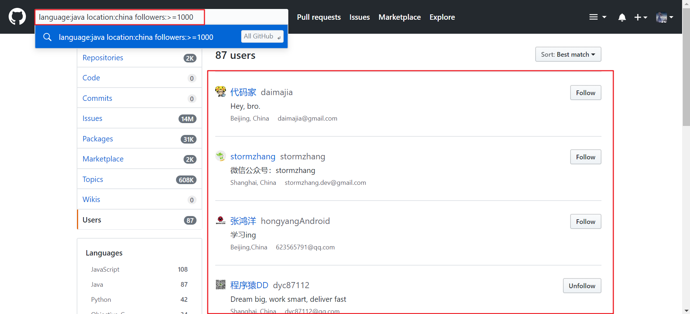

GitHub 作为目前广大程序员最大的游乐场,怎么在Github上搜索优秀的项目就显得尤为重要.下面是在Github上快速找到自己需要的开源项目的几个搜索技巧:

### 一.搜热门

[Github Trend](https://github.com/trending) 页面总结了每天/每周/每月周期的热门 Repositories 和 Developers.

[Github Topic](https://github.com/topics) 展示了最新和最流行的讨论主题.

### 二.搜开发者

GitHub 官方支持很多搜索条件，在 [这里](https://help.github.com/articles/about-searching-on-github/) 可以查看官方出品的搜索技巧.

|    搜索条件     |                 备注                  |
| :---------: | :---------------------------------: |
| followers:  |  followers:>=1000,匹配超过1000名关注着的开发者  |
|  language:  |   language:java,匹配开发语言为 java 的开发者   |
| in:fullname | jack in:fullname,匹配用户名实名为 jack 的开发者 |
|  location:  |   location:china,匹配用户填写的地址在 china   |

### 三.搜项目

在GitHub上找到优秀的项目和工具可以通过关键字或设置搜索条件可以事半功倍的找到好资源.

|          搜索条件          |                    备注                    |
| :--------------------: | :--------------------------------------: |
|   Awesome + keyword    |         关键字 Awesome,帮忙找到优秀的工具列表          |
|    in:name example     | in:name springboot,匹配项目名中包含 springboot关键词的项目 |
|   in:readme example    | in:readme springboot,匹配readme中包含 springboot关键词的项目 |
| in:description example | in:description springboot,匹配描述中包含 springboot关键词的项目 |
|         stars:         |      stars:>=1000,匹配收藏数量超过 1000 的项目      |
|         forks:         |      forks:>=1000,匹配分支数量超过 1000 的项目      |
|        pushed:         |  pushed:>2019-05-06,匹配在2019年5月6号后有更新的项目  |
|       language:        |     language:java,匹配以 java 作为开发语言的项目     |

#### 1.Awesome + keyword

Awesome 几乎成为了不少 GitHub 用户命名项目的关键字之一,如要找到优秀的java相关开源项目的集合,可以尝试搜索 `Awesome java` 得到下列结果:

#### 2.设置搜索条件

明确需要寻找某类特定的项目,如用某种语言,Stars数需要达到什么标准,在搜索框中直接输入搜索条件即可.多个搜索条件可组合使用.一般使用: `stars:` `language` `forks:` `in:` `pushed:`  ,其实就是设置项目收藏,开发语言,派生 这些搜索条件. 如 `stars:>=1000 language:java forks:>=600` ,结果如下:

也可以使用 Github 提供的 [高级搜索功能](https://github.com/search/advanced) .或者参考官方给出的帮助指南 [Searching on GitHub](https://help.github.com/articles/searching-on-github/) ，里面有更多关于项目、代码、评论、问题等搜索技巧。

下面是 Github 颇受欢迎上的项目:

[Awesome](https://github.com/Awesome-Windows/Awesome/blob/master/README-cn.md) :Windows上优质&精选的最佳应用程序及工具列表

[free-programming-books](https://github.com/EbookFoundation/free-programming-books/blob/master/free-programming-books-zh.md) :免费的编程相关书籍

[chinese-independent-developer](https://github.com/1c7/chinese-independent-developer) :中国独立开发者项目列表

[chinese-independent-blogs](https://github.com/timqian/chinese-independent-blogs) :中文独立博客列表

[awesome-java-cn](https://github.com/jobbole/awesome-java-cn#ancients) :Java资源大全中文版

