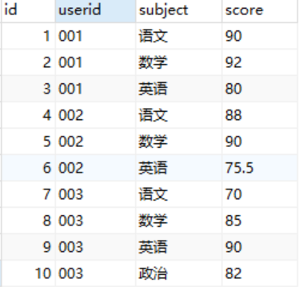
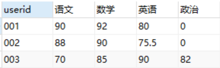
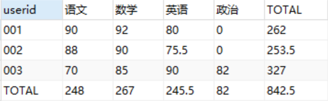
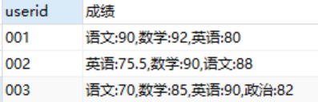
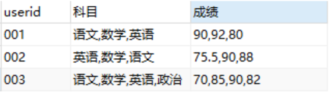
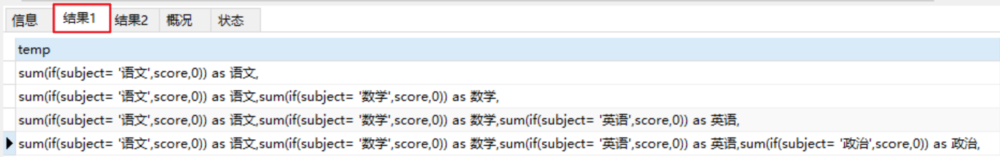
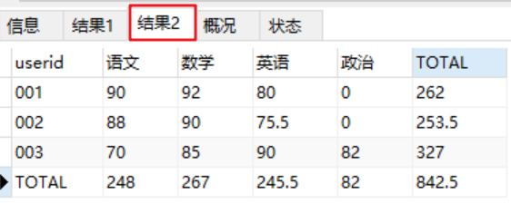
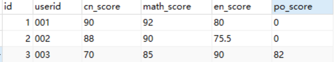
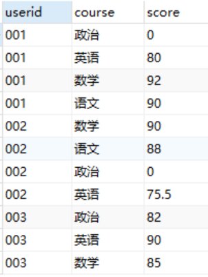

mysql 行列转换在项目中应用极其频繁.其中最为头痛的就是多行转多列.动态的列行转换.下面是简单的行列转换案例.

### 一.行转列

**将原本同一列下多行的不同内容作为多个字段，输出对应内容**.

原始数据表tb_score结构图:


数据:



#### 1.多行转多列

转换后效果:



**行转列是将原来的subject字段的多行内容选出来，作为结果集中的不同列，并根据userid进行分组显示对应的score.**

**使用IF() 进行行转列** :

```mysql
SELECT userid,
MAX(IF(`subject`='语文',score,0)) as '语文',
MAX(IF(`subject`='数学',score,0)) as '数学',
MAX(IF(`subject`='英语',score,0)) as '英语',
MAX(IF(`subject`='政治',score,0)) as '政治' 
FROM tb_score 
GROUP BY userid
```

-   MAX()是为了能够使用GROUP BY根据userid进行分组，因为每一个userid对应的subject="语文"的记录只有一条，所以MAX()的值就等于对应那一条记录的score的值
-   若userid ='001' and subject='语文' 的记录有两条，则此时MAX() 的值将会是这两条记录中的一个最大值。但是正常情况下，一个user对应一个subject只有一个分数，因此可以使用`SUM()、MAX()、MIN()、AVG()` 等聚合函数都可以达到行转列的效果。

**使用case...when....then 进行行转列** :

```mysql
SELECT userid,
SUM(CASE `subject` WHEN '语文' THEN score ELSE 0 END) as '语文',
SUM(CASE `subject` WHEN '数学' THEN score ELSE 0 END) as '数学',
SUM(CASE `subject` WHEN '英语' THEN score ELSE 0 END) as '英语',
SUM(CASE `subject` WHEN '政治' THEN score ELSE 0 END) as '政治' 
FROM tb_score 
GROUP BY userid
```

#### 2.生成汇总行和汇总列

生成后效果:



**利用SUM(IF()) 生成列 + WITH ROLLUP 生成汇总行** :

```mysql
SELECT IFNULL(userid,'TOTAL') AS userid,
SUM(IF(`subject`='语文',score,0)) AS 语文,
SUM(IF(`subject`='数学',score,0)) AS 数学,
SUM(IF(`subject`='英语',score,0)) AS 英语,
SUM(IF(`subject`='政治',score,0)) AS 政治,
SUM(score) AS TOTAL	# 生成汇总列
FROM tb_score
GROUP BY userid
WITH ROLLUP;	# 生成汇总行
```

-   生成汇总行: `WITH ROLLUP` , `SUM(IF('subject'='语文',score,0)) AS 语文` 这里的SUM()函数为求和,那TOTAL行即为该列的总和.若对当前列求MAX(),即TOTAL行的结果为该列的最大值.
-   生成汇总列: `SUM(score) AS TOTAL ` 这里的SUM()函数对userid分组后的score求和,若为MAX()函数,即为userid分组后score的最大值.

**利用SUM(IF()) 生成列 + UNION 生成汇总行** :

```mysql
# 对userid分组后求和
SELECT userid,
SUM(IF(`subject`='语文',score,0)) AS 语文,
SUM(IF(`subject`='数学',score,0)) AS 数学,
SUM(IF(`subject`='英语',score,0)) AS 英语,
SUM(IF(`subject`='政治',score,0)) AS 政治,
SUM(score) AS TOTAL	# 生成汇总列
FROM tb_score
GROUP BY userid
UNION
# 对整张表各个科目求和,生成汇总行
SELECT 'TOTAL',SUM(IF(`subject`='语文',score,0)) AS 语文,
SUM(IF(`subject`='数学',score,0)) AS 数学,
SUM(IF(`subject`='英语',score,0)) AS 英语,
SUM(IF(`subject`='政治',score,0)) AS 政治,
SUM(score)
FROM tb_score
```

**利用SUM(IF()) 生成列 + WITH ROLLUP 生成汇总行,利用子查询** :

```mysql
SELECT IFNULL(userid,'TOTAL') AS userid,
SUM(IF(`subject`='语文',score,0)) AS 语文,
SUM(IF(`subject`='数学',score,0)) AS 数学,
SUM(IF(`subject`='英语',score,0)) AS 英语,
SUM(IF(`subject`='政治',score,0)) AS 政治,
SUM(IF(`subject`='TOTAL',score,0)) AS TOTAL
FROM(
    SELECT userid,IFNULL(`subject`,'TOTAL') AS `subject`,SUM(score) AS score
    FROM tb_score
    GROUP BY userid,`subject`
    WITH ROLLUP
    HAVING userid IS NOT NULL
)AS A 
GROUP BY userid
WITH ROLLUP;
```

#### 3.多行转一列

**合并字段显示,利用group_concat()函数** :

可以将对应关系均放在一列,生成后效果:



```mysql
SELECT userid,GROUP_CONCAT(`subject`,":",score)AS 成绩
FROM tb_score
GROUP BY userid
```

-   `group_concat()` 函数返回带有来自一个组的连接的非NULL值的字符串结果,可以很好的建属于同一分组的多个行转化为一个列
-   `group_concat()` 函数也可以不分组,将整张表(相当于一个组)的指定列的所有行值拼接成一列值
-   **默认是之间用逗号隔开,还可以自定义符号**来作为隔开 `GROUP_CONCAT('subject',":",score separator '/')` 

也可以将对应关系分开成不同的列显示:



```mysql
SELECT userid,GROUP_CONCAT(`subject`)AS 科目,GROUP_CONCAT(score)AS 成绩
FROM tb_score
GROUP BY userid
```

-   也可以自定义分隔符: 如 `GROUP_CONCAT(score separator '/')` 成绩这列用'/'分隔 

#### 4.动态列

会有两个结果, 结果1:



结果2:



sql语句:

```mysql
SET @XX='';
select @XX :=CONCAT(@XX,'sum(if(subject= \'',subject,'\',score,0)) as ',subject, ',') AS temp FROM (SELECT DISTINCT subject FROM tb_score) A ;

SET @YY = CONCAT('select ifnull(userid,\'TOTAL\')as userid,',@XX,' sum(score) as TOTAL from tb_score group by userid WITH ROLLUP');

-- SELECT @YY;
PREPARE trends FROM @YY;
EXECUTE trends;
DEALLOCATE PREPARE trends;
```

### 二.列转行

#### 1.多列转多行

原始表数据结构:



转换后结果:



**利用 UNION ALL 将多个科目的结果进行拼接** :

```mysql
SELECT userid,'语文' AS course,cn_score AS score FROM tb_score
UNION ALL
SELECT userid,'数学' AS course,math_score AS score FROM tb_score
UNION ALL
SELECT userid,'英语' AS course,en_score AS score FROM tb_score
UNION ALL
SELECT userid,'政治' AS course,po_score AS score FROM tb_score
ORDER BY userid
```

原理: **将userid的每个科目分数分散成一条记录显示出来**. 即将每个userid对应的多个科目的成绩查出来，通过UNION ALL将结果集加起来.

UNION ALL 与 UNION 的区别:

-   对重复结果的处理：UNION会去掉重复记录，UNION ALL不会
-   对排序的处理：UNION会排序，UNION ALL只是简单地将两个结果集合并
-   效率方面的区别：因为**UNION 会做去重和排序处理**，因此效率比UNION ALL慢很多


