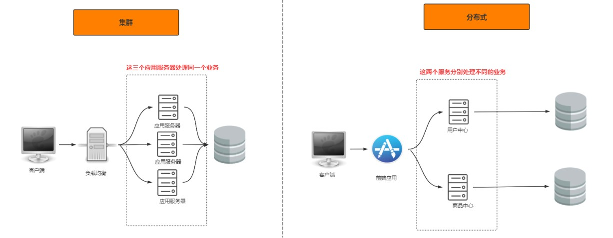
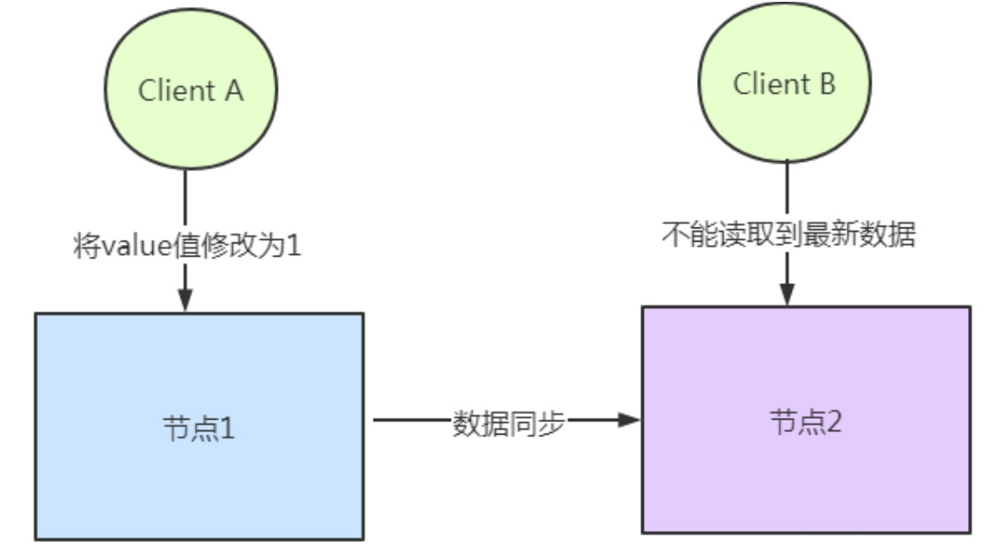
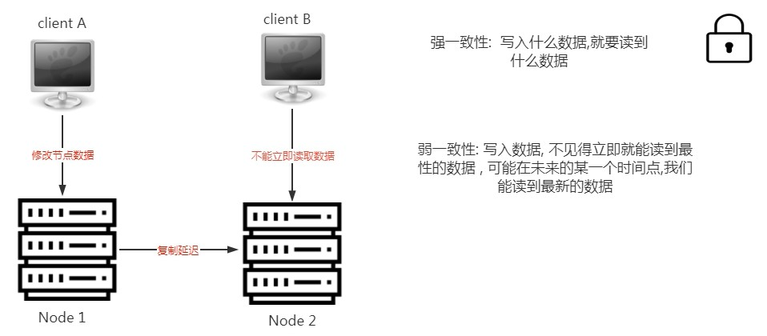
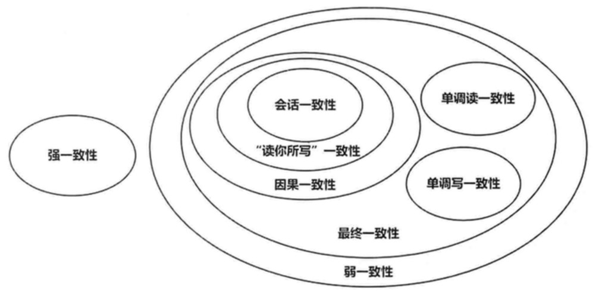
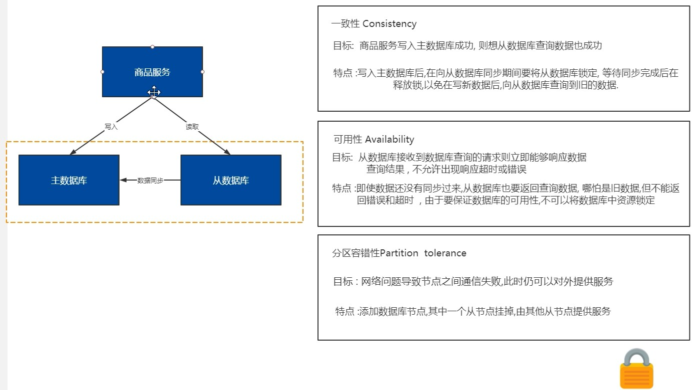
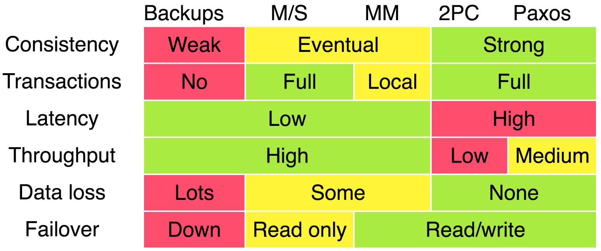
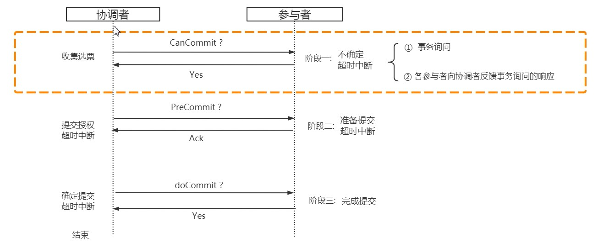

## 一.分布式理论

### 1.分布式架构概述

> 分布式系统是一个硬件或软件组件分布在不同的网络计算机上，彼此之间仅仅通过消息传递进行通信和协调
> 的系统。

一个业务拆分成多个子业务，分布在不同的服务器节点，共同构成的系统称为分布式系统. 同一个分布式系统中的服务器节点在空间部署上是可以随意分布的.无论空间上如何分布,一个标准的分布式系统应该具有以下几个主要特征:

- 分布性: 分布式系统中的多台计算机之间在空间位置上可以随意分布, 系统中的多台计算机之间没有主、从之分
- 透明性: 系统资源被所有计算机共享
- 同一性: 系统中的若干台计算机可以互相协作来完成一个共同的任务
- 通信性: 系统中任意两台计算机都可以通过通信来交换信息

**常用的分布式方案**:

- 分布式应用和服务: 将应用和服务进行分层和分割，然后将应用和服务模块进行分布式部署
- 分布式静态资源: 对网站的静态资源如JS、CSS、图片等资源进行分布式部署可以减轻应用服务器的负载压力
- 分布式数据和存储: 大型网站常常需要处理海量数据，单台计算机往往无法提供足够的内存空间，可以对这些数据进行分布式存储
- 分布式计算: 分布式计算将该应用分解成许多小的部分，分配给多台计算机进行处理

**分布式与集群的区别**:

- 集群(cluster): 多个人在一起做同样的事. **多台不同的服务器**中部署**相同应用或服务模块**，构成一个集群，通过负载均衡设备对外提供服务
- 分布式(distributed): 多个人在一起做不同的事. **多台不同的服务器**中部署**不同的服务模块**，通过远程调用协同工作，对外提供服务

分布式系统的特点: 分布性, 对等性, 并发性, 缺乏全局时钟, 故障总是会发生.

**分布式架构的演变**:

1. 单应用架构
2. 应用服务器(tomcat)与数据库服务器分离
3. 应用服务器集群(tomcat集群同时访问一个数据库)
4. 应用服务器负载客户(客户发送请求负载均衡到应用服务器上,如`Nginx`)
5. 数据库读写分离(写数据库同步读数据库)
6. 添加搜索引擎缓解读数据库压力(如分布式搜索引擎`Elasticsearch`)
7. 添加缓存机制缓解数据库的压力(如`Redis`)
8. 数据库水平/垂直拆分(按不同业务场景,如用户数据库,商品数据库,订单数据库) [数据库水平/垂直拆分](https://imgkr.cn-bj.ufileos.com/4d4c6863-38eb-4ffd-a1ba-8ed31e5c31cd.jpg)
9. 应用拆分(应用按业务场景拆分) [应用拆分](https://imgkr.cn-bj.ufileos.com/1b203986-c32f-44e9-966a-22d433a444a2.jpg)
10. 服务化(如用户中心,商品中心,订单中心)  [服务化](https://imgkr.cn-bj.ufileos.com/73e593ca-9f97-4adb-a565-a1ab5b7ce8dc.jpg)

**分布式系统面临的问题**:

- 通信异常: 网络本身的不可靠及其它风险最终会导致分布式系统无法顺利进行一次网络通信
- 网络分区: 系统的网路环境被切分成若干个孤立的区域,即分布式系统会出现局部小集群
- 节点故障: 服务器节点出现宕机或"僵死"现象
- 三态: 每一次请求与响应存在特有的"三态"概念,即成功,失败和超时

### 2.分布式一致性问题

分布式领域CAP理论告诉我们，任何一个分布式系统都无法同时满足Consistency(一致性),Availability(可用性), Partition tolerance(分区容错性) 这三个基本需求。最多只能满足其中两项。一个分布式系统无论在CAP三者之间如何权衡，都无法彻底放弃一致性（Consistency）,真的放弃,就说明系统中数据根本不可信.

分布式数据一致性，指的是数据在多份副本中存储时，各副本中的数据是一致的。

**数据一致性**:

在数据库系统中通常用事务（访问并可能更新数据库中各种数据项的一个程序执行单元）来保证数据的一致性和完整性。而在分布式系统中，数据一致性往往指的是由于数据的复制，不同数据节点中的数据内容是否完整并且相同。

若是单个数据库,事务的ACID特性基本可以保证数据库的一致性.多个副本需要保证多份拷贝就有同步问题.

**为什么会有数据一致性问题**:

分布式系统为了提升可用性和性能，会通过复制技术来进行数据同步。复制机制的目的是为了保证数据的一致性。但是数据复制面临的主要难题也是如何保证多个副本之间的数据一致性。

由于应用分布式部署，就无法通过数据库事务保证多个写操作的原子性。一旦某个操作失败，其他操作如果不回滚的话就会发生数据不一致问题。

因此如何保证数据的一致性同时又不影响运行的性能是每一个分布式系统都要考虑和权衡的.

**一致性模型**:

<u>强一致性</u>: 当更新操作完成之后，任何多个后续进程或者线程的访问都会返回最新的更新过的值。这种是对用户最友好的，就是用户上一次写什么，下一次就保证能读到什么。

<u>弱一致性</u>: 系统并不保证进程或者线程的访问都会返回最新的更新过的值。但会尽可能保证在某个时间级别（比如秒级别）之后，可以让数据达到一致性状态。

<u>最终一致性</u>: 弱一致性的特定形式。系统保证在没有后续更新的前提下，系统最终返回上一次更新操作的值。在没有故障发生的前提下，不一致窗口的时间主要受通信延迟，系统负载和复制副本的个数影响。DNS是一个典型的最终一致性系统。

最终一致性模型的变种: 它们的关系如下图所示(图来自 [《大数据日知录：架构与算法》](https://item.jd.com/11540991.html))

> 因果一致性：如果A进程在更新之后向B进程通知更新的完成，那么B的访问操作将会返回更新的值。如果没有因果关系的C进程将会遵循最终一致性的规则。
>
> 读己所写一致性：因果一致性的特定形式。一个进程总可以读到自己更新的数据。
>
> 会话一致性：读己所写一致性的特定形式。进程在访问存储系统同一个会话内，系统保证该进程读己之所写。
>
> 单调读一致性：如果一个进程已经读取到一个特定值，那么该进程不会读取到该值以前的任何值。
>
> 单调写一致性：系统保证对同一个进程的写操作串行化。

### 3.CAP定理

CAP 理论含义是，一个分布式系统最多只能同时满足一致性（Consistency）、可用性（Availability）和分区容错性（Partition tolerance）这三项中的两项。

| 选项         | 描述                                                         |
| ------------ | ------------------------------------------------------------ |
| C 一致性     | 分布式系统当中的一致性指的是所有节点的数据一致，或者说是所有副本的数据一致 |
| A 可用性     | Reads and writes always succeed. 也就是说系统一直可用，而且服务一直保持正常 |
| P 分区容错性 | 系统在遇到一些节点或者网络分区故障的时候，仍然能够提供满足一致性和可用性的服务 |

#### CAP的定义

##### Consistency 一致性

对于一致性，可以分为从客户端和服务端两个不同的视角。从客户端来看，一致性主要指的是多并发访问时更新过的数据如何获取的问题。从服务端来看，则是更新如何复制分布到整个系统，以保证数据最终一致。

从客户端角度，多进程并发访问时，更新过的数据在不同进程如何获取的不同策略，决定了不同的一致性。

三种一致性策略:

- 对于关系型数据库，要求更新过的数据能被后续的访问都能看到，这是强一致性。
- 如果能容忍后续的部分或者全部访问不到，则是弱一致性。
- 如果经过一段时间后要求能访问到更新后的数据，则是最终一致性。

CAP中说，不可能同时满足的这个一致性指的是强一致性。

##### Availability 可用性

对于一个可用性的分布式系统，每一个非故障的节点必须对每一个请求作出响应。所以，一般我们在衡量一个系统的可用性的时候，都是通过停机时间来计算的。

好的可用性主要是指系统能够很好的为用户服务，不出现用户操作失败或者访问超时等用户体验不好的情况。一个分布式系统，上下游设计很多系统如负载均衡、WEB服务器、应用代码、数据库服务器等，任何一个节点的不稳定都可以影响可用性。

##### Partition Tolerance分区容错性

很多人可能对分区容忍性不太理解，知乎有一个回答对这个解释的比较清楚（[CAP理论中的P到底是个什么意思？](https://www.zhihu.com/question/54105974)），这里引用一下：

- 一个分布式系统里面，节点组成的网络本来应该是连通的。然而可能因为一些故障，使得有些节点之间不连通了，整个网络就分成了几块区域。数据就散布在了这些不连通的区域中。这就叫分区。
- 当你一个数据项只在一个节点中保存，那么分区出现后，和这个节点不连通的部分就访问不到这个数据了。这时分区就是无法容忍的。
- 提高分区容忍性的办法就是一个数据项复制到多个节点上，那么出现分区之后，这一数据项就可能分布到各个区里，容忍性就提高了。
- 然而，要把数据复制到多个节点，就会带来一致性的问题，就是多个节点上面的数据可能是不一致的。
- 要保证一致，每次写操作就都要等待全部节点写成功，而这等待又会带来可用性的问题。
- 总的来说就是，数据存在的节点越多，分区容忍性越高，但要复制更新的数据就越多，一致性就越难保证。为了保证一致性，更新所有节点数据所需要的时间就越长，可用性就会降低。

#### CAP权衡

##### CA without P

这种情况在分布式系统中几乎是不存在的。首先在分布式环境下，网络分区是一个自然的事实。因为分区是必然的，所以如果舍弃P，意味着要舍弃分布式系统。

我们熟知的关系型数据库,如MySql和Oracle就是保证了可用性和数据一致性,但是他并不是分布式系统.一旦关系型数据库要考虑主备同步、集群部署等就必须要把P也考虑进来。

##### CP without A

一个保证了CP而一个舍弃了A的分布式系统，一旦发生网络故障或者消息丢失等情况，就要牺牲用户的体验，等待所有数据全部一致之后再让用户访问系统。

无论是像Redis、HBase这种分布式存储系统，还是像Zookeeper这种分布式协调组件。数据的一致性是他们最最基本的要求。

ZooKeeper是个CP（一致性+分区容错性）的，即任何时刻对ZooKeeper的访问请求能得到一致的数据结果，同时系统对网络分割具备容错性。但是它不能保证每次服务请求的可用性，也就是在极端环境下，ZooKeeper可能会丢弃一些请求，消费者程序需要重新请求才能获得结果。ZooKeeper是分布式协调服务，它的职责是保证数据在其管辖下的所有服务之间保持同步、一致。所以就不难理解为什么ZooKeeper被设计成CP而不是AP特性的了。

##### AP without C

对于很多业务系统来说，比如淘宝的购物，12306的买票。都是在可用性和一致性之间舍弃了一致性而选择可用性。

在12306买票的时候肯定遇到过这种场景，当你购买的时候提示你是有票的（但是可能实际已经没票了），你也正常的去输入验证码，下单了。但是过了一会系统提示你下单失败，余票不足。这其实就是先在可用性方面保证系统可以正常的服务，然后在数据的一致性方面做了些牺牲，会影响一些用户体验，但是也不至于造成用户流程的严重阻塞。

上面的买票的例子，其实舍弃的只是强一致性。退而求其次保证了最终一致性。也就是说，虽然下单的瞬间，关于车票的库存可能存在数据不一致的情况，但是过了一段时间，还是要保证最终一致性的。

##### 总结

- 舍弃A，保留CP：在极端情况下，允许出现系统无法访问的情况，会牺牲用户体验。
- 舍弃C，保留AP：是大部分分布式系统的设计，保证高可用和分区容错。
- 舍弃P，保留CA：也就是舍弃分布式系统，即P是分布式系统的前提,这种情况是不存在的。

##### 推荐

- [CAP理论](http://blog.csdn.net/chen77716/article/details/30635543)
- [一文带你重新审视CAP理论与分布式系统设计](http://dbaplus.cn/news-159-1917-1.html)
- [分布式系统的CAP理论](http://www.hollischuang.com/archives/666)

### 4.BASE理论

BASE全称: Basically Available（基本可用）、Soft state（软状态）和Eventually consistent（最终一致性）三个短语的缩写。

BASE理论核心思想：**即使无法做到强一致性，但每个应用都可以根据自身业务特点，采用适当的方式来使系统达到最终一致性**。

- Basically Available（基本可用）：基本可用是指分布式系统在出现不可预知故障的时候，允许损失部分可用性。例子: 响应时间上的损失, 功能上的损失.
- Soft state（软状态）
    - 硬状态指的是相对于一致性，要求多个节点的数据副本都是一致的。
    - 软状态指的是允许系统在多个不同节点的数据副本之间进行数据同步的过程中存在延迟。
- Eventually consistent（最终一致性）: 最终一致性是系统中所有的数据副本在经过一段时间的同步后最终达到一致的状态。弱一致性和强一致性相反，最终一致性是弱一致性的一种特殊情况。

ACID和BASE的区别与联系:

- ACID是传统数据库常用的设计理念，追求强一致性模型。BASE支持的是大型分布式系统，提出通过牺牲强一致性获得高可用性
- ACID和BASE代表了两种截然相反的设计哲学
- 在分布式系统设计的场景中，系统组件对一致性要求是不同的，因此ACID和BASE又会结合使用

推荐:

- [CAP和BASE理论](http://my.oschina.net/foodon/blog/372703)

### 5.一致性协议

在分布式系统中，为了保证数据的高可用，通常，我们会将数据保留多个副本(replica)，这些副本会放置在不同的物理的机器上。为了对用户提供正确的增\删\改\差等语义，我们需要保证这些放置在不同物理机器上的副本是一致的。

为了解决这种分布式一致性问题，前人在性能和数据一致性的反反复复权衡过程中总结了许多典型的协议和算法。其中比较著名的有**二阶提交协议**（Two Phase Commitment Protocol）、**三阶提交协议**（Three Phase Commitment Protocol）和**Paxos算法**。

Google 2009年 在[Transaction Across DataCenter](https://snarfed.org/transactions_across_datacenters_io.html) 的分享中，对一致性协议在业内的实践做了一简单的总结，如下图所示，这是 CAP 理论在工业界应用的实践经验。

其中，第一行表头代表了分布式系统中通用的一致性方案，包括冷备、Master/Slave、Master/Master、两阶段提交以及基于 Paxos 算法的解决方案，第一列表头代表了分布式系统大家所关心的各项指标，包括一致性、事务支持程度、数据延迟、系统吞吐量、数据丢失可能性、故障自动恢复方式。

#### 分布式事务

> 分布式事务是指会涉及到操作多个数据库的事务。其实就是将对同一库事务的概念扩大到了对多个库的事务。目的是为了保证分布式系统中的数据一致性。分布式事务处理的关键是必须有一种方法可以知道事务在任何地方所做的所有动作，提交或回滚事务的决定必须产生统一的结果（**全部提交或全部回滚**）

在分布式系统中，每个节点虽然可以知晓自己的操作时成功或者失败，却无法知道其他节点的操作的成功或失败。当一个事务跨越多个节点时，为了保持事务的ACID特性，需要引入一个作为**协调者**的组件来统一掌控所有节点(称作**参与者**)的操作结果并最终指示这些节点是否要把操作结果进行真正的提交(比如将更新后的数据写入磁盘等等)。

#### XA规范

这里引用 [关于分布式事务,两阶段提交协议,三阶段提交协议](https://www.hollischuang.com/archives/681) 中的一段内容:

X/Open 组织（即现在的 Open Group ）定义了分布式事务处理模型。 X/Open DTP 模型（ 1994 ）包括**应用程序**（ AP ）、**事务管理器**（ TM ）、**资源管理器**（ RM ）、**通信资源管理器**（ CRM ）四部分。一般，**常见的事务管理器（ TM ）是交易中间件，常见的资源管理器（ RM ）是数据库，常见的通信资源管理器（ CRM ）是消息中间件**。  通常把一个数据库内部的事务处理，如对多个表的操作，作为本地事务看待。**数据库的事务处理对象是本地事务，而分布式事务处理的对象是全局事务**。  **所谓全局事务，是指分布式事务处理环境中，多个数据库可能需要共同完成一个工作，这个工作即是一个全局事务**，例如，一个事务中可能更新几个不同的数据库。对数据库的操作发生在系统的各处但必须全部被提交或回滚。此时一个数据库对自己内部所做操作的提交不仅依赖本身操作是否成功，还要依赖与全局事务相关的其它数据库的操作是否成功，如果任一数据库的任一操作失败，则参与此事务的所有数据库所做的所有操作都必须回滚。   一般情况下，某一数据库无法知道其它数据库在做什么，因此，**在一个 DTP 环境中，交易中间件是必需的，由它通知和协调相关数据库的提交或回滚**。而一个数据库只将其自己所做的操作（可恢复）影射到全局事务中。

> XA 就是 X/Open DTP 定义的交易中间件与数据库之间的接口规范（即接口函数），交易中间件用它来通知数据库事务的开始、结束以及提交、回滚等。 XA 接口函数由数据库厂商提供。

**二阶提交协议**和**三阶提交协议**就是根据这一思想衍生出来的。可以说二阶段提交其实就是实现**XA分布式事务**的关键(确切地说：两阶段提交主要保证了分布式事务的原子性：即所有结点要么全做要么全不做)

#### 2PC

2PC(Two-Phase Commit)：两阶段提交协议，将整个事务流程分为两个阶段，准备阶段（Prepare phase）、提交阶段（commit phase）。部分关系数据库如Mysql,Oracle都支持两阶段提交协议.

> 2PC 要解决的问题可以简单总结为：在分布式系统中，每个节点虽然可以知道自己的操作是成功还是失败，却是无法知道其他节点的操作状态。当一个事务需要跨越多个节点时，为了保持事务的 ACID 特性，需要引入一个作为**协调者**的组件来统一掌控所有节点（**参与者**）的操作结果并最终指示这些节点是否要把操作结果进行真正的提交（比如将更新后的数据写入磁盘等等）。因此，二阶段提交的算法思路可以概括为： 参与者将操作结果通知协调者，再由协调者根据所有参与者的反馈情报决定各参与者是否要提交操作还是中止操作。

所谓的两个阶段是指：第一阶段：**准备阶段(投票阶段)**和第二阶段：**提交阶段（执行阶段）**。

1. 投票阶段：事务协调者(事务管理器)给每个参与者(资源管理器)发送Prepare消息，每个参与者要么直接返回失败(如权限验证失败)，要么在本地执行事务，写本地的redo和undo日志，但不提交，到达一种“万事俱备，只欠东风”的状态。（Undo日志是记录修改前的数据，用于数据库回滚，Redo日志是记录修改后的数据，用于提交事务后写入数 据文件）
2. 执行阶段：如果协调者收到了参与者的失败消息或者超时，直接给每个参与者发送回滚(Rollback)消息；否则，发送提交(Commit)消息；参与者根据协调者的指令执行提交或者回滚操作，释放所有事务处理过程中使用的锁资源。(注意:必须在最后阶段释放锁资源)

**2PC一致性问题**

2PC 在执行过程中可能发生 Coordinator 或者参与者突然宕机的情况，在不同时期宕机可能有不同的现象。

|                   情况                   |                        分析及解决方案                        |
| :--------------------------------------: | :----------------------------------------------------------: |
|       Coordinator 挂了，参与者没挂       | 这种情况其实比较好解决，只要找一个 Coordinator 的替代者。当他成为新的 Coordinator 的时候，询问所有参与者的最后那条事务的执行情况，他就可以知道是应该做什么样的操作了。所以，这种情况不会导致数据不一致。 |
| 参与者挂了（无法恢复），Coordinator 没挂 |     如果挂了之后没有恢复，那么是不会导致数据一致性问题。     |
| 参与者挂了（后来恢复），Coordinator 没挂 | 恢复后参与者如果发现有未执行完的事务操作，直接取消，然后再询问 Coordinator 目前我应该怎么做，协调者就会比对自己的事务执行记录和该参与者的事务执行记录，告诉他应该怎么做来保持数据的一致性。 |

还有一种情况是：参与者挂了，Coordinator 也挂了，需要再细分为几种类型来讨论：

|                             情况                             |                        分析及解决方案                        |
| :----------------------------------------------------------: | :----------------------------------------------------------: |
|              Coordinator 和参与者在第一阶段挂了              | 由于这时还没有执行 commit 操作，新选出来的 Coordinator 可以询问各个参与者的情况，再决定是进行 commit 还是 roolback。因为还没有 commit，所以不会导致数据一致性问题。 |
| Coordinator 和参与者在第二阶段挂了，但是挂的这个参与者在挂之前还没有做相关操作 | 这种情况下，当新的 Coordinator 被选出来之后，他同样是询问所有参与者的情况。只要有机器执行了 abort（roolback）操作或者第一阶段返回的信息是 No 的话，那就直接执行 roolback 操作。如果没有人执行 abort 操作，但是有机器执行了 commit 操作，那么就直接执行 commit 操作。这样，当挂掉的参与者恢复之后，只要按照 Coordinator 的指示进行事务的 commit 还是 roolback 操作就可以了。因为挂掉的机器并没有做 commit 或者 roolback 操作，而没有挂掉的机器们和新的 Coordinator 又执行了同样的操作，那么这种情况不会导致数据不一致现象。 |
| Coordinator 和参与者在第二阶段挂了，挂的这个参与者在挂之前已经执行了操作。但是由于他挂了，没有人知道他执行了什么操作。 | 这种情况下，新的 Coordinator 被选出来之后，如果他想负起 Coordinator 的责任的话他就只能按照之前那种情况来执行 commit 或者 roolback 操作。这样新的 Coordinator 和所有没挂掉的参与者就保持了数据的一致性，我们假定他们执行了 commit。但是，这个时候，那个挂掉的参与者恢复了怎么办，因为他已经执行完了之前的事务，如果他执行的是 commit 那还好，和其他的机器保持一致了，万一他执行的是 roolback 操作呢？这不就导致数据的不一致性了么？虽然这个时候可以再通过手段让他和 Coordinator 通信，再想办法把数据搞成一致的，但是，这段时间内他的数据状态已经是不一致的了！ |

所以，2PC协议中，如果出现协调者和参与者都挂了的情况，有可能导致数据不一致。为了解决这个问题，衍生出了3PC。

**2PC优缺点**

二阶段提交看起来确实能够提供原子性的操作，原理简洁清晰、实现方便. 但是不幸的事，二阶段提交还是有几个**缺点**的：

> 1、**同步阻塞问题**。执行过程中，所有参与节点都是事务阻塞型的。当参与者占有公共资源时，其他第三方节点访问公共资源不得不处于阻塞状态。
>
> 2、**单点故障**。由于协调者的重要性，一旦协调者发生故障。参与者会一直阻塞下去。尤其在第二阶段，协调者发生故障，那么所有的参与者还都处于锁定事务资源的状态中，而无法继续完成事务操作。（如果是协调者挂掉，可以重新选举一个协调者，但是无法解决因为协调者宕机导致的参与者处于阻塞状态的问题）
>
> 3、**数据不一致**。在二阶段提交的阶段二中，当协调者向参与者发送commit请求之后，发生了局部网络异常或者在发送commit请求过程中协调者发生了故障，这回导致只有一部分参与者接受到了commit请求。而在这部分参与者接到commit请求之后就会执行commit操作。但是其他部分未接到commit请求的机器则无法执行事务提交。于是整个分布式系统便出现了数据部一致性的现象。
>
> 4、二阶段无法解决的问题：协调者再发出commit消息之后宕机，而唯一接收到这条消息的参与者同时也宕机了。那么即使协调者通过选举协议产生了新的协调者，这条事务的状态也是不确定的，没人知道事务是否被已经提交。

由于二阶段提交存在着诸如同步阻塞、单点问题、脑裂等缺陷，所以，研究者们在二阶段提交的基础上做了改进，提出了三阶段提交。

#### 3PC

与两阶段提交不同的是，三阶段提交有两个改动点:

- 引入超时机制。同时在协调者和参与者中都引入超时机制
- 在第一阶段和第二阶段中插入一个准备阶段。保证了在最后提交阶段之前各参与节点的状态是一致的

也就是说，除了引入超时机制之外，3PC把2PC的准备阶段再次一分为二，这样三阶段提交就有`CanCommit`、`PreCommit`、`DoCommit`三个阶段。

**CanCommit阶段**

协调者向参与者发送CanCommit请求，参与者如果可以提交就返回Yes响应，否则返回No响应。

1. 事务询问：Coordinator 向各参与者发送 CanCommit 的请求，询问是否可以执行事务提交操作，并开始等待各参与者的响应；
2. 参与者向 Coordinator 反馈询问的响应：参与者收到 CanCommit 请求后，正常情况下，如果自身认为可以顺利执行事务，那么会反馈 Yes 响应，并进入预备状态，否则反馈 No。

**ProCommit阶段**

协调者根据参与者的反应情况来决定是否可以继续事务的PreCommit操作。根据响应情况，有以下两种可能。

**执行事务预提交**：如果 Coordinator 接收到各参与者反馈都是Yes，那么执行事务预提交：

1. 发送预提交请求：Coordinator 向各参与者发送 preCommit 请求，并进入 prepared 阶段；
2. 事务预提交：参与者接收到 preCommit 请求后，会执行事务操作，并将 Undo 和 Redo 信息记录到事务日记中；
3. 各参与者向 Coordinator 反馈事务执行的响应：如果各参与者都成功执行了事务操作，那么反馈给协调者 ACK 响应，同时等待最终指令，提交 commit 或者终止 abort，结束流程；

**中断事务**：如果任何一个参与者向 Coordinator 反馈了 No 响应，或者在等待超时后，Coordinator 无法接收到所有参与者的反馈，那么就会中断事务。

1. 发送中断请求：Coordinator 向所有参与者发送 abort 请求；
2. 中断事务：无论是收到来自 Coordinator 的 abort 请求，还是等待超时，参与者都中断事务。

**DoCommit阶段**

该阶段进行真正的事务提交，也可以分为以下两种情况。

**执行提交**

1. 发送提交请求：假设 Coordinator 正常工作，接收到了所有参与者的 ack 响应，那么它将从预提交阶段进入提交状态，并向所有参与者发送 doCommit 请求；
2. 事务提交：参与者收到 doCommit 请求后，正式提交事务，并在完成事务提交后释放占用的资源；
3. 反馈事务提交结果：参与者完成事务提交后，向 Coordinator 发送 ACK 信息；
4. 完成事务：Coordinator 接收到所有参与者 ack 信息，完成事务。

**中断事务**：假设 Coordinator 正常工作，并且有任一参与者反馈 No，或者在等待超时后无法接收所有参与者的反馈，都会中断事务

1. 发送中断请求：Coordinator 向所有参与者节点发送 abort 请求；
2. 事务回滚：参与者接收到 abort 请求后，利用 undo 日志执行事务回滚，并在完成事务回滚后释放占用的资源；
3. 反馈事务回滚结果：参与者在完成事务回滚之后，向 Coordinator 发送 ack 信息；
4. 中断事务：Coordinator 接收到所有参与者反馈的 ack 信息后，中断事务。

> ACK 确认字符，在数据通信中，接收站发给发送站的一种传输类控制字符。表示发来的数据已确认接收无误。
>
> 在doCommit阶段，如果参与者无法及时接收到来自协调者的doCommit或者rebort请求时，会在等待超时之后，会继续进行事务的提交。（其实这个应该是基于概率来决定的，当进入第三阶段时，说明参与者在第二阶段已经收到了PreCommit请求，那么协调者产生PreCommit请求的前提条件是他在第二阶段开始之前，收到所有参与者的CanCommit响应都是Yes。（一旦参与者收到了PreCommit，意味他知道大家其实都同意修改了）所以，一句话概括就是，当进入第三阶段时，由于网络超时等原因，虽然参与者没有收到commit或者abort响应，但是他有理由相信：成功提交的几率很大。 ）

**2PC与3PC的区别**

3PC 虽然解决了 Coordinator 与参与者都异常情况下导致数据不一致的问题，3PC 依然带来其他问题：比如，网络分区问题，在 preCommit 消息发送后突然两个机房断开，这时候 Coordinator 所在机房会 abort, 另外剩余参与者的机房则会 commit。

而且由于3PC 的设计过于复杂，在解决2PC 问题的同时也引入了新的问题，所以在实际上应用不是很广泛。

参考:

- [关于分布式事务,两阶段提交协议,三阶段提交协议](https://www.hollischuang.com/archives/681)

- [分布式协议之两阶段提交协议（2PC）和改进三阶段提交协议（3PC）](http://www.mamicode.com/info-detail-890945.html) 
- [关于分布式事务、两阶段提交、一阶段提交、Best Efforts 1PC模式和事务补偿机制的研究](http://blog.csdn.net/bluishglc/article/details/7612811) 
- [两阶段提交协议与三阶段提交协议](http://www.tuicool.com/articles/mARV3u)

### 6.一致性算法

#### 6.1 Paxos

Paxos解决了分布式系统一致性问题。

##### Paxos相关概念

首先一个很重要的概念叫提案（Proposal）。最终要达成一致的value就在提案里。

提案 (Proposal)：Proposal信息包括提案编号 (Proposal ID) 和提议的值 (Value)。

在Paxos算法中，有如下角色：

- Client：客户端。客户端向分布式系统发出请求，并等待响应。例如，对分布式文件服务器中文件的写请求。
- Proposer：提案发起者。提案者提倡客户请求，试图说服Acceptor对此达成一致，并在发生冲突时充当协调者以推动协议向前发展。
- Acceptor：决策者，可以批准提案。Acceptor可以接受（accept）提案；如果某个提案被选定（chosen），那么该提案里的value就被选定了。
- Learners：最终决策的学习者。学习者充当该协议的复制因素。

推荐：[分布式一致性算法——paxos](http://www.hollischuang.com/archives/693)

#### 6.2 Raft

Paxos 相比 Raft 比较复杂和难以理解。角色扮演和流程比 Raft 都要啰嗦。比如 Agreement 这个流程，在 Paxos 里边：Client 发起请求举荐 Proposer 成为 Leader，Proposer 然后向全局 Acceptors 寻求确认，Acceptors 全部同意 Proposer 后，Proposer 的 Leader 地位得已承认，Acceptors 还得再向Learners 进行全局广播来同步。而在 Raft 里边，只有 Follower/Candidate/Leader 三种角色，角色本身代表状态，角色之间进行状态转移是一件非常自由民主的事情。Raft虽然有角色之分但是是全民参与进行选举的模式；但是在Paxos里边，感觉更像议员参政模式。

##### 三个角色

follower、candidate、leader。最开始大家都是follower，当follower监听不到leader，就可以自己成为candidate，发起投票

##### leader选举：timeout限制

##### 选举的timeout

follower成为candidate的超时时间，每个follower都在150ms and 300ms之间随机，之后看谁先timeout，谁就先成为candidate，然后它会先投自己一票，再向其他节点发起投票邀请。
如果其他节点在这轮选举还没有投过票，那么就给candidate投票，然后重置自己的选举timeout。
如果得到大多数的投票就成为leader，之后定期开始向follower发送心跳。

如果两个follower同时成为candidate的话，如果最后得到的票数相同，则等待其他follower的选择timeout之后成为candidate，继续开始新一轮的选举。

##### log复制

leader把变动的log借助心跳同步给follower，过半回复之后才成功提交，之后再下一次心跳之后，follower也commit变动，在自己的node上生效。

分裂之后，另一个分区的follower接受不到leader的timeout，然后会有一个先timeout，成为candidate，最后成为leader。于是两个分区就有了两个leader。

当客户端有变动时，其中的leader由于无法收到过半的提交，则保持未提交状态。有的leader的修改，可以得到过半的提交，则可以修改生效。

当分裂恢复之后，leader开始对比选举的term，发现有更高的term存在时，他们会撤销未提交的修改，然后以最新的为准。

参考:

- [分布式系统的一致性协议之2PC和3PC](https://www.cnblogs.com/sunsky303/p/9290992.html)

- [维基百科：二阶段提交](https://en.wikipedia.org/wiki/Two-phase_commit_protocol)；
- [维基百科：三阶段提交](https://en.wikipedia.org/wiki/Three-phase_commit_protocol)；
- [左耳朵耗子推荐：分布式系统架构经典资料](http://www.infoq.com/cn/news/2018/05/distributed-system-architecture)；
- [深入理解分布式系统的2PC和3PC](http://www.hollischuang.com/archives/1580)；
- [2PC到3PC到Paxos到Raft到ISR](https://segmentfault.com/a/1190000004474543)；
- [《大数据日知录：架构与算法》](https://item.jd.com/11540991.html)；
- [分布式系统的事务处理](https://coolshell.cn/articles/10910.html) ;

