要实现网络机器间的通讯，首先得来看看计算机系统网络通信的基本原理，在底层层面去看，网络通信需要做的就是将流从一台计算机传输到另外一台计算机，基于传输协议和网络IO来实现，其中传输协议比较出名的有tcp、udp等等，tcp、udp都是在基于Socket概念上为某类应用场景而扩展出的传输协议，网络IO，主要有bio、nio、aio三种方式。

### 1.什么是RPC

RPC全称为remote procedure call，即远程过程调用。借助RPC可以做到像本地调用一样调用远程服务，是一种进程间的通信方式。RPC并不是一个具体的技术，而是指整个网络远程调用过程。

在java中RPC框架比较多，常见的有Hessian、gRPC、Thrift、HSF (High Speed Service Framework)、Dubbo等，其实对 于RPC框架而言，核心模块就是通讯和序列化。

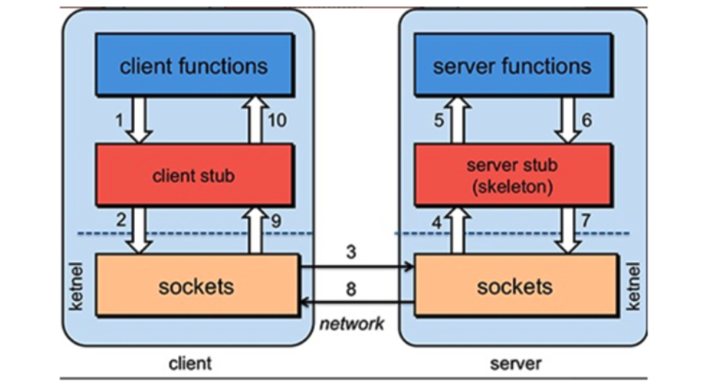

一个完整的RPC架构里面包含了四个核心的组件，分别是Client，Client Stub，Server以及Server Stub，这个Stub可以理解为存根。

- 客户端(Client)，服务的调用方。
- 客户端存根(Client Stub)，存放服务端的地址消息，再将客户端的请求参数打包成网络消息，然后通过网络远程发送给服务方。
- 服务端(Server)，真正的服务提供者。
- 服务端存根(Server Stub)，接收客户端发送过来的消息，将消息解包，并调用本地的方法。

调用过程：

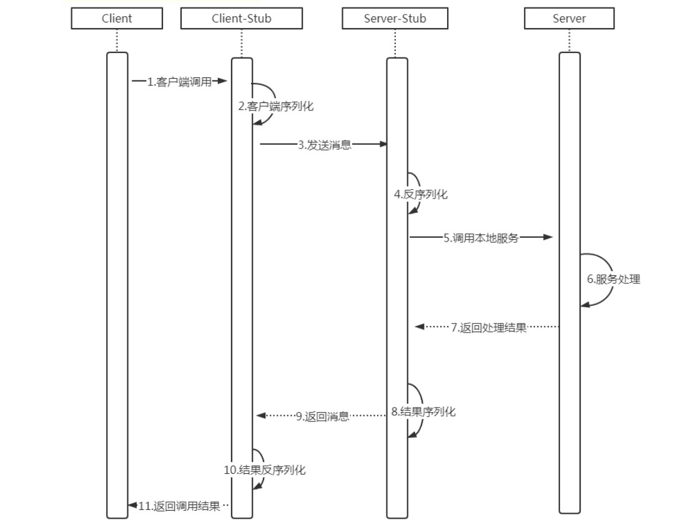

> (1) 客户端（client）以本地调用方式（即以接口的方式）调用服务；
> (2) 客户端存根（client stub）接收到调用后，负责将方法、参数等组装成能够进行网络传输的消息体（将消息体对象序列化为二进制）；
> (3) 客户端通过sockets将消息发送到服务端；
> (4) 服务端存根( server stub）收到消息后进行解码（将消息对象反序列化）；
> (5) 服务端存根( server stub）根据解码结果调用本地的服务；
> (6) 本地服务执行并将结果返回给服务端存根( server stub）；
> (7) 服务端存根( server stub）将返回结果打包成消息（将结果消息对象序列化）；
> (8) 服务端（server）通过sockets将消息发送到客户端；
> (9) 客户端存根（client stub）接收到结果消息，并进行解码（将结果消息发序列化）；
> (10) 客户端（client）得到最终结果。

RPC的目标是要把2、3、4、7、8、9这些步骤都封装起来。无论是何种类型的数据，最终都需要转换成二进制流在网络上进行传输，数据的发送方需要将对象转换为二进制流，而数据的接收方则需要把二进制流再恢复为对象。

### 2.RMI

#### 概述

Java RMI 指的是**远程方法调用** (Remote Method Invocation),是java原生支持的远程调用 ,采用JRMP（JavaRemote Messageing protocol）作为通信协议，可以认为是**纯java版本的分布式远程调用解决方案**， RMI主要用于不同虚拟机之间的通信，这些虚拟机可以在不同的主机上、也可以在同一个主机上，这里的通信可以理解为**一个虚拟机上的对象调用另一个虚拟机上对象的方法**。

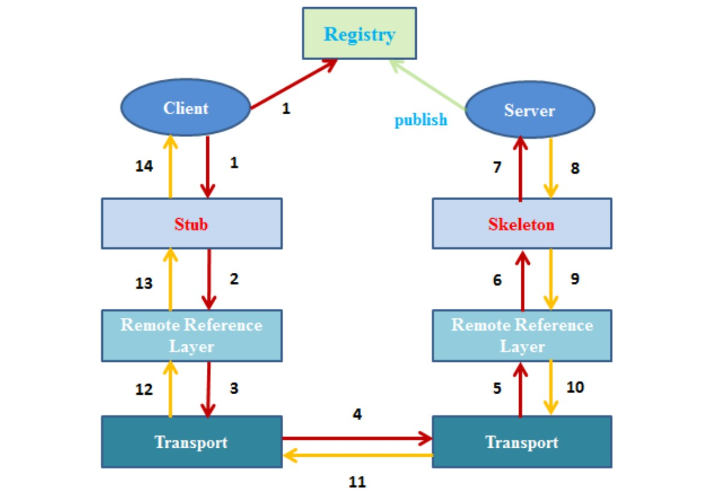

客户端:

- 存根/桩(Stub)：远程对象在客户端上的代理
- 远程引用层(Remote Reference Layer)：解析并执行远程引用协议
- 传输层(Transport)：发送调用、传递远程方法参数、接收远程方法执行结果

服务端:

- 骨架(Skeleton)：读取客户端传递的方法参数，调用服务器方的实际对象方法，并接收方法执行后的返回值
- 远程引用层(Remote Reference Layer)：处理远程引用后向骨架发送远程方法调用
- 传输层(Transport)：监听客户端的入站连接，接收并转发调用到远程引用层

注册表(Registry)：

- 以URL形式注册远程对象，并向客户端回复对远程对象的引用

调用过程:

- 远程调用过程

    >1.客户端从远程服务器的注册表中查询并获取远程对象引用。
    >2.桩对象与远程对象具有相同的接口和方法列表，当客户端调用远程对象时，实际上是由相应的桩对象代理完成的。
    >3,远程引用层在将桩的本地引用转换为服务器上对象的远程引用后，再将调用传递给传输层(Transport)，由传输层通过TCP协议发送调用；
    >4.在服务器端，传输层监听入站连接，它一旦接收到客户端远程调用后，就将这个引用转发给其上层的远程引用层；
    >5.服务器端的远程引用层将客户端发送的远程应用转换为本地虚拟机的引用后，再将请求传递给骨架(Skeleton)；
    >6.骨架读取参数，又将请求传递给服务器，最后由服务器进行实际的方法调用。

- 结果返回过程

    >1.如果远程方法调用后有返回值，则服务器将这些结果又沿着“骨架->远程引用层->传输层”向下传递；
    >2.客户端的传输层接收到返回值后，又沿着“传输层->远程引用层->桩”向上传递，然后由桩来反序列化这些返回值，并将最终的结果传递给客户端程序。

#### 开发流程

服务端：

- 定义Remote子接口，在其内部定义要发布的远程方法，并且这些方法都要Throws RemoteException；
- 定义实现远程接口，并且继承:UnicastRemoteObject
- 启动服务器：依次完成注册表的启动和远程对象绑定

客户端：

- 通过符合JRMP规范的URL字符串在注册表中获取并强转成Remote子接口对象
- 调用这个Remote子接口对象中的某个方法就是为一次远程方法调用行为

#### 代码实现

1.创建远程接口IHelloService

```java
/**
* 远程服务对象接口必须继承Remote接口；同时方法必须抛出RemoteExceptino异常
*/
public interface IHelloService extends Remote {

    //1.定义一个sayHello方法
    public  String sayHello(User user) throws RemoteException;
}
```

其中有一个引用对象User作为参数

```java
/**
* 引用对象应该是可序列化对象，这样才能在远程调用的时候：
* 1. 序列化对象 2. 拷贝 3. 在网络中传输
* 4. 服务端反序列化 5. 获取参数进行方法调用； 
* 这种方式其实是将远程对象引用传递的方式转化为值传递的方式
*/
public class User implements Serializable {
    private String username;
    private int age;

    // 其余代码省略 ...
}
```

2.实现远程服务对象IHelloServiceImpl

```java
/**
* 远程服务对象实现类写在服务端；必须继承UnicastRemoteObject或其子类
**/
public class HelloServiceImpl extends UnicastRemoteObject implements IHelloService {

    /**
    * 手动实现父类的构造方法
	* 因为UnicastRemoteObject的构造方法抛出了RemoteException异常，
	* 因此这里默认的构造方法必须写，必须声明抛出RemoteException异常
    * @throws RemoteException
    */
    public HelloServiceImpl() throws RemoteException {
        super();
    }

    //我们自定义的sayHello
    public String sayHello(User user) throws RemoteException {
        System.out.println("this is server , say hello to "+user.getUsername());
        return "success";
    }
}
```

3.服务端程序RMIServer

```java
public class RMIServer {
    public static void main(String[] args) throws RemoteException, AlreadyBoundException, MalformedURLException {
        // 1.创建一个远程对象，同时也会创建stub对象、skeleton对象
        IHelloService service = new HelloServiceImpl();

        // 2.本地主机上的远程对象注册表Registry的实例，并指定端口为8888
        // 这一步必不可少（Java默认端口是1099），缺少注册表创建，则无法绑定对象到远程注册表上
        LocateRegistry.createRegistry(8888);

        //3.对象的绑定
        //bind方法的参数1:   rmi://ip地址:端口/服务名（协议名rmi可省略）   参数2:绑定的对象
        Naming.bind("//127.0.0.1:8888/rmiserver",service); //将stub引用绑定到服务地址上
    }
}
```

4.客户端程序RMIClient

```java
public class RMIClient {
    public static void main(String[] args) throws RemoteException, NotBoundException, MalformedURLException {
        //1.从注册表中获取远程对象 , 强转
        IHelloService service = (IHelloService) Naming.lookup("//127.0.0.1:8888/rmiserver");

        //2.准备参数
        User user = new User("laowang",18);

        //3.调用远程方法sayHello
        String message = service.sayHello(user);
        System.out.println(message);
    }
}
```

客户端上的IHelloService.java 和 User.java 与服务端代码相同.

6.启动服务端程序，再启动客户端进行远程方法调用

### 3.BIO,NIO,AIO

#### 同步和异步

同步（synchronize）、异步（asychronize）是指应用程序和内核的交互而言的.

- 同步：指用户进程触发IO操作等待或者轮训的方式查看IO操作是否就绪。
- 异步：当一个异步进程调用发出之后，调用者不会立刻得到结果。而是在调用发出之后，被调用者通过状态、通知来通知调用者，或者通过回调函数来处理这个调用。

使用异步IO时，Java将IO读写委托给OS处理，需要将数据缓冲区地址和大小传给OS，OS需要支持异步IO操作

#### 阻塞和非阻塞

阻塞和非阻塞是针对于进程访问数据的时候,根据IO操作的就绪状态来采取不同的方式.

简单点说就是一种读写操作方法的实现方式. 阻塞方式下读取和写入将一直等待, 而非阻塞方式下,读取和写入方法会理解返回一个状态值.

例子：

>老张煮开水。 老张，水壶两把（普通水壶，简称水壶；会响的水壶，简称响水壶）。
>1 老张把水壶放到火上，站立着等水开。（同步阻塞）
>2 老张把水壶放到火上，去客厅看电视，时不时去厨房看看水开没有。（同步非阻塞）
>3 老张把响水壶放到火上，立等水开。（异步阻塞）
>4 老张把响水壶放到火上，去客厅看电视，水壶响之前不再去看它了，响了再去拿壶。（异步非阻塞）

#### BIO

**同步阻塞IO**。**服务器实现模式为一个连接一个线程**，即客户端有连接请求时服务器端就需要启动一个线程进行处理，如果这个连接不做任何事情会造成不必要的线程开销，当然可以通过线程池机制改善。

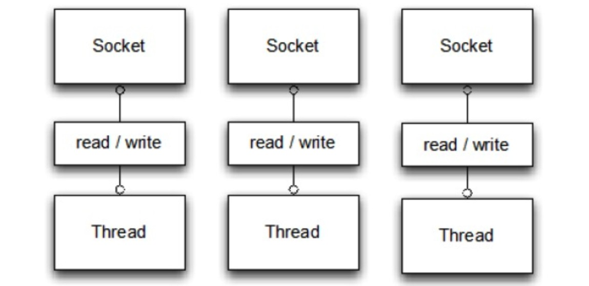

服务端代码：

```java
public class IOServer {
    public static void main(String[] args) throws Exception {

        //首先创建了一个serverSocket
        ServerSocket serverSocket = new ServerSocket();
        serverSocket.bind(new InetSocketAddress("127.0.0.1",8081));
        while (true){
            Socket socket = serverSocket.accept();  //同步阻塞
            new Thread(()->{
                try {
                    byte[] bytes = new byte[1024];
                    int len = socket.getInputStream().read(bytes);  //同步阻塞
                    System.out.println(new String(bytes,0,len));
                    socket.getOutputStream().write(bytes,0,len);
                    socket.getOutputStream().flush();
                } catch (IOException e) {
                    e.printStackTrace();
                }
            }).start();
        }
    }
}
```

客户端代码:

```java
public class IOClient {

    public static void main(String[] args) throws IOException {
        Socket socket = new Socket("127.0.0.1",8081);
        socket.getOutputStream().write("hello".getBytes());
        socket.getOutputStream().flush();
        System.out.println("server send back data =====");
        byte[] bytes = new byte[1024];
        int len = socket.getInputStream().read(bytes);
        System.out.println(new String(bytes,0,len));
        socket.close();
    }
}
```

#### NIO

**同步非阻塞IO** （non-blocking IO / new io）是指JDK 1.4 及以上版本。**服务器实现模式为一个请求一个通道**，即客户端发送的连接请求都会注册到多路复用器上，多路复用器轮询到连接有IO请求时才启动一个线程进行处理。

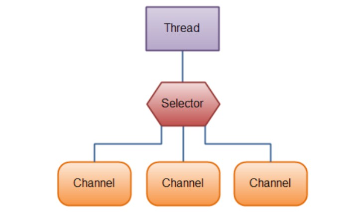

通道（Channels）：NIO 新引入的最重要的抽象是通道的概念。Channel 数据连接的通道。 数据可以从Channel读到Buffer中，也可以从Buffer 写到Channel中 。
缓冲区（Buffers）：通道channel可以向缓冲区Buffer中写数据，也可以像buffer中存数据。
选择器（Selector）：使用选择器，借助单一线程，就可对数量庞大的活动 I/O 通道实时监控和维护。

当一个连接创建后，不会需要对应一个线程，这个连接会被注册到多路复用器，所以一个连接只需要一个线程即可，所有的连接需要一个线程就可以操作，该线程的多路复用器会轮训，发现连接有请求时，才开启一个线程处理。

NIO模型中selector的作用，一条连接来了之后，现在不创建一个while死循环去监听是否有数据可读了，而是直接把这条连接注册到selector上，然后通过检查这个selector，就可以批量监测出有数据可读的连接，进而读取数据。

JDK原生NIO实现服务端：

```java
public class NIOServer extends Thread{

    //1.声明多路复用器
    private Selector selector;
    //2.定义读写缓冲区
    private ByteBuffer readBuffer = ByteBuffer.allocate(1024);
    private ByteBuffer writeBuffer = ByteBuffer.allocate(1024);

    //3.定义构造方法初始化端口
    public NIOServer(int port) {
        init(port);
    }

    //4.main方法启动线程
    public static void main(String[] args) {
        new Thread(new  NIOServer(8888)).start();
    }

    //5.初始化
    private void init(int port) {

        try {
            System.out.println("服务器正在启动......");
            //1)开启多路复用器
            this.selector = Selector.open();
            //2) 开启服务通道
            ServerSocketChannel serverSocketChannel = ServerSocketChannel.open();
            //3)设置为非阻塞
            serverSocketChannel.configureBlocking(false);
            //4)绑定端口
            serverSocketChannel.bind(new InetSocketAddress(port));
            /**
             * SelectionKey.OP_ACCEPT   —— 接收连接继续事件，表示服务器监听到了客户连接，服务器可以接收这个连接了
             * SelectionKey.OP_CONNECT  —— 连接就绪事件，表示客户与服务器的连接已经建立成功
             * SelectionKey.OP_READ     —— 读就绪事件，表示通道中已经有了可读的数据，可以执行读操作了（通道目前有数据，可以进行读操作了）
             * SelectionKey.OP_WRITE    —— 写就绪事件，表示已经可以向通道写数据了（通道目前可以用于写操作）
             */
            //5)注册,标记服务连接状态为ACCEPT状态
            serverSocketChannel.register(this.selector, SelectionKey.OP_ACCEPT);
            System.out.println("服务器启动完毕");
        } catch (IOException e) {
            e.printStackTrace();
        }
    }

    public void run(){
        while (true){
            try {
                //1.当有至少一个通道被选中,执行此方法
                this.selector.select();
                //2.获取选中的通道编号集合
                Iterator<SelectionKey> keys = this.selector.selectedKeys().iterator();
                //3.遍历keys
                while (keys.hasNext()) {
                    SelectionKey key = keys.next();
                    //4.当前key需要从动刀集合中移出,如果不移出,下次循环会执行对应的逻辑,造成业务错乱
                    keys.remove();
                    //5.判断通道是否有效
                    if (key.isValid()) {
                        try {
                            //6.判断是否可以连接
                            if (key.isAcceptable()) {
                                accept(key);
                            }
                        } catch (CancelledKeyException e) {
                            //出现异常断开连接
                            key.cancel();
                        }

                        try {
                            //7.判断是否可读
                            if (key.isReadable()) {
                                read(key);
                            }
                        } catch (CancelledKeyException e) {
                            //出现异常断开连接
                            key.cancel();
                        }

                        try {
                            //8.判断是否可写
                            if (key.isWritable()) {
                                write(key);
                            }
                        } catch (CancelledKeyException e) {
                            //出现异常断开连接
                            key.cancel();
                        }
                    }
                }
            } catch (IOException e) {
                e.printStackTrace();
            }
        }
    }

    private void accept(SelectionKey key) {
        try {
            //1.当前通道在init方法中注册到了selector中的ServerSocketChannel
            ServerSocketChannel serverSocketChannel = (ServerSocketChannel) key.channel();
            //2.阻塞方法, 客户端发起后请求返回.
            SocketChannel channel = serverSocketChannel.accept();
            ///3.serverSocketChannel设置为非阻塞
            channel.configureBlocking(false);
            //4.设置对应客户端的通道标记,设置次通道为可读时使用
            channel.register(this.selector, SelectionKey.OP_READ);
        } catch (IOException e) {
            e.printStackTrace();
        }
    }

    //使用通道读取数据
    private void read(SelectionKey key) {
        try{
            //清空缓存
            this.readBuffer.clear();
            //获取当前通道对象
            SocketChannel channel = (SocketChannel) key.channel();
            //将通道的数据(客户发送的data)读到缓存中.
            int readLen = channel.read(readBuffer);
            //如果通道中没有数据
            if(readLen == -1 ){
                //关闭通道
                key.channel().close();
                //关闭连接
                key.cancel();
                return;
            }
            //Buffer中有游标,游标不会重置,需要我们调用flip重置. 否则读取不一致
            this.readBuffer.flip();
            //创建有效字节长度数组
            byte[] bytes = new byte[readBuffer.remaining()];
            //读取buffer中数据保存在字节数组
            readBuffer.get(bytes);
            System.out.println("收到了从客户端 "+ channel.getRemoteAddress() + " :  "+ new String(bytes,"UTF-8"));
            //注册通道,标记为写操作
            channel.register(this.selector,SelectionKey.OP_WRITE);

        }catch (Exception e){

        }
    }

    //给通道中写操作
    private void write(SelectionKey key) {
        //清空缓存
        this.readBuffer.clear();
        //获取当前通道对象
        SocketChannel channel = (SocketChannel) key.channel();
        //录入数据
        Scanner scanner = new Scanner(System.in);

        try {
            System.out.println("即将发送数据到客户端..");
            String line = scanner.nextLine();
            //把录入的数据写到Buffer中
            writeBuffer.put(line.getBytes("UTF-8"));
            //重置缓存游标
            writeBuffer.flip();
            channel.write(writeBuffer);
            channel.register(this.selector,SelectionKey.OP_READ);
        } catch (Exception e) {
            e.printStackTrace();
        }
    }
}
```

客户端：

```java
public class NIOClient {
    public static void main(String[] args) {
        //创建远程地址
        InetSocketAddress address  = new InetSocketAddress("127.0.0.1",8888);
        SocketChannel channel = null;
        //定义缓存
        ByteBuffer buffer = ByteBuffer.allocate(1024);
        try {
            //开启通道
            channel = SocketChannel.open();
            //连接远程远程服务器
            channel.connect(address);
            Scanner sc = new Scanner(System.in);
            while (true){
                System.out.println("客户端即将给 服务器发送数据..");
                String line = sc.nextLine();
                if(line.equals("exit")){
                    break;
                }
                //控制台输入数据写到缓存
                buffer.put(line.getBytes("UTF-8"));
                //重置buffer 游标
                buffer.flip();
                //数据发送到数据
                channel.write(buffer);
                //清空缓存数据
                buffer.clear();

                //读取服务器返回的数据
                int readLen = channel.read(buffer);
                if(readLen == -1){
                    break;
                }
                //重置buffer游标
                buffer.flip();
                byte[] bytes = new byte[buffer.remaining()];
                //读取数据到字节数组
                buffer.get(bytes);
                System.out.println("收到了服务器发送的数据 : "+ new String(bytes,"UTF-8"));
                buffer.clear();
            }
        } catch (IOException e) {
            e.printStackTrace();
        } finally {
            if (null != channel){
                try {
                    channel.close();
                } catch (IOException e) {
                    e.printStackTrace();
                }
            }
        }
    }
}
```

效果：

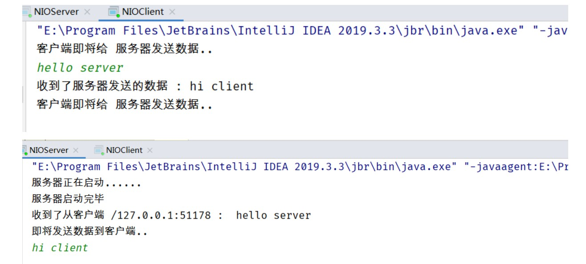

#### AIO

异步非阻塞IO。A代表asynchronize。

当有流可以读时,操作系统会将可以读的流传入read方法的缓冲区,并通知应用程序,对于写操作,OS将write方法的流写入完毕是操作系统会主动通知应用程序。因此read和write都是异步 的，完成后会调用回调函数。

使用场景：连接数目多且连接比较长（重操作）的架构，比如相册服务器。重点调用了OS参与并发操作，编程比较复杂。Java7开始支持。

### 4.Netty

#### Netty初认识

Netty 是由 **JBOSS 提供一个异步的、 基于事件驱动的网络编程框架**。

Netty 可以帮助你快速、 简单的开发出一 个网络应用， 相当于**简化和流程化了 NIO 的开发过程**。 作为当前最流行的 NIO 框架， Netty 在互联网领域、 大数据分布式计算领域、 游戏行业、 通信行业等获得了广泛的应用， 知名的 Elasticsearch 、 Dubbo 框架内部都采用了 Netty。

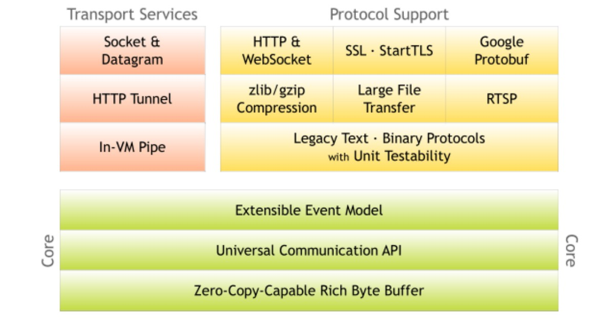

NIO缺点：

- NIO 的类库和 API 繁杂，使用麻烦。你需要熟练掌握 Selector、ServerSocketChannel、SocketChannel、ByteBuffer 等.
- 可靠性不强，开发工作量和难度都非常大
- NIO 的 Bug。例如 Epoll Bug，它会导致 Selector 空轮询，最终导致 CPU 100%。

Netty优点：

- 对各种传输协议提供统一的 API
- 高度可定制的线程模型——单线程、一个或多个线程池
- 更好的吞吐量，更低的等待延迟
- 更少的资源消耗
- 最小化不必要的内存拷贝

#### 线程模型

单线程模型：

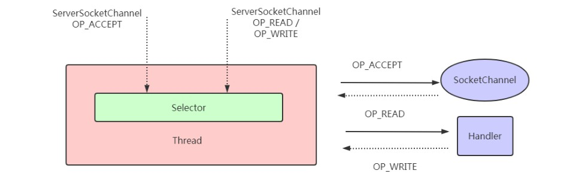

线程池模型：

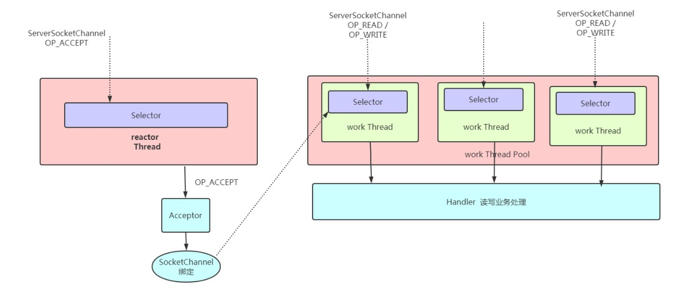

Netty模型：

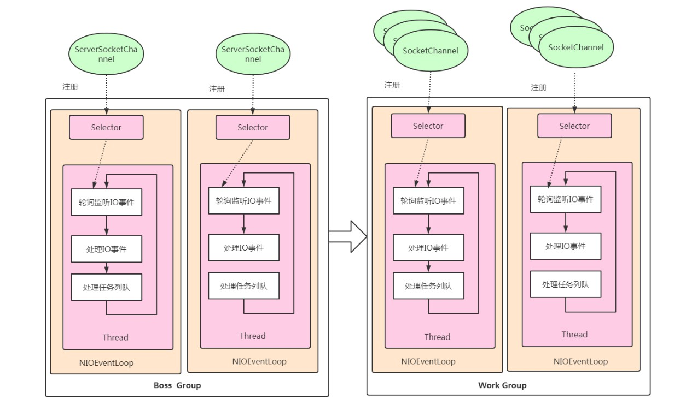

Netty 抽象出两组线程池， BossGroup 专门负责接收客 户端连接， WorkerGroup 专门负责网络读写操作。NioEventLoop 表示一个不断循环执行处理 任务的线程， 每个 NioEventLoop 都有一个 selector， 用于监听绑定在其上的 socket 网络通道。 NioEventLoop 内部采用串行化设计， 从消息的读取->解码->处理->编码->发送， 始终由 IO 线 程 NioEventLoop 负责。

#### Netty核心组件

**EventLoopGroup 和其实现类 NioEventLoopGroup**

EventLoopGroup 是一组 EventLoop 的抽象， Netty 为了更好的利用多核 CPU 资源， 一般 会有多个 EventLoop同时工作， 每个 EventLoop 维护着一个 Selector 实例。

>public NioEventLoopGroup()， 构造方法
>
>public Future<?> shutdownGracefully()， 断开连接， 关闭线程

**ServerBootstrap 和 Bootstrap**

ServerBootstrap 是 Netty 中的**服务器端**启动助手，通过它可以完成服务器端的各种配置； Bootstrap 是 Netty 中的**客户端**启动助手， 通过它可以完成客户端的各种配置。 

> public ServerBootstrap group(EventLoopGroup parentGroup, EventLoopGroup childGroup)，该方法用于服务器端， 用来设置两个 EventLoop
>
> public B group(EventLoopGroup group) ， 该方法用于客户端， 用来设置一个 EventLoop
>
> public B channel(Class<? extends C> channelClass)， 该方法用来设置一个服务器端的通道实现
>
> public <T> B option(ChannelOption<T> option, T value)， 用来给 ServerChannel 添加配置
>
> public <T> ServerBootstrap childOption(ChannelOption<T> childOption, T value)， 用来给接收到的通道添加配置
>
> public ServerBootstrap childHandler(ChannelHandler childHandler)， 该方法用来设置业务处理类（自定
> 义的 handler）
>
> public ChannelFuture bind(int inetPort) ， 该方法用于服务器端， 用来设置占用的端口号
>
> public ChannelFuture connect(String inetHost, int inetPort) 该方法用于客户端， 用来连接服务器端

**ChannelPipeline**

ChannelPipeline 是一个 Handler 的集合， 它负责处理和拦截 inbound 或者 outbound 的事件和操作， 相当于一个贯穿 Netty 的链。

>ChannelPipeline addFirst(ChannelHandler... handlers)， 把一个业务处理类（handler） 添加到链中的第一个位置
>
>ChannelPipeline addLast(ChannelHandler... handlers)， 把一个业务处理类（handler） 添加到链中的最后一个位置

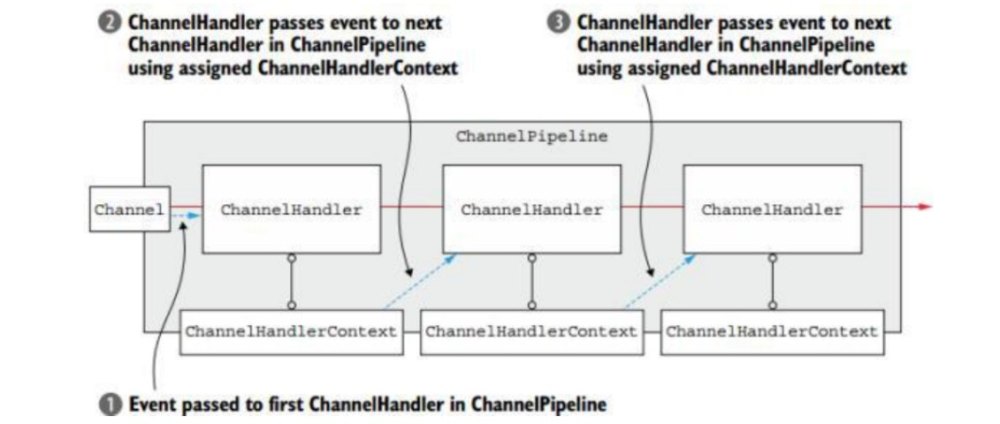

**ChannelHandler 及其实现类**

ChannelHandler 接口定义了许多事件处理的方法， 我们可以通过重写这些方法去实现具 体的业务逻辑。经常需要自定义一个 Handler 类去继承 ChannelInboundHandlerAdapter， 然后通过重写相应方法实现业务逻辑，一般都需要重写下列方法：

> public void channelActive(ChannelHandlerContext ctx)， 通道就绪事件
>
> public void channelRead(ChannelHandlerContext ctx, Object msg)， 通道读取数据事件
>
> public void channelReadComplete(ChannelHandlerContext ctx) ， 数据读取完毕事件
>
> public void exceptionCaught(ChannelHandlerContext ctx, Throwable cause)， 通道发生异常事件

**ChannelHandlerContext**

这 是 事 件 处 理 器 上 下 文 对 象 ， Pipeline 链 中 的 实 际 处 理 节 点 。 每 个 处 理 节 点
ChannelHandlerContext 中 包 含 一 个 具 体 的 事 件 处 理 器 ChannelHandler ， 同 时
ChannelHandlerContext 中也绑定了对应的 pipeline 和 Channel 的信息，方便对 ChannelHandler 进行调用。

> ChannelFuture close()， 关闭通道
>
> ChannelOutboundInvoker flush()， 刷新
>
> ChannelFuture writeAndFlush(Object msg) ， 将 数 据 写 到 ChannelPipeline 中当前ChannelHandler 的下一个 ChannelHandler 开始处理（出站）

**ChannelFuture**

表示 Channel 中异步 I/O 操作的结果， 在 Netty 中所有的 I/O 操作都是异步的， I/O 的调 用会直接返回， 调用者并不能立刻获得结果， 但是可以通过 ChannelFuture 来获取 I/O 操作 的处理状态。

> Channel channel()， 返回当前正在进行 IO 操作的通道
> ChannelFuture sync()， 等待异步操作执行完毕

#### 案例实现

需求：使用netty客户端给服务端发送数据,服务端接收消息打印。

引入依赖：

```xml
<dependency>
    <groupId>io.netty</groupId>
    <artifactId>netty-all</artifactId>
    <version>4.1.6.Final</version>
</dependency>
```

服务端实现代码：

```java
// 接收客户端请求,打印在控制台
public class NettyServer {

    public static void main(String[] args) throws InterruptedException {
        //1.创建2个线程池对象，默认线程数为CPU核心数乘2
        //bossGroup 负责接收用户连接
        NioEventLoopGroup bossGroup = new NioEventLoopGroup();
        //workGroup 负责处理用户的io读写操作
        NioEventLoopGroup workGroup = new NioEventLoopGroup();

        //2.创建服务启动辅助类：组装一些必要的组件
        ServerBootstrap serverBootstrap = new ServerBootstrap();

        //3.设置启动引导类
        //添加到组中,两个线程池,第一个位置的线程池就负责接收,第二个参数就负责读写
        serverBootstrap.group(bossGroup,workGroup)
                //channel方法指定服务器监听的通道类型：NioServerSocketChannel
                .channel(NioServerSocketChannel.class)
                //设置channel handler,每一个客户端连接后,给定一个监听器进行处理
                .childHandler(new ChannelInitializer<NioSocketChannel>() {
                    //事件监听Channel通道
                    protected void initChannel(NioSocketChannel nioSocketChannel) throws Exception {
                        //获取pipeLine传输通道
                        ChannelPipeline pipeline = nioSocketChannel.pipeline();
                        //绑定编码，在通道上添加对通道的处理器, 该处理器可能还是一个监听器
                        pipeline.addFirst(new StringEncoder());
                        pipeline.addLast(new StringDecoder());
                        //绑定我们的业务逻辑，监听器队列上添加我们自己的处理方式
                        pipeline.addLast(new SimpleChannelInboundHandler<String>() {
                            protected void channelRead0(ChannelHandlerContext channelHandlerContext, String msg) throws Exception {
                                //获取入栈信息,打印客户端传递的数据
                                System.out.println(msg);
                            }
                        });
                    }
                });

        //4.启动引导类绑定监听端口
        ChannelFuture future = serverBootstrap.bind(9999).sync();

        //5.关闭通道，会阻塞等待直到服务器的channel关闭
        future.channel().closeFuture().sync();
    }
}
```

客户端实现代码：

```java
//客户端给服务器发送数据
public class NettyClient {
    public static void main(String[] args) throws InterruptedException {
        //1.创建连接池对象
        NioEventLoopGroup group = new NioEventLoopGroup();

        //2.创建客户端的启动引导类 BootStrap
        Bootstrap bootstrap = new Bootstrap();

        //3.配置启动引导类
        bootstrap.group(group)
                //设置通道为Nio，指定通道类型：NioSocketChannel
                .channel(NioSocketChannel.class)
                //设置Channel初始化监听
                .handler(new ChannelInitializer<Channel>() {
                    //当前该方法监听channel是否初始化
                    protected void initChannel(Channel channel) throws Exception {
                        //设置编码
                        channel.pipeline().addLast(new StringEncoder());
                    }
                });

        //4.使用启动引导类连接服务器 , 获取一个channel
        Channel channel = bootstrap.connect("127.0.0.1", 9999).channel();

        //5.循环写数据给服务器
        while (true) {
           //给服务器写数据
            channel.writeAndFlush("hello server .. this is client ...");
            Thread.sleep(2000);
        }
    }
}
```

使用Netty之后，一方面Netty对NIO封装得如此完美，写出来的代码非常优雅，另外一方面，使用Netty之后，网络通信这块的性能问题几乎不用操心。

### 5.基于Netty自定义RPC


#### 开发流程

provider服务提供者

1. 初始化远程服务端
2. 编写事件处理器（监听read操作）
3. 启动服务器

consumer服务消费者

1. 初始化客户端
2. 编写自定义事件处理器（监听读写操作，完成具体事件）
3. JDK动态代理，使用线程池，分配一个线程处理自定义事件处理器中监听到的事件
4. 启动客户端，获取代理对象，发送请求

