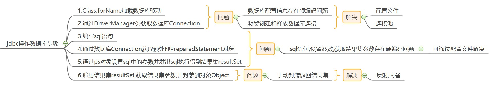
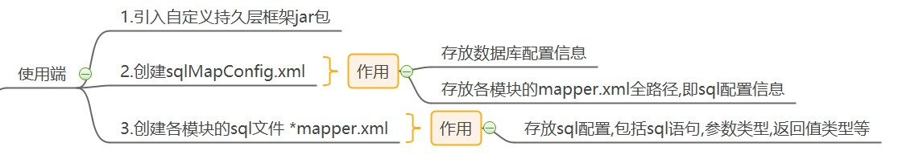
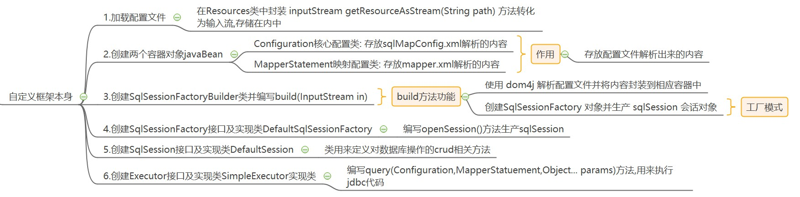

## 一.JDBC操作数据库步骤及存在的问题



**jdbc操作数据库**: 获取数据库连接对象,获取sql,获取PreparedStatement对象,设置参数,执行sql得到结果集,遍历结果集.

**存在问题及解决办法**: 

- 数据库配置信息存在编码问题: 配置文件解决
- 频繁创建和释放数据库连接: 可以使用连接池
- sql语句,设置参数,获取结果集参数存在硬编码问题: 配置文件解决
- 手动封装返回结果集: 反射,内省

## 二.自定义框架设计

### 1.使用端



在使用端时,需要先引入自定义的持久层框架jar包.

创建mybatis的核心配置文件 `SqlMapConfig.xml` ,主要用来存放数据库配置信息和各模块的`mapper.xml`路径信息.

```xml
<configuration>
    <!-- 数据源配置 -->
    <dataSource>
        <property name="driverClass" value="com.mysql.jdbc.Driver"></property>
        <property name="jdbcUrl" value="jdbc:mysql:///zdy_mybatis"></property>
        <property name="user" value="root"></property>
        <property name="password" value="root"></property>
    </dataSource>

    <!-- 引入sql配置文件 -->
    <mapper resource="UserMapper.xml"></mapper>
</configuration>
```

创建各模块的sql文件的mapper.xml文件,用来配置sql信息.

```xml
<!-- 命名空间用来区分多个模块里相同的id,指向代理的dao接口 -->
<mapper namespace="com.fishleap.dao.IUserDao">

    <!-- 唯一标识: namespace.id 也称为 statementId -->
    <!-- id用来区分多个select标签,与代理接口中与调用方法名相同,
        最终会代理给sqlSession相关jdbc操作的方法 -->
    <select id="findAll" resultType="com.fishleap.pojo.User">
        select * from user;
    </select>

    <!--
        parameterType与resultType都是利用反射进行映射参数
        sql中自定义 #{} 占位符, 参数为实体类中属性
        jdk动态代理代理dao接口来生成代理实现类,
        调用方法实质上会将方法代理给sqlSession相关jdbc操作的方法
    -->
    <select id="findByCondition" resultType="com.fishleap.pojo.User" paramterType="com.fishleap.pojo.User">
        select * from user where id = #{id} and username = #{username}
    </select>

    <insert id="addUser" paramterType="com.fishleap.pojo.User">
        insert into user values(#{id},#{username},#{password},#{birthday})
    </insert>

    <update id="updateUser" paramterType="com.fishleap.pojo.User">
        update user set username=#{username} where id=#{id}
    </update>

    <delete id="deleteUser" paramterType="com.fishleap.pojo.User">
        delete from user where id=#{id}
    </delete>

</mapper>
```

### 2.自定义持久层框架本身



**通过自定义持久层框架可以上文jdbc操作数据库的一些问题,在后文会通过jdk的动态代理创建接口的代理对象来解决dao中模板重复的操作(创建SqlSession,调用SqlSession,关闭SqlSession)和参数statementId的硬编码的问题**.

#### 1.加载配置文件

```java
public class Resources {

    // 使用类加载器将配置文件转化为输入流,存储在内存中
    public static InputStream getResourceAsStream(String path) {
        return Resources.class.getClassLoader().getResourceAsStream(path);
    }

}
```

#### 2.创建两个容器对象

Configuration类:

```java
/**
 * 封装sqlMapConfig.xml文件中的信息
 */
public class Configuration {

    // 封装sqlMapConfig中的数据源
    private DataSource datasource;

    // 封装多个sql语句对象,key采用唯一标志
    private Map<String, MapperStatement> mapperStatementMap = new HashMap<>();
}
```

MapperStatement类:

```java
public class MapperStatement {

    // id标识: 注意是String类型,不是Integer类型,封装时会报错
    private String id;
    // 参数类型
    private String paramterType;
    // 返回值类型
    private String resultType;
    // sql语句
    private String sql;
}
```

#### 3.创建SqlSessionFactoryBuilder类

```java
public class SqlSessionFactoryBuilder {

    /*
     * 1.使用dom4j解析传入的配置文件输入流,封装到定义的两个容器中
     * 2.创建sqlSessionFactory对象
     */
    public SqlSessionFactory build(InputStream inputStream) throws 
        DocumentException, PropertyVetoException {
        // 1.使用dom4j解析配置文件,将解析的内容(数据源,sql列表)封装到Configuration中
        // 创建XmlConfiguration对象时同时初始化Configuration对象属性
        XmlConfigBuilder xmlConfigBuilder = new XmlConfigBuilder();
        Configuration configuration = 
            xmlConfigBuilder.parseConfiguration(inputStream);

        // 2.创建sqlSessionFactory对象
        SqlSessionFactory sqlSessionFactory = 
            new DefaultSqlSessionFactory(configuration);

        return sqlSessionFactory;
    }
}
```

XmlConfigBuilder类:

```java
public class XmlConfigBuilder {

    // 定义一个全局的 Configuration对象
    private Configuration configuration;

    // 创建XmlConfigBuilder对象时同时创建configuration对象
    public XmlConfigBuilder() {
        this.configuration = new Configuration();
    }

    public Configuration parseConfiguration(InputStream inputStream) 
        throws DocumentException, PropertyVetoException {
        // 获取document对象
        Document document = new SAXReader().read(inputStream);
        // 获取根元素
        Element rootElement = document.getRootElement();

        // 从rootElement中获取datasource所有 property 标签的元素
        // 参数 "//property"表示当前根节点下所有property元素, xml-apis表达式
        List<Element> propertyList = rootElement.selectNodes("//property");
        // 使用Properties对象封装数据源数据
        Properties properties = new Properties();
        for (Element element : propertyList) {
            properties.setProperty(element.attributeValue("name"),
                                   element.attributeValue("value"));
        }
        // 配置数据库连接池根据Properties中的数据源数据,解决频繁创建和释放数据库连接问题
        ComboPooledDataSource comboPooledDataSource = new ComboPooledDataSource();
        comboPooledDataSource.setDriverClass(properties.getProperty("driverClass"));
        comboPooledDataSource.setJdbcUrl(properties.getProperty("jdbcUrl"));
        comboPooledDataSource.setUser(properties.getProperty("user"));
        comboPooledDataSource.setPassword(properties.getProperty("password"));

        // 封装数据源到Configuration对象中
        configuration.setDatasource(comboPooledDataSource);

        // 解析 *mapper.xml
        /**
         * 遇到错误:
         * 1.创建的xmlMapperBuilder对象不能放在循环中,
         *  将所有MapperStatement封装到Configuration对象中
         * 2.调用parseMapper时传入输入流参数,
         *  尽量别传入mapper全路径,做到公用方法(文件路径和流都可以公用)
         */
        List<Element> mapperList = rootElement.selectNodes("//mapper");
        XmlMapperBuilder xmlMapperBuilder = new XmlMapperBuilder(configuration);
        for (Element element : mapperList) {
            String mapperPath = element.attributeValue("resource");
            InputStream is = Resources.getResourceAsStream(mapperPath);
            // 解析mapper文件
            xmlMapperBuilder.parseMapper(is);
        }

        return configuration;
    }
}
```

XmlMapperBuilder类:

```java
public class XmlMapperBuilder {

    private Configuration configuration;

    // 创建对象时初始化configuration对象
    public XmlMapperBuilder(Configuration configuration) {
        this.configuration = configuration;
    }

    // 解析 mapper文件
    public void parseMapper(InputStream inputStream) throws DocumentException {
        // 获取document对象
        Document document = new SAXReader().read(inputStream);
        Element rootElement = document.getRootElement();
        String namespace = rootElement.attributeValue("namespace");

        // 查找并遍历select节点
        List<Element> selectNodes= rootElement.selectNodes("//select");
        /*for (Element selectNode : selectNodes) {
            // 属性参数是字符串
            String id = selectNode.attributeValue("id");
            String paramterType = selectNode.attributeValue("paramterType");
            String resultType = selectNode.attributeValue("resultType");
            String sql = selectNode.getTextTrim();

            MapperStatement mapperStatement = new MapperStatement();
            mapperStatement.setId(id);
            mapperStatement.setParamterType(paramterType);
            mapperStatement.setResultType(resultType);
            mapperStatement.setSql(sql);

            String key = namespace + "." + id;
            configuration.getMapperStatementMap().put(key,mapperStatement);
        }*/

        // 增加insert / update / delete 节点解析
        List<Element> insertNodes = rootElement.selectNodes("//insert");
        List<Element> updateNodes = rootElement.selectNodes("//update");
        List<Element> deleteNodes = rootElement.selectNodes("//delete");

        // 调用方法进行节点解析并封装到configuration中
        traverseNodes(selectNodes, namespace);
        traverseNodes(insertNodes, namespace);
        traverseNodes(updateNodes, namespace);
        traverseNodes(deleteNodes, namespace);
    }

    // 解析节点的信息并封装到configuration.mapperStatementMap
    public void traverseNodes(List<Element> elements, String namespace) {
        for (Element node : elements) {
            // 属性参数是字符串
            String id = node.attributeValue("id");
            String paramterType = node.attributeValue("paramterType");
            String resultType = node.attributeValue("resultType");
            String sql = node.getTextTrim();

            MapperStatement mapperStatement = new MapperStatement();
            mapperStatement.setId(id);
            mapperStatement.setParamterType(paramterType);
            mapperStatement.setResultType(resultType);
            mapperStatement.setSql(sql);

            String key = namespace + "." + id;
            configuration.getMapperStatementMap().put(key, mapperStatement);
        }
    }
}
```

#### 4.创建DefaultSqlSessionFactory类

```java
public class DefaultSqlSessionFactory implements SqlSessionFactory {

    private Configuration configuration;

    public DefaultSqlSessionFactory(Configuration configuration) {
        this.configuration = configuration;
    }

    /**
     * 需要将configuration对象依次传递
     */
    @Override
    public SqlSession openSession() {
        return new DefaultSqlSession(configuration);
    }
}
```

#### 5.创建DefaultSqlSession类

```java
public class DefaultSqlSession implements SqlSession {

    private Configuration configuration;

    public DefaultSqlSession(Configuration configuration) {
        this.configuration = configuration;
    }

    // 处理器对象,定义为成员变量
    /**
     * 问题:
     * 不要将其声明在selectList方法中了
     * 这里也不同将Configuration对象当参数往下传递了,方法形参中有configuration对象
     */
    private Executor executor = new SimpleExecutor();

    @Override
    public <E> List<E> selectList(String statementId, Object... params) 
        throws Exception {
        MapperStatement mapperStatement = configuration.getMapperStatementMap()
                .get(statementId);

        // 方法参数 configuration, 查询的sql对象, sql传参
        List<E> querList = executor.query(configuration, mapperStatement, params);
        return querList;
    }

    // 调用selectList方法
    @Override
    public <T> T selectOne(String statementId, Object... params) throws Exception {
        List<Object> objects = selectList(statementId, params);
        if (objects.size() == 1) {
            return (T) objects.get(0);
        } else {
            throw new RuntimeException("查询结果为空或查询结果过多!");
        }

    }

    // 修改
    @Override
    public void update(String statementId, Object... params) throws Exception {
        MapperStatement mapperStatement = configuration.getMapperStatementMap()
                .get(statementId);

        // 方法参数 configuration, 查询的sql对象, sql传参
        executor.update(configuration, mapperStatement, params);
    }


    // 使用jdk动态代理 为dao接口代理实现类
    @Override
    public <T> T getMapper(Class<?> mapperClass) {
        // jdk动态代理.参数: 当前类的类加载器,Class对象数组,InvocationHandler实现类对象
        Object proxyInstance = 
            Proxy.newProxyInstance(DefaultSqlSession.class.getClassLoader(), 
                new Class[]{mapperClass}, new InvocationHandler() {
            // InvocationHandler 匿名内部类
            // 参数: proxy:代理dao接口的引用, method:调用方法的引用, args:调用方式时传入的参数
            @Override
            public Object invoke(Object proxy, Method method, Object[] args) 
                throws Throwable {
                /**
                 * 使用动态代理最终也是使用jdbc操作数据库,最终也要调用selectList或selectOne方法
                 * 调用selectList还是调用selectOne都需要参数: statementId 和 params
                 * statementId是由 *mapper.xml文件中定义的,namespace+"."+id,
                 * 因为有method参数,可以获取到接口的全限定类名和方法名,之前statementId的定义是没法获取的
                 * statementId: 类的全限定名称(namespace值).方法名(id值);  params: 就是args
                 */
                String methodName = method.getName();   // 方法名
                String className = method.getDeclaringClass().getName();    // 类名
                String statementId = className+"."+methodName;
                // 获取MapperStatement对象
                MapperStatement mapperStatement = 
                    configuration.getMapperStatementMap().get(statementId);
                /*// 判断sql属于什么类型
                String sqlType = mapperStatement.getSql().substring(0,6);
                if ("insert".equalsIgnoreCase(sqlType)) {
                    insert(statementId, args);
                    return null;
                }
                if ("update".equalsIgnoreCase(sqlType)) {
                    update(statementId, args);
                    return null;
                }
                if ("delete".equalsIgnoreCase(sqlType)) {
                    delete(statementId, args);
                    return null;
                }
                if ("select".equalsIgnoreCase(sqlType)) {
                    // 这里需要判断代理接口调用方法的返回值是集合还是单个对象
                    // 问题: getReturnType 错误, 正确方法是
                    Type genericReturnType = method.getGenericReturnType();
                    // 判断是否进行了 泛型类型参数化: 看返回类型是否存在泛型 List<E>
                    if (genericReturnType instanceof ParameterizedType) {
                        // 返回值为集合
                        List<Object> objects = selectList(statementId, args);
                        return  objects;
                    }
                    return selectOne(statementId, args);
                }
                return new RuntimeException("sql语句错误");*/

                // 这里需要判断代理接口调用方法的返回值是集合还是单个对象
                // 问题: getReturnType 错误, 正确方法是
                Type genericReturnType = method.getGenericReturnType();
                // 判断是否进行了 泛型类型参数化: 看返回类型是否存在泛型 List<E>
                if (genericReturnType instanceof ParameterizedType) {
                    // 返回值为集合
                    List<Object> objects = selectList(statementId, args);
                    return  objects;
                }
                //是否为增删改，且返回值为void
                if(genericReturnType instanceof Class && 
                   "void".equals(genericReturnType.getTypeName())){
                    update(statementId, args);
                    return null;
                }
                return selectOne(statementId, args);
            }
        });

        return (T) proxyInstance;
    }


    // 添加
    @Override
    public void insert(String statementId, Object... params) throws Exception {
        MapperStatement mapperStatement = configuration.getMapperStatementMap()
                .get(statementId);

        // 方法参数 configuration, 查询的sql对象, sql传参
        executor.insert(configuration, mapperStatement, params);
    }

    // 删除
    @Override
    public void delete(String statementId, Object... params) throws Exception {
        MapperStatement mapperStatement = configuration.getMapperStatementMap()
                .get(statementId);

        // 方法参数 configuration, 查询的sql对象, sql传参
        executor.delete(configuration, mapperStatement, params);
    }
}
```

#### 6.创建SimpleExecutor类

```java
public class SimpleExecutor implements Executor {

    // 编写 jdbc 操作数据库
    @Override
    public <E> List<E> query(Configuration configuration, MapperStatement mapperStatement, Object... params) throws Exception {
        /**
         * 由于增删改查在执行sql时都需要以下几步: 故封装为 PreparedStatementHandler设置参数
         * 1.获取Connection连接对象
         * 2.获取解析后的sql
         * 3.根据sql获取预处理对象PreparedStatement
         * 4.使用反射设置参数
         */
        PreparedStatementHandler preparedStatementHandler = new PreparedStatementHandler(configuration, mapperStatement, params);
        PreparedStatement preparedStatement = preparedStatementHandler.getPreparedStatement();

        // 执行sql
        ResultSet resultSet = preparedStatement.executeQuery();

        /**
         * ResultSetHandler: 使用内省封装结果集
         */
        ResultSetHandler resultSetHandler = new ResultSetHandler(mapperStatement, resultSet);
        return resultSetHandler.getResultSet();
    }

    @Override
    public void update(Configuration configuration, MapperStatement mapperStatement, Object[] params) throws Exception {
        // 获取设置好参数的PreparedStatementHandler
        PreparedStatementHandler preparedStatementHandler = new PreparedStatementHandler(configuration, mapperStatement, params);
        PreparedStatement preparedStatement = preparedStatementHandler.getPreparedStatement();
        // 执行增/删/改操作
        preparedStatement.executeUpdate();
    }

    // insert/delete可以不同写
    @Override
    public void insert(Configuration configuration, MapperStatement mapperStatement, Object[] params) throws Exception{
        update(configuration,mapperStatement,params);
    }

    @Override
    public void delete(Configuration configuration, MapperStatement mapperStatement, Object[] params) throws Exception {
        update(configuration,mapperStatement,params);
    }
}
```

PreparedStatementHandler类:

```java
public class PreparedStatementHandler {

    private Configuration configuration;

    private MapperStatement mapperStatement;

    private Object[] params;

    public PreparedStatementHandler(Configuration configuration, 
                                MapperStatement mapperStatement, Object[] params) {
        this.configuration = configuration;
        this.mapperStatement = mapperStatement;
        this.params = params;
    }

    public PreparedStatement getPreparedStatement() throws Exception{
        // 1.注册驱动,获取连接
        Connection connection = configuration.getDatasource().getConnection();
        // 2.转化sql语句,将 #{id} 转为 `?`,字符,并将id进行存储
        String sql = mapperStatement.getSql();
        BoundSql boundSql = getBoundSql(sql);
        // 3.获取预处理对象PreparedStatement
        PreparedStatement preparedStatement = 
            connection.prepareStatement(boundSql.getSqlText());
        // 4.设置参数
        // 获取类的全路径并生成当前类的字节码对象
        String paramterType = mapperStatement.getParamterType();
        Class<?> paramterTypeClass = getClassType(paramterType);
        // 获取所有存储的sql参数值并根据反射获取对应属性值进行设置参数
        List<ParameterMapping> parameterMappings = boundSql.getParameterMappings();
        for (int i = 0; i < parameterMappings.size(); i++) {
            // 获取存储的sql参数,即对象中的某个属性
            ParameterMapping parameterMapping = parameterMappings.get(i);
            String content = parameterMapping.getContent();
            // 通过反射设置参数
            Field declaredField = paramterTypeClass.getDeclaredField(content);
            // 设置访问
            declaredField.setAccessible(true);
            // 从用户传入的参数如 User 中获取对应的属性值
            Object o = declaredField.get(params[0]);

            // 设置参数,参数索引从1开始
            preparedStatement.setObject(i+1, o);
        }
        return preparedStatement;
    }

    // 根据类的全路径获取字节码对象
    private Class<?> getClassType(String paramterType) throws ClassNotFoundException {
        if (paramterType!=null) {
            Class<?> aClass = Class.forName(paramterType);
            return aClass;
        }

        return null;
    }

    // 解析sql #{} 为 ? 并存储参数
    private BoundSql getBoundSql(String sql) {
        // 1.创建TokenHandler标记处理器 配合 GenericTokenParse通用标记解析器完成配置文件等的解析工作
        ParameterMappingTokenHandler parameterMappingTokenHandler = 
            new ParameterMappingTokenHandler();
        // 2.创建GenericTokenParser通用标记解析器完成对sql代码的解析
        // TokenHandler完成对表达式的处理,存储表达式#{}中的参数
        GenericTokenParser genericTokenParser = 
            new GenericTokenParser("#{", "}", parameterMappingTokenHandler);

        // 解析sql
        String sqlText = genericTokenParser.parse(sql);
        // 存储占位符中的参数
        List<ParameterMapping> parameterMappings = 
            parameterMappingTokenHandler.getParameterMappings();

        // 将解析结果封装到BoundSql中
        BoundSql boundSql = new BoundSql(sqlText, parameterMappings);
        return boundSql;
    }

}
```

BoundSql类:

```java
public class BoundSql {

    // 解析过后的sql语句
    private String sqlText;

    // 表达式 #{} 解析出来的参数
    private List<ParameterMapping> parameterMappings;

    public BoundSql(String sqlText, List<ParameterMapping> parameterMappings) {
        this.sqlText = sqlText;
        this.parameterMappings = parameterMappings;
    }
}
```

ResultSetHandler类:

```java
public class ResultSetHandler {

    private MapperStatement mapperStatement;

    private ResultSet resultSet;

    public ResultSetHandler(MapperStatement mapperStatement, ResultSet resultSet) {
        this.mapperStatement = mapperStatement;
        this.resultSet = resultSet;
    }

    // 封装返回的结果集并获取
    public <E> List<E> getResultSet() throws Exception{
        String resultType = mapperStatement.getResultType();
        Class<?> resultTypeClass = (resultType != null) ? Class.forName(resultType) : null;

        ArrayList<Object> objects = new ArrayList<>();
        while (resultSet.next()) {
            // 每一条记录封装一个对象
            Object o = resultTypeClass.newInstance();
            // 获取元数据
            ResultSetMetaData metaData = resultSet.getMetaData();
            // 索引从1开始,从0的话会: java.sql.SQLException: Column index out of range
            for (int i = 1; i <= metaData.getColumnCount(); i++) {
                // 字段名
                String columnName = metaData.getColumnName(i);
                // 字段值
                Object value = resultSet.getObject(columnName);

                // 根据反射或内省设置对象的属性值,如属性中没有password时会报错
                // 这里对应的javaBean里的属性需与数据库一一对应,属性不是只是一部分,不然会报下面错误
                // java.beans.IntrospectionException: Method not found: isPassword
                PropertyDescriptor propertyDescriptor = new PropertyDescriptor(columnName, resultTypeClass);
                Method writeMethod = propertyDescriptor.getWriteMethod();
                // 需要给字段的value参数值,不然报下面异常
                // java.lang.IllegalArgumentException: wrong number of arguments
                writeMethod.invoke(o,value);
            }
            objects.add(o);
        }

        return (List<E>) objects;
    }
}
```

## 三.测试类

在使用端中测试IPersistenceTest类:

```java
/**
 * 下列所有测试方法都是针对于对象参数,因为PreparedStatementHandler在设置参数时:
 *  是根据反射,获取对象中的属性值进行设参的
 */
public class IPersistenceTest {

    private SqlSession sqlSession;

    // 在每次执行单元测试之前都会先执行下面@before注释的代码
    @Before
    public void before() throws Exception {
        // 1.根据配置文件获取输入流
        InputStream is = Resources.getResourceAsStream("sqlMapConfig.xml");
        // 2.根据输入流解析数据封装到 包含Configuration对象属性 的SqlSessionFactory对象
        SqlSessionFactory sqlSessionFactory = 
            new SqlSessionFactoryBuilder().build(is);
        // 3.根据SqlSessionFactory得到SqlSession对象,configuration对象(xml文件中的数据)依次传递
        sqlSession = sqlSessionFactory.openSession();
    }

    /**
     * 编写测试方法,下面的代码一般都会在持久层中去写
     * 在dao层多个方法中会出现模板重复,statementId硬编码问题,需要使用jdk的动态代理进行优化
     * @throws Exception
     */
    @Test
    public void selectTest(){
        // 使用原生方法操作数据库sql crud
        /*List<Object> objects = sqlSession.selectList("user.selectList");
        objects.forEach(System.out::println);

        User user = new User();
        user.setId(2);
        user.setUsername("tom");
        Object o = sqlSession.selectOne("user.selectOne", user);
        System.out.println(o);*/

        // 使用jdk动态代理dao接口来生成代理实现类
        IUserDao userDao = sqlSession.getMapper(IUserDao.class);
        List<User> users = userDao.findAll();
        users.forEach(System.out::println);
        System.out.println("---------------------------");

        User user = new User();
        user.setId(2);
        user.setUsername("jack");
        User u = userDao.findByCondition(user);
        System.out.println(u);
    }

    // 测试添加操作
    @Test
    public void insertTest() {
        IUserDao userDao = sqlSession.getMapper(IUserDao.class);
        long startTime = System.currentTimeMillis();    //获取开始时间
        userDao.addUser(new User(4,"aaa","123","1995-01-01"));
        long endTime = System.currentTimeMillis();    //获取结束时间
        System.out.println("程序运行时间：" + (endTime - startTime) + "ms");    //输出程序运行时间
    }

    // 测试修改操作
    @Test
    public void updateTest() {
        IUserDao userDao = sqlSession.getMapper(IUserDao.class);
        long startTime = System.currentTimeMillis();    //获取开始时间
        userDao.updateUser(new User(1,"aaa"));
        long endTime = System.currentTimeMillis();    //获取结束时间
        System.out.println("程序运行时间：" + (endTime - startTime) + "ms");    //输出程序运行时间
    }

    // 测试删除操作
    @Test
    public void deleteTest() {
        IUserDao userDao = sqlSession.getMapper(IUserDao.class);
        long startTime = System.currentTimeMillis();    //获取开始时间
        userDao.deleteUser(new User(4,"ccc"));
        long endTime = System.currentTimeMillis();    //获取结束时间
        System.out.println("程序运行时间：" + (endTime - startTime) + "ms");    //输出程序运行时间
    }
}
```

所用jar包:

```xml
<dependency>
    <groupId>mysql</groupId>
    <artifactId>mysql-connector-java</artifactId>
    <version>5.1.17</version>
</dependency>
<dependency>
    <groupId>c3p0</groupId>
    <artifactId>c3p0</artifactId>
    <version>0.9.1.2</version>
</dependency>
<dependency>
    <groupId>log4j</groupId>
    <artifactId>log4j</artifactId>
    <version>1.2.12</version>
</dependency>
<dependency>
    <groupId>junit</groupId>
    <artifactId>junit</artifactId>
    <version>4.10</version>
</dependency>
<dependency>
    <groupId>dom4j</groupId>
    <artifactId>dom4j</artifactId>
    <version>1.6.1</version>
</dependency>
<dependency>
    <groupId>jaxen</groupId>
    <artifactId>jaxen</artifactId>
    <version>1.1.6</version>
</dependency>
```


