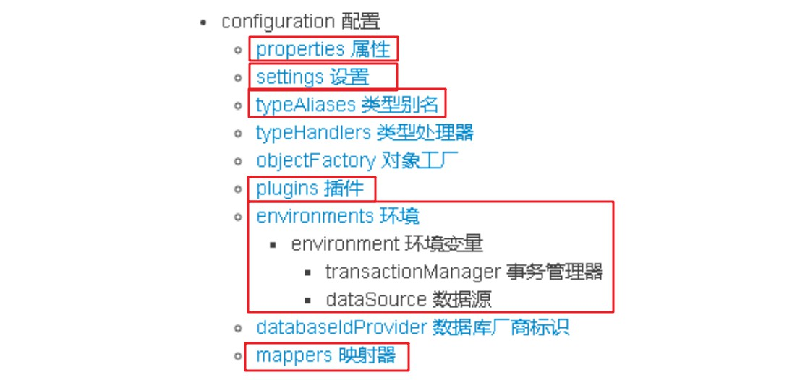
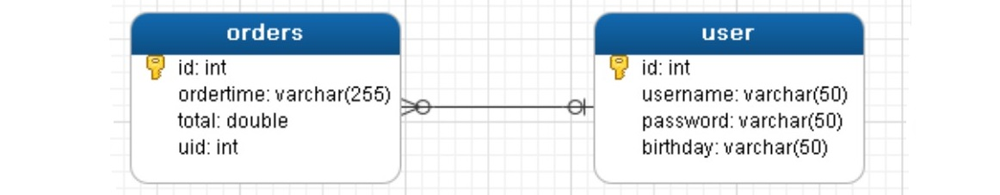
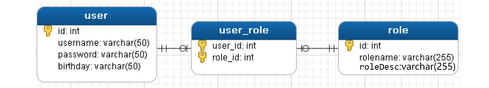
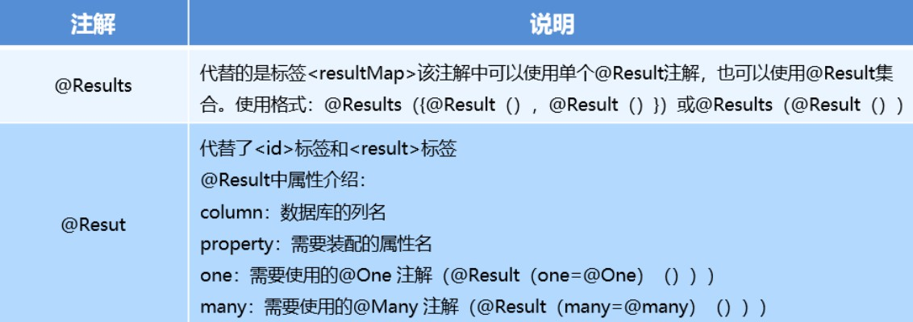

简要: **Mybatis 是ORM(实体与表映射), 半自动(可以自定义sql), 轻量级(没有过多的依赖,耦合性低)的持久层框架.**

### 一.Mybatis两种实现方式

接口IUserDao:

```java
public interface IUserDao {

    public List<User> findAll();
}
```

#### 1.传统dao实现类方式

实现类UserDaoImpl:

```java
public class UserDaoImpl implements IUserDao {
    @Override
    public List<User> findAll() {
        InputStream is = 
            Resources.class.getClassLoader().getResourceAsStream("sqlMapConfig.xml");
        SqlSessionFactory sqlSessionFactory = 
            new SqlSessionFactoryBuilder().build(is);
        SqlSession sqlSession = sqlSessionFactory.openSession();

        List<User> users = sqlSession.selectList("com.fishleap.dao.IUserDao.findAll");
        return users;
    }

}
```

测试:

```java
// 1.采用传统方式进行Dao接口,使用接口Dao的实现类,相当于在实现类中使用原生mybatis的API
@Test
public void findTest(){
    IUserDao userDao = new UserDaoImpl();
    List<User> users = userDao.findAll();
    users.forEach(System.out::println);
}
```

#### 2.jdk动态代理方式(重要)

jdk动态代理接口,生成接口的代理实现类.程序员只需要编写代理的接口如UserDao.java即可,Mapper接口开发需要遵循以下规范:

- Mapper接口的全限定名与mapper.xml文件中的namespace相同
- Mapper接口方法名和mapper.xml中定义的每个statement的id相同
- Mapper接口的方法的输入参数类型和mapper.xml中定义的每个sql的parameterType的类型相同
- Mapper接口的方法的输出参数类型和mapper.xml中定义的每个sql的resultType的类型相同

如UserMapper.xml

```xml
<mapper namespace="com.fishleap.dao.IUserDao">

    <select id="findAll" resultType="com.fishleap.entity.User">
        select * from user
    </select>
</mapper>
```

测试:

```java
// 2.使用jdk动态代理 生成接口Dao 的代理实现类
@Test
public void selectTest() {
    /**
     * 也可以使用 Resources.getResourceAsStream("sqlMapConfig.xml");写法,要抛异常
     * 问题: 获取InputStream 两种错误写法:
     * Resources.getDefaultClassLoader().getResourceAsStream("sqlMapConfig.xml");
     * Resources.class.getResourceAsStream("sqlMapConfig.xml");
     */
    InputStream is = 
        Resources.class.getClassLoader().getResourceAsStream("sqlMapConfig.xml");
    SqlSessionFactory sqlSessionFactory = new SqlSessionFactoryBuilder().build(is);
    SqlSession sqlSession = sqlSessionFactory.openSession();

    IUserDao userDao = sqlSession.getMapper(IUserDao.class);
    List<User> users = userDao.findAll();
    users.forEach(System.out::println);
}
```

### 二.Mybatis配置文件

#### 1.SqlMapConfig.xml

Mybatis核心配置文件层级关系,书写时顺序不能打乱.



下面是常用配置解析示例:

```xml
<?xml version="1.0" encoding="UTF-8" ?>
<!DOCTYPE configuration
        PUBLIC "-//mybatis.org//DTD Config 3.0//EN"
        "http://mybatis.org/dtd/mybatis-3-config.dtd">
<configuration>
    <!--注意: 下列标签使用时有一定的先后顺序,不能随便在任何位置写标签,
        如 properties标签必须放在第一个,不然会报错-->
    
    <!--  加载属性配置文件  -->
    <properties resource="jdbc.properties"></properties>

    <settings>
        <!-- 打印sql日志 -->
<!--        <setting name="logImpl" value="STDOUT_LOGGING" />-->
        <!--开启二级缓存  -->
        <setting name="cacheEnabled" value="true"/>
    </settings>

    <!--  配置别名: 基本数据类型的包装类和String类型,mybatis已经帮我们设置好了  -->
    <typeAliases>
        <!--  对单个实体类配置别名  -->
        <!-- <typeAlias type="com.fishleap.entity.User" alias="user"></typeAlias> -->

        <!--  配置别名包,对当前包下所有实体类配置别名,并且不区分大小写  -->
        <package name="com.fishleap.entity" />
    </typeAliases>

    <!--配置插件-->
    <plugins>
        <!--配置自定义插件-->
        <!--<plugin interceptor="com.fishleap.plugin.MyPlugin">
            <property name="username" value="jack"/>
        </plugin>-->
        
        <!--配置PageHelper插件: 若有分页插件,要排在通用mapper插件之前-->
        <plugin interceptor="com.github.pagehelper.PageHelper">
            <property name="dialect" value="mysql"/>
        </plugin>

        <!--通用mapper插件-->
        <plugin interceptor="tk.mybatis.mapper.mapperhelper.MapperInterceptor">
            <!--通用mapper接口,多个通用接口用逗号隔开-->
            <property name="mappers" value="tk.mybatis.mapper.common.Mapper"/>
        </plugin>
    </plugins>

    <!-- 配置环境: 事务管理,数据源; 指定默认的环境名称 -->
    <environments default="development">
        <!--指定当前环境的名称-->
        <environment id="development">
            <!--指定事务管理类型是JDBC: 使用jdbc的事务提交和回滚;还有一种类型是 MANAGED-->
            <transactionManager type="JDBC"></transactionManager>
            <!--指定当前数据源类型是连接池; 类型总共有三种: UNPOOLED/POOLED/JNDI-->
            <dataSource type="POOLED">
                <!--数据源配置的基本参数-->
                <property name="driver" value="${jdbc.driver}"/>
                <property name="url" value="${jdbc.url}"/>
                <property name="username" value="${jdbc.username}"/>
                <property name="password" value="${jdbc.password}"/>
            </dataSource>
        </environment>
    </environments>

    <!-- 引入mapper文件,指定路径 -->
    <mappers>
        <!--使用xml方式,引入xml文件-->
        <mapper resource="UserMapper.xml" />

        <!--使用注解方式,引入全路径类名-->
<!--        <mapper class="com.fishleap.mapper.IUserMapper" />-->

        <!-- 使用package引入mapper.xml文件时,所在的 包名+文件名 都必须一致 -->
        <!-- 注意: 在创建多层级包名时一定要使用"/"分隔,不是"."分隔 -->
        <!--即可以引入xml文件,也可以加载注解方式,使用时只能使用其中一种方式-->
        <package name="com.fishleap.mapper"/>
    </mappers>
</configuration>
```

#### 2.Mapper.xml

##### Mybatis动态sql是做什么的？都有哪些动态sql？简述一下动态sql的执行原理？

- **Mybatis动态sql**: 可以在 `*mapper.xml `sql映射文件中以xml标签编写sql,根据表达式的值进行逻辑判断并拼接成不同的sql;
- **动态sql的执行原理**: 从sql传入的参数对象中计算OGNL表达式的值,完成逻辑判断并动态拼接sql功能.

**动态sql标签**: `<if>`, `<choose>`,  `<when>`, `<otherwise>`, `<trim>`, `<where>`, `<set>`, `<foreach>`,  `<bind>` 

- set,if标签:
    ```xml
    <set>
      <if test="name != null">
        name=#{name},
      </if>
    </set>
    ```
- where,if标签:
    ```xml
    <where>
    	<if test="name != null"> 
            and name = #{name}
        </if>
    </where>
    ```
- foreach标签:
    ```xml
    <!--
    collection: 遍历的集合元素
    item: 遍历集合的每个元素,生成的变量名
    separator: 分隔符
    open: 语句的开始部分
    close: 结束部分
    -->
    <foreach collection="array" item="item" separator="," open="id in (" close=")">
      	#{item}
    </foreach>
    ```
- choose,when,otherwise标签:
    ```xml
    <choose>
      <when test="type == 1">
          startTime &gt; #{startTime}
      </when>
      <when test="type == 2">
          startTime &lt; #{startTime}
      </when>
      <otherwise>
          startTime = #{startTime}
      </otherwise> 
    </choose>
    ```
补充一个:
- sql片段抽取: 将重复地 sql 提取出来,使用 include 标签引用即可,达到重用目的
    ```xml
    <!-- sql片段 -->
    <sql id="selectSql">
        select * from user
    </sql>
    ```

### 三.Mybatis xml开发

#### 1.一对一查询

如一个订单从属于一个用户.

Order类:

```java
public class Orders {

    private Integer id;
    private String ordertime;
    private Double total;

    // 订单所从属的用户
    private User user;
}    
```



IOrderMapper.xml:

```xml
<resultMap id="orderMap" type="com.fishleap.entity.Orders">
    <id property="id" column="id"></id>
    <result property="ordertime" column="ordertime"></result>
    <result property="total" column="total"></result>

    <association property="user" javaType="com.fishleap.entity.User">
        <id property="id" column="uid"></id>
        <result property="username" column="username"></result>
        <result property="password" column="password"></result>
        <result property="birthday" column="birthday"></result>
    </association>
</resultMap>

<!--resultMap：手动来配置实体属性与表字段的映射关系-->
<!--查询订单信息的同时包含所属用户信息-->
<select id="findOrdersAndUser" resultMap="orderMap">
    select * from orders o,user u where o.uid = u.id
</select>
```

#### 2.一对多查询

如一个用户可以下多个订单:

User类:

```java
public class User {

    private Integer id;
    private String username;
    private String password;
    private String birthday;

    // 一个用户可以下多个订单
    private List<Orders> ordersList;
}    
```


IUserMapper.xml

```xml
<!--在主键id上手动映射时一般是 外键字段uid 映射到 属性id 上-->
<resultMap id="userMap" type="com.fishleap.entity.User">
    <id property="id" column="uid"></id>
    <result property="username" column="username"></result>
    <result property="password" column="password"></result>
    <result property="birthday" column="birthday"></result>
    <collection property="ordersList" ofType="com.fishleap.entity.Orders">
        <id property="id" column="oid"></id>
        <result property="ordertime" column="ordertime"></result>
        <result property="total" column="total"></result>
    </collection>
</resultMap>

<!---查询所有用户(左连接)的同时包含当前用户的所有订单信息-->
<!--z这里orders表的id需要取个别名,user表的id与orders表的id会重,导致映射时不正确-->
<select id="findAllUserAndOrders" resultMap="userMap">
    select u.*,o.id as oid,ordertime,total,uid
    from user u left join orders o on u.id = o.uid
</select>
```

#### 3.多对多查询

如: 一个用户可以有多个角色,一个角色可以分配给多个用户

User类:

```java
public class User {

    private Integer id;
    private String username;
    private String password;
    private String birthday;

    // 多对多关系
    private List<Role> roleList;
}    
```



IUserMapper.xml:

```xml
<!--在主键id上手动映射时一般是 外键字段userid 映射到 属性id 上-->
<resultMap id="userRoleMap" type="com.fishleap.entity.User">
    <id property="id" column="userid"></id>
    <result property="username" column="username"></result>
    <result property="password" column="password"></result>
    <result property="birthday" column="birthday"></result>
    <!--在主键id上手动映射时一般是 外键字段roleid 映射到 属性id 上-->
    <collection property="roleList" ofType="com.fishleap.entity.Role">
        <id property="id" column="roleid"></id>
        <result property="rolename" column="rolename"></result>
        <result property="roleDesc" column="roleDesc"></result>
    </collection>
</resultMap>

<select id="findAllUserAndRoles" resultMap="userRoleMap">
    select * from
    user u left join sys_user_role ur on u.id=ur.userid
    left join sys_role r on r.id=ur.roleid
</select>
```

### 四.Mybatis 注解开发

#### 1.常用注解

- @Insert: 增加
- @Update: 更新
- @Delete: 删除
- @Select: 查询
- @Result: 结果集封装
- @Results: 与@Result一起使用,封装多个结果集
- @One: 一对一结果集封装
- @Many: 一对多结果集封装

复杂关系的配置:



#### 2.一对一查询

如一个订单从属于一个用户:


IOrderMapper接口:

```java
// 一对一关系:一个订单从属于一个用户
// @one(select = statementId),接口的全限定名称.方法名,根据uid去findUserById(uid)
// column配合one去查询user对象后赋值给property的值
@Results({
    @Result(property = "id",column = "id"),
    @Result(property = "ordertime",column = "ordertime"),
    @Result(property = "total",column = "total"),
    @Result(property = "user",column = "uid",
            one = @One(select = "com.fishleap.mapper.IUserMapper.findUserById"))
})
@Select("select * from orders")
public List<Orders> findOrders();
```

IUserMapper接口:

```java
// 根据传入的uid来查询当前订单从属的用户
// 默认配置使用二级缓存,每次操作都会刷新缓存,避免脏数据
@Options(useCache = true,flushCache = Options.FlushCachePolicy.DEFAULT)
@Select("select * from user where id=#{id}")
public User findUserById(Integer id);
```

#### 3.一对多查询

如一个用户可以下多单:


IUserMapper接口:

```java
// 一对多: 一个用户可以下多个订单
@Select("select * from user")
@Results({
    @Result(property = "id",column = "id"),
    @Result(property = "username",column = "username"),
    @Result(property = "password",column = "password"),
    @Result(property = "birthday",column = "birthday"),
    @Result(property = "ordersList",column = "id",javaType = List.class,
            many = @Many(select = "com.fishleap.mapper.IOrderMapper.findOrdersByUid"))
})
public List<User> findAllUserAndOrdersOnAnnotation();
```

IOrderMapper接口:

```java
// 根据外键id: uid 查询有多少个订单
@Select("select * from orders where uid=#{uid}")
public List<Orders> findOrdersByUid(Integer uid);
```

#### 4.多对多查询

如: 一个用户可以有多个角色,一个角色可以分配给多个用户


IUserMapper接口:

```java
// 多对对: 一个用户可以有多个角色,一个角色可以分配多个用户
@Select("select * from user")
@Results({
    @Result(property = "id",column = "id"),
    @Result(property = "username",column = "username"),
    @Result(property = "password",column = "password"),
    @Result(property = "birthday",column = "birthday"),
    @Result(property = "roleList",column = "id",javaType = List.class,
            many = @Many(select = "com.fishleap.mapper.IRoleMapper.findRoleById")),
})
public List<User> findAllUserAndRolesOnAnnotation();
```

IRoleMapper接口:

```java
// 问题: Role导包时是自定义的entity包,导包要正确
// 根据用户表的id和中间表去查多个角色信息
@Select("select * from sys_role r,sys_user_role ur where r.id = ur.roleid
        and ur.userid = #{id}")
public List<Role> findRoleById(Integer id);
```

总结: **关于工作中到底是使用xml开发还是注解形式呢? 若是单表操作可以使用注解形式,若是复杂关系可以使用xml开发**.


