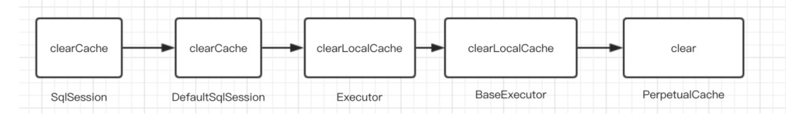
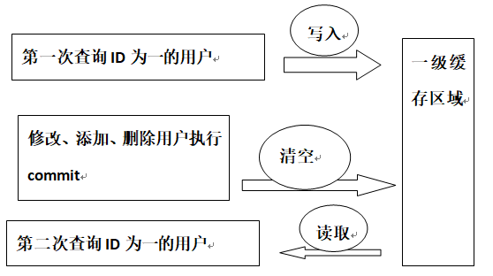
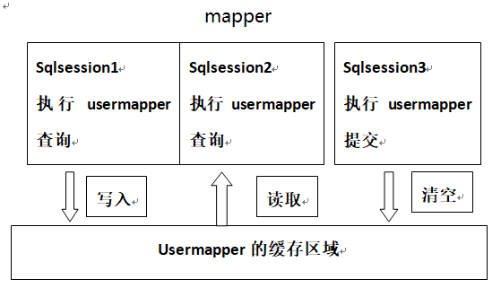

### 一.Mybatis缓存介绍

缓存就是内存中的数据,来自对数据库查询结果的保存,使用缓存可以避免频繁的与数据库进行交互,提高响应速度.

mybatis提供了对缓存的支持,分为一级缓存和二级缓存:

- 一级缓存是SqlSession级别的缓存,在操作数据库时需要构造sqlSession对象,在对象中有一个数据结构(HashMap)用于存储缓存数据.不同的sqlSession之间的缓冲数据区域(HashMap)是互相不影响的.
- 二级缓冲是mapper级别的缓冲,多个SqlSession去操作同一个Mapper的sql语句,多个SqlSession可以共用二级缓冲,二级缓冲是跨SqlSession的.

#### 1.一级缓冲源码分析

一级缓冲离不开SqlSession,从SqlSession入手,**看当前类是谁,它的父类和子类分别又是谁**.了解类之间的关系,

接下来看一下缓存到底是什么,又是怎么清除的? 下面是`SqlSession`接口中的`clearCache()`流程图:



如下:

```java
public class PerpetualCache implements Cache {
    // 缓冲容器
    private Map<Object, Object> cache = new HashMap<>();
    
    @Override
    public void clear() {
        cache.clear();
    }
}
```

缓存其实就是本地存放的一个map对象,每一个SqlSession都会存放一个map对象的引用.清除缓存实质就是`map.clear()`.

再看一下缓存在什么地方创建的呢?

```java
// Executor 中创建 CacheKey 对象
CacheKey createCacheKey(MappedStatement ms, Object parameterObject,
                        RowBounds rowBounds, BoundSql boundSql);

// BaseExecutor类
public CacheKey createCacheKey(MappedStatement ms, Object parameterObject, RowBounds rowBounds, BoundSql boundSql) {
    // 创建 CacheKey 对象
    CacheKey cacheKey = new CacheKey();
    // 设置 id、offset、limit、sql 到 CacheKey 对象中
    // 设置 id 就是Sql语句的所在位置: 包名 + 类名 + SQL名称(方法名)
    cacheKey.update(ms.getId());
    // 设置offse 第几条记录 值为0
    cacheKey.update(rowBounds.getOffset());
    // 设置limit 就是 Integer.MAXVALUE
    cacheKey.update(rowBounds.getLimit());
    // 设置具体的SQL语句
    cacheKey.update(boundSql.getSql());
    // ...... 设置了 sql 中带的参数
    cacheKey.update(value);
}
```

缓存的使用: 一级缓存更多用于查询操作.

```java
// Executor接口
// 查询，带 ResultHandler
<E> List<E> query(MappedStatement ms, Object parameter, RowBounds rowBounds, 
                  ResultHandler resultHandler) throws SQLException;

//此方法在SimpleExecutor的父类BaseExecutor中实现
@Override
public <E> List<E> query(MappedStatement ms, Object parameter, RowBounds rowBounds, 
                         ResultHandler resultHandler) throws SQLException {
    //根据传入的参数动态获得SQL语句，最后返回用BoundSql对象表示
    BoundSql boundSql = ms.getBoundSql(parameter);
    //为本次查询创建缓存的Key
    CacheKey key = createCacheKey(ms, parameter, rowBounds, boundSql);
    // 查询
    return query(ms, parameter, rowBounds, resultHandler, key, boundSql);
}

@Override
public <E> List<E> query(MappedStatement ms, Object parameter, RowBounds rowBounds, 
                         ResultHandler resultHandler, CacheKey key, BoundSql boundSql) 
    throws SQLException {
    // ......
        // 从一级缓存中，获取查询结果
        list = resultHandler == null ? (List<E>) localCache.getObject(key) : null;
        // 获取到，则进行处理
        if (list != null) {
            // 处理存储过程用的
            handleLocallyCachedOutputParameters(ms, key, parameter, boundSql);
            // 获得不到，则从数据库中查询
        } else {
            list = queryFromDatabase(ms, parameter, rowBounds, resultHandler, key, boundSql);
    // ......
    return list;
}
    
// 从数据库中读取操作
private <E> List<E> queryFromDatabase(MappedStatement ms, Object parameter, RowBounds 
          rowBounds, ResultHandler resultHandler, CacheKey key, BoundSql boundSql) 
    	throws SQLException {
    List<E> list;
    // 在缓存中，添加占位对象。此处的占位符，和延迟加载有关，可见 `DeferredLoad#canLoad()` 方法
    localCache.putObject(key, EXECUTION_PLACEHOLDER);
    try {
        // 执行读操作
        list = doQuery(ms, parameter, rowBounds, resultHandler, boundSql);
    } finally {
        // 从缓存中，移除占位对象
        localCache.removeObject(key);
    }
    // 添加到缓存中
    localCache.putObject(key, list);
    // 暂时忽略，存储过程相关
    if (ms.getStatementType() == StatementType.CALLABLE) {
        localOutputParameterCache.putObject(key, parameter);
    }
    return list;
}
    
// PerpetualCache类 实现 Cache接口
private Map<Object, Object> cache = new HashMap<>();
@Override
public void putObject(Object key, Object value) {
    cache.put(key, value);
}
```

#### 2.二级缓存使用

二级缓存在原理上与一级缓存是一样的.怎么使用二级缓存呢?

- 开启二级缓存: 一级缓存默认开启,二级缓存需要手动开启.在sqlMapConfig.xml文件中加入如下代码:

    ```xml
    <!--开启二级缓存-->
    <settings>
    <setting name="cacheEnabled" value="true"/>
    </settings>
    ```

- 在Mapper.xml文件中开启缓存

    ```xml
    <cache></cache>
    ```

    PerpetualCache类是mybatis默认实现缓存功能的类,也可以实现Cache接口来自定义缓存.

- POJO类需要实现 Serializable 序列化接口,为了将缓存数据取出执行反序列化操作.mybatis中的pojo都去实现Serializable接口.

- mybatis中默认sql使用二级缓存,即 `useCache=true`,在同一个namespace中,若有insert,update,delete操作后会默认刷新缓存.即 `flushCache=true`.一般事务操作都需要刷新缓存.

    ```xml
    <select id="selectUserByUserId" useCache="true" flushCache="true"
    resultType="com.fishleap.pojo.User" parameterType="int">
    select * from user where id=#{id}
    </select>
    ```

#### 3.二级缓存整合redis

mybatis自带实现Cache接口的PerpetualCache实现类,适用于单服务环境; 若是分布式环需要使用现在主流的缓存框架: redis等

引入依赖:

```xml
<!--mybatis整合redis实现二级缓存-->
<dependency>
    <groupId>org.mybatis.caches</groupId>
    <artifactId>mybatis-redis</artifactId>
    <version>1.0.0-beta2</version>
</dependency>
```

配置文件xml中添加: `<cache type="org.mybatis.caches.redis.RedisCache" />`

接口上使用注解:`IUserMapper.java`上`@CacheNamespace(implementation = RedisCache.class)`开启redis二级缓存.

**resources**下编写`redis.properties`文件,覆盖默认redis配置:

```properties
# 若是虚拟机上运行redis,不需要加上redis前缀,会报错
redis.host=localhost
redis.port=6379
redis.connectionTimeout=5000
redis.password=
redis.database=0
```

**源码分析**:

RedisCache和Mybatis的缓存方案类似,都需要实现Cache接口,并使用jedis操作缓存.

```java
public final class RedisCache implements Cache {
    private final ReadWriteLock readWriteLock = new DummyReadWriteLock();
    private String id;
    private static JedisPool pool;

    public RedisCache(String id) {
        if (id == null) {
            throw new IllegalArgumentException("Cache instances require an ID");
        } else {
            this.id = id;
            // RedisConfigurationBuilder 创建 RedisConfig
            RedisConfig redisConfig = 
                RedisConfigurationBuilder.getInstance().parseConfiguration();
            // 使用RedisConfig创建JedisPool
            pool = new JedisPool(redisConfig, redisConfig.getHost(), 
                                 redisConfig.getPort(), 
                                 redisConfig.getConnectionTimeout(), 
                                 redisConfig.getSoTimeout(), 
                                 redisConfig.getPassword(), redisConfig.getDatabase(), 
                                 redisConfig.getClientName());
        }
    }
    
    // 模板接口为RedisCallback,这个接口中只需要实现一个doWithRedis方法
    private Object execute(RedisCallback callback) {
        Jedis jedis = pool.getResource();
        Object var3;
        try {
            var3 = callback.doWithRedis(jedis);
        } finally {
            jedis.close();
        }
        return var3;
    }
    
    // 存储数据
    public void putObject(final Object key, final Object value) {
        this.execute(new RedisCallback() {
            public Object doWithRedis(Jedis jedis) {
                // 使用hash结构,把cache的id作为hash的key(mapper的namespace)
                // 查询缓存数据为hash的field
                jedis.hset(RedisCache.this.id.toString().getBytes(), 
                           key.toString().getBytes(), 
                           // SerializeUtil存储缓存的内容,负责对象的序列化和反序列化
                           SerializeUtil.serialize(value));
                return null;
            }
        });
    }

    public Object getObject(final Object key) {
        return this.execute(new RedisCallback() {
            public Object doWithRedis(Jedis jedis) {
                return SerializeUtil.unserialize(jedis.hget(RedisCache.this.id
                     .toString().getBytes(),key.toString().getBytes()));
            }
        });
    }
    
}    
```

看下RedisConfig类:

```java
public class RedisConfig extends JedisPoolConfig {
    private String host = "localhost";
    private int port = 6379;
    private int connectionTimeout = 2000;
    private int soTimeout = 2000;
    private String password;
    private int database = 0;
    private String clientName;
}    
```

RedisConfigurationBuilder类:

```java
final class RedisConfigurationBuilder {
    public RedisConfig parseConfiguration(ClassLoader classLoader) {
        Properties config = new Properties();
        // 加载配置文件,从classpath中读取一个redis.properties
        InputStream input = 
            classLoader.getResourceAsStream(this.redisPropertiesFilename);
        if (input != null) {
            try {
                config.load(input);
            } // ......
        }

        RedisConfig jedisConfig = new RedisConfig();
        // 将该配置文件中的内容设置到RedisConfig对象中并返回
        this.setConfigProperties(config, jedisConfig);
        return jedisConfig;
    }
}   
```

#### 4.mybatis缓存相关面试题

##### 1.谈谈对Mybatis的一级、二级缓存的认识

- 一级缓存: 基于 PerpetualCache 的 HashMap 本地缓存，其存储作用域为 Session，当 Session flush 或 close 之后，该 Session 中的所有 Cache 就将清空，默认打开一级缓存。
- 二级缓存与一级缓存其机制相同，默认也是采用 PerpetualCache，HashMap 存储，不同在于其存储作用域为 Mapper(Namespace)，并且可自定义存储源，如 Ehcache。默认不打开二级缓存，要开启二级缓存，使用二级缓存属性类需要实现Serializable序列化接口(可用来保存对象的状态),可在它的映射文件中配置 `<cache/>` 
- 对于缓存数据更新机制，当某一个作用域(一级缓存 Session/二级缓存Namespaces)的进行了C/U/D 操作后，默认该作用域下所有 select 中的缓存将被 clear。

##### 2.从以下几个方面谈谈对mybatis的一级缓存?

- **mybaits中如何维护一级缓存**
     - BaseExecutor成员变量之一的PerpetualCache，是对Cache接口最基本的实现，其实现非常简单，内部持有HashMap，对一级缓存的操作实则是对HashMap的操作。

- **一级缓存的生命周期**
    - MyBatis一级缓存的生命周期和SqlSession一致;
    -  MyBatis的一级缓存最大范围是SqlSession内部，有多个SqlSession或者分布式的环境下，数据库写操作会引起脏数据;
    - MyBatis一级缓存内部设计简单，只是一个没有容量限定的HashMap，在缓存的功能性上有所欠缺

- **mybatis 一级缓存何时失效**
    - MyBatis在开启一个数据库会话时，会创建一个新的SqlSession对象，SqlSession对象中会有一个新的Executor对象，Executor对象中持有一个新的PerpetualCache对象；当会话结束时，SqlSession对象及其内部的Executor对象还有PerpetualCache对象也一并释放掉。
    - 如果SqlSession调用了close()方法，会释放掉一级缓存PerpetualCache对象，一级缓存将不可用；
    - 如果SqlSession调用了clearCache()，会清空PerpetualCache对象中的数据，但是该对象仍可使用；
    - SqlSession中执行了任何一个事务操作update()、delete()、insert() ，都会清空PerpetualCache对象的数据.

- **一级缓存的工作流程**
    - 对于某个查询，根据statementId,params,rowBounds来构建一个key值，根据这个key值去缓存Cache中取出对应的key值存储的缓存结果；
    - 判断从Cache中根据特定的key值取的数据数据是否为空，即是否命中；
    - 如果命中，则直接将缓存结果返回；
    - 如果没命中：去数据库中查询数据，得到查询结果；将key和查询到的结果分别作为key,value对存储到Cache中；将查询结果返回.

##### 3.简述下Mybatis的一级、二级缓存（分别从存储结构、范围、失效场景。三个方面来作答）？



一级缓存是**SqlSession级别的缓存**.不同的sqlSession之间的缓存数据区域(**HashMap**)是互不影响的.Mybatis**默认开启**一级缓存.在同一个sqlSession中执行两次相同的sql,第一次执行会将查询的数据写入缓存(**LocalCache**),第二次会**判断缓存是否存在,若存在则直接从缓存中获取值.当发生增删改和commit时,缓存会被清除**.



二级缓存是实现的**全局缓存**.**多个sqlSession共享二级缓存**,是基于**namespace**的.配置中**cacheEnabled**开启二级缓存,被**CachingExecutor**进行包装.在接口添加**CacheNamespace**注解或mapper中添加**cache**标签.使用二级缓存的**pojo类也需要实现序列化接口**.Mybatis采用**PerpetualCache实现Cache接口**实现二级缓存,也可以整合redis来实现二级缓存.同样也是实现了Cache接口.发生**增删改和commit时,缓存会被清除**.

**总结**: 

- 一级缓存与二级缓存底层数据结构都是HashMap结构,都是`PerpetualCache.cache` Map结构
- 一级缓存: 
    - SqlSession中Map集合,存在于每个SqlSession中;
    - **缓存存储的是查询结果的引用**,判断引用是否相等是true;
    - 一级缓存默认时开启的
    - 当sqlSession调用方法发生增删改并commit时,缓存被清空
- 二级缓存:
    - 基于`*Mapper.xml`的**namespace**,同一个mapper.xml的所有sqlsession共享二级缓存;
    - **缓存存储的是查询结果的数据,会重新将数据封装到新的对象中**,判断引用是否相等是false;
    - 二级缓存需要在`sqlMapConfig.xml`文件中配置settings标签**cacheEnabled**开启缓存,接口中使用注解 `@CacheNamespace` 开启二级缓存,类上注解`@CacheNamespace(implementation = PerpetualCache.class)` ,使用二级缓存的pojo的类也需要**实现序列化**.
    - 同一个mapper.xml映射文件中发生增删改并commit,二级缓存会失效

参考:

- [Mybatis的一级缓存和二级缓存](https://blog.csdn.net/xiaojin21cen/article/details/105689189)
- [mybatis中的一级缓存和二级缓存](https://blog.csdn.net/qq_35688140/article/details/89848539)


### 二.Mybatis插件介绍

#### 1.插件介绍及基本原理

mybatis支持用插件对四大核心对象(Executor,StatementHandler,ParameterHandler,ResultSetHandler)进行拦截,用来增强核心功能,其本质借助于底层的动态代理实现的.即mybatis中四大对象都是代理对象.

**Mybatis允许拦截下面4种接口的方法**:

- `ParameterHandler(getParameterObject, setParameters等)`: 参数设置处理
- `ResultSetHandler(handlerResultSets, handlerOutputParameters等)`: 结果封装处理
- `Statementhandler(prepare, parameterize, batch, update, query等)`: SQL语法构建器
- `Executor(update, query, commit, rollback等)`: 执行器

Mybatis使用JDK动态代理,代理拦截的接口生成代理对象.然后实现接口的拦截方法.即当执行需要拦截的接口方法时,会进入拦截方法.每个创建的对象是`interceptorChain.pluginAll(parameterHandler);` 方法获取所有的Interceptor,然后遍历最终得到target包装的对象.

拿ParameterHandler源码来说:

```java
// Configuration类中
// 创建 ParameterHandler 对象
public ParameterHandler newParameterHandler(MappedStatement mappedStatement, Object 
                                            parameterObject, BoundSql boundSql) {
    // 创建 ParameterHandler 对象
    ParameterHandler parameterHandler = 
        mappedStatement.getLang().createParameterHandler(mappedStatement, 
                                                         parameterObject, boundSql);
    // 应用插件
    parameterHandler = (ParameterHandler) 
        interceptorChain.pluginAll(parameterHandler);
    return parameterHandler;
}

// InterceptorChain类中
public class InterceptorChain {
    // 拦截器数组,保存了所有的拦截器interceptors,是mybatis初始化创建的
    private final List<Interceptor> interceptors = new ArrayList<>();
    // 应用所有插件,拦截器
    public Object pluginAll(Object target) {
        // 调用拦截器链中的拦截器依次对目标进行拦截或增强
        for (Interceptor interceptor : interceptors) {
            // target可以理解为mybatis中的四大对象
            // 即拦截器链中拦截器会依次对目标进行拦截或层层增强
            target = interceptor.plugin(target);
        }
        // 返回的target是被重重代理后的对象
        return target;
    }
}

// Interceptor接口中
// 应用插件。如应用成功，则会创建目标对象的代理对象
// 应用的结果对象，可以是代理对象，也可以是 target 对象，也可以是任意对象。
Object plugin(Object target);
```

#### 2.自定义插件

**拦截器接口**:

```java
public interface Interceptor {

    /**
     * 拦截方法: 插件的核心方法
     * @param invocation 调用信息
     * @return 调用结果
     * @throws Throwable 若发生异常
     */
    Object intercept(Invocation invocation) throws Throwable;

    /**
     * 应用插件。如应用成功，则会创建目标对象的代理对象,生成target的代理对象
     * @param target 目标对象
     * @return 应用的结果对象，可以是代理对象，也可以是 target 对象，也可以是任意对象。具体的，看代码实现
     */
    Object plugin(Object target);

    /**
     * 设置拦截器属性,传递插件所需要的参数
     * @param properties 属性
     */
    void setProperties(Properties properties);
}
```

**编写插件步骤**:

- 编写`Interceptor`接口的实现类
- 使用`@Intercepts`和`@Signature`注解设置插件的签名,显示要拦截哪个对象的哪个方法
- 在全局配置文件中配置插件

示例:

```java
@Intercepts({   // 可以配置多个@Signature对多个地方拦截
    @Signature(type= StatementHandler.class,    // 拦截哪个接口
        method = "prepare", // 拦截接口中的指定方法
        args = {Connection.class,Integer.class})    // 拦截方法的入参,确定方法的唯一,可能方法重载
})
public class MyPlugin implements Interceptor {

    /**
     * 拦截方法: 每次执行StatementHandler.prepare方法都之前都会执行下列方法
     * 3.拦截方法：只要被拦截的目标对象的目标方法被执行时，每次都会执行intercept方法
     * @param invocation
     * @return
     * @throws Throwable
     */
    @Override
    public Object intercept(Invocation invocation) throws Throwable {
        System.out.println("在sql执行之前对方法进行增强");
        return invocation.proceed();   //调用原方法;
    }

    /**
     * 包装目标对象,为目标对象创建代理对象
     * 主要为了把当前的拦截器生成代理存到拦截器链中
     * 2.在拦截方法之前,每次调用都会先将当前拦截器代理存到拦截器链中
     * @param target    要拦截的对象
     * @return  代理对象
     */
    @Override
    public Object plugin(Object target) {
        System.out.println("将当前拦截器生成代理存到拦截器链中");
        Object wrap = Plugin.wrap(target, this);
        return wrap;
    }

    /**
     * 获取sqlMapConfig文件中插件配置参数
     * 插件初始化时调用,也只调用一次
     * 1.应用启动时最先执行下面方法获取插件的配置参数
     * @param properties
     */
    @Override
    public void setProperties(Properties properties) {
        System.out.println("获取sqlMapConfig文件中配置参数"+ properties);
    }
}

```

sqlMapConfig.xml中全局配置插件: 需要注意标签的顺序

```xml
<!--配置插件-->
<plugins>
	<!--配置自定义插件-->
	<plugin interceptor="com.fishleap.plugin.MyPlugin">
		<property name="username" value="jack"/>
	</plugin>
</plugins>
```

#### 3.插件源码分析

Plugin类部分源码:

```java
// 插件类，一方面提供创建动态代理对象的方法，另一方面实现对指定类的指定方法的拦截处理。
public class Plugin implements InvocationHandler {
    
    @Override
    public Object invoke(Object proxy, Method method, Object[] args) throws Throwable 
    {
        try {
            // 获得目标方法是否被拦截,是否配置在插件的@Signature注解中
            // 如signatureMap(Executor.class),可能返回 [query,update,commit]等方法
            Set<Method> methods = signatureMap.get(method.getDeclaringClass());
            // 检测方法列表是否包含被拦截的方法
            if (methods != null && methods.contains(method)) {
                // 如果是，则拦截处理该方法,执行插件逻辑
                // 插件逻辑封装在intercept方法中,参数类型为Invocation
                return interceptor.intercept(new Invocation(target, method, args));
            }
            // 如果不是，则调用原方法
            return method.invoke(target, args);
        } catch (Exception e) {
            throw ExceptionUtil.unwrapThrowable(e);
        }
    }
}    

// Invocation类: 方法调用信息
public class Invocation {
    
    private final Object target;	// 目标对象
    private final Method method;	// 方法对象
    private final Object[] args;	// 方法参数数组
    
    // 调用方法
    public Object proceed() throws InvocationTargetException, IllegalAccessException {
        return method.invoke(target, args);
    }
}    
```

#### 4.pageHelper和mapper插件

##### 4.1 pageHelper分页插件

pageHelper是将分页的复杂操作进行封装,使用简单方式即可获得分页相关数据.

引入依赖:

```xml
<!--分页插件pagehelper-->
<dependency>
    <groupId>com.github.pagehelper</groupId>
    <artifactId>pagehelper</artifactId>
    <version>3.7.5</version>
</dependency>
<dependency>
    <groupId>com.github.jsqlparser</groupId>
    <artifactId>jsqlparser</artifactId>
    <version>0.9.1</version>
</dependency>
```

在sqlMapConfig.xml文件中配置插件:

```xml
<!--配置PageHelper插件: 若有分页插件,要排在通用mapper插件之前-->
<plugin interceptor="com.github.pagehelper.PageHelper">
    <property name="dialect" value="mysql"/>
</plugin>
```

测试代码:

```java
// 对分页助手 PageHelper 的测试
@Test
public void pagehelperTest() {
    IUserMapper userMapper = sqlSession.getMapper(IUserMapper.class);
    // startPage()方法只对接下来的一条sql起分页查询作用,后续其它sql都不会生效
    PageHelper.startPage(1,1);
    List<User> users = userMapper.findAll();
    users.forEach(System.out::println);
    // 将users封装到PageInfo中,包含分页信息和分页数据一起返回给前端
    PageInfo<User> userPageInfo = new PageInfo<>(users);
    System.out.println("总条数: " + userPageInfo.getTotal());
    System.out.println("总页数: " + userPageInfo.getPages());
    System.out.println("当前页: " + userPageInfo.getPageNum());
    System.out.println("每页记录数: " + userPageInfo.getPageSize());
}
```

##### 4.2 mapper插件

Mapper是为了解决单表增删改查问题而生的,开发人员不需要编写sql,不需要在dao中增加方法,只需要写好实体类就能支持相应的crud方法.

引入依赖:

```xml
<!--通用mapper插件-->
<dependency>
    <groupId>tk.mybatis</groupId>
    <artifactId>mapper</artifactId>
    <version>3.1.2</version>
</dependency>
```

配置文件中配置:

```xml
<!--通用mapper插件,排在pageHelper之后-->
<plugin interceptor="tk.mybatis.mapper.mapperhelper.MapperInterceptor">
    <!--通用mapper接口,多个通用接口用逗号隔开-->
    <property name="mappers" value="tk.mybatis.mapper.common.Mapper"/>
</plugin>
```

实体类设置主键:

```java
@Table(name = "user")
public class User implements Serializable {
    @Id
    @GeneratedValue(strategy = GenerationType.IDENTITY)
    private Integer id;

    @Column(name = "username")
    private String username;
}
```

定义通用mapper:

```java
/**
 * 自定义持久层接口 extend 通用Mapper<T> 接口
 * 通用Mapper接口中继承了基本的单表CRUD操作
 */
public interface UserMapper extends Mapper<User>  {
}
```

测试代码:

```java
/**
  * 对通用mapper插件进行测试: 只适用于单表的 crud 操作
  * 单表对应的实体类User中只能由自己类的相关属性,不能有多表操作的属性
  * User类中的类名和相关和属性都可以适用注解来与表名及字段进行映射
  */
@Test
public void mapperTest() {
    UserMapper userMapper = sqlSession.getMapper(UserMapper.class);
    // 使用select等基础方法
    List<User> users = userMapper.select(null); // 查询全部
    //        List<User> users = userMapper.select(new User(1, "abc"));
    users.forEach(System.out::println);

    // 使用example对象配置查询条件
    Example example = new Example(User.class);
    example.createCriteria().andEqualTo("id",2);
    // 不能链式写法
    //        Example.Criteria id = new Example(User.class)
    //                .createCriteria().andEqualTo("id", 2);
    List<User> userList = userMapper.selectByExample(example);
    userList.forEach(System.out::println);
}
```

#### 5.插件相关面试题

##### 1.简述 Mybatis 的插件运行原理，以及如何编写一个插件。

Mybatis 仅可以编写针对 ParameterHandler、ResultSetHandler、StatementHandler、Executor 这 4 种接口的插件，Mybatis 使用 JDK 的动态代理，为需要拦截的接口生成代理对象以实现接口方法拦截功能，每当执行这 4 种接口对象的方法时，就会进入拦截方法，具体就是 InvocationHandler 的 invoke()方法，会拦截那些你指定需要拦截的方法。

编写插件：实现 Mybatis 的 Interceptor 接口并复写 intercept()方法，然后在给插件编写注解，指定要拦截哪一个接口的哪些方法即可, 最后需要在核心配置文件中个配置插件,自定义的插件才会生效.

##### 2.Mybatis是如何进行分页的？分页插件的原理是什么？

Mybatis 使用 RowBounds 对象进行分页，它是针对 ResultSet 结果集执行的内存分页，而非物理分页。可以在 sql 内直接书写带有物理分页的参数来完成物理分页功能，也可以使用分页插件来完成物理分页。

分页插件的基本原理是使用 Mybatis 提供的插件接口，实现自定义插件，在插件的拦截方法内拦截待执行的 sql，然后重写 sql，根 据 dialect 方言，添加对应的物理分页语句和物理分页参数。


