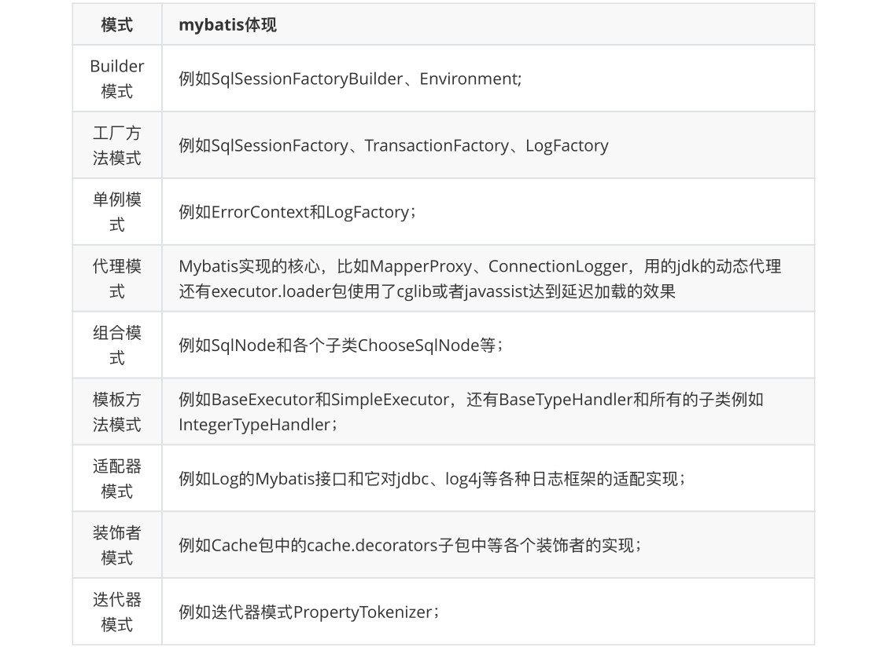
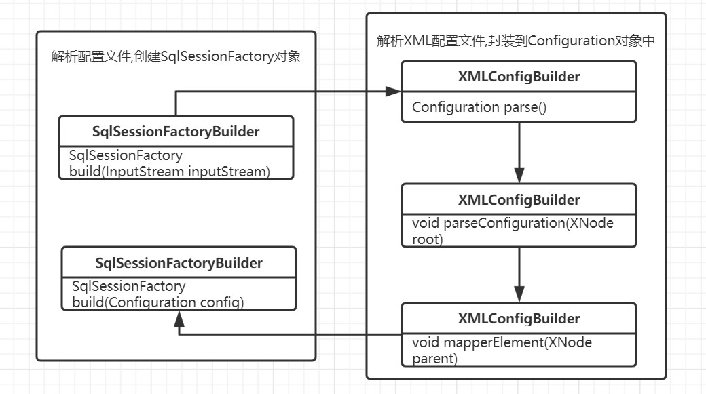

### 一.Mybatis架构介绍

架构设计:


Mybatis的功能架构分为上图的三层: API接口层,数据处理层,框架支撑层.

### 二.Mybatis执行流程

主要构件:


mybatis执行流程图如下:


mybatis中xml解析是通过`SqlSessionFactoryBuilder.build()`方法。初始化mybatis(解析xml文件构建成Configuration对象)并初始化SqlSessionFactory对象，在解析xml时会同时根据其中节点做相应的初始化操作.关键节点: settings、typeAliases、mappers.

通过`SqlSesssionFactory.openSession()`方法打开一个SqlSession对象,SqlSessionFactory对象的作用是里面存了全局的配置信息以及初始化环境和DataSource，DataSource对象可以用来开辟连接.  SqlSessionFactory对象是用来保存全局信息并且打开数据库连接，在打开SqlSession对象的时候就会开辟一个连接对象并传给SqlSession对象，和数据库打交道的操作入口在于SqlSession对象.

通过`SqlSession.getMapper()`根据传入的Mapper对象类型动态代理并返回一个动态代理后的Mapper对象，由`SqlSession.select()/update()`，MapperProxy对象的`invoke()`方法执行后再执行execure方法，再根据情况选择执行select/update.

Executor执行`Query/queryFromDatabase`，在前面经过参数名封装和缓存查询之后（缓存为空），会调用queryFromDatabase方法去数据库当中查.

SimpleExecurot执行`doQuery()`方法，初始化prepareStatement并且给#{}参数赋值; StatementHandler执行`query()`方法，执行sql语句; `ResuletHandler.handleResultSets()`方法封装结果集.

### 三.Mybatis涉及到的设计模式

mybatis源码中使用了以下的设计模式:



下面主要介绍以下三种设计模式:

#### 1.Builder构建者模式

使用多个简单的对象一步一步构建一个赋值的对象.

在mybatis中的体现: 使用SqlSessionFactoryBuilder类构建SqlSessionFactory的过程中,调用`XMLConfigBuilder.parseConfiguration()` 方法中就使用了构建者模式.



parseConfiguration方法:

```java
private void parseConfiguration(XNode root) {
    try {
        //issue #117 read properties first
        // 解析 <properties /> 标签
        propertiesElement(root.evalNode("properties"));
        // 解析 <settings /> 标签
        Properties settings = settingsAsProperties(root.evalNode("settings"));
        // 加载自定义的 VFS 实现类
        loadCustomVfs(settings);
        // 解析 <typeAliases /> 标签
        typeAliasesElement(root.evalNode("typeAliases"));
        // 解析 <plugins /> 标签
        pluginElement(root.evalNode("plugins"));
        // 解析 <objectFactory /> 标签
        objectFactoryElement(root.evalNode("objectFactory"));
        // 解析 <objectWrapperFactory /> 标签
        objectWrapperFactoryElement(root.evalNode("objectWrapperFactory"));
        // 解析 <reflectorFactory /> 标签
        reflectorFactoryElement(root.evalNode("reflectorFactory"));
        // 赋值 <settings /> 到 Configuration 属性
        settingsElement(settings);
        // read it after objectFactory and objectWrapperFactory issue #631
        // 解析 <environments /> 标签
        environmentsElement(root.evalNode("environments"));
        // 解析 <databaseIdProvider /> 标签
        databaseIdProviderElement(root.evalNode("databaseIdProvider"));
        // 解析 <typeHandlers /> 标签
        typeHandlerElement(root.evalNode("typeHandlers"));
        // 解析 <mappers /> 标签
        mapperElement(root.evalNode("mappers"));
    }
}
```

示例: 使用构建者设计模式生成computer.

Computer类:

```java
/**
 * 复杂对象
 */
public class Computer {
    private String displayer;
    private String mainUnit;
    private String mouse;
    private String keyboard;
}
```

ComputerBuilder类:

```java
/**
 * 构建者对象,使用简单对象一步一步构建复杂对象
 */
public class ComputerBuilder {
    // 复杂对象成员属性
    private Computer computer = new Computer();

    public void installDisplayer(String displayer){
        computer.setDisplayer(displayer);
    }
    public void installMainUnit(String mainUnit){
        computer.setMainUnit(mainUnit);
    }
    public void installMouse(String mouse){
        computer.setMouse(mouse);
    }
    public void installKeyboard(String keyboard){
        computer.setKeyboard(keyboard);
    }

    // 构建复杂对象
    public Computer build() {
        return computer;
    }
}
```

ConstructorTest类:

```java
/**
 * 构建者模式: 使用多个简单对象一步一步构建一个复杂对象
 * 使用构建者模式来生产computer
 */
public class ConstructorTest {

    public static void main(String[] args) {
        ComputerBuilder computerBuilder = new ComputerBuilder();

        computerBuilder.installDisplayer("displayer");
        computerBuilder.installMainUnit("mainUnit");
        computerBuilder.installMouse("mouse");
        computerBuilder.installKeyboard("keyboard");

        Computer computer = computerBuilder.build();
        System.out.println(computer);
    }
}
```

#### 2.工厂模式

Mybatis中使用的时简单工厂模式,又称为静态工厂方法模式,属于创建型模式.

简单工厂模式: 根据参数的不同返回不同类的实例, 专门定义一个类来负责创建其他类的实例,被创建的实例通常都具有共同的父类.

mybatis中使用工厂模式: 执行Sql语句,获取Mappers,管理事务的核心接口SqlSession的创建过程使用了工厂模式.

DefaultSqlSessionFactory类图:


SqlSessionFactory的`open Session()`方法重载了多个来构建SqlSession对象.

示例: 根据不同的电脑类型生产不同的电脑

Computer抽象类:

```java
public abstract class Computer {
    // 产品的抽象方法,由具体的产品去实现
    public abstract void start();
}
```

Computer子类:

```java
public class LenovoComputer extends Computer {
    @Override
    public void start() {
        System.out.println("Lenovo start...");
    }
}

public class XiaomiComputer extends Computer{
    @Override
    public void start() {
        System.out.println("xiaomi start...");
    }
}
```

ComputerFactory类:

```java
/**
 * 专门定义一个类来负责创建其他类的实例,被创建的实例通常都具有共同的父类
 * 简单工厂类,用于生产不同类型的电脑
 */
public class ComputerFactory {

    // 根据不同参数类型来生产不同的电脑
    public static Computer createComputer(String type) {
        Computer computer = null;
        switch (type) {
            case "lenovo":
                computer = new LenovoComputer();
                break;
            case "xiaomi":
                computer = new XiaomiComputer();
                break;
        }
        return computer;
    }

}
```

SimpleFactoryTest测试类:

```java
/**
 * 简单工厂模式: 根据参数的不同返回不同类的实例
 * 根据不同的电脑类型生产不同的电脑
 */
public class SimpleFactoryTest {
    public static void main(String[] args) {
        Computer computer = ComputerFactory.createComputer("lenovo");
        computer.start();
    }
}
```

#### 3.代理模式

代理模式(Proxy Pattern): 给某一个对象提供一个代理,并由代理对象控制对原对象的引用.是一种结构型模式.代理模式分为静态代理和动态代理.

mybatis中体现: 当使用Configuration的getMapper方法时,会调用mapperRegistry.getMapper方法,该方法又会调用mapperProxyFactory.newInstance(sqlSession)生成一个具体的代理:


具体源码可看: [Mybatis源码分析-getmapper源码](http://itzlg.gitee.io/java-development-notes/#/docs/framework/mybatis/mybatis04?id=_1getmapper方法源码)

示例:

Computer接口和实现类:

```java
public interface Computer {
    void start();
}

public class LenovoComputer implements Computer {
    @Override
    public void start() {
        System.out.println("lenovo start...");
    }
}
```

JDKDynamicProxy类:

```java
/**
 * JDK动态代理
 * 需要实现 InvocationHandler 接口
 */
public class JDKDynamicProxy implements InvocationHandler {

    // 被代理对象
    private Computer target;

    // 构造函数
    public JDKDynamicProxy(Computer computer) {
        this.target = computer;
    }

    // 获取代理对象: 使用jdk动态代理生产实现类的代理类
    public Object getMapper() {
        Object proxy = Proxy.newProxyInstance(target.getClass().getClassLoader(),
                target.getClass().getInterfaces(), this);
        return proxy;
    }

    // 动态代理: 只要代理对象调用代理接口中的方法,都会执行invoke方法
    @Override
    public Object invoke(Object proxy, Method method, Object[] args) 
        				throws Throwable {
        // 被代理方法前执行
        System.out.println("JDKDynamicProxy do something before!");
        // 调用原接口实现类的方法: 执行被代理的方法
        // 这里的参数是 接口对象,要调用接口中对应的方法,不是上面的形参proxy
        Object invoke = method.invoke(target, args);
        // 被代理方法后执行
        System.out.println("JDKDynamicProxy do something after!");
        return invoke;
    }
}
```

DynamicProxyTest测试类:

```java
public class DynamicProxyTest {
    public static void main(String[] args) {
        System.out.println("不使用jdk动态代理");
        Computer computer = new LenovoComputer();
        computer.start();

        System.out.println("---------------------------------");

        System.out.println("使用jdk动态代理");
        // 获取代理类
        JDKDynamicProxy jdkDynamicProxy = new JDKDynamicProxy(new LenovoComputer());
        Computer mapper = (Computer)jdkDynamicProxy.getMapper();
        // 调用接口中的方法,会执行 invoke 方法
        mapper.start();
    }
}
```


