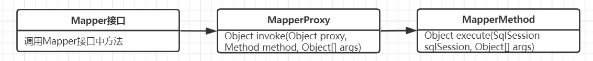

### 一.传统方式源码分析

#### 1.加载配置文件源码

从原生api使用开始一步一步分析.

```java
// 1. 读取配置文件，读成字节输入流，注意：现在还没解析
InputStream resourceAsStream = Resources.getResourceAsStream("sqlMapConfig.xml");
```

源码流程:


ClassLoader类:

```java
public InputStream getResourceAsStream(String name) {
    Objects.requireNonNull(name);
    // 获取文件名称的url
    URL url = getResource(name);
    try {
        // 转化为InputStream
        return url != null ? url.openStream() : null;
    } catch (IOException e) {
        return null;
    }
}
```

#### 2.创建DefaultSqlSessionFactory对象源码

```java
// 2. 解析配置文件，封装Configuration对象   创建DefaultSqlSessionFactory对象
SqlSessionFactory sqlSessionFactory = new 
        SqlSessionFactoryBuilder().build(resourceAsStream);
```

源码流程:


SqlSessionFactoryBuilder类:

```java
// 2.调用的重载方法
public SqlSessionFactory build(InputStream inputStream, String environment, Properties properties) {
    try {
        // 创建 XMLConfigBuilder, XMLConfigBuilder是专门解析mybatis的配置文件的类
        XMLConfigBuilder parser = new XMLConfigBuilder(inputStream, environment, properties);
        // 执行 XML 解析
        // 创建 DefaultSqlSessionFactory 对象
        return build(parser.parse());
    } 
}

// 创建 DefaultSqlSessionFactory 对象
public SqlSessionFactory build(Configuration config) {
    return new DefaultSqlSessionFactory(config); //构建者设计模式
}
```

XMLConfigBuilder类:

```java
// 解析 XML 成 Configuration 对象
public Configuration parse() {
    ///parser是XPathParser解析器对象，读取节点内数据，<configuration>是MyBatis配置文件中的顶层标签
    // 解析 XML configuration 节点
    parseConfiguration(parser.evalNode("/configuration"));
    return configuration;
}

// 解析XML
private void parseConfiguration(XNode root) {
    try {
        //issue #117 read properties first
        // 解析 <properties /> 标签
        propertiesElement(root.evalNode("properties"));
        // ......
        // 解析 <mappers /> 标签
        mapperElement(root.evalNode("mappers"));
    }
}

// 解析mappers标签,也就是解析mapper.xml文件
private void mapperElement(XNode parent) throws Exception {
    // ......
    // 如果是 package 标签，则扫描该包
    if ("package".equals(child.getName())) {
        // 获得包名
        String mapperPackage = child.getStringAttribute("name");
        // 添加到 configuration 中
        configuration.addMappers(mapperPackage);
        // 如果是 mapper 标签，
    } else {
}
```

Configuration类:

```java
/**
* MappedStatement 映射
* KEY：`${namespace}.${id}`
* 存储key=全限定类名+方法名,value=对应的MappedStatement对象.
* 一个MappedStatement对象封装一个mapper文件中的sql标签.
*/
protected final Map<String, MappedStatement> mappedStatements = new StrictMap<>("Mapped Statements collection");

public void addMappers(String packageName) {
    // 扫描该包下所有的 Mapper 接口，并添加到 mapperRegistry 中
    mapperRegistry.addMappers(packageName);
}
```

MapperRegistry类:

```java
// Mapper 注册表
public class MapperRegistry {
    // MyBatis Configuration 对象
    private final Configuration config;
    // MapperProxyFactory 的映射
    // 这个类中维护一个HashMap存放MapperProxyFactory
    private final Map<Class<?>, MapperProxyFactory<?>> knownMappers = new HashMap<>();
    
    /**
     * 扫描指定包，并将符合的类，添加到 {@link #knownMappers} 中
     */
    public void addMappers(String packageName, Class<?> superType) {
        // 扫描指定包下的指定类
        ResolverUtil<Class<?>> resolverUtil = new ResolverUtil<>();
        resolverUtil.find(new ResolverUtil.IsA(superType), packageName);
        Set<Class<? extends Class<?>>> mapperSet = resolverUtil.getClasses();
        // 遍历，添加到 knownMappers 中
        for (Class<?> mapperClass : mapperSet) {
            addMapper(mapperClass);
        }
    }
    
    public <T> void addMapper(Class<T> type) {
        // 判断，必须是接口。
        if (type.isInterface()) {
            boolean loadCompleted = false;
            try {
                // 添加到 knownMappers 中
                knownMappers.put(type, new MapperProxyFactory<>(type));
                // It's important that the type is added before the parser is run
                // otherwise the binding may automatically be attempted by the
                // mapper parser. If the type is already known, it won't try.
                // 解析 Mapper 的注解配置
                MapperAnnotationBuilder parser = new MapperAnnotationBuilder(config, type);
                parser.parse();
                // 标记加载完成
                loadCompleted = true;
            } finally {
                // 若加载未完成，从 knownMappers 中移除
                if (!loadCompleted) {
                    knownMappers.remove(type);
                }
            }
        }
    }
}    
```

#### 3.创建DefaultSqlSession对象源码

```java
// 3. 生产了DefaultSqlsession实例对象   设置了事务不自动提交  完成了executor对象的创建
SqlSession sqlSession = sqlSessionFactory.openSession();
```

源码流程:


源码如下:

DefaultSqlSessionFactory类:

```java
//6. 进入openSession方法
@Override
public SqlSession openSession() {
    //getDefaultExecutorType()传递的是SimpleExecutor
    return openSessionFromDataSource(configuration.getDefaultExecutorType(), 
                                     null, false);
}

//7. 进入openSessionFromDataSource。
//ExecutorType 为Executor的类型，TransactionIsolationLevel为事务隔离级别，autoCommit是否开启事务
//openSession的多个重载方法可以指定获得的SeqSession的Executor类型和事务的处理
private SqlSession openSessionFromDataSource(ExecutorType execType, TransactionIsolationLevel level, boolean autoCommit) {
    Transaction tx = null;
    try {
        // 获得 Environment 对象
        final Environment environment = configuration.getEnvironment();
        // 创建 Transaction 对象
        final TransactionFactory transactionFactory = 
            getTransactionFactoryFromEnvironment(environment);
        tx = transactionFactory.newTransaction(environment.getDataSource(), 
                                               level, autoCommit);
        // 创建 Executor 对象
        final Executor executor = configuration.newExecutor(tx, execType);
        // 创建 DefaultSqlSession 对象
        return new DefaultSqlSession(configuration, executor, autoCommit);
    } 
}
```

Configuration类:

```java
/**
* 创建 Executor 对象
* @param transaction 事务对象
* @param executorType 执行器类型
* @return Executor 对象
*/
public Executor newExecutor(Transaction transaction, ExecutorType executorType) {
    // 获得执行器类型
    // 使用默认
    executorType = executorType == null ? defaultExecutorType : executorType; 
    // 使用 ExecutorType.SIMPLE
    executorType = executorType == null ? ExecutorType.SIMPLE : executorType; 
    // 创建对应实现的 Executor 对象
    Executor executor;
    if (ExecutorType.BATCH == executorType) {
        executor = new BatchExecutor(this, transaction);
    } else if (ExecutorType.REUSE == executorType) {
        executor = new ReuseExecutor(this, transaction);
    } else {
        executor = new SimpleExecutor(this, transaction);
    }
    // 如果开启缓存，创建 CachingExecutor 对象，进行包装
    if (cacheEnabled) {
        executor = new CachingExecutor(executor);
    }
    // 应用插件
    executor = (Executor) interceptorChain.pluginAll(executor);
    return executor;
}
```

#### 4.SqlSession的selectList方法源码

```java
// 4.(1)根据statementid来从Configuration中map集合中获取到了指定的MappedStatement对象
//(2)将查询任务委派了executor执行器
List<Object> objects = sqlSession.selectList("namespace.id");
```

源码流程:


源码如下:

DefaultSqlSession类:

```java
@Override
public <E> List<E> selectList(String statement, Object parameter, RowBounds rowBounds) {
    try {
        // 根据传入的全限定名+方法名从映射的Map中取出MappedStatement对象
        MappedStatement ms = configuration.getMappedStatement(statement);
        // 调用Executor中的方法处理
        // RowBounds是用来逻辑分页,是对结果集的分页,不是sql物理分页
        // wrapCollection(parameter)是用来装饰集合或者数组参数
        return executor.query(ms, wrapCollection(parameter), rowBounds, Executor.NO_RESULT_HANDLER);
    }
}
```

BaseExecutor类:

```java
//此方法在SimpleExecutor的父类BaseExecutor中实现
@Override
public <E> List<E> query(MappedStatement ms, Object parameter, RowBounds rowBounds, ResultHandler resultHandler) throws SQLException {
    //根据传入的参数动态获得SQL语句，最后返回用BoundSql对象表示
    BoundSql boundSql = ms.getBoundSql(parameter);
    //为本次查询创建缓存的Key
    CacheKey key = createCacheKey(ms, parameter, rowBounds, boundSql);
    // 查询
    return query(ms, parameter, rowBounds, resultHandler, key, boundSql);
}

// 进入query的重在方法中
public <E> List<E> query(MappedStatement ms, Object parameter, RowBounds rowBounds, ResultHandler resultHandler, CacheKey key, BoundSql boundSql) throws SQLException {
    List<E> list;
    try {
        // queryStack + 1
        queryStack++;
        // 从一级缓存中，获取查询结果
        list = resultHandler == null ? (List<E>) localCache.getObject(key) : null;
        // 获取到，则进行处理
        if (list != null) {
            handleLocallyCachedOutputParameters(ms, key, parameter, boundSql);
            // 获得不到，则从数据库中查询
        } else {
            list = queryFromDatabase(ms, parameter, rowBounds, 
                                     resultHandler, key, boundSql);
        }
    }
    
    return list;
}

// 从数据库中读取操作
private <E> List<E> queryFromDatabase(MappedStatement ms, Object parameter, RowBounds 
                                      rowBounds, ResultHandler resultHandler, CacheKey 
                                      key, BoundSql boundSql) throws SQLException {
    List<E> list;
    // 在缓存中，添加占位对象。此处的占位符，和延迟加载有关，可见 `DeferredLoad#canLoad()` 方法
    localCache.putObject(key, EXECUTION_PLACEHOLDER);
    try {
        // 执行读操作
        list = doQuery(ms, parameter, rowBounds, resultHandler, boundSql);
    } finally {
        // 从缓存中，移除占位对象
        localCache.removeObject(key);
    }
    // 添加到缓存中
    localCache.putObject(key, list);
    return list;
}
```

SimpleExecutor类:

```java
@Override
public <E> List<E> doQuery(MappedStatement ms, Object parameter, RowBounds rowBounds, ResultHandler resultHandler, BoundSql boundSql) throws SQLException {
    Statement stmt = null;
    try {
        Configuration configuration = ms.getConfiguration();
        // 传入参数创建StatementHanlder对象来执行查询
        StatementHandler handler = configuration.newStatementHandler(wrapper, ms, 
                         parameter, rowBounds, resultHandler, boundSql);
        // 创建jdbc中的statement对象
        stmt = prepareStatement(handler, ms.getStatementLog());
        // 执行 StatementHandler，进行读操作
        return handler.query(stmt, resultHandler);
    } finally {
        // 关闭 StatementHandler 对象
        closeStatement(stmt);
    }
}

// 初始化 StatementHandler 对象
private Statement prepareStatement(StatementHandler handler, Log statementLog) 
    								throws SQLException {
    Statement stmt;
    // getConnection方法经过重重调用最后会调用openConnection方法,从连接池获取连接
    Connection connection = getConnection(statementLog);
    // 创建 Statement 或 PrepareStatement 对象
    stmt = handler.prepare(connection, transaction.getTimeout());
    // 设置 SQL 上的参数，例如 PrepareStatement 对象上的占位符
    handler.parameterize(stmt);
    return stmt;
}
```

JdbcTransaction类:

```java
// 获得 Connection 对象
protected void openConnection() throws SQLException {
    if (log.isDebugEnabled()) {
        log.debug("Opening JDBC Connection");
    }
    // 从连接池获得连接
    connection = dataSource.getConnection();
    // 设置隔离级别
    if (level != null) {
        connection.setTransactionIsolation(level.getLevel());
    }
    // 设置 autoCommit 属性
    setDesiredAutoCommit(autoCommit);
}
```

由`Executor.query()`方法后,最终会创建一个StatementHandler对象,将必要的参数传递给StatementHandle,使用StatementHandler完成数据库的查询,返回List结果集. 

Executor的功能和作用是:

- 根据传递的参数完成sql语句的动态解析,生成BoundSql对象,拱StatementHandle使用
- 为查询创建缓存,提高性能
- 创建JDBC的Statement连接对象,传递给StatementHandler对象,返回List结果集

StatementHandler主要两个作用:

- 对于JDBC的PreparedStatement类型的对象,StatementHandler通过parameterize(statement)方法对Statement进行设置
- `StatementHandler.query(Statement stmt, ResultHandler resultHandler)` 完成执行Statement,和将返回的resultSet封装成List.

#### 5.SimpleExecutor的doQuery方法源码

再来看下SimpleExecutor类的doQuery方法的流程图:


PreparedStatementHandler类:

```java
@Override
public void parameterize(Statement statement) throws SQLException {
    //使用ParameterHandler对象来完成对Statement的设值
    parameterHandler.setParameters((PreparedStatement) statement);
}
```

DefaultParameterHandler类:

```java
// 对一个Statement对象的 ? 占位符处进行赋值
@Override
public void setParameters(PreparedStatement ps) {
    ErrorContext.instance().activity("setting parameters").object(mappedStatement.getParameterMap().getId());
    // 遍历 ParameterMapping 数组
    List<ParameterMapping> parameterMappings = boundSql.getParameterMappings();
    if (parameterMappings != null) {
        for (int i = 0; i < parameterMappings.size(); i++) {
            // 获得 ParameterMapping 对象
            ParameterMapping parameterMapping = parameterMappings.get(i);
            if (parameterMapping.getMode() != ParameterMode.OUT) {
                // 获得值
                Object value;
                String propertyName = parameterMapping.getProperty();
                // issue #448 ask first for additional params
                if (boundSql.hasAdditionalParameter(propertyName)) { 
                    value = boundSql.getAdditionalParameter(propertyName);
                } else if (parameterObject == null) {
                    value = null;
                } else if 
                    (typeHandlerRegistry.hasTypeHandler(parameterObject.getClass())) {
                    value = parameterObject;
                } else {
                    MetaObject metaObject = 
                        configuration.newMetaObject(parameterObject);
                    value = metaObject.getValue(propertyName);
                }
                // 每一个Mapping都有一个TypeHandler
                // 根据TypeHandler来对preparedStatement进行设置参数
                TypeHandler typeHandler = parameterMapping.getTypeHandler();
                JdbcType jdbcType = parameterMapping.getJdbcType();
                if (value == null && jdbcType == null) {
                    jdbcType = configuration.getJdbcTypeForNull();
                }
                // 设置 ? 占位符的参数
                try {
                    typeHandler.setParameter(ps, i + 1, value, jdbcType);
                }
            }
        }
    }
}
```

接下来看结果集的封装:

PreparedStatementHandler类:

```java
@Override
public <E> List<E> query(Statement statement, ResultHandler resultHandler) throws SQLException {
    // 调用preparedStatement.execute()方法,然后将resultSet交给ResultSetHandler处理
    PreparedStatement ps = (PreparedStatement) statement;
    // 执行查询
    ps.execute();
    // 使用ResultHandler处理返回结果
    return resultSetHandler.handleResultSets(ps);
}
```

DefaultResultSetHandler类:

```java
// 处理 {@link java.sql.ResultSet} 结果集
@Override
public List<Object> handleResultSets(Statement stmt) throws SQLException {
 
    // 多 ResultSet 的结果集合，每个 ResultSet 对应一个 Object 对象。而实际上，
    // 每个 Object 是 List<Object> 对象。
    // 在不考虑存储过程的多 ResultSet 的情况，普通的查询，实际就一个 ResultSet ，也就是说，
    // multipleResults 最多就一个元素。
    final List<Object> multipleResults = new ArrayList<>();

    int resultSetCount = 0;
    // 获得首个 ResultSet 对象，并封装成 ResultSetWrapper 对象
    ResultSetWrapper rsw = getFirstResultSet(stmt);

    // 获得 ResultMap 数组
    // 在不考虑存储过程的多 ResultSet 的情况，普通的查询，实际就一个 ResultSet ，
    // 也就是说，resultMaps 就一个元素。
    List<ResultMap> resultMaps = mappedStatement.getResultMaps();
    int resultMapCount = resultMaps.size();
    validateResultMapsCount(rsw, resultMapCount); // 校验
    while (rsw != null && resultMapCount > resultSetCount) {
        // 获得 ResultMap 对象
        ResultMap resultMap = resultMaps.get(resultSetCount);
        // 处理 ResultSet ，将结果添加到 multipleResults 中
        handleResultSet(rsw, resultMap, multipleResults, null);
        // 获得下一个 ResultSet 对象，并封装成 ResultSetWrapper 对象
        rsw = getNextResultSet(stmt);
        // 清理
        cleanUpAfterHandlingResultSet();
        // resultSetCount ++
        resultSetCount++;
    }

    // 因为 `mappedStatement.resultSets` 只在存储过程中使用，本系列暂时不考虑，忽略即可
    String[] resultSets = mappedStatement.getResultSets();
    if (resultSets != null) {
        while (rsw != null && resultSetCount < resultSets.length) {
            ResultMapping parentMapping = 
                nextResultMaps.get(resultSets[resultSetCount]);
            if (parentMapping != null) {
                String nestedResultMapId = parentMapping.getNestedResultMapId();
                ResultMap resultMap = configuration.getResultMap(nestedResultMapId);
                handleResultSet(rsw, resultMap, null, parentMapping);
            }
            rsw = getNextResultSet(stmt);
            cleanUpAfterHandlingResultSet();
            resultSetCount++;
        }
    }

    // 如果是 multipleResults 单元素，则取首元素返回
    return collapseSingleResultList(multipleResults);
}
```

### 二.Mapper代理方式源码分析

采用jdk动态代理方式来生成接口的动态代理实现类.Mybatis初始化时对接口的处理:

```java
// MyBatis 配置
public class Configuration {
    /**
     * MapperRegistry 对象
     */
    protected final MapperRegistry mapperRegistry = new MapperRegistry(this);
}    

// Mapper 注册表
public class MapperRegistry {
    /**
     * MapperProxyFactory 的映射
     * KEY：Mapper 接口的字节码对象
     * VALUE: 接口对应的MapperProxyFactory对象
     */
    //这个类中维护一个HashMap存放MapperProxyFactory
    private final Map<Class<?>, MapperProxyFactory<?>> knownMappers = new HashMap<>();
    
}    
```

#### 1.getMapper方法源码

```java
// 使用JDK动态代理对mapper接口产生代理对象
IUserMapper mapper = sqlSession.getMapper(IUserMapper.class);
```

源码流程:


源码如下:

MapperRegistry类:

```java
public <T> T getMapper(Class<T> type, SqlSession sqlSession) {
    // 获得 MapperProxyFactory 对象
    final MapperProxyFactory<T> mapperProxyFactory = (MapperProxyFactory<T>) knownMappers.get(type);
    // 不存在，则抛出 BindingException 异常
    if (mapperProxyFactory == null) {
        throw new BindingException("Type " + type + " is not known to the MapperRegistry.");
    }
    /// 通过动态代理工厂生成实例。
    try {
        return mapperProxyFactory.newInstance(sqlSession);
    } catch (Exception e) {
        throw new BindingException("Error getting mapper instance. Cause: " + e, e);
    }
}
```

MapperProxyFactory类:

```java
//MapperProxyFactory类中的newInstance方法
public T newInstance(SqlSession sqlSession) {
    // 创建了JDK动态代理的invocationHandler接口的实现类mapperProxy
    final MapperProxy<T> mapperProxy = new MapperProxy<>(sqlSession, mapperInterface, methodCache);
    // 调用了重载方法
    return newInstance(mapperProxy);
}
```

MapperProxy类:

```java
public class MapperProxy<T> implements InvocationHandler, Serializable {
	// SqlSession 对象
    private final SqlSession sqlSession;
    // Mapper 接口
    private final Class<T> mapperInterface;
    // 方法与 MapperMethod 的映射
    // 从 {@link MapperProxyFactory#methodCache} 传递过来
    private final Map<Method, MapperMethod> methodCache;

    // 构造，传入了SqlSession，说明每个session中的代理对象的不同的！
    public MapperProxy(SqlSession sqlSession, Class<T> mapperInterface, 
                       Map<Method, MapperMethod> methodCache) {
        this.sqlSession = sqlSession;
        this.mapperInterface = mapperInterface;
        this.methodCache = methodCache;
    }
    
    // ......
    // invoke源码在下文
    public Object invoke(Object proxy, Method method, Object[] args){ // ......}
}    
```

#### 2.invoke方法源码

当调用mapper类中的方法时就会调用 MapperProxy 中的 invoke方法.

```java
//代理对象调用接口中的任意方法，执行的都是动态代理中的invoke方法
List<Object> allUser = mapper.findAllUser();
```

流程图:



MapperProxy类中invoke方法源码:

```java
@Override
public Object invoke(Object proxy, Method method, Object[] args) throws Throwable {
    try {
        // 如果是 Object 定义的方法，直接调用
        if (Object.class.equals(method.getDeclaringClass())) {
            return method.invoke(this, args);

        } else if (isDefaultMethod(method)) {
            return invokeDefaultMethod(proxy, method, args);
        }
    } catch (Throwable t) {
        throw ExceptionUtil.unwrapThrowable(t);
    }
    // 获得 MapperMethod 对象
    final MapperMethod mapperMethod = cachedMapperMethod(method);
    // 重点在这：MapperMethod最终调用了执行的方法
    return mapperMethod.execute(sqlSession, args);
}
```

MapperMethod类:

```java
public Object execute(SqlSession sqlSession, Object[] args) {
    Object result;
    //判断mapper中的方法类型，最终调用的还是SqlSession中的方法
    switch (command.getType()) {
        case INSERT: {
            // 转换参数
            Object param = method.convertArgsToSqlCommandParam(args);
            // 执行 INSERT 操作
            // 转换 rowCount
            result = rowCountResult(sqlSession.insert(command.getName(), param));
            break;
        }
        case UPDATE: {
            // 转换参数
            Object param = method.convertArgsToSqlCommandParam(args);
            // 转换 rowCount
            result = rowCountResult(sqlSession.update(command.getName(), param));
            break;
        }
        case DELETE: {
            // 转换参数
            Object param = method.convertArgsToSqlCommandParam(args);
            // 转换 rowCount
            result = rowCountResult(sqlSession.delete(command.getName(), param));
            break;
        }
        case SELECT:
        // 无返回，并且有 ResultHandler 方法参数，则将查询的结果，提交给 ResultHandler 进行处理
            if (method.returnsVoid() && method.hasResultHandler()) {
                executeWithResultHandler(sqlSession, args);
                result = null;
                // 执行查询，返回列表
            } else if (method.returnsMany()) {
                result = executeForMany(sqlSession, args);
                // 执行查询，返回 Map
            } else if (method.returnsMap()) {
                result = executeForMap(sqlSession, args);
                // 执行查询，返回 Cursor
            } else if (method.returnsCursor()) {
                result = executeForCursor(sqlSession, args);
                // 执行查询，返回单个对象
            } else {
                // 转换参数
                Object param = method.convertArgsToSqlCommandParam(args);
                // 查询单条
                result = sqlSession.selectOne(command.getName(), param);
                if (method.returnsOptional() &&
                    (result == null || 
                     !method.getReturnType().equals(result.getClass()))) {
                    result = Optional.ofNullable(result);
                }
            }
            break;
        case FLUSH:
            result = sqlSession.flushStatements();
            break;
        default:
            throw new BindingException("Unknown execution method for: " + 
                                       command.getName());
    }
    // 返回结果为 null ，并且返回类型为基本类型，则抛出 BindingException 异常
    if (result == null && method.getReturnType().isPrimitive() && 
        !method.returnsVoid()) {
        throw new BindingException("Mapper method '" + command.getName()
                                   + " attempted to return null from a method with a 
                          primitive return type (" + method.getReturnType() + ").");
    }
    // 返回结果
    return result;
}
```


