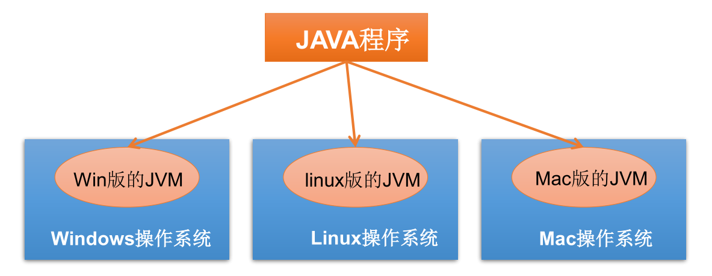
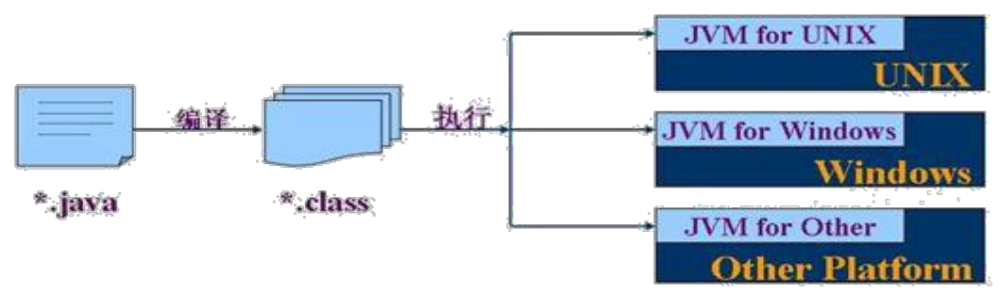
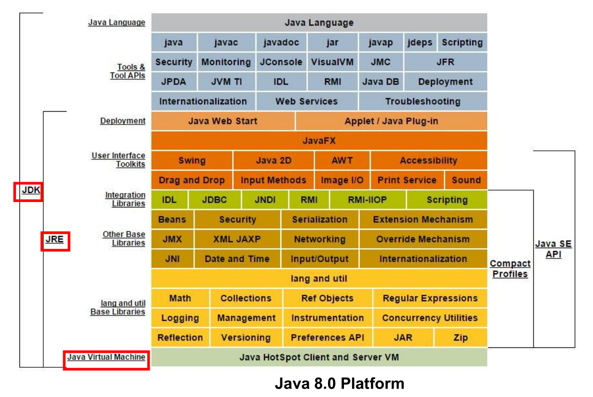

### 一.概述

#### 1.java语言概述

1.  是**SUN**(Stanford University Network，斯坦福大学网络公司 ) 1995年推出的一门高级编程语言; java之父---**James Gosling(詹姆斯.高斯林)**.

2.  应用领域:

    -   **Java SE(Java Standard Edition)标准版**: 支持面向桌面级应用（如Windows下的应用程序）的Java平台，提供了完整的Java核心API，此版本以前称为J2SE;
    -   **Java EE(Java Enterprise Edition)企业版**: 是为开发企业环境下的应用程序提供的一套解决方案。该技术体系中包含的技术如:Servlet 、Jsp等，主要针对于Web应用程序开发。版本以前称为J2EE;
    -   Java ME(Java Micro Edition)小型版: 支持Java程序运行在移动终端（手机、PDA）上的平台，对Java API有所精简，并加入了针对移动终端的支持，此版本以前称为J2ME;
    -   Java Card: 支持一些Java小程序（Applets）运行在小内存设备（如智能卡）上的平台.

3.  java发展:

    -   **1996年，发布JDK 1.0，约8.3万个网页应用Java技术来制作**
    -   **2004年，发布里程碑式版本：JDK 1.5，为突出此版本的重要性，更名为JDK 5.0**
    -   2009年，Oracle公司收购SUN，交易价格74亿美元
    -   2011年，发布JDK 7.0
    -   **2014年，发布JDK 8.0，是继JDK 5.0以来变化最大的版本**
    -   随后发布了 JDK 9.0, JDK 10.0, JDK 11.0, JDK 12.0, JDK 13.0

4.  java语言特点:

    -   **面向对象**: 两大基本概念(类, 对象)与 三大特性(封装, 继承, 多态)

    -   **健壮性**: 吸收了C/C++语言的优点,去掉了影响程序健壮性的部分(指针、内存的申请与释放等)

    -   **跨平台性**: 

        -   跨平台性：通过Java语言编写的应用程序在不同的系统平台上都可以运行。 “Write once , Run Anywhere”

        -   原理：只要在需要运行 java 应用程序的操作系统上，先安装一个Java虚拟机 (JVM Java Virtual Machine) 即可。由JVM来负责Java程序在该系统中的运行

            

#### 2.java运行机制与运行过程

1.  **Java虚拟机 (Java Virtal Machine)**

    -   JVM 是一个虚拟的计算机，具有指令集并使用不同的存储区域。负责执行指令，管理数据、内存、寄存器
    -   对于不同的平台，有不同的虚拟机, 只有某平台提供了对应的java虚拟机，java程序才可在此平台运行
    -   Java虚拟机机制屏蔽了底层运行平台的差别，实现了“一次编译，到处运行”

2.  **垃圾收集机制 (Garbage Collection)**

    Java技术提供了垃圾收集器，用于自动检测每一块分配出去的内存空间，然后将无价值的内存块自动回收.

    在java中判断内存空间是否符合垃圾收集器的收集标准有两个：

    -   为对象赋予了空值NULL后再没有调用过
    -   为对象赋予了新值，即重新分配了内存空间

3.  **运行原理**：

    -   编写java源文件，以.java作为后缀名
    -   编译为字节码文件，使用java编译器将.java源文件编译成JVM能接受的指令集合，且以字节码.class的形式保存于文件中
    -   解释执行字节码.class文件，JVM读取字节码，取出指令，并且将其解释为能够将计算机执行的语言

    **java源程序 --(java编译器编译)--> .class文件 --(JVM解释)--> 计算机语言**

    

#### 3.java环境搭建

1.  什么是JDK ，JRE

    -   JDK(Java Development Kit): Java开发工具包

        JDK是提供给Java开发人员使用的，其中包含了java的开发工具，也包括了JRE。所以安装了JDK，就不用在单独安装JRE了。其中的开发工具：编译工具(javac.exe) 打包工具(jar.exe)等

    -   JRE(Java Runtime Environment): Java运行环境

        包括Java虚拟机(JVM Java Virtual Machine)和Java程序所需的核心类库等，如果想要 运行一个开发好的Java程序，计算机中只需要安装JRE即可

2.  JDK 、JRE 、JVM 关系

    

    JDK = JRE + 开发工具集（例如Javac编译工具等）
    JRE = JVM + Java SE标准类库

    总结: 使用JDK 的开发工具完成的java 程序，交给JRE 去运行

3.  环境变量

    -   Java_HOME:JDK的安装路径  (JAVA_HOME: JDK安装路径)
    -   PATH：使系统可以在任何路径下识别java命令  (PATH: %JAVA_HOME%\bin)
    -   CLASSPATH：Java加载类的路径  (CLASSPATH: .;%JAVA_HOME%\lib)	'.'表示当前路径

4.  运行步骤：在cmd窗口中执行java程序时先用javac命令将java源文件编译成字节码（.class）文件`javac 源文件名.java`，再用java命令将字节码文件解释为能被计算机执行的语言`java 字节码文件  (不能加后缀名)`。文档注释（/** */）可以通过javadoc命令生成API文档`javadoc -d 文档存放目录 源文件名.java `。

#### 4.helloword程序

-   Java应用程序的执行入口是main()方法.`public static void main(String[] args) {...}`

-   Java语言严格区分大小写

-   Java方法由一条条语句构成，每个语句以“;”结束

-   **一个源文件中最多只能有一个public类。其它类的个数不限，如果源文件包含一个public类，则文件名必须按该类名命名**

-   注释:

    -   单行注释:  `//注释文字`

    -   多行注释: `/* 注释文字 */`

    -   文档注释（Java 特有）: 注释内容可以被JDK提供的工具 javadoc 所解析，生成一套以网页文件形式体现的该程序的说明文档。

        /**
        @author 指定java 程序的作者
        @version 指定源文件的版本
        */

### 二.变量与运算符

#### 1.关键字和保留字

1.  关键字(keyword)的定义和特点

    -   定义：被Java 语言赋予了特殊含义，用做专门用途的字符串
    -   特点：关键字中所有字母都为 小写

    | 定义类型         | 关键字                                      |
    | ------------ | ---------------------------------------- |
    | 定义数据类型       | class interface enum byte short int long float double char boolean void |
    | 定义流程控制       | if else switch case default while do for break continue return |
    | 定义访问权限修饰符    | private protected public                 |
    | 定义类,函数,变量修饰符 | abstract final static synchronized       |
    | 定义类与类之间关系    | extends implements                       |
    | 定义建立实例及引用实例  | new this super instanceof                |
    | 异常处理         | try catch finally throw throws           |
    | 包            | package import                           |
    | 其他修饰符        | native strictfp transient volatile assert |
    | 定义数据类型值      | true false null                          |

2.  保留字(reserved word)

    现有Java版本尚未使用，但以后版本可能会作为关键字使用

    goto 、const

#### 2.标识符

1.  标识符
    -   Java 对各种 变量、 方法和 类等要素命名时使用的字符序列称为标识符
2.  标识符命名规范
    -   由字母，数字，下划线，和‘$’中的任意字符组合而成
    -   数字不可以开头
    -   需要具有一定意义，且不能是系统关键字
    -   严格区分大小写
3.  名称命名规范
    -   包名：多单词组成时所有字母都小写：xxxyyyzzz
    -   类名、接口名：多单词组成时，所有单词的首字母大写：XxxYyyZzz
    -   变量名、方法名：多单词组成时，第一个单词首字母小写，第二个单词开始每个单词首字母大写：xxxYyyZzz
    -   常量名：所有字母都大写。多单词时每个单词用下划线连接：XXX_YYY_ZZZ

#### 3.变量

#### 4.运算符

### 三.流程控制

