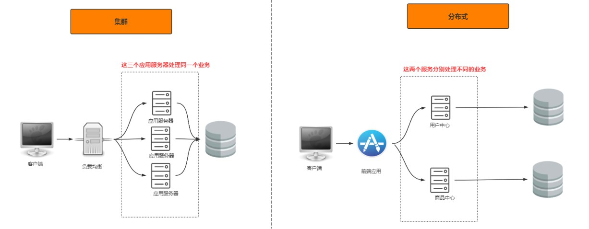
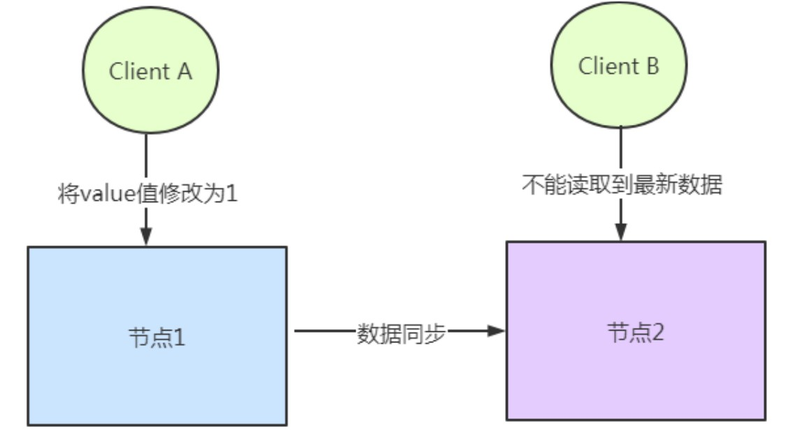

## 一.分布式理论

### 1.分布式架构概述

> 分布式系统是一个硬件或软件组件分布在不同的网络计算机上，彼此之间仅仅通过消息传递进行通信和协调
> 的系统。

一个业务拆分成多个子业务，分布在不同的服务器节点，共同构成的系统称为分布式系统. 同一个分布式系统中的服务器节点在空间部署上是可以随意分布的.

**分布式与集群的区别**:

- 集群: 多个人在一起做同样的事
- 分布式: 多个人在一起做不同的事



分布式系统的特点: 分布性, 对等性, 并发性, 缺乏全局时钟, 故障总是会发生.

**分布式架构的演变**:

1. 单应用架构
2. 应用服务器(tomcat)与数据库服务器分离
3. 应用服务器集群(tomcat集群同时访问一个数据库)
4. 应用服务器负载客户(客户发送请求负载均衡到应用服务器上,如`Nginx`)
5. 数据库读写分离(写数据库同步读数据库)
6. 添加搜索引擎缓解读数据库压力(如分布式搜索引擎`Elasticsearch`)
7. 添加缓存机制缓解数据库的压力(如`Redis`)
8. 数据库水平/垂直拆分(按不同业务场景,如用户数据库,商品数据库,订单数据库) [数据库水平/垂直拆分](https://imgkr.cn-bj.ufileos.com/4d4c6863-38eb-4ffd-a1ba-8ed31e5c31cd.jpg)
9. 应用拆分(应用按业务场景拆分) [应用拆分](https://imgkr.cn-bj.ufileos.com/1b203986-c32f-44e9-966a-22d433a444a2.jpg)
10. 服务化(如用户中心,商品中心,订单中心)  [服务化](https://imgkr.cn-bj.ufileos.com/73e593ca-9f97-4adb-a565-a1ab5b7ce8dc.jpg)

**分布式系统面临的问题**:

- 通信异常: 网络本身的不可靠及其它风险最终会导致分布式系统无法顺利进行一次网络通信
- 网络分区: 系统的网路环境被切分成若干个孤立的区域,即分布式系统会出现局部小集群
- 节点故障: 服务器节点出现宕机或"僵死"现象
- 三态: 每一次请求与响应存在特有的"三态"概念,即成功,失败和超时

### 2.分布式一致性

分布式数据一致性，指的是数据在多份副本中存储时，各副本中的数据是一致的。

**副本一致性**:

若是单个数据库,事务的ACID特性基本可以保证数据库的一致性.多个副本需要保证多份拷贝就有同步问题.



如何保证数据的一致性同时又不影响运行的性能是每一个分布式系统都要考虑和权衡的.

**一致性分类**:


- 强一致性: 系统写入什么数据,就要读到什么数据
- 弱一致性: 系统写入数据后最终达到一致状态

**分布式一致性模型**:

- 读写一致性

    ```
    用户读取自己写入结果的一致性，保证用户永远能够第一时间看到自己更新的内容。
    比如我们发一条朋友圈，朋友圈的内容是不是第一时间被朋友看见不重要，但是一定要显示在自己的列表上.
    解决方案:
    方案1：一种方案是对于一些特定的内容我们每次都去主库读取。 （问题主库压力大）
    方案2：我们设置一个更新时间窗口，在刚刚更新的一段时间内，我们默认都从主库读取，过了这个窗口之后，我
    们会挑选最近有过更新的从库进行读取
    方案3：我们直接记录用户更新的时间戳，在请求的时候把这个时间戳带上，凡是最后更新时间小于这个时间戳的
    从库都不予以响应。
    ```

- 单调读一致性

    ```
    本次读到的数据不能比上次读到的旧。
    由于主从节点更新数据的时间不一致，导致用户在不停地刷新的时候，有时候能刷出来，再次刷新之后会发现数据
    不见了，再刷新又可能再刷出来，就好像遇见灵异事件一样.
    解决方案:就是根据用户ID计算一个hash值，再通过hash值映射到机器。同一个用户不管怎么刷新，都只会被映
    射到同一台机器上。这样就保证了不会读到其他从库的内容，带来用户体验不好的影响。
    ```

- 因果一致性

    ```
    指的是：如果节点 A 在更新完某个数据后通知了节点 B，那么节点 B 之后对该数据的访问和修改都是基于 A 
    更新后的值。于此同时，和节点 A 无因果关系的节点 C 的数据访问则没有这样的限制。
    ```

- 最终一致性

    ```
    最终一致性是所有分布式一致性模型当中最弱的。可以认为是没有任何优化的“最”弱一致性，它的意思是说，我不
    考虑所有的中间状态的影响，只保证当没有新的更新之后，经过一段时间之后，最终系统内所有副本的数据是正确的。
    它最大程度上保证了系统的并发能力，也因此，在高并发的场景下，它也是使用最广的一致性模型。
    ```

### 3.CAP定理

CAP 理论含义是，一个分布式系统不可能同时满足一致性（C:Consistency)，可用性（A: Availability）和分区容错性（P：Partition tolerance）这三个基本需求，最多只能同时满足其中的2个。

| 选项         | 描述                                                         |
| ------------ | ------------------------------------------------------------ |
| C 一致性     | 分布式系统当中的一致性指的是所有节点的数据一致，或者说是所有副本的数据一致 |
| A 可用性     | Reads and writes always succeed. 也就是说系统一直可用，而且服务一直保持正常 |
| P 分区容错性 | 系统在遇到一些节点或者网络分区故障的时候，仍然能够提供满足一致性和可用性的服务 |

- 一致性（Consistency）：主从数据库数据一致性，同步期间需要将从数据库加锁
- 可用性（Availability）：发送查询请求能立即响应数据，不允许出现响应超时或错误，即使是旧数据
- 分区容错性（Partition tolerance）：网络问题导致节点通信失败后还可以对外提供服务，增加数据库节点和使用异步方式进行数据同步

**CAP只能三选二**:

- 舍弃A，保留CP：在极端情况下，允许出现系统无法访问的情况，会牺牲用户体验。
- 舍弃C，保留AP：是大部分分布式系统的设计，保证高可用和分区容错。
- 舍弃P，保留CA：也就是舍弃分布式系统，即P是分布式系统的前提,这种情况是不存在的。

### 4.BASE理论

BASE全程: Basically Available（基本可用）、Soft state（软状态）和Eventually consistent（最终一致性）三个短语的缩写。

BASE理论核心思想：**即使无法做到强一致性，但每个应用都可以根据自身业务特点，采用适当的方式来使系统达到最终一致性**。

- Basically Available（基本可用）：基本可用是指分布式系统在出现不可预知故障的时候，允许损失部分可用性。例子: 响应时间上的损失, 功能上的损失.
- Soft state（软状态）
    - 硬状态指的是相对于一致性，要求多个节点的数据副本都是一致的。
    - 软状态指的是允许系统在多个不同节点的数据副本之间进行数据同步的过程中存在延迟。
- Eventually consistent（最终一致性）: 最终一致性是系统中所有的数据副本在经过一段时间的同步后最终达到一致的状态。即不需要实时保证系统数据的强一致性。

### 5.一致性协议

#### 5.1 2PC


#### 5.2 3PC


### 6.一致性算法

#### 6.1 Paxos


#### 6.2 Raft


