### 一.什么是Elasticsearch

#### 1.什么是搜索

搜索，就是在任何场景下，找寻你想要的信息，这个时候，会输入一段你要搜索的关键字，然后就期望找到这个关键字相关的有些信息

#### 2.如果用数据库做搜索会怎么样

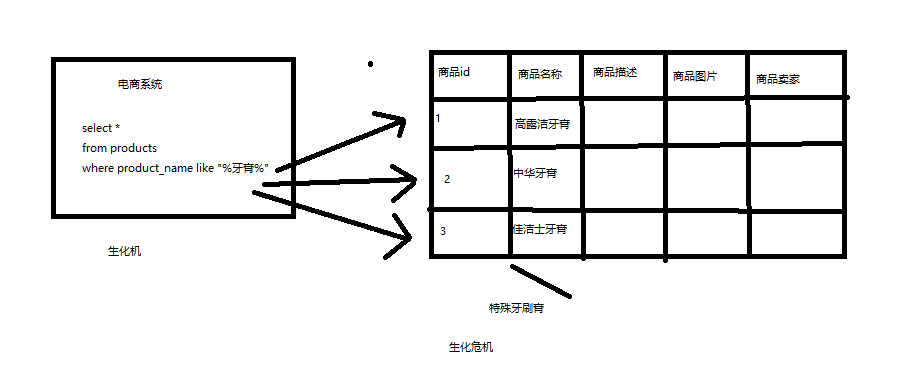

- 比方说，每条记录的指定字段的文本，可能会很长，比如说“商品描述”字段的长度，有长达数千个，甚至数万个字符，这个时候，每次都要对每条记录的所有文本进行扫描，再判断包不包含指定的这个关键词（比如说“牙膏”）
- 还不能将搜索词拆分开来，尽可能去搜索更多的符合你的期望的结果，比如输入“生化机”，就搜索不出来“生化危机”

用数据库来实现搜索，是不太靠谱的。通常来说，性能会很差的。

#### 3.什么是全文检索、倒排索引和Lucene

（1）全文检索，倒排索引

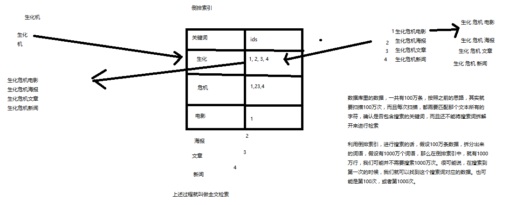

（2）lucene，就是一个jar包，里面包含了封装好的各种建立倒排索引，以及进行搜索的代码，包括各种算法。我们就用java开发的时候，引入lucene jar，然后基于lucene的api进行去进行开发就可以了。用lucene，我们就可以去将已有的数据建立索引，lucene会在本地磁盘上面，给我们组织索引的数据结构。另外的话，我们也可以用lucene提供的一些功能和api来针对磁盘上额

#### 4.什么是Elasticsearch

Elasticsearch，分布式，高性能，高可用，可伸缩的搜索和分析系统

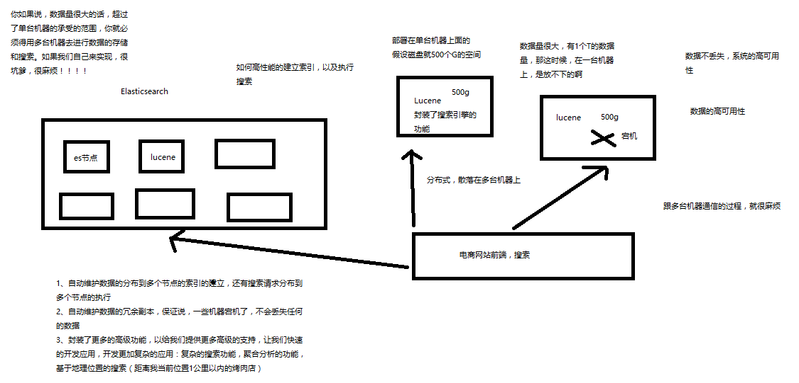

#### 5.Elasticsearch的功能

##### 分布式的搜索引擎和数据分析引擎

-   搜索：百度，网站的站内搜索，IT系统的检索
-   数据分析：电商网站，最近7天牙膏这种商品销量排名前10的商家有哪些；新闻网站，最近1个月访问量排名前3的新闻版块是哪些

##### 全文检索，结构化检索，数据分析

-   全文检索：我想搜索商品名称包含牙膏的商品，`select * from products where product_name like "%牙膏%"` 
-   结构化检索：我想搜索商品分类为日化用品的商品都有哪些，`select * from products where category_id='日化用品'` 
-   部分匹配、自动完成、搜索纠错、搜索推荐
-   数据分析：我们分析每一个商品分类下有多少个商品，`select category_id,count(*) from products group by category_id` 

##### 对海量数据进行近实时的处理

-   分布式：ES自动可以将海量数据分散到多台服务器上去存储和检索
-   海量数据的处理：分布式以后，就可以采用大量的服务器去存储和检索数据，自然而然就可以实现海量数据的处理了
-   近实时：检索个数据要花费1小时（这就不要近实时，离线批处理，batch-processing）；在秒级别对数据进行搜索和分析
-   跟分布式/海量数据相反的：lucene，单机应用，只能在单台服务器上使用，最多只能处理单台服务器可以处理的数据量

#### 6.Elasticsearch的特点

-   可以作为一个大型分布式集群（数百台服务器）技术，处理PB级数据，服务大公司；也可以运行在单机上，服务小公司
-   Elasticsearch不是什么新技术，主要是将全文检索、数据分析以及分布式技术，合并在了一起，才形成了独一无二的ES；lucene（全文检索），商用的数据分析软件（也是有的），分布式数据库（mycat）
-   对用户而言，是开箱即用的，非常简单，作为中小型的应用，直接3分钟部署一下ES，就可以作为生产环境的系统来使用了，数据量不大，操作不是太复杂
-   数据库的功能面对很多领域是不够用的（事务，还有各种联机事务型的操作）；特殊的功能，比如全文检索，同义词处理，相关度排名，复杂数据分析，海量数据的近实时处理；Elasticsearch作为传统数据库的一个补充，提供了数据库所不不能提供的很多功能

#### 7.Elasticsearch和lucene的前世今生

lucene，最先进、功能最强大的搜索库，直接基于lucene开发，非常复杂，api复杂（实现一些简单的功能，写大量的java代码），需要深入理解原理（各种索引结构）

elasticsearch，基于lucene，隐藏复杂性，提供简单易用的restful api接口、java api接口（还有其他语言的api接口）

-   分布式的文档存储引擎
-   分布式的搜索引擎和数据分析引擎
-   分布式，支持PB级数据

开箱即用，优秀的默认参数，不需要任何额外设置，完全开源

关于elasticsearch的一个传说，有一个程序员失业了，陪着自己老婆去英国伦敦学习厨师课程。程序员在失业期间想给老婆写一个菜谱搜索引擎，觉得lucene实在太复杂了，就开发了一个封装了lucene的开源项目，compass。后来程序员找到了工作，是做分布式的高性能项目的，觉得compass不够，就写了elasticsearch，让lucene变成分布式的系统。

#### 8.在windows上安装和启动Elasticsearch

1.  安装JDK，至少1.8.0_73以上版本，java -version

2.  下载和解压缩Elasticsearch安装包，目录结构

3.  启动Elasticsearch：bin\elasticsearch.bat，es本身特点之一就是开箱即用，如果是中小型应用，数据量少，操作不是很复杂，直接启动就可以用了

4.  检查ES是否启动成功：http://localhost:9200/?pretty

    ```json
    // name: node名称
    // cluster_name: 集群名称（默认的集群名称就是elasticsearch）
    // version.number: 5.2.0，es版本号
    {
      "name" : "4onsTYV",
      "cluster_name" : "elasticsearch",
      "cluster_uuid" : "nKZ9VK_vQdSQ1J0Dx9gx1Q",
      "version" : {
          "number" : "5.2.0",
          "build_hash" : "24e05b9",
          "build_date" : "2017-01-24T19:52:35.800Z",
          "build_snapshot" : false,
          "lucene_version" : "6.4.0"
      },
      "tagline" : "You Know, for Search"
    }
    ```

5.  修改集群名称：elasticsearch.yml

6.  下载和解压缩Kibana安装包，使用里面的开发界面，去操作elasticsearch，作为学习es知识点的一个主要的界面入口

7.  启动Kibana：bin\kibana.bat

8.  进入Dev Tools界面

9.  命令测试: GET _cluster/health

### 二.Elasticsearch概念

#### 1.Elasticsearch的核心概念

-   Near Realtime（NRT）：**近实时**，两个意思，从写入数据到数据可以被搜索到有一个小延迟（大概1秒）；基于es执行搜索和分析可以达到秒级

    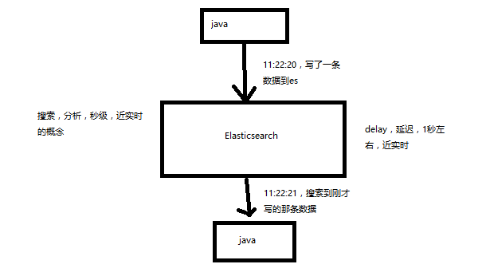

-   Cluster：**集群**，包含多个节点，每个节点属于哪个集群是通过一个配置（集群名称，默认是elasticsearch）来决定的，对于中小型应用来说，刚开始一个集群就一个节点很正常

-   Node：**节点**，集群中的一个节点，节点也有一个名称（默认是随机分配的），节点名称很重要（在执行运维管理操作的时候），默认节点会去加入一个名称为“elasticsearch”的集群，如果直接启动一堆节点，那么它们会自动组成一个elasticsearch集群，当然一个节点也可以组成一个elasticsearch集群

-   Document&field：**文档**，es中的最小数据单元，一个document可以是一条客户数据，一条商品分类数据，一条订单数据，通常用JSON数据结构表示，每个index下的type中，都可以去存储多个document。一个document里面有多个field，每个field就是一个数据字段。

    ```json
    product document
    {
      "product_id": "1",
      "product_name": "高露洁牙膏",
      "product_desc": "高效美白",
      "category_id": "2",
      "category_name": "日化用品"
    }
    ```


-   Index：**索引**，包含一堆有相似结构的文档数据，比如可以有一个客户索引，商品分类索引，订单索引，索引有一个名称。一个index包含很多document，一个index就代表了一类类似的或者相同的document。比如说建立一个product index，商品索引，里面可能就存放了所有的商品数据，所有的商品document。

-   Type：**类型**，每个索引里都可以有一个或多个type，type是index中的一个逻辑数据分类，一个type下的document，都有相同的field，比如博客系统，有一个索引，可以定义用户数据type，博客数据type，评论数据type。

    >商品index，里面存放了所有的商品数据，商品document, 但是商品分很多种类，每个种类的document的field可能不太一样，比如说电器商品，可能还包含一些诸如售后时间范围这样的特殊field；生鲜商品，还包含一些诸如生鲜保质期之类的特殊field
    >
    >type，日化商品type，电器商品type，生鲜商品type
    >
    >-   日化商品type：product_id，product_name，product_desc，category_id，category_name
    >-   电器商品type：product_id，product_name，product_desc，category_id，category_name，service_period
    >-   生鲜商品type：product_id，product_name，product_desc，category_id，category_name，eat_period
    >
    >每一个type里面，都会包含一堆document
    >
    >```json
    >{
    >  "product_id": "2",
    >  "product_name": "长虹电视机",
    >  "product_desc": "4k高清",
    >  "category_id": "3",
    >  "category_name": "电器",
    >  "service_period": "1年"
    >}
    >{
    >  "product_id": "3",
    >  "product_name": "基围虾",
    >  "product_desc": "纯天然，冰岛产",
    >  "category_id": "4",
    >  "category_name": "生鲜",
    >  "eat_period": "7天"
    >}
    >```

- shard：单台机器无法存储大量数据，es可以将一个索引中的数据切分为多个shard，分布在多台服务器上存储。有了shard就可以横向扩展，存储更多数据，让搜索和分析等操作分布到多台服务器上去执行，提升吞吐量和性能。每个shard都是一个lucene index。

- replica：任何一个服务器随时可能故障或宕机，此时shard可能就会丢失，因此可以为每个shard创建多个replica副本。replica可以在shard故障时提供备用服务，保证数据不丢失，多个replica还可以提升搜索操作的吞吐量和性能。primary shard（建立索引时一次设置，不能修改，默认5个），replica shard（随时修改数量，默认1个），默认每个索引10个shard，5个primary shard，5个replica shard，最小的高可用配置，是2台服务器。

  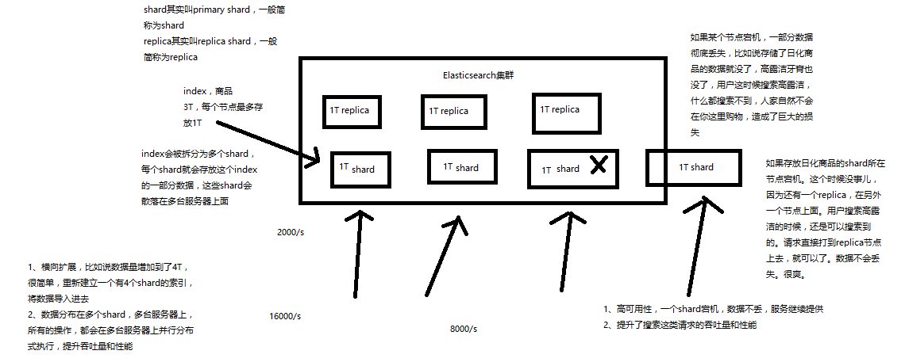


**Elasticsearch与数据库:**

| elasticsearch | 数据库  |
| :-----------: | :--: |
|   Document    |  行   |
|     Type      |  表   |
|     Index     |  库   |

#### 2.Elasticsearch的基础分布式架构

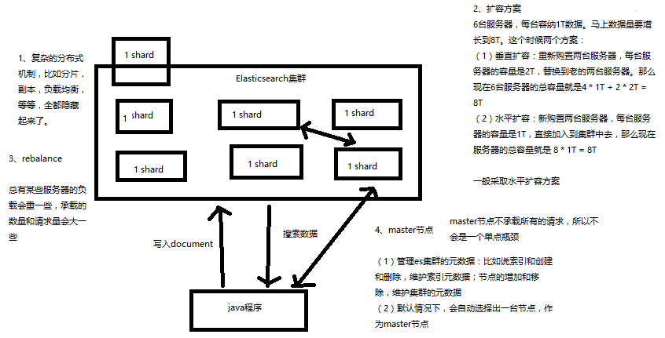

##### 2.1 复杂分布式机制的透明隐藏特性

Elasticsearch是一套分布式的系统，分布式是为了应对大数据量.

隐藏了复杂的分布式机制:

-   分片机制（我们之前随随便便就将一些document插入到es集群中去了，我们有没有care过数据怎么进行分片的，数据到哪个shard中去）
-   cluster discovery（集群发现机制，我们之前在做那个集群status从yellow转green的实验里，直接启动了第二个es进程，那个进程作为一个node自动就发现了集群，并且加入了进去，还接受了部分数据，replica shard）
-   shard负载均衡（举例，假设现在有3个节点，总共有25个shard要分配到3个节点上去，es会自动进行均匀分配，以保持每个节点的均衡的读写负载请求）
-   shard副本，请求路由，集群扩容，shard重分配

##### 2.2 垂直扩容与水平扩容

垂直扩容：采购更强大的服务器，成本非常高昂，而且会有瓶颈，假设世界上最强大的服务器容量就是10T，但是当你的总数据量达到5000T的时候，你要采购多少台最强大的服务器啊

水平扩容：业界经常采用的方案，采购越来越多的普通服务器，性能比较一般，但是很多普通服务器组织在一起，就能构成强大的计算和存储能力

扩容对应用程序的透明性

##### 2.3 增减或减少节点时的数据rebalance

保持负载均衡

##### 2.4 master节点

- 创建或删除索引
- 增加或删除节点

##### 2.5 节点对等的分布式架构

-   节点对等，每个节点都能接收所有的请求
-   自动请求路由
-   响应收集

#### 3.shard&replica机制

##### 3.1 shard&replica机制再次梳理

-   **index包含多个shard**
-   **每个shard都是一个最小工作单元，承载部分数据，lucene实例，完整的建立索引和处理请求的能力**
-   **增减节点时，shard会自动在nodes中负载均衡**
-   primary shard和replica shard，每个document肯定只存在于某一个primary shard以及其对应的replica shard中，不可能存在于多个primary shard
-   **replica shard是primary shard的副本，负责容错，以及承担读请求负载**
-   **primary shard的数量在创建索引的时候就固定了，replica shard的数量可以随时修改**
-   **primary shard的默认数量是5，replica默认是1(备份*1)，默认有10个shard，5个primary shard，5个replica shard**
-   **primary shard不能和自己的replica shard放在同一个节点上**（否则节点宕机，primary shard和副本都丢失，起不到容错的作用），但是**可以和其他primary shard的replica shard放在同一个节点上**

##### 3.2 单node环境下创建index


```java
PUT /test_index
{
   "settings" : {
      "number_of_shards" : 3,
      "number_of_replicas" : 1	// 备份次数
   }
}
```

-   单node环境下，创建一个index，有3个primary shard，3个replica shard
-   集群status是yellow
-   这个时候，只会将3个primary shard分配到仅有的一个node上去，另外3个replica shard是无法分配的
-   集群可以正常工作，但是一旦出现节点宕机，数据全部丢失，而且集群不可用，无法承接任何请求


##### 3.3 2个node环境下replica shard是如何分配的

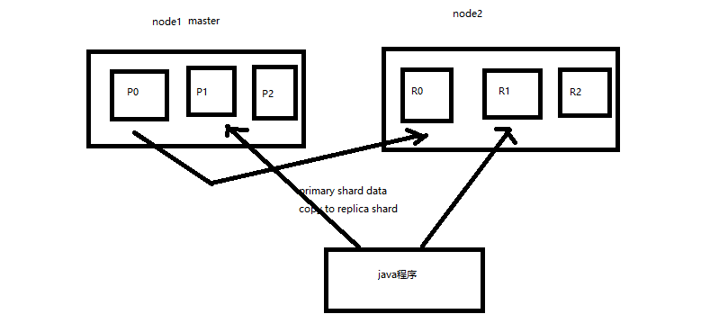

- replica shard分配：3个primary shard，3个replica shard，1 node
- primary ---> replica同步
- 读请求：primary/replica

#### 4.横向扩容与容错机制

##### 4.1 横向扩容过程，如何超出扩容极限，以及如何提升容错性

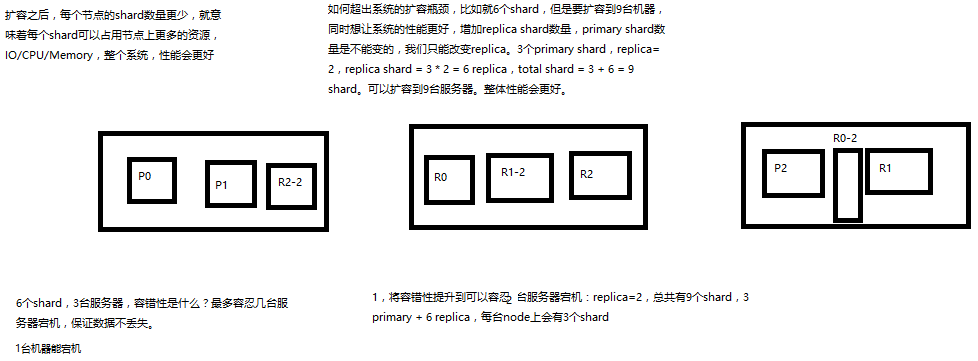

- primary&replica自动负载均衡，6个shard，3 primary，3 replica
- 每个node有更少的shard，IO/CPU/Memory资源给每个shard分配更多，每个shard性能更好
- 扩容的极限，6个shard（3 primary，3 replica），最多扩容到6台机器，每个shard可以占用单台服务器的所有资源，性能最好
- 超出扩容极限，动态修改replica数量，9个shard（3primary，6 replica），扩容到9台机器，比3台机器时，拥有3倍的读吞吐量


- 3台机器下，**9个shard**（3 primary，6 replica），资源更少，但是容错性更好，最多容纳**2台机器**宕机，**6个shard**只能容纳**1台机器**宕机
- 综合起来看，一方面要知道扩容的原理，怎么扩容，怎么提升系统整体吞吐量；另一方面要考虑到系统的容错性，怎么保证提高容错性，让尽可能多的服务器宕机，保证数据不丢失

##### 4.2 Elasticsearch容错机制：master选举，replica容错，数据恢复


- 9 shard，3 node
- master node宕机，自动master选举，**red**(不是所有的primary shard都是active)
- replica容错：新master将replica提升为primary shard，**yellow**(不是所有的replica shard都是active)
- 重启宕机node，master copy replica到该node，使用原有的shard并同步宕机后的修改，**green**(shard与replica都齐全了)

### 三.分布式文档系统概述

Elasticsearch在跑起来以后，其实起到的第一个最核心的功能，就是一个分布式的文档数据存储系统。ES是分布式的,文档数据存储系统。

-   文档数据：es可以存储和操作json文档类型的数据，而且这也是es的核心数据结构。
-   存储系统：es可以对json文档类型的数据进行存储，查询，创建，更新，删除，等等操作。其实ES满足了这些功能，就可以说已经是一个NoSQL的存储系统了。

什么类型的应用程序呢？

-   数据量较大，es的分布式本质，可以帮助你快速进行扩容，承载大量数据
-   数据结构灵活多变，随时可能会变化，而且数据结构之间的关系，非常复杂，如果我们用传统数据库，那是不是很坑，因为要面临大量的表
-   对数据的相关操作，较为简单，比如就是一些简单的增删改查，用我们之前讲解的那些document操作就可以搞定
-   NoSQL数据库，适用的也是类似于上面的这种场景

比如说像一些网站系统，或者普通的电商系统，博客系统，面向对象概念比较复杂，但是作为终端网站来说，没什么太复杂的功能，就是一些简单的CRUD操作，而且数据量可能还比较大。这个时候选用ES这种NoSQL型的数据存储比传统的复杂的功能支持SQL的关系型数据库更加合适一些。无论是性能，还是吞吐量，可能都会更好。

#### 1.document核心元数据

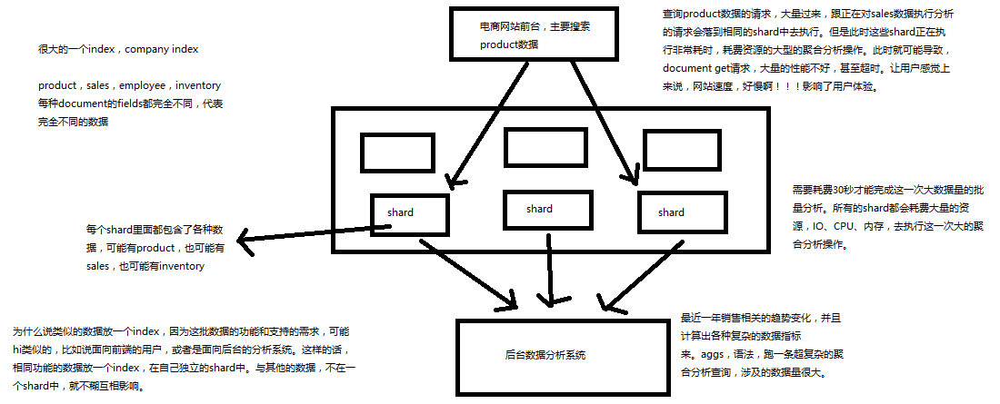

```java
{
  "_index": "test_index",
  "_type": "test_type",
  "_id": "1",
  "_version": 1,
  "found": true,
  "_source": {
    "test_content": "test test"
  }
}
```

##### 1.1 _index元数据

- **代表一个document存放在哪个index中**
- **类似的数据放在一个索引，非类似的数据放不同索引**：product index（包含了所有的商品），sales index（包含了所有的商品销售数据），inventory index（包含了所有库存相关的数据）。如果你把比如product，sales，human resource（employee），全都放在一个大的index里面，比如说company index，不合适的。
- **index中包含了很多类似的document**：类似是什么意思，其实指的就是说，**这些document的fields很大一部分是相同的**，你说你放了3个document，每个document的fields都完全不一样，这就不是类似了，就不太适合放到一个index里面去了。
- **索引名称必须是小写的，不能用下划线开头，不能包含逗号**：product，website，blog

##### 1.2 _type元数据

-   **代表document属于index中的哪个类别（type）**
-   一个索引通常会划分为多个type，逻辑上对index中有些许不同的几类数据进行分类：因为**一批相同的数据，可能有很多相同的fields，但是还是可能会有一些轻微的不同**，可能会有少数fields是不一样的，举个例子，就比如说，商品，可能划分为电子商品，生鲜商品，日化商品，等等。
-   **type名称可以是大写或者小写，但是同时不能用下划线开头，不能包含逗号**

##### 1.3 _id元数据

**代表document的唯一标识，与index和type一起，可以唯一标识和定位一个document**, 我们可以**手动指定document的id**（put /index/type/id），也可以不指定，由**es自动为我们创建一个id**.

###### 1.3.1 手动指定document id: `PUT /index/type/id`

```java
PUT /test_index/test_type/1
{
  "test_content": "my test"
}
```

一般来说，是从某些其他的系统中，导入一些数据到es时，会采取这种方式，就是**使用系统中已有数据的唯一标识，作为es中document的id**。举个例子，比如说，我们现在在开发一个电商网站，做搜索功能，或者是OA系统，做员工检索功能。这个时候，数据首先会在网站系统或者IT系统内部的数据库中，会先有一份，此时就肯定会有**一个数据库的primary key（自增长，UUID，或者是业务编号）**。**如果将数据导入到es中，此时就比较适合采用数据在数据库中已有的primary key。**

如果说，我们是在做一个系统，这个系统主要的数据存储就是es一种，也就是说，数据产生出来以后，可能就没有id，直接就放es一个存储，那么这个时候，可能就不太适合说手动指定document id的形式了，因为你也不知道id应该是什么，此时可以采取让es自动生成id的方式。

###### 1.3.2 自动生成document id: `POST /index/type`

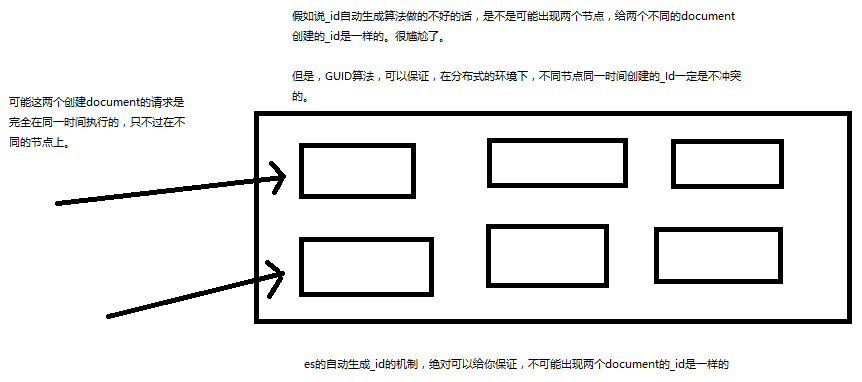

自动生成的id，长度为20个字符，URL安全，base64编码，GUID，分布式系统并行生成时不可能会发生冲突

```java
POST /test_index/test_type
{
  "test_content": "test"
}
// 结果
{
  "_index": "test_index",
  "_type": "test_type",
  "_id": "AXAOt4I2nI5hry7h_-7X",
  "_version": 1,
  "result": "created",
  "_shards": {
    "total": 2,
    "successful": 1,
    "failed": 0
  },
  "created": true
}
```

##### 1.4 _source元数据

创建一个document的时候，使用的那个放在request body中的json串，默认情况下，在get的时候，会原封不动的给我们返回回来。

示例:

```java
PUT /test_index/test_type/1
{
  "test_field1": "test field1",
  "test_field2": "test field2"
}

GET /test_index/test_type/1
// 结果
{
  "_index": "test_index",
  "_type": "test_type",
  "_id": "1",
  "_version": 2,
  "found": true,
  "_source": {
    "test_field1": "test_field1",
    "test_field2": "test_field2"
  }
}
```

**定制返回的结果，在_source中指定需要返回的field:**

```java
// 多个field用逗号隔开
GET /test_index/test_type/1?_source=test_field1,test_field2
// 结果
{
  "_index": "test_index",
  "_type": "test_type",
  "_id": "1",
  "_version": 2,
  "found": true,
  "_source": {
    "test_field1": "test_field1",
    "test_field2": "test_field2"
  }
}
```

##### 1.5 _version元数据

**第一次创建一个document的时候，它的 _version 内部版本号就是1；以后，每次对这个document执行修改或者删除操作，都会对这个 _version版本号自动加1**；哪怕是删除，也会对这条数据的版本号加1.

```java
{
  "found": true,
  "_index": "test_index",
  "_type": "test_type",
  "_id": "6",
  "_version": 2,
  "result": "deleted",
  "_shards": {
    "total": 2,
    "successful": 1,
    "failed": 0
  }
}
```

在删除一个document之后，可以从一个侧面证明，它不是**立即物理删除掉的，因为它的一些版本号等信息还是保留着的**。先删除一条document，再重新创建这条document，其实会在delete version基础之上，再把version号加1.

#### 2.document全量替换与删除

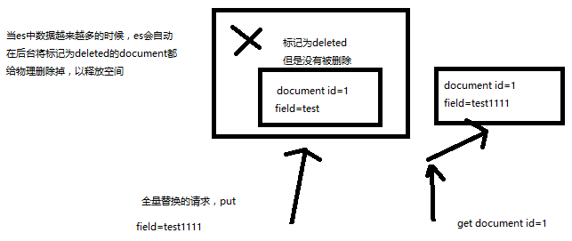

##### 2.1 document的全量替换

**语法与创建文档是一样的，如果document id不存在，那么就是创建；如果document id已经存在，那么就是全量替换操作，替换document的json串内容.**

**document是不可变的**，如果要修改document的内容，第一种方式就是全量替换，直接对document重新建立索引，替换里面所有的内容.

**es会将老的document标记为deleted，然后新增我们给定的一个document，当我们创建越来越多的document的时候，es会在适当的时机在后台自动删除标记为deleted的document.**

##### 2.2 document的强制创建

创建文档与全量替换的语法是一样的，有时我们只是想新建文档，不想替换文档，如果强制进行创建呢？

`PUT /index/type/id?op_type=create`  或 `PUT /index/type/id/_create` (常用)

##### 2.3 document的删除

`DELETE /index/type/id` 

**不会在物理删除上删除，只会将其标记为deleted，当数据越来越多的时候，在后台自动删除.**

#### 3.elasticsearch并发冲突问题

##### 3.1 elasticsearch并发冲突问题

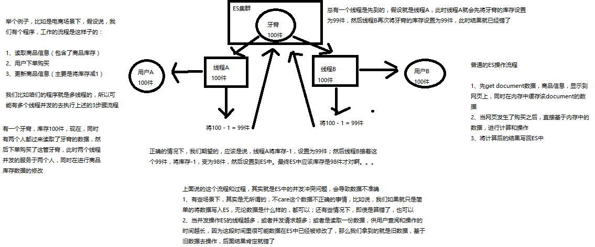

正常情况下,线程A将库存-1,设置为99件;然后线程B接着将库存-1,设置为98件. 图示就是ES中的并发冲突问题,会导致数据不准确.

-   有些场景下,其实是无所谓的,不care这个数据不正确的事情,比如说,我们如果就只是简单的将数据写入ES ,无论数据是什么样的,都可以;还有些情况下,即使是算错了,也可以
-   当并发操作ES的线程越多,或者并发请求越多;或者是读取一份数据,供用户查阅和操作的时间越长,因为这段时间里很可能数据在ES中已经被修改了,那么我们拿到的就是旧数据,基于旧数据去操作,后面结果肯定就错了

##### 3.2 悲观锁与乐观锁两种并发控制方案

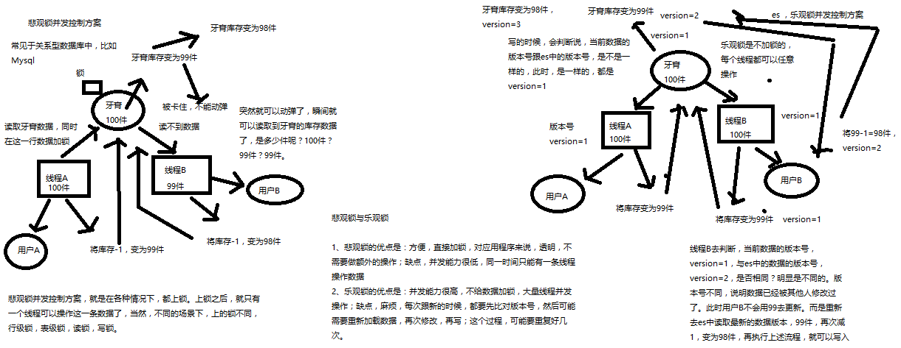

悲观锁与乐观锁:

-   悲观锁的优点是: 方便,**直接加锁**,对应用程序来说,透明,不需要做额外的操作; 缺点,**并发能力很低,同一时间只能有一条线程操作数据**
-   乐观锁的优点是: **并发能力很高,不给数据加锁,大量线程并发操作**；缺点,麻烦,**每次更新的时候,都要先比对版本号,然后可能需要重新加载数据,再次修改,再写**;这个过程,可能要重复好几次

##### 3.3 es基于_version进行乐观锁并发控制

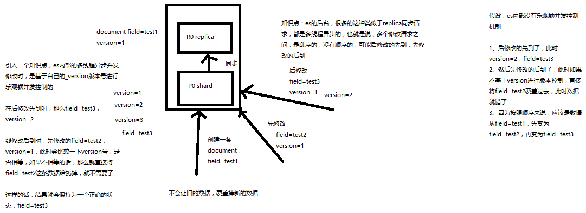

**es的后台,很多的这种类似于replica同步请求,都是多线程异步的,也就是说,多个修改请求之间,是乱序的,没有顺序的,可能后修改的先到,先修改的后到.**

**es内部的多线程异步并发修改时,是基于自己的_version版本号进行乐观锁并发控制的.** 若在后修改先到时,那么field=test3,version=2. 先修改后到时,此时会比较一下version号是否相等,若不相等,就直接将field=test2这条数据丢掉.这样结果就会保持一个正确的状态. 若先修改先到时,version=2,后修改的因为内部机制version会同步为2,这样就可以修改数据,field=test3,version=3.

**基于_version进行乐观锁并发控制示例:**

```java
// 1.先构造一条数据出来
PUT /test_index/test_type/6
{
  "test_field": "test test"
}

// 2.模拟两个客户端，都获取到了同一条数据
GET test_index/test_type/6
// 结果
{
  "_index": "test_index",
  "_type": "test_type",
  "_id": "7",
  "_version": 1,
  "found": true,
  "_source": {
    "test_field": "test test"
  }
}

// 3.其中一个客户端,先更新了一下这个数据,同时带上数据的版本号(只有版本好与es中数据版本号相同才能修改)
PUT /test_index/test_type/6?version=1 
{
  "test_field": "test client 1"
}
// 结果
{
  "_index": "test_index",
  "_type": "test_type",
  "_id": "6",
  "_version": 2,
  "result": "updated",
  "_shards": {
    "total": 2,
    "successful": 1,
    "failed": 0
  },
  "created": false
}

// 4.另外一个客户端，尝试基于version=1的数据去进行修改，进行乐观锁的并发控制, 结果会报错
PUT /test_index/test_type/6?version=1 
{
  "test_field": "test client 2"
}
// 结果
"reason": "[test_type][7]: version conflict, 
  current version [2] is different than the one provided [1]"

// 5.在乐观锁成功阻止并发问题之后，尝试正确的完成更新
// 基于最新的数据和版本号进行修改，可能这个步骤会需要反复执行好几次才能成功，
// 特别是在多线程并发更新同一条数据很频繁的情况下
PUT /test_index/test_type/6?version=2 
{
  "test_field": "test client 2"
}
// 结果
{
  "_index": "test_index",
  "_type": "test_type",
  "_id": "6",
  "_version": 3,
  "result": "updated",
  "_shards": {
    "total": 2,
    "successful": 1,
    "failed": 0
  },
  "created": false
}
```

##### 3.4 es基于external version进行乐观锁并发控制

**es提供了一个feature，可以不用它提供的内部 _version 版本号来进行并发控制，可以基于自己维护的一个版本号来进行并发控制**。举个列子，加入你的数据在mysql里也有一份，然后你的应用系统本身就维护了一个版本号，无论是自己生成的，还是程序控制的, 这个时候，你进行乐观锁并发控制，可能并不是想要用es内部的 _version 来进行控制，而是用自己维护的那个version来进行控制。

-   `?version=1` : 提供的version与es中的_version一模一样的时候，才可以进行修改
-   `?version=1&version_type=external` : 只有当你提供的version比es中的_version大的时候，才能进行修改

如:

-   es，_version=1，`?version=1` ，才能更新成功
-   es，_version=1，`?version>1&version_type=external` ,才能更新成功. 如: `version=2&version_type=external` 

示例:

```java
// 添加一条数据
PUT /test_index/test_type/8
{
  "test_field": "test"
}
// 两个客户端同时查询这条数据
GET /test_index/test_type/8
  
// 第一个先修改,此时客户端程序是在自己的数据库中获取到了这条数据的最新版本号，比如说是2
PUT /test_index/test_type/8?version=2&version_type=external
{
  "test_field": "test client 1"
}
// 模拟第二个客户端，同时拿到了自己数据库中维护的那个版本号，也是2
PUT /test_index/test_type/8?version=2&version_type=external
{
  "test_field": "test client 2"
}
// 结果会报错
"reason": "[test_type][8]: version conflict, 
  current version [2] is higher or equal to the one provided [2]"
// 在并发控制成功后，重新基于最新的版本号发起更新
PUT /test_index/test_type/8?version=3&version_type=external
{
  "test_field": "test client 2"
}
```

#### 4.document的partial update

##### 4.1 什么是partial update

**再复习一下全量替换:**

`PUT /index/type/id` ，创建文档&替换文档，就是一样的语法

一般对应到应用程序中，每次的执行流程基本是这样的:

- 应用程序先发起一个get请求，获取到document，展示到前台界面，供用户查看和修改
- 用户在前台界面修改数据，发送到后台
- 后台代码，会将用户修改的数据在内存中进行执行，然后封装好修改后的全量数据
- 然后发送PUT请求，到es中，进行全量替换
- es将老的document标记为deleted，然后重新创建一个新的document

**partial update:**

语法:

```java
post /index/type/id/_update 
{
   "doc": {
  		"要修改的少数几个field即可，不需要全量的数据"
   }
}
```

**相对于全量替换, 每次就传递少数几个发生修改的field即可，不需要将全量的document数据发送过去**

**示例:**

```java
// 添加一条数据
PUT /test_index/test_type/10
{
  "test_field1": "test1",
  "test_field2": "test2"
}
// 更新添加的数据
POST /test_index/test_type/10/_update
{
  "doc": {
    "test_field2": "updated test2"
  }
}
```

##### 4.2 partial update实现原理以及其优点

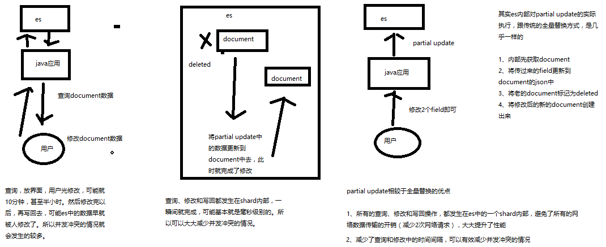

其实es内部对partial update的实际执行,跟传统的全量替换方式,是几乎一样的:

1. 内部先获取document
2. 将传过来的field更新到document的json中
3. 将老的document标记为deleted
4. 将修改后的新的document创建出来

partial update相较于全量替换的优点:

- 所有的查询、修改和写回操作,都发生在es中的一个shard内部,避免了所有的网络数据传输的开销(减少2次网络请求) ,大大提升了性能
- 减少了查询和修改中的时间间隔,可以有效减少并发冲突的情况

##### 4.3 基于groovy脚本执行partial update

es其实是有个内置的脚本支持的，可以基于groovy脚本实现各种各样的复杂操作.

```java
// 先添加一条数据
PUT /test_index/test_type/2
{
  "num": 0,
  "tags": []
}
```

内置脚本:

```java
// 内置脚本修改该条数据
POST /test_index/test_type/2/_update
{
  "script": "ctx._source.num+=1"
}
GET /test_index/test_type/2
// 结果
{
  "_index": "test_index",
  "_type": "test_type",
  "_id": "2",
  "_version": 3,
  "found": true,
  "_source": {
    "num": 1,
    "tags": []
  }
}
```

如果指定的document不存在，就执行upsert中的初始化操作；如果指定的document存在，就执行doc或者script指定的partial update操作:

```java
POST /test_index/test_type/2/_update
{
   "script" : "ctx._source.num+=1",
   "upsert": {
       "num": 0,
       "tags": []
   }
}
```

外部脚本:

```java
// 脚本存放在: elasticsearch-5.2.0\config\scripts文件夹下
ctx._source.tags+=new_tag
// 使用外部脚本修改数据
POST /test_index/test_type/2/_update
{
  "script": {
    "lang": "groovy",	// 文件后缀
    "file": "test-add-tags",	// 文件名
    "params": {
      "new_tag": "tag1"
    }
  }
}
// 结果
{
  "_index": "test_index",
  "_type": "test_type",
  "_id": "2",
  "_version": 4,
  "found": true,
  "_source": {
    "num": 2,
    "tags": [
      "tag1"
    ]
  }
}
```

用脚本删除文档:

```java
// 脚本
ctx.op = ctx._source.num = count ? 'delete' : 'none'
// 删除数据
POST /test_index/test_type/2/_update
{
  "script": {
    "lang": "groovy",
    "file": "test-delete-document",
    "params": {
      "count": 2
    }
  }
}
```

#### 5.partial update内置乐观锁并发控制

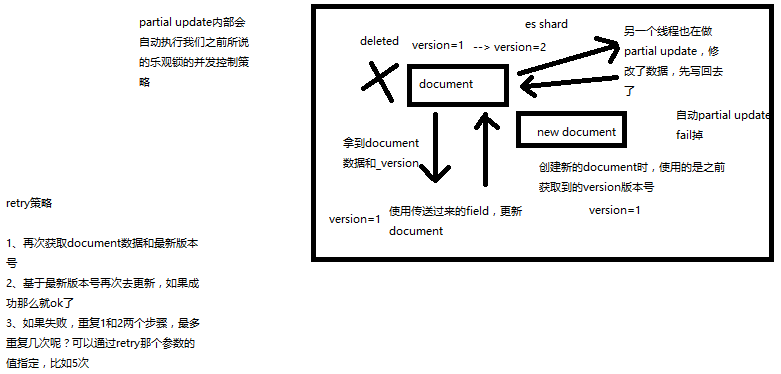

`POST /index/type/id/_update?retry_on_conflict=5&version=6`

#### 6.document批量增删改查及内部原理

##### 6.1 mget批量查询api

如果一条一条的查询数据，比如说要查询100条数据，那么就要发送100次网络请求，这个开销还是很大的
如果进行批量查询的话，查询100条数据，就只要发送1次网络请求，网络请求的性能开销缩减100倍.

```java
GET /_mget
{
  "docs": [
    {
      "_index": "test_index",
      "_type": "test_type",
      "_id": 1
    },
    {
      "_index": "test_index",
      "_type": "test_type",
      "_id": 2
    }
  ]
}
```

如果查询的document是一个index下的不同type种的话:

```java
GET /test_index/_mget
{
   "docs" : [
      {
         "_type" : "test_type",
         "_id" : 1
      },
      {
         "_type" : "test_type",
         "_id" : 2
      }
   ]
}
```

如果查询的数据都在同一个index下的同一个type下:

```java
GET /test_index/test_type/_mget
{
   "ids": [1, 2]
}
```

一般来说，在进行查询的时候，如果一次性要查询多条数据的话，那么一定要用batch批量操作的api
尽可能减少网络开销次数，可能可以将性能提升数倍，甚至数十倍.

##### 6.2 bulk批量增删改api

有下列操作可以执行:

- delete：删除一个文档，只要1个json串就可以了
- create：PUT /index/type/id/_create，强制创建
- index：普通的put操作，可以是创建文档，也可以是全量替换文档
- update：执行的partial update操作


每一个操作要两个json串，语法如下：

```java
{"action": {"metadata"}}
{"data"}
```

比如要创建一个文档放bulk里面：

```java
{"index": {"_index": "test_index", "_type": "test_type", "_id": "1"}}
{"test_field1": "test1", "test_field2": "test2"}
```

**bulk api对json的语法，有严格的要求，每个json串不能换行，只能放一行，同时一个json串和一个json串之间，必须有一个换行.**

示例:

```java
POST /_bulk
{ "delete": { "_index": "test_index", "_type": "test_type", "_id": "4" }} 
{ "create": { "_index": "test_index", "_type": "test_type", "_id": "5" }}
{ "test_field": "test5" }
{ "index":  { "_index": "test_index", "_type": "test_type", "_id": "3" }}
{ "test_field": "replaced test3" }
{ "update": { "_index": "test_index", "_type": "test_type", "_id": "1", "_retry_on_conflict" : 3} }
{ "doc" : {"test_field2" : "bulk test1"} }
```

bulk操作中，任意一个操作失败，是不会影响其他的操作的，但是在返回结果里，会告诉你异常日志.若index相同,可写 `POST /test_index/_bulk` ,index可省略. 若index与type都相同,可写 `POST /test_index/test_type/_bulk `, index与type都可省略.

bulk request会加载到内存里，如果太大的话，性能反而会下降，因此需要反复尝试一个最佳的bulk size。**一般从1000 ~ 5000条数据开始，尝试逐渐增加。另外，如果看大小的话，最好是在5~15MB之间。**

**bulk api奇特的json格式:**

1.  bulk中的每个操作都可能要转发到不同的node的shard去执行

2.  如果采用比较良好的json数组格式

    -   将json数组解析为JSONArray对象，整个数据会在内存中出现一份一模一样的拷贝，一份数据是json文本，一份数据是JSONArray对象
    -   解析json数组里的每个json，对每个请求中的document进行路由
    -   为路由到同一个shard上的多个请求，创建一个请求数组
    -   将这个请求数组序列化
    -   将序列化后的请求数组发送到对应的节点上去

    耗费更多内存，更多的jvm gc开销. 占用更多的内存可能就会积压其他请求的内存使用量，比如说最重要的搜索请求，分析请求，此时可能会导致其他请求的性能急速下降. 占用内存更多会导致java虚拟机的垃圾回收次数更多，耗费的时间更多.

3.  现在的奇特格式

    -   不用将其转换为json对象，不会出现内存中的相同数据的拷贝，直接按照换行符切割json
    -   对每两个一组的json，读取meta，进行document路由
    -   直接将对应的json发送到node上去

    不需要将json数组解析为一个JSONArray对象，形成一份大数据的拷贝，浪费内存空间，尽可能地保证性能.

##### 6.3 document数据路由原理

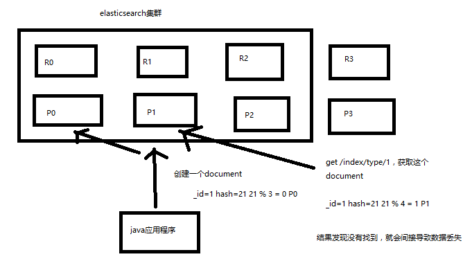

一个index的数据会被分为多片,每片在一个shard中。所以说,一个document,只能存在于一个shard中.当客户端创建document的时候, es此时就需要决定这个document是放在这个index的哪个shard上, 这个过程就称为document routing**数据路由**。

**路由算法：shard = hash(routing) % number_of_primary_shards.**

每次增删改查一个document的时候，都会带过来一个routing number，默认是document的 id （可能是手动指定，也可能是自动生成）routing = id，假设 _id=1. 再根据hash函数算出routing的hash值, 如hash(routing) = 21,然后对primary shard的数量求余，若有3个primary shard,则21 % 3 = 0,这个document就放在P0上。

默认的routing就是_id,也可以手动指定一个routing value，比如`put /index/type/id?routing=user_id` ,手动指定routing value是很有用的，可以保证某一类document一定被路由到一个shard上去，那么在后续进行应用级别的负载均衡，以提升批量读取的性能.

**primary shard一旦index建立, 是不允许修改的。但是replica shard可以随时修改。**

##### 6.4 document增删改内部原理

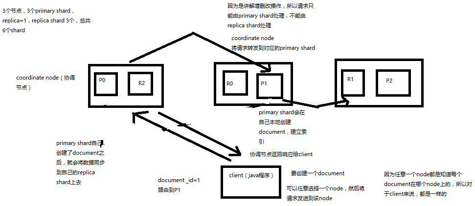

1.  客户端选择一个node发送请求过去，这个node就是coordinating node（协调节点）
2.  coordinating node，对document进行路由，将请求转发给对应的node（有primary shard）
3.  实际的node上的primary shard处理请求，然后将数据同步到replica node
4.  coordinating node，如果发现primary node和所有replica node都搞定之后，就返回响应结果给客户端


在发送任何一个增删改操作的时候，比如说`put /index/type/id` ，都可以带上一个consistency参数，指明我们想要的写一致性是什么. `put /index/type/id?consistency=quorum`

-   one：要求我们这个写操作，只要有一个primary shard是active活跃可用的，就可以执行
-   all：要求我们这个写操作，必须所有的primary shard和replica shard都是活跃的，才可以执行这个写操作
-   quorum：默认的值，要求所有的shard中，必须是大部分的shard都是活跃的，可用的，才可以执行这个写操作
    -   quorum值时需确保大多数shard都可用，`int( (primary + number_of_replicas) / 2 ) + 1`，当`number_of_replicas>1`时才生效(至少要备份一次),如3个primary shard，number_of_replicas=1,则`quorum = int( (3 + 1) / 2 ) + 1 = 3` ,即要求6个shard中至少有3个shard是active状态的，才可以执行这个写操作
    -   如果节点数少于quorum数量，可能导致quorum不齐全，进而导致无法执行任何写操作.可以在写操作的时候，加一个timeout参数，如`put /index/type/id?timeout=30` ，设定quorum不齐全时es的timeout时长，可以缩短也可以增长.


##### 6.5 document查询内部原理

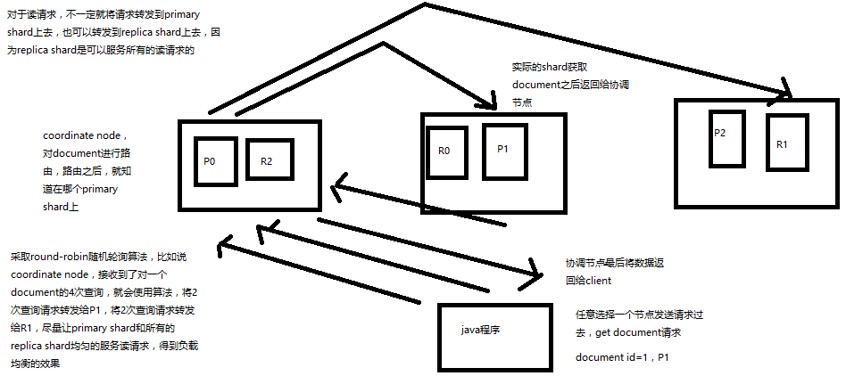

1.  客户端发送请求到任意一个node，成为coordinate node
2.  coordinate node对document进行路由，将请求转发到对应的node，此时会使用round-robin随机轮询算法，在primary shard以及其所有replica中随机选择一个，让读请求负载均衡
3.  接收请求的node返回document给coordinate node
4.  coordinate node返回document给客户端
5.  特殊情况：document若还在建立索引过程中,可能只在primaryshard上存在,此时replica shard上没有。但是协调节点可能会将请求转发给replica shard ,此时就会找不到这个document. 但是当这个document完成了建立素引的过程之后, primary shard和replica shard就都有数据了。


### 四.电商网站商品管理简单案例

所有命令都是在 **Kibana** 可视化界面的 **Dev Tools** 的 **Console**里开发的


#### 1.document数据格式

面向文档的搜索分析引擎

-   应用系统的数据结构都是面向对象的，复杂的
-   对象数据存储到数据库中，只能拆解开来，变为扁平的多张表，每次查询的时候还得还原回对象格式，相当麻烦
-   ES是面向文档的，文档中存储的数据结构，与面向对象的数据结构是一样的，基于这种文档数据结构，es可以提供复杂的索引，全文检索，分析聚合等功能
-   es的document用json数据格式来表达

用数据库来实现:

```java
public class Employee {
  private String email;
  private String firstName;
  private String lastName;
  private EmployeeInfo info;
  private Date joinDate;
}

private class EmployeeInfo {
  private String bio; // 性格
  private Integer age;
  private String[] interests; // 兴趣爱好
}

EmployeeInfo info = new EmployeeInfo();
info.setBio("curious and modest");
info.setAge(30);
info.setInterests(new String[]{"bike", "climb"});

Employee employee = new Employee();
employee.setEmail("zhaoliu@sina.com");
employee.setFirstName("liu");
employee.setLastName("zhao");
employee.setInfo(info);
employee.setJoinDate(new Date());
```

employee对象：里面包含了Employee类自己的属性，还有一个EmployeeInfo对象

-   两张表：employee表，employee_info表，将employee对象的数据重新拆开来，变成Employee数据和EmployeeInfo数据
-   employee表：email，first_name，last_name，join_date，4个字段
-   employee_info表：bio，age，interests，3个字段；此外还有一个外键字段，比如employee_id，关联着employee表

document数据格式:

```json
{
  "email": "zhaoliu@sina.com",
  "first_name": "san",
  "last_name": "zhang",
  "info": {
      "bio": "curious and modest",
      "age": 30,
      "interests": [ "bike", "climb" ]
  },
  "join_date": "2017/01/01"
}
```

我们就明白了es的document数据格式和数据库的关系型数据格式的区别

#### 2.背景介绍

有一个电商网站，需要为其基于ES构建一个后台系统，提供以下功能：

1.  对商品信息进行CRUD（增删改查）操作
2.  执行简单的结构化查询
3.  可以执行简单的全文检索，以及复杂的phrase（短语）检索
4.  对于全文检索的结果，可以进行高亮显示
5.  对数据进行简单的聚合分析

#### 3.简单的集群管理

##### 3.1 快速检查集群的健康状况

es提供了一套api，叫做cat api，可以查看es中各种各样的数据

`GET /_cat/health?v`

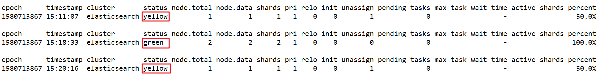

如何快速了解集群的健康状况？green、yellow、red？

-   **green**：每个索引的primary shard和replica shard都是active状态的
-   **yellow**：每个索引的primary shard都是active状态的，但是部分replica shard不是active状态，处于不可用的状态
-   **red**：不是所有索引的primary shard都是active状态的，部分索引有数据丢失了

为什么现在会处于一个yellow状态？

我们现在就一个笔记本电脑，就启动了一个es进程，相当于就只有一个node。现在es中有一个index，就是kibana自己内置建立的index。由于默认的配置是给每个index分配5个primary shard和5个replica shard，而且primary shard和replica shard不能在同一台机器上（为了容错）。现在kibana自己建立的index是1个primary shard和1个replica shard。当前就一个node，所以只有1个primary shard被分配了和启动了，但是一个replica shard没有第二台机器去启动。

做一个小实验：此时只要启动第二个es进程，就会在es集群中有2个node，然后那1个replica shard就会自动分配过去，然后cluster status就会变成green状态。

##### 3.2 快速查看集群中有哪些索引

`GET /_cat/indices?v`

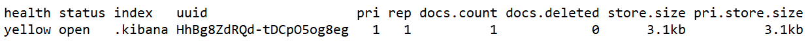

##### 3.3 简单的索引操作

创建索引：`PUT /test_index?pretty`

删除索引：`DELETE /test_index?pretty`

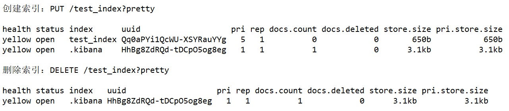

#### 4.商品的CRUD操作

##### 4.1 新增商品：新增文档，建立索引

es会自动建立index和type，不需要提前创建，而且es默认会对document每个field都建立倒排索引，让其可以被搜索

```java
// 必须是这种格式,大括号不能移到第一行
PUT /index/type/id
{
	"json数据"
}
```

示例:

```java
PUT /ecommerce/product/1
{
	"name" : "gaolujie yagao",
    "desc" :  "gaoxiao meibai",
    "price" :  30,
    "producer" : "gaolujie producer",
    "tags": [ "meibai", "fangzhu" ]
}
PUT /ecommerce/product/2
{
    "name" : "jiajieshi yagao",
    "desc" :  "youxiao fangzhu",
    "price" :  25,
    "producer" : "jiajieshi producer",
    "tags": [ "fangzhu" ]
}
PUT /ecommerce/product/3
{
    "name" : "zhonghua yagao",
    "desc" :  "caoben zhiwu",
    "price" :  40,
    "producer" : "zhonghua producer",
    "tags": [ "qingxin" ]
}
```

结果:

```java
{
  "_index": "ecommerce",
  "_type": "product",
  "_id": "1",
  "_version": 1,
  "result": "created",
  "_shards": {
    "total": 2,
    "successful": 1,
    "failed": 0
  },
  "created": true
}
```

##### 4.2 查询商品：检索文档

`GET /index/type/id`

示例:

```java
GET /ecommerce/product/1
  
// 结果
{
  "_index": "ecommerce",
  "_type": "product",
  "_id": "1",
  "_version": 1,
  "found": true,
  "_source": {
    "name": "gaolujie yagao",
    "desc": "gaoxiao meibai",
    "price": 30,
    "producer": "gaolujie producer",
    "tags": [
      "meibai",
      "fangzhu"
    ]
  }
}
```

##### 4.3 修改商品：替换文档

替换方式有一个不好，即使必须带上所有的field，才能去进行信息的修改

示例:

```java
PUT /ecommerce/product/1
{
    "name" : "jiaqiangban gaolujie yagao",
    "desc" :  "gaoxiao meibai",
    "price" :  30,
    "producer" : "gaolujie producer",
    "tags": [ "meibai", "fangzhu" ]
}

// 结果
{
  "_index": "ecommerce",
  "_type": "product",
  "_id": "1",
  "_version": 2,	// 替换后就是版本2
  "result": "updated",
  "_shards": {
    "total": 2,
    "successful": 1,
    "failed": 0
  },
  "created": false
}
```

##### 4.4 修改商品：更新文档

示例:

```java
POST /ecommerce/product/1/_update
{
  "doc": {
	"name": "gaolujie yagao"
  }
}

// 结果
{
  "_index": "ecommerce",
  "_type": "product",
  "_id": "1",
  "_version": 3,
  "result": "updated",
  "_shards": {
    "total": 2,
    "successful": 1,
    "failed": 0
  }
}
```

##### 4.5 删除商品：删除文档

示例:

```java
DELETE /ecommerce/product/1
  
// 结果
{
  "found": true,
  "_index": "ecommerce",
  "_type": "product",
  "_id": "1",
  "_version": 4,
  "result": "deleted",
  "_shards": {
    "total": 2,
    "successful": 1,
    "failed": 0
  }
}

GET /ecommerce/product/1
// 结果
{
  "_index": "ecommerce",
  "_type": "product",
  "_id": "1",
  "found": false
}
```

#### 5.多种搜索方式

##### 5.1 query string search

搜索全部商品：`GET /ecommerce/product/_search`

query string search的由来，因为search参数都是以http请求的query string来附带的, 搜索商品名称中包含yagao的商品，而且按照售价降序排序：`GET /ecommerce/product/_search?q=name:yagao&sort=price:desc`

适用于临时的在命令行使用一些工具，比如curl，快速的发出请求，来检索想要的信息；但是如果查询请求很复杂，是很难去构建的, 在生产环境中，几乎很少使用query string search

```java
{
  "took": 2,	// 耗费了几毫秒
  "timed_out": false,	// 是否超时，这里是没有
  // 数据拆成了5个分片，所以对于搜索请求，会打到所有的primary shard（或者是它的某个replica shard也可以）
  "_shards": {
    "total": 5,	
    "successful": 5,
    "failed": 0
  },
  "hits": {
    "total": 3,	 // 查询结果的数量，3个document
    // score的含义，就是document对于一个search的相关度的匹配分数，越相关，就越匹配，分数也高
    "max_score": 1,	
    "hits": [	// 包含了匹配搜索的document的详细数据
      {
        "_index": "ecommerce",
        "_type": "product",
        "_id": "2",
        "_score": 1,
        "_source": {
          "name": "jiajieshi yagao",
          "desc": "youxiao fangzhu",
          "price": 25,
          "producer": "jiajieshi producer",
          "tags": [
            "fangzhu"
          ]
        }
      },
      {
        "_index": "ecommerce",
        "_type": "product",
        "_id": "1",
        "_score": 1,
        "_source": {
          "name": "gaolujie yagao",
          "desc": "gaoxiao meibai",
          "price": 30,
          "producer": "gaolujie producer",
          "tags": [
            "meibai",
            "fangzhu"
          ]
        }
      },
      {
        "_index": "ecommerce",
        "_type": "product",
        "_id": "3",
        "_score": 1,
        "_source": {
          "name": "zhonghua yagao",
          "desc": "caoben zhiwu",
          "price": 40,
          "producer": "zhonghua producer",
          "tags": [
            "qingxin"
          ]
        }
      }
    ]
  }
}
```

##### 5.2 query DSL

DSL：Domain Specified Language，特定领域的语言

http request body：请求体，可以用json的格式来构建查询语法，比较方便，可以构建各种复杂的语法，比query string search肯定强大多了

查询所有的商品:

```java
GET /ecommerce/product/_search
{
	"query": {"match_all": {}}
}
```

查询名称包含yagao的商品，同时按照价格降序排序:

```java
GET /ecommerce/product/_search
{
  "query": {
      "match": {
          "name": "yagao"
      }
  },
  "sort": [
    	{"price": "desc"}
    ]
}
```

分页查询商品，总共3条商品，假设每页就显示1条商品，现在显示第2页，所以就查出来第2个商品:

```java
GET /ecommerce/product/_search
{
	"query": {"match_all": {}},
	"from": 1,	// 索引从0开始
	"size": 1
}
```

显示要查询出来商品的名称和价格就可以:

```java
GET /ecommerce/product/_search
{
	"query": {"match_all": {}},
	"_source": ["name", "price"]
}
```

##### 5.3 query filter

搜索商品名称包含yagao，而且售价大于25元的商品:

```java
GET /ecommerce/product/_search
{
  "query": {
	  "bool": {
          "must" :{
			"match": {"name": "yagao"}
          },
          "filter": {
              "range": {
				"price": {"gt": 25}
              }
          }
	  }
  }
}
```

##### 5.4 full-text search(全文检索)

```java
GET /ecommerce/product/_search
{
    "query" : {
        "match" : {
            "producer" : "zhonghua producer"
        }
    }
}
// 结果有三条document
```

producer这个字段，会先被拆解，建立倒排索引

```java
producer	1,2,3
gaolujie	1
zhonghua	3
jiajieshi	2
```

zhonghua producer ---> zhonghua和producer

##### 5.5 phrase search(短语搜索)

跟全文检索相对应，相反，全文检索会将输入的搜索串拆解开来，去倒排索引里面去一一匹配，只要能匹配上任意一个拆解后的单词，就可以作为结果返回

phrase search，要求输入的搜索串，必须在指定的字段文本中，完全包含一模一样的，才可以算匹配，才能作为结果返回

```java
GET /ecommerce/product/_search
{
    "query": {
		"match_phrase": {
			"producer": "zhonghua producer"
		}
    }
}
// 结果只有一条document
```

##### 5.6 highlight search(高亮搜索结果)

```java
GET /ecommerce/product/_search
{
    "query" : {
        "match" : {
            "producer" : "zhonghua producer"
        }
    },
    "highlight": {
        "fields" : {
            "producer" : {}
        }
    }
}

// 结果
{
   "_index": "ecommerce",
   "_type": "product",
   "_id": "3",
   "_score": 0.51623213,
   "_source": {
        "name": "zhonghua yagao",
        "desc": "caoben zhiwu",
        "price": 40,
        "producer": "zhonghua producer",
        "tags": [
            "qingxin"
        ]
    },
    "highlight": {
        "producer": [
            "<em>zhonghua</em> <em>producer</em>"
         ]
    }
},
```

#### 6.聚合分析

##### 1.计算每个tag下的商品数量

将文本field的fielddata属性设置为true

```java
PUT /ecommerce/_mapping/product
{
  "properties": {
    "tags": {
      "type": "text",
      "fielddata": true
    }
  }
}
```

查询:

```java
GET /ecommerce/product/_search
{
  "size": 0,
  "aggs": {
    "all_tags": {	// 分组名称,自定义
      "terms": {
        "field": "tags"
      }
    }
  }
}

// 结果
{
  "took": 1,
  "timed_out": false,
  "_shards": {
    "total": 5,
    "successful": 5,
    "failed": 0
  },
  "hits": {
    "total": 3,
    "max_score": 0,
    "hits": []
  },
  "aggregations": {
    "all_tags": {
      "doc_count_error_upper_bound": 0,
      "sum_other_doc_count": 0,
      "buckets": [
        {
          "key": "fangzhu",
          "doc_count": 2
        },
        {
          "key": "meibai",
          "doc_count": 1
        },
        {
          "key": "qingxin",
          "doc_count": 1
        }
      ]
    }
  }
}
```

##### 2.对名称中包含yagao的商品，计算每个tag下的商品数量

```java
GET /ecommerce/product/_search
{
  "size": 0,
  "query": {
    "match": {
      "name": "yagao"
    }
  }, 
  "aggs": {
    "all_tags": {
      "terms": {
        "field": "tags"
      }
    }
  }
}
```

##### 3.先分组，再算每组的平均值，计算每个tag下的商品的平均价格

```java
GET /ecommerce/product/_search
{
    "size": 0,
    "aggs" : {
        "all_tags" : {	// 聚合名称
            "terms" : { "field" : "tags" },	// 词组
            "aggs" : {
                "avg_price" : {	// 聚合名称
                    "avg" : { "field" : "price" }
                }
            }
        }
    }
}

// 结果
"aggregations": {
    "all_tags": {
      "doc_count_error_upper_bound": 0,
      "sum_other_doc_count": 0,
      "buckets": [
        {
          "key": "fangzhu",
          "doc_count": 2,
          "avg_price": {
            "value": 27.5
          }
        },
        {
          "key": "meibai",
          "doc_count": 1,
          "avg_price": {
            "value": 30
          }
        },
        {
          "key": "qingxin",
          "doc_count": 1,
          "avg_price": {
            "value": 40
          }
        }
      ]
    }
  }
```

##### 4.计算每个tag下的商品的平均价格，并且按照平均价格降序排序

```java
GET /ecommerce/product/_search
{
    "size": 0,
    "aggs" : {
        "all_tags" : {
            "terms" : { "field" : "tags", "order": { "avg_price": "desc" } },
            "aggs" : {
                "avg_price" : {
                    "avg" : { "field" : "price" }
                }
            }
        }
    }
}
```

##### 5.按照指定的价格范围区间进行分组，然后在每组内再按照tag进行分组，最后再计算每组的平均价格

```java
GET /ecommerce/product/_search
{
  "size": 0,
  "aggs": {
    "group_by_price": {
      "range": {
        "field": "price",
        "ranges": [
          {
            "from": 0,
            "to": 19
          },
          {
            "from": 20,
            "to": 40
          },
          {
            "from": 41,
            "to": 50
          }
        ]
      },
      "aggs": {
        "group_by_tags": {
          "terms": {
            "field": "tags"
          },
          "aggs": {
            "average_price": {
              "avg": {
                "field": "price"
              }
            }
          }
        }
      }
    }
  }
}
```


