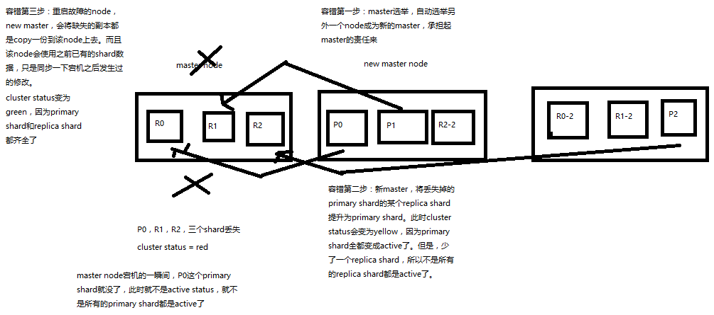
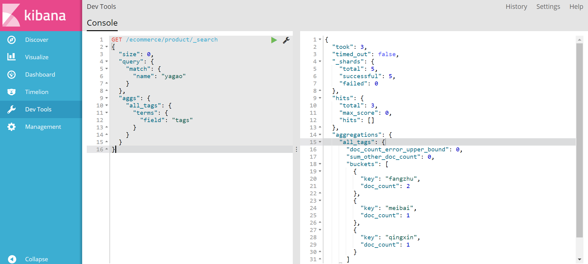

### 一.什么是Elasticsearch

#### 1.什么是搜索

搜索，就是在任何场景下，找寻你想要的信息，这个时候，会输入一段你要搜索的关键字，然后就期望找到这个关键字相关的有些信息

#### 2.如果用数据库做搜索会怎么样


- 比方说，每条记录的指定字段的文本，可能会很长，比如说“商品描述”字段的长度，有长达数千个，甚至数万个字符，这个时候，每次都要对每条记录的所有文本进行扫描，再判断包不包含指定的这个关键词（比如说“牙膏”）
- 还不能将搜索词拆分开来，尽可能去搜索更多的符合你的期望的结果，比如输入“生化机”，就搜索不出来“生化危机”

用数据库来实现搜索，是不太靠谱的。通常来说，性能会很差的。

#### 3.什么是全文检索、倒排索引和Lucene

（1）全文检索，倒排索引


（2）lucene，就是一个jar包，里面包含了封装好的各种建立倒排索引，以及进行搜索的代码，包括各种算法。我们就用java开发的时候，引入lucene jar，然后基于lucene的api进行去进行开发就可以了。用lucene，我们就可以去将已有的数据建立索引，lucene会在本地磁盘上面，给我们组织索引的数据结构。另外的话，我们也可以用lucene提供的一些功能和api来针对磁盘上额

#### 4.什么是Elasticsearch

Elasticsearch，分布式，高性能，高可用，可伸缩的搜索和分析系统


#### 5.Elasticsearch的功能

##### 分布式的搜索引擎和数据分析引擎

-   搜索：百度，网站的站内搜索，IT系统的检索
-   数据分析：电商网站，最近7天牙膏这种商品销量排名前10的商家有哪些；新闻网站，最近1个月访问量排名前3的新闻版块是哪些

##### 全文检索，结构化检索，数据分析

-   全文检索：我想搜索商品名称包含牙膏的商品，`select * from products where product_name like "%牙膏%"` 
-   结构化检索：我想搜索商品分类为日化用品的商品都有哪些，`select * from products where category_id='日化用品'` 
-   部分匹配、自动完成、搜索纠错、搜索推荐
-   数据分析：我们分析每一个商品分类下有多少个商品，`select category_id,count(*) from products group by category_id` 

##### 对海量数据进行近实时的处理

-   分布式：ES自动可以将海量数据分散到多台服务器上去存储和检索
-   海量数据的处理：分布式以后，就可以采用大量的服务器去存储和检索数据，自然而然就可以实现海量数据的处理了
-   近实时：检索个数据要花费1小时（这就不要近实时，离线批处理，batch-processing）；在秒级别对数据进行搜索和分析
-   跟分布式/海量数据相反的：lucene，单机应用，只能在单台服务器上使用，最多只能处理单台服务器可以处理的数据量

#### 6.Elasticsearch的特点

-   可以作为一个大型分布式集群（数百台服务器）技术，处理PB级数据，服务大公司；也可以运行在单机上，服务小公司
-   Elasticsearch不是什么新技术，主要是将全文检索、数据分析以及分布式技术，合并在了一起，才形成了独一无二的ES；lucene（全文检索），商用的数据分析软件（也是有的），分布式数据库（mycat）
-   对用户而言，是开箱即用的，非常简单，作为中小型的应用，直接3分钟部署一下ES，就可以作为生产环境的系统来使用了，数据量不大，操作不是太复杂
-   数据库的功能面对很多领域是不够用的（事务，还有各种联机事务型的操作）；特殊的功能，比如全文检索，同义词处理，相关度排名，复杂数据分析，海量数据的近实时处理；Elasticsearch作为传统数据库的一个补充，提供了数据库所不不能提供的很多功能

#### 7.Elasticsearch和lucene的前世今生

lucene，最先进、功能最强大的搜索库，直接基于lucene开发，非常复杂，api复杂（实现一些简单的功能，写大量的java代码），需要深入理解原理（各种索引结构）

elasticsearch，基于lucene，隐藏复杂性，提供简单易用的restful api接口、java api接口（还有其他语言的api接口）

-   分布式的文档存储引擎
-   分布式的搜索引擎和数据分析引擎
-   分布式，支持PB级数据

开箱即用，优秀的默认参数，不需要任何额外设置，完全开源

关于elasticsearch的一个传说，有一个程序员失业了，陪着自己老婆去英国伦敦学习厨师课程。程序员在失业期间想给老婆写一个菜谱搜索引擎，觉得lucene实在太复杂了，就开发了一个封装了lucene的开源项目，compass。后来程序员找到了工作，是做分布式的高性能项目的，觉得compass不够，就写了elasticsearch，让lucene变成分布式的系统。

#### 8.在windows上安装和启动Elasticsearch

1.  安装JDK，至少1.8.0_73以上版本，java -version

2.  下载和解压缩Elasticsearch安装包，目录结构

3.  启动Elasticsearch：bin\elasticsearch.bat，es本身特点之一就是开箱即用，如果是中小型应用，数据量少，操作不是很复杂，直接启动就可以用了

4.  检查ES是否启动成功：http://localhost:9200/?pretty

    ```json
    // name: node名称
    // cluster_name: 集群名称（默认的集群名称就是elasticsearch）
    // version.number: 5.2.0，es版本号
    {
      "name" : "4onsTYV",
      "cluster_name" : "elasticsearch",
      "cluster_uuid" : "nKZ9VK_vQdSQ1J0Dx9gx1Q",
      "version" : {
          "number" : "5.2.0",
          "build_hash" : "24e05b9",
          "build_date" : "2017-01-24T19:52:35.800Z",
          "build_snapshot" : false,
          "lucene_version" : "6.4.0"
      },
      "tagline" : "You Know, for Search"
    }
    ```

5.  修改集群名称：elasticsearch.yml

6.  下载和解压缩Kibana安装包，使用里面的开发界面，去操作elasticsearch，作为学习es知识点的一个主要的界面入口

7.  启动Kibana：bin\kibana.bat

8.  进入Dev Tools界面

9.  命令测试: GET _cluster/health

### 二.Elasticsearch概念

#### 1.Elasticsearch的核心概念

-   Near Realtime（NRT）：**近实时**，两个意思，从写入数据到数据可以被搜索到有一个小延迟（大概1秒）；基于es执行搜索和分析可以达到秒级

    

-   Cluster：**集群**，包含多个节点，每个节点属于哪个集群是通过一个配置（集群名称，默认是elasticsearch）来决定的，对于中小型应用来说，刚开始一个集群就一个节点很正常

-   Node：**节点**，集群中的一个节点，节点也有一个名称（默认是随机分配的），节点名称很重要（在执行运维管理操作的时候），默认节点会去加入一个名称为“elasticsearch”的集群，如果直接启动一堆节点，那么它们会自动组成一个elasticsearch集群，当然一个节点也可以组成一个elasticsearch集群

-   Document&field：**文档**，es中的最小数据单元，一个document可以是一条客户数据，一条商品分类数据，一条订单数据，通常用JSON数据结构表示，每个index下的type中，都可以去存储多个document。一个document里面有多个field，每个field就是一个数据字段。

    ```json
    product document
    {
      "product_id": "1",
      "product_name": "高露洁牙膏",
      "product_desc": "高效美白",
      "category_id": "2",
      "category_name": "日化用品"
    }
    ```


-   Index：**索引**，包含一堆有相似结构的文档数据，比如可以有一个客户索引，商品分类索引，订单索引，索引有一个名称。一个index包含很多document，一个index就代表了一类类似的或者相同的document。比如说建立一个product index，商品索引，里面可能就存放了所有的商品数据，所有的商品document。

-   Type：**类型**，每个索引里都可以有一个或多个type，type是index中的一个逻辑数据分类，一个type下的document，都有相同的field，比如博客系统，有一个索引，可以定义用户数据type，博客数据type，评论数据type。

    >商品index，里面存放了所有的商品数据，商品document, 但是商品分很多种类，每个种类的document的field可能不太一样，比如说电器商品，可能还包含一些诸如售后时间范围这样的特殊field；生鲜商品，还包含一些诸如生鲜保质期之类的特殊field
    >
    >type，日化商品type，电器商品type，生鲜商品type
    >
    >-   日化商品type：product_id，product_name，product_desc，category_id，category_name
    >-   电器商品type：product_id，product_name，product_desc，category_id，category_name，service_period
    >-   生鲜商品type：product_id，product_name，product_desc，category_id，category_name，eat_period
    >
    >每一个type里面，都会包含一堆document
    >
    >```json
    >{
    >  "product_id": "2",
    >  "product_name": "长虹电视机",
    >  "product_desc": "4k高清",
    >  "category_id": "3",
    >  "category_name": "电器",
    >  "service_period": "1年"
    >}
    >{
    >  "product_id": "3",
    >  "product_name": "基围虾",
    >  "product_desc": "纯天然，冰岛产",
    >  "category_id": "4",
    >  "category_name": "生鲜",
    >  "eat_period": "7天"
    >}
    >```

- shard：单台机器无法存储大量数据，es可以将一个索引中的数据切分为多个shard，分布在多台服务器上存储。有了shard就可以横向扩展，存储更多数据，让搜索和分析等操作分布到多台服务器上去执行，提升吞吐量和性能。每个shard都是一个lucene index。

- replica：任何一个服务器随时可能故障或宕机，此时shard可能就会丢失，因此可以为每个shard创建多个replica副本。replica可以在shard故障时提供备用服务，保证数据不丢失，多个replica还可以提升搜索操作的吞吐量和性能。primary shard（建立索引时一次设置，不能修改，默认5个），replica shard（随时修改数量，默认1个），默认每个索引10个shard，5个primary shard，5个replica shard，最小的高可用配置，是2台服务器。

  


**Elasticsearch与数据库:**

| elasticsearch | 数据库  |
| :-----------: | :--: |
|   Document    |  行   |
|     Type      |  表   |
|     Index     |  库   |

#### 2.Elasticsearch的基础分布式架构


##### 3.1 复杂分布式机制的透明隐藏特性

Elasticsearch是一套分布式的系统，分布式是为了应对大数据量.

隐藏了复杂的分布式机制:

-   分片机制（我们之前随随便便就将一些document插入到es集群中去了，我们有没有care过数据怎么进行分片的，数据到哪个shard中去）
-   cluster discovery（集群发现机制，我们之前在做那个集群status从yellow转green的实验里，直接启动了第二个es进程，那个进程作为一个node自动就发现了集群，并且加入了进去，还接受了部分数据，replica shard）
-   shard负载均衡（举例，假设现在有3个节点，总共有25个shard要分配到3个节点上去，es会自动进行均匀分配，以保持每个节点的均衡的读写负载请求）
-   shard副本，请求路由，集群扩容，shard重分配

##### 3.2 垂直扩容与水平扩容

垂直扩容：采购更强大的服务器，成本非常高昂，而且会有瓶颈，假设世界上最强大的服务器容量就是10T，但是当你的总数据量达到5000T的时候，你要采购多少台最强大的服务器啊

水平扩容：业界经常采用的方案，采购越来越多的普通服务器，性能比较一般，但是很多普通服务器组织在一起，就能构成强大的计算和存储能力

扩容对应用程序的透明性

##### 3.3 增减或减少节点时的数据rebalance

保持负载均衡

##### 3.4 master节点

- 创建或删除索引
- 增加或删除节点

##### 3.5 节点对等的分布式架构

-   节点对等，每个节点都能接收所有的请求
-   自动请求路由
-   响应收集

#### 3.shard&replica机制

##### 3.1 shard&replica机制再次梳理

-   **index包含多个shard**
-   **每个shard都是一个最小工作单元，承载部分数据，lucene实例，完整的建立索引和处理请求的能力**
-   **增减节点时，shard会自动在nodes中负载均衡**
-   primary shard和replica shard，每个document肯定只存在于某一个primary shard以及其对应的replica shard中，不可能存在于多个primary shard
-   **replica shard是primary shard的副本，负责容错，以及承担读请求负载**
-   **primary shard的数量在创建索引的时候就固定了，replica shard的数量可以随时修改**
-   **primary shard的默认数量是5，replica默认是1(备份*1)，默认有10个shard，5个primary shard，5个replica shard**
-   **primary shard不能和自己的replica shard放在同一个节点上**（否则节点宕机，primary shard和副本都丢失，起不到容错的作用），但是**可以和其他primary shard的replica shard放在同一个节点上**

##### 3.2 单node环境下创建index


```java
PUT /test_index
{
   "settings" : {
      "number_of_shards" : 3,
      "number_of_replicas" : 1	// 备份次数
   }
}
```

-   单node环境下，创建一个index，有3个primary shard，3个replica shard
-   集群status是yellow
-   这个时候，只会将3个primary shard分配到仅有的一个node上去，另外3个replica shard是无法分配的
-   集群可以正常工作，但是一旦出现节点宕机，数据全部丢失，而且集群不可用，无法承接任何请求


##### 3.3 2个node环境下replica shard是如何分配的


- replica shard分配：3个primary shard，3个replica shard，1 node
- primary ---> replica同步
- 读请求：primary/replica

#### 4.横向扩容与容错机制

##### 4.1 横向扩容过程，如何超出扩容极限，以及如何提升容错性


- primary&replica自动负载均衡，6个shard，3 primary，3 replica
- 每个node有更少的shard，IO/CPU/Memory资源给每个shard分配更多，每个shard性能更好
- 扩容的极限，6个shard（3 primary，3 replica），最多扩容到6台机器，每个shard可以占用单台服务器的所有资源，性能最好
- 超出扩容极限，动态修改replica数量，9个shard（3primary，6 replica），扩容到9台机器，比3台机器时，拥有3倍的读吞吐量


- 3台机器下，**9个shard**（3 primary，6 replica），资源更少，但是容错性更好，最多容纳**2台机器**宕机，**6个shard**只能容纳**1台机器**宕机
- 综合起来看，一方面要知道扩容的原理，怎么扩容，怎么提升系统整体吞吐量；另一方面要考虑到系统的容错性，怎么保证提高容错性，让尽可能多的服务器宕机，保证数据不丢失

##### 4.2 Elasticsearch容错机制：master选举，replica容错，数据恢复



- 9 shard，3 node
- master node宕机，自动master选举，**red**(不是所有的primary shard都是active)
- replica容错：新master将replica提升为primary shard，**yellow**(不是所有的replica shard都是active)
- 重启宕机node，master copy replica到该node，使用原有的shard并同步宕机后的修改，**green**(shard与replica都齐全了)

### 三.分布式文档系统概述

#### 1.document核心元数据


```java
{
  "_index": "test_index",
  "_type": "test_type",
  "_id": "1",
  "_version": 1,
  "found": true,
  "_source": {
    "test_content": "test test"
  }
}
```

##### 1.1 _index元数据

- **代表一个document存放在哪个index中**
- **类似的数据放在一个索引，非类似的数据放不同索引**：product index（包含了所有的商品），sales index（包含了所有的商品销售数据），inventory index（包含了所有库存相关的数据）。如果你把比如product，sales，human resource（employee），全都放在一个大的index里面，比如说company index，不合适的。
- **index中包含了很多类似的document**：类似是什么意思，其实指的就是说，**这些document的fields很大一部分是相同的**，你说你放了3个document，每个document的fields都完全不一样，这就不是类似了，就不太适合放到一个index里面去了。
- **索引名称必须是小写的，不能用下划线开头，不能包含逗号**：product，website，blog

##### 1.2 _type元数据

-   **代表document属于index中的哪个类别（type）**
-   一个索引通常会划分为多个type，逻辑上对index中有些许不同的几类数据进行分类：因为**一批相同的数据，可能有很多相同的fields，但是还是可能会有一些轻微的不同**，可能会有少数fields是不一样的，举个例子，就比如说，商品，可能划分为电子商品，生鲜商品，日化商品，等等。
-   **type名称可以是大写或者小写，但是同时不能用下划线开头，不能包含逗号**

##### 1.3 _id元数据

-   **代表document的唯一标识，与index和type一起，可以唯一标识和定位一个document**
-   我们可以**手动指定document的id**（put /index/type/id），也可以不指定，由**es自动为我们创建一个id**


### 四.电商网站商品管理简单案例

所有命令都是在 **Kibana** 可视化界面的 **Dev Tools** 的 **Console**里开发的



#### 1.document数据格式

面向文档的搜索分析引擎

-   应用系统的数据结构都是面向对象的，复杂的
-   对象数据存储到数据库中，只能拆解开来，变为扁平的多张表，每次查询的时候还得还原回对象格式，相当麻烦
-   ES是面向文档的，文档中存储的数据结构，与面向对象的数据结构是一样的，基于这种文档数据结构，es可以提供复杂的索引，全文检索，分析聚合等功能
-   es的document用json数据格式来表达

用数据库来实现:

```java
public class Employee {
  private String email;
  private String firstName;
  private String lastName;
  private EmployeeInfo info;
  private Date joinDate;
}

private class EmployeeInfo {
  private String bio; // 性格
  private Integer age;
  private String[] interests; // 兴趣爱好
}

EmployeeInfo info = new EmployeeInfo();
info.setBio("curious and modest");
info.setAge(30);
info.setInterests(new String[]{"bike", "climb"});

Employee employee = new Employee();
employee.setEmail("zhaoliu@sina.com");
employee.setFirstName("liu");
employee.setLastName("zhao");
employee.setInfo(info);
employee.setJoinDate(new Date());
```

employee对象：里面包含了Employee类自己的属性，还有一个EmployeeInfo对象

-   两张表：employee表，employee_info表，将employee对象的数据重新拆开来，变成Employee数据和EmployeeInfo数据
-   employee表：email，first_name，last_name，join_date，4个字段
-   employee_info表：bio，age，interests，3个字段；此外还有一个外键字段，比如employee_id，关联着employee表

document数据格式:

```json
{
  "email": "zhaoliu@sina.com",
  "first_name": "san",
  "last_name": "zhang",
  "info": {
      "bio": "curious and modest",
      "age": 30,
      "interests": [ "bike", "climb" ]
  },
  "join_date": "2017/01/01"
}
```

我们就明白了es的document数据格式和数据库的关系型数据格式的区别

#### 2.背景介绍

有一个电商网站，需要为其基于ES构建一个后台系统，提供以下功能：

1.  对商品信息进行CRUD（增删改查）操作
2.  执行简单的结构化查询
3.  可以执行简单的全文检索，以及复杂的phrase（短语）检索
4.  对于全文检索的结果，可以进行高亮显示
5.  对数据进行简单的聚合分析

#### 3.简单的集群管理

##### 3.1 快速检查集群的健康状况

es提供了一套api，叫做cat api，可以查看es中各种各样的数据

`GET /_cat/health?v`


如何快速了解集群的健康状况？green、yellow、red？

-   **green**：每个索引的primary shard和replica shard都是active状态的
-   **yellow**：每个索引的primary shard都是active状态的，但是部分replica shard不是active状态，处于不可用的状态
-   **red**：不是所有索引的primary shard都是active状态的，部分索引有数据丢失了

为什么现在会处于一个yellow状态？

我们现在就一个笔记本电脑，就启动了一个es进程，相当于就只有一个node。现在es中有一个index，就是kibana自己内置建立的index。由于默认的配置是给每个index分配5个primary shard和5个replica shard，而且primary shard和replica shard不能在同一台机器上（为了容错）。现在kibana自己建立的index是1个primary shard和1个replica shard。当前就一个node，所以只有1个primary shard被分配了和启动了，但是一个replica shard没有第二台机器去启动。

做一个小实验：此时只要启动第二个es进程，就会在es集群中有2个node，然后那1个replica shard就会自动分配过去，然后cluster status就会变成green状态。

##### 3.2 快速查看集群中有哪些索引

`GET /_cat/indices?v`


##### 3.3 简单的索引操作

创建索引：`PUT /test_index?pretty`

删除索引：`DELETE /test_index?pretty`


#### 4.商品的CRUD操作

##### 4.1 新增商品：新增文档，建立索引

es会自动建立index和type，不需要提前创建，而且es默认会对document每个field都建立倒排索引，让其可以被搜索

```java
// 必须是这种格式,大括号不能移到第一行
PUT /index/type/id
{
	"json数据"
}
```

示例:

```java
PUT /ecommerce/product/1
{
	"name" : "gaolujie yagao",
    "desc" :  "gaoxiao meibai",
    "price" :  30,
    "producer" : "gaolujie producer",
    "tags": [ "meibai", "fangzhu" ]
}
PUT /ecommerce/product/2
{
    "name" : "jiajieshi yagao",
    "desc" :  "youxiao fangzhu",
    "price" :  25,
    "producer" : "jiajieshi producer",
    "tags": [ "fangzhu" ]
}
PUT /ecommerce/product/3
{
    "name" : "zhonghua yagao",
    "desc" :  "caoben zhiwu",
    "price" :  40,
    "producer" : "zhonghua producer",
    "tags": [ "qingxin" ]
}
```

结果:

```java
{
  "_index": "ecommerce",
  "_type": "product",
  "_id": "1",
  "_version": 1,
  "result": "created",
  "_shards": {
    "total": 2,
    "successful": 1,
    "failed": 0
  },
  "created": true
}
```

##### 4.2 查询商品：检索文档

`GET /index/type/id`

示例:

```java
GET /ecommerce/product/1
  
// 结果
{
  "_index": "ecommerce",
  "_type": "product",
  "_id": "1",
  "_version": 1,
  "found": true,
  "_source": {
    "name": "gaolujie yagao",
    "desc": "gaoxiao meibai",
    "price": 30,
    "producer": "gaolujie producer",
    "tags": [
      "meibai",
      "fangzhu"
    ]
  }
}
```

##### 4.3 修改商品：替换文档

替换方式有一个不好，即使必须带上所有的field，才能去进行信息的修改

示例:

```java
PUT /ecommerce/product/1
{
    "name" : "jiaqiangban gaolujie yagao",
    "desc" :  "gaoxiao meibai",
    "price" :  30,
    "producer" : "gaolujie producer",
    "tags": [ "meibai", "fangzhu" ]
}

// 结果
{
  "_index": "ecommerce",
  "_type": "product",
  "_id": "1",
  "_version": 2,	// 替换后就是版本2
  "result": "updated",
  "_shards": {
    "total": 2,
    "successful": 1,
    "failed": 0
  },
  "created": false
}
```

##### 4.4 修改商品：更新文档

示例:

```java
POST /ecommerce/product/1/_update
{
  "doc": {
	"name": "gaolujie yagao"
  }
}

// 结果
{
  "_index": "ecommerce",
  "_type": "product",
  "_id": "1",
  "_version": 3,
  "result": "updated",
  "_shards": {
    "total": 2,
    "successful": 1,
    "failed": 0
  }
}
```

##### 4.5 删除商品：删除文档

示例:

```java
DELETE /ecommerce/product/1
  
// 结果
{
  "found": true,
  "_index": "ecommerce",
  "_type": "product",
  "_id": "1",
  "_version": 4,
  "result": "deleted",
  "_shards": {
    "total": 2,
    "successful": 1,
    "failed": 0
  }
}

GET /ecommerce/product/1
// 结果
{
  "_index": "ecommerce",
  "_type": "product",
  "_id": "1",
  "found": false
}
```

#### 5.多种搜索方式

##### 5.1 query string search

搜索全部商品：`GET /ecommerce/product/_search`

query string search的由来，因为search参数都是以http请求的query string来附带的, 搜索商品名称中包含yagao的商品，而且按照售价降序排序：`GET /ecommerce/product/_search?q=name:yagao&sort=price:desc`

适用于临时的在命令行使用一些工具，比如curl，快速的发出请求，来检索想要的信息；但是如果查询请求很复杂，是很难去构建的, 在生产环境中，几乎很少使用query string search

```java
{
  "took": 2,	// 耗费了几毫秒
  "timed_out": false,	// 是否超时，这里是没有
  // 数据拆成了5个分片，所以对于搜索请求，会打到所有的primary shard（或者是它的某个replica shard也可以）
  "_shards": {
    "total": 5,	
    "successful": 5,
    "failed": 0
  },
  "hits": {
    "total": 3,	 // 查询结果的数量，3个document
    // score的含义，就是document对于一个search的相关度的匹配分数，越相关，就越匹配，分数也高
    "max_score": 1,	
    "hits": [	// 包含了匹配搜索的document的详细数据
      {
        "_index": "ecommerce",
        "_type": "product",
        "_id": "2",
        "_score": 1,
        "_source": {
          "name": "jiajieshi yagao",
          "desc": "youxiao fangzhu",
          "price": 25,
          "producer": "jiajieshi producer",
          "tags": [
            "fangzhu"
          ]
        }
      },
      {
        "_index": "ecommerce",
        "_type": "product",
        "_id": "1",
        "_score": 1,
        "_source": {
          "name": "gaolujie yagao",
          "desc": "gaoxiao meibai",
          "price": 30,
          "producer": "gaolujie producer",
          "tags": [
            "meibai",
            "fangzhu"
          ]
        }
      },
      {
        "_index": "ecommerce",
        "_type": "product",
        "_id": "3",
        "_score": 1,
        "_source": {
          "name": "zhonghua yagao",
          "desc": "caoben zhiwu",
          "price": 40,
          "producer": "zhonghua producer",
          "tags": [
            "qingxin"
          ]
        }
      }
    ]
  }
}
```

##### 5.2 query DSL

DSL：Domain Specified Language，特定领域的语言

http request body：请求体，可以用json的格式来构建查询语法，比较方便，可以构建各种复杂的语法，比query string search肯定强大多了

查询所有的商品:

```java
GET /ecommerce/product/_search
{
	"query": {"match_all": {}}
}
```

查询名称包含yagao的商品，同时按照价格降序排序:

```java
GET /ecommerce/product/_search
{
  "query": {
      "match": {
          "name": "yagao"
      }
  },
  "sort": [
    	{"price": "desc"}
    ]
}
```

分页查询商品，总共3条商品，假设每页就显示1条商品，现在显示第2页，所以就查出来第2个商品:

```java
GET /ecommerce/product/_search
{
	"query": {"match_all": {}},
	"from": 1,	// 索引从0开始
	"size": 1
}
```

显示要查询出来商品的名称和价格就可以:

```java
GET /ecommerce/product/_search
{
	"query": {"match_all": {}},
	"_source": ["name", "price"]
}
```

##### 5.3 query filter

搜索商品名称包含yagao，而且售价大于25元的商品:

```java
GET /ecommerce/product/_search
{
  "query": {
	  "bool": {
          "must" :{
			"match": {"name": "yagao"}
          },
          "filter": {
              "range": {
				"price": {"gt": 25}
              }
          }
	  }
  }
}
```

##### 5.4 full-text search(全文检索)

```java
GET /ecommerce/product/_search
{
    "query" : {
        "match" : {
            "producer" : "zhonghua producer"
        }
    }
}
// 结果有三条document
```

producer这个字段，会先被拆解，建立倒排索引

```java
producer	1,2,3
gaolujie	1
zhonghua	3
jiajieshi	2
```

zhonghua producer ---> zhonghua和producer

##### 5.5 phrase search(短语搜索)

跟全文检索相对应，相反，全文检索会将输入的搜索串拆解开来，去倒排索引里面去一一匹配，只要能匹配上任意一个拆解后的单词，就可以作为结果返回

phrase search，要求输入的搜索串，必须在指定的字段文本中，完全包含一模一样的，才可以算匹配，才能作为结果返回

```java
GET /ecommerce/product/_search
{
    "query": {
		"match_phrase": {
			"producer": "zhonghua producer"
		}
    }
}
// 结果只有一条document
```

##### 5.6 highlight search(高亮搜索结果)

```java
GET /ecommerce/product/_search
{
    "query" : {
        "match" : {
            "producer" : "zhonghua producer"
        }
    },
    "highlight": {
        "fields" : {
            "producer" : {}
        }
    }
}

// 结果
{
   "_index": "ecommerce",
   "_type": "product",
   "_id": "3",
   "_score": 0.51623213,
   "_source": {
        "name": "zhonghua yagao",
        "desc": "caoben zhiwu",
        "price": 40,
        "producer": "zhonghua producer",
        "tags": [
            "qingxin"
        ]
    },
    "highlight": {
        "producer": [
            "<em>zhonghua</em> <em>producer</em>"
         ]
    }
},
```

#### 6.聚合分析

##### 1.计算每个tag下的商品数量

将文本field的fielddata属性设置为true

```java
PUT /ecommerce/_mapping/product
{
  "properties": {
    "tags": {
      "type": "text",
      "fielddata": true
    }
  }
}
```

查询:

```java
GET /ecommerce/product/_search
{
  "size": 0,
  "aggs": {
    "all_tags": {	// 分组名称,自定义
      "terms": {
        "field": "tags"
      }
    }
  }
}

// 结果
{
  "took": 1,
  "timed_out": false,
  "_shards": {
    "total": 5,
    "successful": 5,
    "failed": 0
  },
  "hits": {
    "total": 3,
    "max_score": 0,
    "hits": []
  },
  "aggregations": {
    "all_tags": {
      "doc_count_error_upper_bound": 0,
      "sum_other_doc_count": 0,
      "buckets": [
        {
          "key": "fangzhu",
          "doc_count": 2
        },
        {
          "key": "meibai",
          "doc_count": 1
        },
        {
          "key": "qingxin",
          "doc_count": 1
        }
      ]
    }
  }
}
```

##### 2.对名称中包含yagao的商品，计算每个tag下的商品数量

```java
GET /ecommerce/product/_search
{
  "size": 0,
  "query": {
    "match": {
      "name": "yagao"
    }
  }, 
  "aggs": {
    "all_tags": {
      "terms": {
        "field": "tags"
      }
    }
  }
}
```

##### 3.先分组，再算每组的平均值，计算每个tag下的商品的平均价格

```java
GET /ecommerce/product/_search
{
    "size": 0,
    "aggs" : {
        "all_tags" : {	// 聚合名称
            "terms" : { "field" : "tags" },	// 词组
            "aggs" : {
                "avg_price" : {	// 聚合名称
                    "avg" : { "field" : "price" }
                }
            }
        }
    }
}

// 结果
"aggregations": {
    "all_tags": {
      "doc_count_error_upper_bound": 0,
      "sum_other_doc_count": 0,
      "buckets": [
        {
          "key": "fangzhu",
          "doc_count": 2,
          "avg_price": {
            "value": 27.5
          }
        },
        {
          "key": "meibai",
          "doc_count": 1,
          "avg_price": {
            "value": 30
          }
        },
        {
          "key": "qingxin",
          "doc_count": 1,
          "avg_price": {
            "value": 40
          }
        }
      ]
    }
  }
```

##### 4.计算每个tag下的商品的平均价格，并且按照平均价格降序排序

```java
GET /ecommerce/product/_search
{
    "size": 0,
    "aggs" : {
        "all_tags" : {
            "terms" : { "field" : "tags", "order": { "avg_price": "desc" } },
            "aggs" : {
                "avg_price" : {
                    "avg" : { "field" : "price" }
                }
            }
        }
    }
}
```

##### 5.按照指定的价格范围区间进行分组，然后在每组内再按照tag进行分组，最后再计算每组的平均价格

```java
GET /ecommerce/product/_search
{
  "size": 0,
  "aggs": {
    "group_by_price": {
      "range": {
        "field": "price",
        "ranges": [
          {
            "from": 0,
            "to": 19
          },
          {
            "from": 20,
            "to": 40
          },
          {
            "from": 41,
            "to": 50
          }
        ]
      },
      "aggs": {
        "group_by_tags": {
          "terms": {
            "field": "tags"
          },
          "aggs": {
            "average_price": {
              "avg": {
                "field": "price"
              }
            }
          }
        }
      }
    }
  }
}
```


