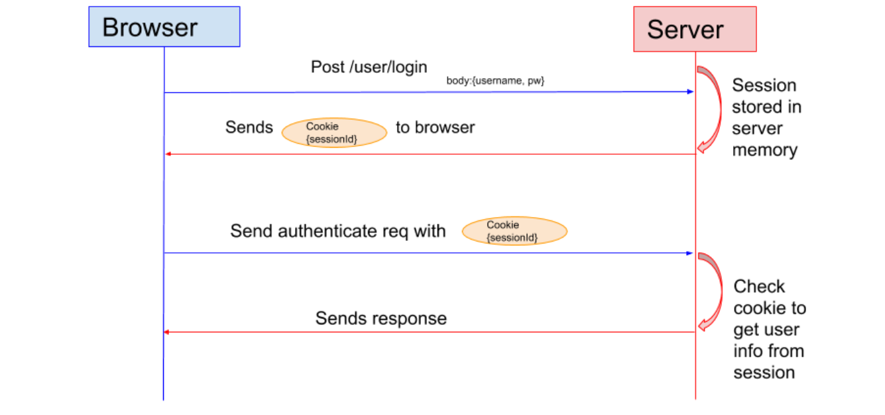

### 一.框架发展过程简单了解

在刚接触javaEE时,学的jsp做前端页面,当时还只知道 Jsp+Servlet+JavaBean 架构模式开发.

在这里简单了解一下后端框架的发展过程:

-   Jsp+Javabean 模式: 效率高,逻辑混乱,适合小项目
-   Jsp+Servlet+JavaBean 模式: 也就是现在所谓的MVC模式(模型,视图,控制器),便于分工,适合大项目,易于维护和扩展
-   Struts+Spring+Hibernate 模式: 也就是ssh框架,struts后来又发展为struts2
-   SpringMVC+Spring+MyBatis 模式: 也就是ssm框架
-   Springboot+MyBatis/JPA 模式
-   SpringCloud全家桶,依赖于Springboot,Springboot依赖于Spring

从以前的 单体应用 到 前后端分离 再到 微服务架构.

回归到jsp层面上,jsp属于模板引擎中的一种,比如现在springboot工程推荐用的thymeleaf.还有其它freemarker等都是模板引擎,这些都用来编写前端页面,说到前端框架,以前大家常用的是JQuery、Bootstrap框架,现在形成React、Vue、Angular三大主流框架的天下了.

使用MVC设计模式的开发要点:

-   jsp:做数据的展示.尽量不写java小脚本
-   servlet:对用户输入数据的封装(request.getParamter()),对业务处理结果的设置(request.setAttribute()),控制页面的流向
-   javabean:做相关的业务处理

### 二.web相关知识了解

#### 1.网络应用程序分类

C/S	客服端(client)/服务器(server) 典型应用:QQ,YY 

B/S 浏览器(browser)/服务器(server) 典型应用:sina,baidu

c/s的优点:

-   个性化更容易实现
-   更安全
-   占用网络资源少

B/S的优点:

-   更新方便
-   使用方便,到处可以使用
-   几乎不占用本地资源

#### 2.Web应用程序的目录结构

Web应用程序: 一般将工程打成war/jar包部署在 D:\tomcat7\webapps目录下.

WEB-INF目录:**web应用配置目录,不能被客户端访问,即将jsp放在该目录下时不能直接被客户端访问,属于安全目录**

-   classes目录:存放java字节码的文件
-   lib目录:存放web应用所需的jar包
-   web.xml文件:存放web应用的部署描述文件,该文件包含web应用的源数据信息

#### 3.http协议

url通常由4个部分组成,url格式如下:

-   应用层协议:// 主机ip地址或web服务器域名:协议端口号 / 资源所在路径 / 文件名
-   端口:一个ip地址的端口可达65536个之多,端口号只有整数,范围从0到65535,修改过端口号后需要重新启动tomcat服务器.80端口是http协议默认的端口,在访问网络地址时可以省略该端口号; tomcat默认的服务端口为8080
-   IP:用来识别主机
-   端口号:用来主机中应用程序

http协议:如何在网络上传输超文本(html文档)的协议; 浏览器发出http请求,服务器做出http响应

http处理流程:

-   客户端和web服务器建立连接
-   发送请求
-   接受请求,生成http响应并发送给客户端
-   服务器关闭连接,客户端接受服务器端的响应,恢复页面(关闭连接后,不再存储连接信息,即http协议称为无状态协议)

http请求方式:

-   get请求方式:
    -   仅能传送文本给服务器
    -   提交的数据会暴露再地址栏,不安全
    -   提交的数据不能超过2kb
-   post请求方式:
    -   可以传送二进制数据,如音频,视频等文件
    -   提交的数据不会暴露再地址栏,安全性高
    -   提交的数据无限制
-   表单通过method属性来指明使用哪种请求方式,默认是get请求方式

#### 4.分析tomcat目录结构

-   bin:存放常用的命令文件
-   conf:存放配置文件
-   lib:存放jar包
-   logs:存放日志文件
-   temp:存放临时文件
-   webapps:存放web应用程序(默认web应用发布目录)
-   work:存放由各种JSP所生成的Servlet文件(存放编译,运行后的文件)
-   conf里的配置文件:
    -   context.xml 配置上下文环境,如JNDI,连接池
    -   server.xml 配置服务器的信息,还有一些应用信息如端口号,虚拟路径
    -   web.xml web应用服务的部署文件(查)
    -   tomcat-users.xml 配置tomcat用户

#### 5.如何在tomcat中部署一个应用

直接将静态项目放入webapps目录下,直接访问即可 或 将项目打成jar/war包放在webapps目录下,启动服务会自动解析war包

http://localhost:8080/exam/zhuye.html
http://127.0.0.1:8080/exam/zhuye.html

HTTP:协议 localhost:服务器ip地址或域名 8080:端口号 exam:项目名 zhuye.html:主页名

服务器部署一般是上面的方法或通过idea直接部署到服务器上. 在tomcat中启动应用时,一般在开发工具里配置tomcat,直接在开发工具里启动应用.

#### 6.配置虚拟路径

配置tomcat虚拟发布目录,默认发布目录是webapps文件夹.需要修改:Conf/server.xml文件

在倒数第四行内,在`<host>` 标签下配置`<Context>` 子元素,使用子元素中相关属性配置tomcat虚拟发布目录:

`<Context path="/pro" docBase="E:\javaWeb\HTML\HtmlProject\project" />`

-   path指定访问web应用的url入口(url中的项目名)
-   docBase指明项目存放位置

然后清理浏览器缓存:ctrl+shift+delete,再访问项目

### 三.servlet介绍和使用

#### 1.概念及执行流程

servlet就是一个java类,服务器端的小程序,用来处理用户请求的.

用户发起一个请求后,由服务器接受处理,根据web.xml文件中的配置信息,查找所请求的资源(访问路径)是否存在,如果不存在则返回错误(404);当找到资源后(servlet),检查该Servlet对象是否存在,如果不存在则创建该对象,如果
存在则执行相应的处理方法.处理方法执行以后将返回处理结果给web服务器,web服务器根据结果进行相关处理后,返回给浏览器,浏览器显示相应的处理结果.

#### 2.servlet生命周期

Servlet 生命周期：**Servlet 加载--->实例化--->服务--->销毁**。

`init()` : 在Servlet的生命周期中，仅执行一次init()方法. 它是在服务器载入Servlet时执行的，负责初始化Servlet对象。可以配置服务器，以在启动服务器或客户机首次访问Servlet时装入Servlet。无论有多少客户机访问Servlet，都不会重复执行init（）。

`service()` : 它是Servlet的核心，负责响应客户的请求。每当一个客户请求一个HttpServlet对象，该对象的Service()方法就要调用，而且传递给这个方法一个“请求”（ServletRequest）对象和一个“响应”(ServletResponse)对象作为参数。在HttpServlet中已存在Service()方法。默认的服务功能是调用与HTTP请求的方法相应的do功能。

`destroy()` : 仅执行一次，在服务器端停止且卸载Servlet时执行该方法。当Servlet对象退出生命周期时，负责释放占用的资源。一个Servlet在运行service()方法时可能会产生其他的线程，因此需要确认在调用destroy()方法时，这些线程已经终止或完成。

创建Servlet对象的时机：

-   Servlet容器启动时, 加载Servlet类,读取web.xml配置文件中的信息，创建ServletConfig对象, 构造指定的Servlet对象，同时将ServletConfig对象作为参数来调用Servlet对象的init方法。

-   在Servlet容器启动后,客户首次向Servlet发出请求，Servlet容器会判断内存中是否存在指定的Servlet对象，如果没有则创建它，然后根据客户的请求创建HttpRequest、HttpResponse对象，从而调用Servlet 对象的service方法进行处理,然后交由相应的doPost()方法或doGet()方法进行处理.

-   注:Servlet容器在启动时自动创建Servlet，这是由在web.xml文件中为Servlet设置的`<load-on-startup>` 属性决定的。从中我们也能看到同一个类型的Servlet对象在Servlet容器中以单例的形式存在。

    ```xml
    <servlet>
      <servlet-name>Init</servlet-name>
      <servlet-class>org.xl.servlet.InitServlet</servlet-class>
      <load-on-startup>1</load-on-startup>
    </servlet>
    ```

生命周期总结:

-   初始化:
    -   当Tomcat服务器加载servlet时会产生一个.class
    -   生成一个改servlet的servletconfig对象
    -   当第一次请求到达时创建servlet实例对象（只执行一次）
    -   调用init方法进行初始化（只执行一次）
-   服务:
    -   当请求到达时Service方法会判断用户的请求方法
    -   如果get请求：调用doGet方法
    -   如果post请求：调用doPost方法
-   销毁:
    -   关闭服务器时销毁servlet实例对象

#### 3.servlet开发

##### Servlet配置文件说明

每写一个selvlet类,就需要配置一个servlet. 每个servlet都有三个名字:类名,servlet-name,访问名. servlet-name:唯一(与类名相似). 访问名:访问路径(可以有多个)

通知Tomcat服务器对于哪个请求调用哪一个Servlet对象进行处理，对Servlet起到注册的作用.

```xml
//声明Servlet对象
<servlet>
  //指定Servlet的名称，可以自定义名称，但要唯一
  <servlet-name>FirstServlet</servlet-name>
  //指定Servlet对象的完整位置：类的全限定名称：包名+类名
  <servlet-class>com.book.servlet.FirstServlet</servlet-class>
</servlet>

//映射Servlet
<servlet-mapping>
  //与上面的元素内容保持一致
  <servlet-name>FirstServlet</servlet-name>
  //用于映射访问Servlet的url
  <url-pattern>/FristServlet</url-pattern>
</servlet-mapping>
```

##### Servlet运行原理

Tomcat接受一个http请求时,根据请求内容创建Servlet实例的步骤: 

用户(url) --> tomcat服务器(url中资源名) --> tomcat服务器(资源名与url-pattern内容匹配)--> tomcat服务器(取出servlet-name的内容值)  --> 与sevlet标签中servlet-name匹配  -->tomcat服务器实例化该Servlet

Servlet运行原理:

-   服务器接受请求 --> Servlet实例是否存在? --> 存在:直接调用service方法
-   --> 不存在:装载Servlet类并创建实例  -->调用init方法初始化  --> 再调用service方法

#### 4.Servlet API常用接口和类

HttpServletRequest接口:

-   `String getParameter(String name)` 	//获取指定名称的参数值
  -   `String[] getParameterValues(String name)`//获取相同名称参数的数组值

HttpServletResponse接口

-   `PrintWriter getWriter()`	//获取打印流对象
  -   `void sendRedirect(String path)`//将请求重定向到指定位置
  -   `void setCharacterEncoding(String enc)`//设置响应编码
  -   `void addCookie()`//向响应中添加cookie对象

ServletConfig接口:类似局部变量，某一个servlet所私有的

-   `String getInitParameter(String path)`	//获取web.xml指定Servlet的初始化参数值

ServletContext接口:类似全局变量，整个web应用所共享的

-   `String getInitParameter(String name)`	//返回web应用范围内匹配的初始化参数值

#### 5.重定向和请求转发

重定向: 响应对象(resp)调用`sendRedirect(String path)` 方法. 也可以在path后手动配置请求参数和值(我请Jack买东西,Jack没时间,我就再请Tom买,Tom再响应给我)

请求转发: 请求对象(req)调用`getRequestDispatcher(String url)` 方法获取实例,RequestDispatcher实例调用`forward(req,resp)` 方法(我请Jack买东西,Jack找Tom帮忙买,Jack再响应给我)

重定向：(访问站外资源时用重定向)

-   浏览器URL会发生改变
-   两次请求，两次响应，所以request不同，不能通过request传递参数
-   可以访问站外资源

请求转发：(传递请求数据用请求转发)

-   浏览器URL不会发生改变
-   请求转发通用同一个request对象，可以通过request传递参数
-   只能访问当前站点资源

#### 6.利用请求域属性传递对象数据

请求对象中存储对象的常用方法:

-   `void setAttribute(String name,Object obj)` 	//将对象存储到请求对象中
  -   `Object getAttribute(String name)` //获取存储在请求对象中的对象
  -   `void removeAttribute(String name)` //从请求对象中删除指定名称的属性

存储在请求实例中的数据称为请求域属性,处于同一请求过程的多个处理模块之间,可以通过请求域属性来传递对象数据.

-   请求转发 可以通过 请求域属性 来传递数据
-   重定向 不可以通过 请求域属性 来传递数据

请求对象接口分为两个空间,一个存储页面提交的数据,一个存储setAttribute的数据

-   `String getParameter(String name)` 	//获取页面提交的请求参数值
  -   `Object getAttribute(String name)` //获取存储再在请求对象中的对象

### 四.Cookie的概念和使用

cookie指浏览器能永久存储的一种数据,仅仅时浏览器实现的一种数据存储功能.**cookie由服务器生成,发送给浏览器,浏览器把cookie以key-value形式保存到某个目录下的文本文件内,下一次请求同一网站会把该cookie发送给服务器.cookie存放在客服端,一般用来保存用户信息**.

**cookie在服务端的使用**:

```java
//1.cookie的创建和存储
    //创建cookie对象
    Cookie cookie = new Cookie(String name, String value);
    //设置有效期
    cookie.setMaxAge(int seconds);
    //设置有效路径
    cookie.setPath(String uri);
    //响应cookie信息给客户端
    response.addCookie(cookie);
//2.cookie的获取
    //获取cookie信息数组
    Cookie[] cookies = request.getCookies();
    //遍历数组获取cookies信息
    if(cookies != null){
      //增强for循环写法
      for(Cookie c:cookies){
        String name = c.getName();
        String value = c.getValue();
        System.out.println(name+":"+value);
      }
      //java8写法
      Arrays.stream(cookies).map(c->c.getName()+":"+c.getValue())
        .collect(Collectors.joining(", "));
    }
//3.spring框架注解 @CookieValue 获取特定的cookie的值
    public void readCookie(@CookieValue(value="name",defaultValue="Jack")String name){
    }
```

注意: 一个Cookie对象存储一条数据。多条数据，可以多创建几个Cookie对象进行存储。

特点:

-   浏览器端的数据存储技术。
-   存储的数据声明在服务器端。
-   临时存储:存储在浏览器的运行内存中，浏览器关闭即失效。
-   定时存储:设置了Cookie的有效期，存储在客户端的硬盘中，在有效期内符合路径要求的请求都会附带该信息。
-   默认cookie信息存储好之后，每次请求都会附带，除非设置有效路径

### 五.Session的概念和使用

session是浏览器与服务器之间的一次会话,包含多个请求,session是服务器为每个客户在服务器端开辟的一块空间.当每个用户都有自己不同的数据时,像购物车,就要使用session. session和浏览器服务器都有关,存放在服务器.

**session保存数据状态,进行身份认证方式**:

客服端和服务端第一次建立请求时,也就是第一次登录成功时,服务器会为该用户创建一个session对象,并且指派一个sessionID.当服务器响应客服端时,会将这个sessionID以cookie方式写入浏览器的内存中,当用户再一次发送请求时,就将该sessionID传给服务器,服务器根据接受的sessionID去查找该客服端对应的session信息进行比较验证身份,响应客服端信息时附带用户当前的状态.



-- 图片来源: [认证授权基础](https://snailclimb.gitee.io/javaguide/#/docs/system-design/authority-certification/basis-of-authority-certification?id=7-%e4%bb%80%e4%b9%88%e6%98%afoauth-20%ef%bc%9f)

注意: 使用session时确保客服端开启了cookie(依赖cookie技术),注意session的过期时间(默认存储时间时30分钟).

**session在服务端的使用**:

```java
//创建或获取session对象: 当请求中有sessionID标志时就是获取session对象,没有就是创建session对象
HttpSession session = request.getSession();
//存储数据: 一般用户在登陆web项目时会将用户的个人信息存储到Sesion中,供该用户的其他请求使用
session.setAttribute(String name, Object value);
//获取数据: 存储的动作和取出的动作发生在不同的请求中，但是存储要先于取出执行
session.getAttribute(String name);
//移除数据: 移除用户
session.removeAttribute(String name);
//设置session存储时间: 在指定的时间内session对象没有被使用则销毁,如果使用了则重新计时
session.setMaxInactiveInterval(int seconds);
//设置session强制失效
session.invalidate();
```

**注意**: **浏览器关闭后,session没有删除(服务器),再打开浏览器不能找到原来服务器里的session对象(sessionID存储在浏览器的cookie临时存储空间中)**

**session何时被删除**: 超时,强制失效,服务器关闭或停止. 

**问题**: 没有cookie话session还可以用嘛? 一般是通过cookie保存sessionID.但也并不是不能用,可以将sessionID放在请求的url里面.

### 六.JSP相关概念

#### 1.JSP页面构成

JSP(java server page)页面就是带有JSP元素的常规Web页面，它由静态内容和动态内容构成。

-   静态内容: HTML元素. 
-   动态内容: JSP元素(指令标识,脚本标识,JSP注释,动作标识)

##### 1.1 指令标识

`<%@指令名 属性1="属性值" 属性2="属性值"...%>` 

指令名:page,include,taglib. 属性:属性之间用逗号或空格隔开.

-   page指令: 定义整个JSP页面的相关属性. `<%@page 属性="属性值"...%>` 

    属性:

    -   language属性:设置JSP页面使用的语言
    -   import属性:设置JSP导入的类包
    -   pageEncoding属性:设置JSP页面的编码格式
    -   contentType属性:设置JSP页面的MIME类型和字符集编码来显示JSP输出的内容

-   include指令: 一个JSP页面包含另一个JSP页面,静态包含,最终生成一个文件,所以两个文件中不能有相同名称的变量,被包含页面中的`<html>` 和`<body>` 元素应删除. `<%@include file="包含文件路径"%>` 

-   taglib指令: 声明该页面中所使用的标签库,同时引用标签库,并指定标签前缀. eg: `<%@taglib prefix="c" uri="http://java.sun.com/jsp/jstl/core" %>` 引用JSTL中的核心标签库

##### 1.2 脚本标识

JSP表达式: 进行各种表达式的运算. 表达式不带分号.

```html
// 可以是任何java语言的完整表达式,最终运算结果被转换为字符串
<%= 表达式 %>
```

声明标识: 定义全局的变量或方法

```html
<%!
    //声明变量或方法的代码
%>
```

java小脚本: `<% java代码或脚本代码 %>` ,语句带分号.

-   java代码: 定义变量或流程控制语句等
-   脚本代码: 应用JSP的内置对象在页面输出内容,处理请求和响应、访问session会话等

java小脚本与声明标识创建的变量和方法区别:

-   声明标识: 
    -   在JSP页面中有效
    -   生命周期是从创建开始到服务器关闭结束
-   java小脚本:
    -   在JSP页面中有效
    -   生命周期在页面关闭后就会被销毁

##### 1.3 JSP注释

客户端查看页面源代码时:

-   `<!-- html注释 -->` 
-   `<%-- 注释内容 --%>` 

#### 2.JSP处理过程

-   客户端 请求资源的路径
-   服务器 加载JSP文件
-   JSP引擎 转化为Servlet代码
-   JSP引擎 编译成class文件
-   服务器 执行class文件
-   服务器 相应结果

**为什么jsp修改了不需要重启tomcat,而servlet类被修改了需要重启**:

servlet和jsp本质都是servlet，运行时都是运行.class文件, 但是它们的部署方式不一样。servlet是先编译后部署，修改完以后，IDE进行编译，然后部署.class文件到servlet容器中。如果web服务器已启动，则之前class已被servlet容器加载，可能修改后的class文件不会被servlet容器执行。而jsp是web服务器进行编译。tomcat可以设置为监视jsp文件的改动，改动之后则重新编译、执行。

#### 3.JSP的隐式对象

JSP隐式对象式web容器加载的一组类的实例,可以在JSP页面使用的对象.

-   输入输出对象:控制页面的输入和输出(request,response,out)
-   作用域通信对象:检索与JSP页面的Servlet相关的信息(session,application(相当于ServletContext),pageContext)
-   Servlet对象:提供有关页面环境的信息(page,config:取配置信息.ServletConfig)
-   异常对象:处理页面中的异常(exception)

#### 4.页面静态导入和动态导入

静态导入指令: `<%@include file="validate.jsp" %>` 

将被导入页面和导入页面，合在一起进行翻译，编译。最后产生一个Servlet，那么两个页面的变量名不能重复。

jsp的动态导入: `<jsp:include page="validate.jsp"></jsp:include>` 

动态导入，被导入页面和导入页面分别翻译，编译，产生两个Servlet，所以两个页面的变量名可以重复. 都会被执行。

静态导入只会执行一次，动态导入执行2次。那么如果导入页面需要用被导入页面的结果来判断是否执行，那么应该用静态导入。

### 七.EL表达式

#### 1.EL表达式概念

EL(expression language)表达式用来获取作用域对象中的数据.获取的是pageContext、request、session、application四个对象中的数据，其他数据一概不理会。找到了则获取返回，找不到则什么都不做，也不报错。

语法: `${scope.object.attr}` 或 `${scope.object['attr']}` ,如果不填scope;那么`从pageScope-->requestScope-->sessionScope-->applicationScope` 进行查找,找到了就获取,不再继续找了.

获取请求数据:

-   request对象存储了请求数据--->param.键名, 表示获取请求对象中的表单数据(单个的)
-   request对象存储了请求数据--->paramvalues.键名, 获取请求对象中的表单数据(多个的 checkbox,select multiple)

通过setAttribute方法存储到作用域对象中的数据: ` ${键名}` 返回键名所对应的值。

-   如果存储的是普通字符串则直接返回
-   如果存储的是对象，则返回的是对象
    -   普通对象: `${键名.属性名.属性名....}` 
    -   集合对象: 
        -   list集合--->`${键名[角标]}` 
        -   map集合--->`${键名.map集合存储的键名}` 

#### 2.EL表达式逻辑运算

-   ${逻辑表达式}：&& || !
-   ${算术表达式}：+，-，*，/
-   ${关系表达式}：>,<,>=,==,!=,%
-   ${三目运算符}
-   ${empty 键名}: 判断键名对象的值是否存有数据

注意: 使用EL表达式进行字符链接会报错

```html
request.setAttribute("msg","用户名或密码不能为空");
a:<span style="color:red;">${not empty msg?msg:""}</span>
b:<script type="text/javascript">
  if("${msg}"!=""){
    alert("${msg}");
  }
</script>
```

#### 3.EL获取请求头数据和Cookie数据

请求头数据：

-   ${header}-->返回所有的请求头数据
-   ${header["键名"]}--->返回指定的键名的请求头数据
-   ${hedaerValues["键名"]}--->返回指定的键名(同键不同值)的值的数组

获取Cookie数据:

-   ${cookie}--->返回存储了所有的cookie对象的map集合
-   ${cookie.键名}---->返回指定的cookie对象
-   ${cookie.键名.name}--->返回指定的cookie对象存储的数据的键名
-   ${cookie.键名.value}--->返回指定的cookie对象存储的数据的值

### 八.JSTL标签库

#### 1.jstl概念

jstl: `JSP Standard Tag Libarary`  JSP标准标签库, 有核心, 格式化, SQL 函数, XML等标签库. 这里主要介绍核心标签库.

声明jstl标签库的引入(核心标签库): `<%@taglib prefix="c" uri="http://java.sun.com/jsp/jstl/core" %>` 

基本标签:

-   `<c:set var="hello" value="hello pageContext" scope="page"></c:set>` : 存储数据到作用域对象中
    -   var: 表示存储的键名
    -   value: 表示存储的数据
    -   scope: 表示要存储的作用域对象 page request session application
-   `<c:out value="数据" default="默认值"></c:out>` : 将数据输出给客户端. 数据可以为常量值也可以是EL表达式
-   `<c:remove var="hello" scope="page"/>` :删除作用域中的指定键的数据.
    -   var：表示要删除的键的名字
    -   scope：表示要删除的作用域（可选）
    -   如果在不指定作用域的情况使用该标签删除数据，会将四个作用域对象中的符合要求的数据全部删除

逻辑标签: 

```html
//进行逻辑判断，相当于java代码的单分支判断
//逻辑判断标签需要依赖于EL的逻辑运算，也就是表达式中涉及到的数据必须从作用域中获取
<c:if test="${表达式}">
  //前端代码
</c:if>

//用来进行多条件的逻辑判断，类似java中的多分支语句
//条件成立只会执行一次，都不成立则执行otherwise
<c:choose>
  <c:when test="">执行内容</c:when>
  <c:when test="">执行内容</c:when>
  ...
  <c:otherwise>执行内容</c:otherwise>
</c:choose>
```

循环标签: 循环内容进行处理

```html
<c:forEach begin="1" end="4" step="2">
  //循环体
</c:forEach>
```

-   begin:声明循环开始位置
-   end:声明循环结束位置
-   step：设置步长
-   varStatus:声明变量记录每次循环的数据(角标，次数，是否是第一次循环，是否是最后一次循环),注意:数据存储在作用域中，需要使用EL表达式获取。
    -   例如：`${vs.index}--${vs.count}--${vs.first}--${vs.last}` 
-   items:声明要遍历的对象。结合EL表达式获取对象
-   var:声明变量记录每次循环的结果。存储在作用域中，需要使用EL表达式获取

引入格式化标签库: `<%@taglib uri="http://java.sun.com/jsp/jstl/fmt" prefix="fmt"%>` 

日期格式化: `<fmt:formatDate value="${bean.pubDate}" pattern="yyyy-MM-dd"></fmt:formatDate>` 

数字格式化: `<fmt:formatNumber value="${bean.price}" type="currency" />` 

#### 2.示例

示例1:

```html
//items中填el表达式,var迭代变量
<c:forEach items="${list}" var="bean">
  <tr>
    <td>${bean.name}</td>
    <td>${bean.price}</td>
  </tr>
</c:forEach>

<c:if test="${1==1}">真</c:if>
//多个条件:当when中条件为真,执行when中代码,否则执行otherwise中代码
<c:choose>
  <c:when test="${1 eq 2}">
    1==2
  </c:when>
  <c:otherwise>
    1!=2
  </c:otherwise>
</c:choose>

//设置参数
<c:set var="t" scope="session" value="23"></c:set>
//输出参数
<c:out value="${t}"></c:out>
//删除
<c:remove var="t" />
```

示例2:

```html
<!--传统方式：  -->
<%
	int  a=4;
	if(a>3){
%>
<b>今天的天气有点热哦</b>
<%} %>
<!--jstl方式： -->
<c:set var="a" value="4"></c:set>
<c:if test="${a>3}">
	<b>今天的天气有点热哦</b>
</c:if>
<br />
<c:set var="score" value="68"></c:set>
<c:choose>
	<c:when test="${score>=90}">
		<i>奖励吃鸡装配一套</i>
	</c:when>
	<c:when test="${score<90&&score>=80}">
		<i>奖励空投箱</i>
	</c:when>
	<c:when test="${score<80&&score>=70}">
		<i>无奖励无惩罚</i>
	</c:when>
	<c:otherwise>
		<i>男女混合双打</i>
	</c:otherwise>
</c:choose>
<hr />

<h3>JSTL的循环标签</h3>
<!--传统方式的表格  -->
<table border="1px">
	<tr>
		<td>课程名称</td>
		<td>教师</td>
		<td>价格</td>
		<td>重要性</td>
	</tr>
	<%
		for(int i=0;i<3;i++){
			if(i==2){
	%>
	<tr>
		<td>java</td>
		<td>张老师</td>
		<td>不要钱</td>
		<td>非常重要</td>
	</tr>
	<%}} %>
</table>
<%
	ArrayList<String> list=new ArrayList<String>();
	list.add("a");
	list.add("b");
	list.add("c");
	list.add("d");
	request.setAttribute("list",list);
	HashMap<String,String> map=new HashMap<String,String>();
	map.put("a1", "哈哈哈");
	map.put("b1", "嘿嘿");
	request.setAttribute("map",map);

%>
<!-- 使用JSTL方式完成循环 -->
<!--常量循环  -->
<c:forEach begin="0" end="4" step="1" varStatus="vs">
	1111---${vs.index}--${vs.count}--${vs.first}--${vs.last}<br />
</c:forEach>
<!--动态循环  -->
<c:forEach items="${list}" var="str">
	${str}<br />
</c:forEach>
<!--创建表格数据  -->
<table border="1px">
	<tr>
		<td>课程名称</td>
		<td>教师</td>
		<td>价格</td>
		<td>重要性</td>
	</tr>
	<c:forEach items="${list}" var="s">
		<tr>
			<td>${s}</td>
			<td>${s}</td>
			<td>${s}</td>
			<td>${s}</td>
		</tr>
	</c:forEach>
</table>
<!--遍历map集合  -->
<c:forEach items="${map}" var="m">
	${m.key}--${m.value} <br />
</c:forEach>
```

### 九.Ajax概念和使用

#### 1.概念

ajax局部刷新技术.不是一门新技术,是多种技术的组合.是浏览器端的技术.用来实现在当前结果页中显示其他请求的响应内容. 下面ajax的基本流程是原始使用方法.一般会用jquery封装的ajax请求方法.

ajax原理: 请求由ajax引擎对象发送，响应数据，浏览器不会直接进行处理，而是流转给发请求的ajax引擎对象。这样我们可以通过操作ajax引擎对象变相的实现在页面中显示新的响应资源.

ajax本质: js的DOM操作中的数据由程序员自己写死声明，变成从服务器动态的获取.

ajax的基本流程:

```java
//创建ajax引擎对象
//复写onreadystatement函数
	//判断ajax状态码
		//判断响应状态码
			//获取响应内容(响应内容的格式)
				//普通字符串：responseText
				//json(重点)：responseText	--分工:主要做数据传输. 其实就是讲述数据按照json的格式拼接好的字符串，方便使用eval方法. 将接受的字符串数据直接转换为js的对象

				json格式：
					var 对象名={
						属性名:属性值,
						属性名:属性值,
						……
					}

				//XML数据：responseXML.返回document对象 --分工:主要做配置文件. 通过document对象将数据从xml中获取出来
			//处理响应内容(js操作文档结构)
//发送请求
	//get请求: get的请求实体拼接在URL后面，？隔开，键值对
	ajax.open("get","url");
	ajax.send(null);
	//post请求: 有单独的请求实体
	ajax.open("post", "url");
	ajax.setRequestHeader("Content-Type","application/x-www-form-urlencoded");
	ajax.send("name=张三&pwd=123");
```

ajax的状态码:

-   ajax状态码: 
    -   0: 表示XMLHttpRequest已建立，但还未初始化，这时尚未调用open方法
    -   1: 表示open方法已经调用，但未调用send方法（已创建，未发送）
    -   2: 表示send方法已经调用，其他数据未知
    -   3: 表示请求已经成功发送，正在接受数据
    -   4: 表示数据已经成功接收
-   响应状态码:
    -   200: 表示请求成功
    -   404: 资源未找到
    -   500: 内部服务器错误

ajax的异步和同步:

-   `ajax.open(method,url,async)` 
-   async: 设置同步代码执行还是异步代码执行. true代表异步,默认是异步. false代表同步.

#### 2.示例

```javascript
function getData(){
  //创建ajax引擎对象
  var ajax;
  if(window.XMLHttpRequest){//火狐
    ajax=new XMLHttpRequest();
  }else if(window.ActiveXObject){//ie
    ajax=new ActiveXObject("Msxml2.XMLHTTP");
  }

  //复写onreadystatement函数
  ajax.onreadystatechange=function(){
    //判断Ajax状态码
    if(ajax.readyState==4){
      //判断响应状态码
      if(ajax.status==200){
        //获取响应内容
        var result=ajax.responseText;
        alert(result);
        //处理响应内容
        //获取元素对象
        var showdiv=document.getElementById("showdiv");
        showdiv.innerHTML=result;
      }else if(ajax.status==404){
        //获取元素对象
        var showdiv=document.getElementById("showdiv");
        showdiv.innerHTML="请求资源不存在";
      }else if(ajax.status==500){
        //获取元素对象
        var showdiv=document.getElementById("showdiv");
        showdiv.innerHTML="服务器繁忙";
      }
    }else{
      //获取元素对象
      var showdiv=document.getElementById("showdiv");
      showdiv.innerHTML="";
    }
  }
  //发送请求
  ajax.open("get","ajax",true);
  ajax.send(null);
  alert("哈哈");
}
```

html代码:

```html
<input type="button" value="测试 " onclick="getData()"/>
<div id="showdiv"></div>
```

### 十.Filter的使用

#### 1.概念

过滤器可以对服务器接受的请求资源和响应给浏览器的资源进行管理,可以保护servlet.

过滤器的生命周期: 服务器启动到服务器关闭.

在web.xml中配置过滤器:

```xml
<filter>
  <filter-name>myFilter</filter-name>
  <filter-class>com.jsp.filter.MyFilter</filter-class>
</filter>
<filter-mapping>
  <filter-name>myFilter</filter-name>
  <url-pattern>/*</url-pattern>
</filter-mapping>
<!-- 
  url-pattern:/*(表示拦截所有的请求)
  url-pattern:*.do(表示所有以.do结尾的请求,一般是用来进行模块拦截处理)
  url-pattern:/ts(表示拦截指定url的请求,针对某个servlet的请求进行拦截,保护servlet)
-->
```

**执行过程**: 浏览器发起请求到服务器，服务器接收到请求后，根据URI信息在web.xml中找到对应的过滤器执行doFilter方法，该方法对此次请求进行处理后如果符合要求则放行，放行后如果还有符合要求的过滤则继续进行过滤，找到执行对应的servlet进行请求处理。servlet对请求处理完毕后，也就service方法结束了。还需继续返回相应的doFilter方法继续执行。

案例: 

-   统一编码格式设置
-   session管理
-   权限管理
-   资源管理（统一水印，和谐词汇等等）

#### 2.使用

```java
package com.jsp.filter;

//创建一个实现了Filter接口的普通java类
public class MyFilter implements Filter{
	//init方法:服务器启动即执行。资源初始化
	@Override
	public void init(FilterConfig filterConfig) throws ServletException {
		System.out.println("MyFilter.init(我被初始化了)");
		
	}
  
	//doFilter方法:拦截请求的方法，在此方法中可以对资源实现管理。
	@Override
	public void doFilter(ServletRequest request, ServletResponse response,
			FilterChain chain) throws IOException, ServletException {
		System.out.println("MyFilter.doFilter(我被执行了)");
		//设置编码格式
		request.setCharacterEncoding("utf-8");
		response.setContentType("text/html;charset=utf-8");
		//判断session
			HttpSession hs=((HttpServletRequest) request).getSession();
			if(hs.getAttribute("user")==null){
				((HttpServletResponse)response).sendRedirect("/a/login.jsp");
			}else{
				//需要手动对请求进行放行。chain.doFilter(request, response);
				chain.doFilter(request, response);
			}
		System.out.println("MyFilter.doFilter(我被执行了2)");
		
	}
  
	//destory方法：服务器关闭执行。
	@Override
	public void destroy() {
		System.out.println("MyFilter.destroy(我被销毁了)");
		
	}
}
```

### 十一.Listener的使用

#### 1.概念

主要用来监听作用域对象request、session、application的创建、销毁和内容的改变.

使用: 创建一个实现了指定接口的java类. 下面为java类中相关API使用介绍:

监听request:

```java
//监听request--->ServletRequestListener  监听request对象的创建和销毁
    //形参可以获取监听的request对象: sre.getServletRequest();
    requestInitialized(ServletRequestEvent sre)//创建
    requestDestroyed(ServletRequestEvent sre)//销毁
//监听request--->ServletRequestAttributeListener  监听request作用域数据的变更
      //形参可以获取被监听的数据: srae.getName()获取监听数据的键. srae.getValue()获取监听数据的值
      attributeAdded(ServletRequestAttributeEvent srae)//	添加数据(键不同)
      attributeRemoved(ServletRequestAttributeEvent srae)//	  删除数据
      attributeReplaced(ServletRequestAttributeEvent srae)//  替换数据(键相同值不同)
```

监听session:

```java
//监听session--->HttpSessionListener 监听session的创建和销毁
	//形参可以获取被监听的session对象:se.getSession();
	sessionCreated(HttpSessionEvent se)//  创建
	sessionDestroyed(HttpSessionEvent se)// 销毁
//监听session--->HttpSessionAttributeListener 监听session数据的变更
	//形参可以获取被监听的数据:event.getName()获取数据的键名, event.getValue()获取数据的值
	attributeAdded(HttpSessionBindingEvent event)
	attributeRemoved(HttpSessionBindingEvent event)
	attributeReplaced(HttpSessionBindingEvent event)
```

监听application:

```java
//监听application--->ServletContextListener 监听application对象的初始化和销毁
	//形参可以获取当前application对象:sce.getServletContext();
	contextInitialized(ServletContextEvent sce)// 初始化    服务器启动
	contextDestroyed(ServletContextEvent sce)//	销毁	     服务器关闭
//监听application--->ServletContextAttributeListener 监听数据的变更
	//形参可以获取当前监听的数据:event.getName()获取数据的键名, event.getValue()获取数据的值
	attributeAdded(ServletContextAttributeEvent event)
	attributeRemoved(ServletContextAttributeEvent event)
	attributeReplaced(ServletContextAttributeEvent event)
```

在web.xml中配置监听器类:

```xml
<listener>
  <listener-class>com.jsp.listener.MyListener</listener-class>
</listener>
```

案例：

-   统计当前在线人数
-   统计网页浏览器次数

#### 2.使用

```java
package com.jsp.listener;

public class MyListener implements ServletRequestListener,ServletRequestAttributeListener,
HttpSessionListener,HttpSessionAttributeListener,ServletContextListener,ServletContextAttributeListener{
	//监听request
	@Override
	public void requestDestroyed(ServletRequestEvent arg0) {
		System.out.println("MyListener.requestDestroyed(销毁request)");
	}
	@Override
	public void requestInitialized(ServletRequestEvent sre) {
		System.out.println("MyListener.requestInitialized(创建request)");
	}
	@Override
	public void attributeAdded(ServletRequestAttributeEvent sra) {
		System.out.println("MyListener.attributeAdded(作用域request中存储数据~"+sra.getName()+":"+sra.getValue()+")");
//		System.out.println("request作用域中存储--"+sra.getName()+":"+sra.getValue());
	}
	@Override
	public void attributeRemoved(ServletRequestAttributeEvent arg0) {
	}
	@Override
	public void attributeReplaced(ServletRequestAttributeEvent arg0) {
	}
	/*----------------------------------------------------------------------*/
	//监听session
	@Override
	public void sessionCreated(HttpSessionEvent arg0) {
		System.out.println("MyListener.sessionCreated(创建session)");
	}
	@Override
	public void sessionDestroyed(HttpSessionEvent arg0) {
		System.out.println("MyListener.sessionDestroyed(销毁session)");
	}
	@Override
	public void attributeAdded(HttpSessionBindingEvent event) {
		System.out.println("MyListener.attributeAdded(作用域session中存储数据~"+event.getName()+":"+event.getValue()+")");
	}
	@Override
	public void attributeRemoved(HttpSessionBindingEvent arg0) {
	}
	@Override
	public void attributeReplaced(HttpSessionBindingEvent arg0) {
	}
	/*----------------------------------------------------------------------*/
	//监听application
	@Override
	public void contextDestroyed(ServletContextEvent arg0) {
		System.out.println("MyListener.contextDestroyed(销毁application)");
	}
	@Override
	public void contextInitialized(ServletContextEvent arg0) {
		System.out.println("MyListener.contextInitialized(创建application)");
	}
	@Override
	public void attributeAdded(ServletContextAttributeEvent event) {
		System.out.println("MyListener.attributeAdded(作用域application中存储数据~"+event.getName()+":"+event.getValue()+")");
	}
	@Override
	public void attributeRemoved(ServletContextAttributeEvent arg0) {
	}
	@Override
	public void attributeReplaced(ServletContextAttributeEvent arg0) {
	}
}
```

#### 3.案例:单例机器登录

只允许单台机器登录,另外的机器登录会让之前登录过的机器被迫下线.

PersonInfo类:

```java
public class PersonInfo {
	private String account;	//账号
	private String ip;		//ip地址
	private Date loginDate;	//登陆时间

	@Override
	public boolean equals(Object obj) {
		//重写equals方法,obj中的equals()是判断两地址是否相等
		if(obj==null || !(obj instanceof PersonInfo)){
			return false;
		}
		//obj是PersonInfo类型时,判断账号是否相等.
		//因为equals重写了,所以用equalsIgnoreCase(String str)来判断两字符串是否相等,不然会形成死递归
		return account.equalsIgnoreCase(((PersonInfo)obj).getAccount());
	}
}  
```

SingletonServlet类:

```java
public class SingletonServlet extends HttpServlet {
	@Override
	protected void doPost(HttpServletRequest req, HttpServletResponse resp)
			throws ServletException, IOException {
		
		//获取请求信息
		String action = req.getParameter("action");
		String account = req.getParameter("account");
		//当登陆且用户名不为空
		if("login".equals(action) && account.trim().length()>0){
			//生成对象,保存信息:账号,客服端ip地址,登陆时间
			//toUpperCase:将所有的英文字符转换为大写字母,toLowerCase:将所有的英文字符转换为小写字母
			PersonInfo personInfo = new PersonInfo(account.trim().toLowerCase(),
					req.getRemoteAddr(), new Date());
			//保存到session作用域中
			req.getSession().setAttribute("personInfo", personInfo);
			//重定向
			resp.sendRedirect("singletonServlet");
			//结束方法
			return;		//这一步必须要写
		}else if("logout".equals(action)){	//这里只能是else if,不能是else	
			//从Session作用域中删除personInfo属性
			req.getSession().removeAttribute("personInfo");
			resp.sendRedirect("singletonServlet");
			return;		//这一步必须要写
		}
		
		PersonInfo personInfo = (PersonInfo)req.getSession().getAttribute("personInfo");
		if(personInfo!=null){
			req.getRequestDispatcher("show.jsp").forward(req, resp);
		}else{
			req.getRequestDispatcher("login.jsp").forward(req, resp);
		}
		
	}
	@Override
	protected void doGet(HttpServletRequest req, HttpServletResponse resp)
			throws ServletException, IOException {
		this.doPost(req, resp);
	}
}
```

LoginListener监听类:

```java
public class LoginListener implements HttpSessionAttributeListener{
	private Map<String,HttpSession> map = new HashMap<String,HttpSession>();
	@Override
	public void attributeAdded(HttpSessionBindingEvent event) {
		//获取添加事件中的key
		String name = event.getName();
		if(name.equals("personInfo")){
			PersonInfo personInfo = (PersonInfo)event.getValue();
			//当保存用户名的session存在时
			if(map.get(personInfo.getAccount())!=null){
				HttpSession session = map.get(personInfo.getAccount());
				//移除session作用域中的personInfo
				session.removeAttribute("personInfo");
				session.setAttribute("msg", "您的账号已经在其它机器上登陆,您被迫下线");
			}
			//将Session以用户名为索引,放入Map中
			map.put(personInfo.getAccount(), event.getSession());
		}
	}

	@Override
	public void attributeRemoved(HttpSessionBindingEvent event) {
		String name = event.getName();
		if(name.equals("personInfo")){
			PersonInfo personInfo = (PersonInfo)event.getValue();
			map.remove(personInfo.getAccount());
		}
	}

	@Override
	public void attributeReplaced(HttpSessionBindingEvent event) {
		String name = event.getName();
		//在没有注销的情况下，用另一个账号登陆
		if(name.equals("personInfo")){
			//移除旧的登陆信息
			PersonInfo oldPersonInfo = (PersonInfo)event.getValue();
			map.remove(oldPersonInfo.getAccount());
			//新的登陆信息
			PersonInfo personInfo = (PersonInfo)event.getSession().getAttribute("personInfo");
			//判断新登陆的账号是否在别的机器上登陆过
			if(map.get(personInfo.getAccount())!=null){
				HttpSession session = map.get(personInfo.getAccount());
				//移除session作用域中的personInfo
				session.removeAttribute("personInfo");
				session.setAttribute("msg", "您的账号已经在其它机器上登陆,您被迫下线");
			}
			//将Session以用户名为索引,放入Map中
			map.put(personInfo.getAccount(), event.getSession());
		}
	}

}
```


