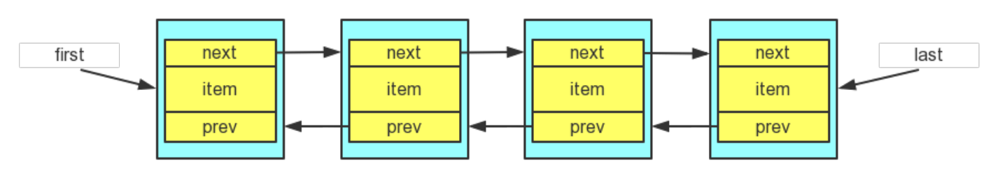
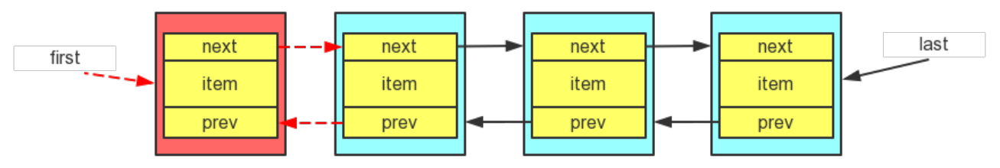
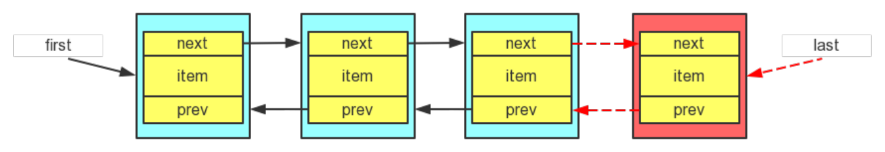
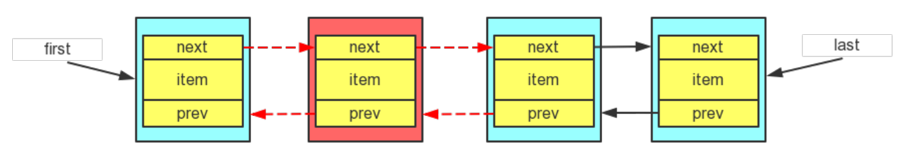
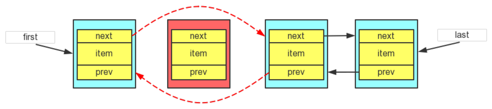

##  一.Java集合框架概述

集合、数组都是对多个数据进行存储操作的结构，简称Java容器。此时的存储，主要指的是内存层面的存储，不涉及到持久化的存储（.txt, .jpg, .avi，数据库中）。Java 集合就像一种容器，可以动态地把多个对象的引用放入容器中。

**1.数组在内存存储方面的特点：**

- 数组初始化以后，长度就确定了
- 数组声明的类型，就决定了进行元素初始化时的类型

**2.数组在存储数据方面的弊端：**

- 数组初始化以后，长度就不可变了，不便于扩展
- 数组中提供的属性和方法少，不便于进行添加、删除、插入等操作，且效率不高。同时无法直接获取数组中实际元素的个数


- 数组存储的数据是有序的、可以重复的。对于无序、不可重复的需求，不能满足。

**3.Java集合分为Collection和Map两种关系：**

- **Collection接口**：单列集合，用来存储一个一个的对象
  - List：存储有序的、可重复的数据。  --> “动态”数组
    - `ArrayList、LinkedList、Vector`
  - Set：存储无序的、不可重复的数据   --> 高中讲的“集合”
    - `HashSet、LinkedHashSet、TreeSet`
- **Map接口**：双列集合，用来存储一对(key - value)一对的数据   --> 高中函数：y = f(x)
  - `HashMap、LinkedHashMap、TreeMap、Hashtable、Properties`

## 二.Collection接口

Collection 接口是 List、Set 和 Queue 接口的父接口，该接口里定义的方法。既可用于操作 Set 集合，也可用于操作 List 和 Queue 集合。

### 1.常用的API


### 2.抽象方法

删除、包含相关方法底层都是调用元素类型对象**重写的equals方法(比较内容)**来判断集合中是否有要删除或包含的元素。向集合中添加obj数据时，要求obj所在类要重写equals()。

- 增：
  - `boolean add(Object o)`：**添加元素到集合**
  - `boolean addAll(Collection c)`：将指定集合中的所有元素添加到此集合
- 删：
  - `boolean remove(Object o)`：**删除找到的第一个元素(equals)**
  - `boolean removeAll(Collection c)`：从当前集合中删除公共元素(equals)(差集)
  - `boolean retainAll(Collection c)`：从当前集合中删除非公共元素(equals)(交集)
  - `void clear()`：删除所有元素
- 查：
  - `iterator()`：**返回迭代器对象，用于遍历**
  - `for(集合元素的类型 局部变量 : 集合对象)`：**增强for循环，用于遍历**
  - `int size()`：**查询有效元素个数**
  - `hashCode()`：**查询当前对象的哈希值**
- 判断：
  - `boolean contains(Object o)`：**是否包含某个元素(equals)**
  - `boolean containsAll(Collection c)`：是否包含某个集合的所有元素(equals)
  - `boolean isEmpty()`：**判断集合size==0** 
  - `boolean equals(Object o)`：**集合是否相等(比较集合是否相等：元素及顺序)**
- 转换：
  - `Object[] toArray()`：**集合 --> 数组**
  - `T[] toArray(T[] a) ` : **集合 --> 数组**
  - `(Arrays)public static List<T> asList(T... a)`：**数组 --> 集合**

### 3.注意

**获取长度的区分:**

-   java 中的**length属性**是针对数组说的,比如说你声明了一个数组,想知道这个数组的长度则用到了 length 这个属性.
-   java 中的**length()方法**是针对字符串String说的,如果想看这个字符串的长度则用到 length()这个方法.
-   java 中的**size()方法**是针对泛型集合说的,如果想看这个泛型有多少个元素,就调用此方法来查看!

**向Collection接口的实现类的对象中添加obj数据时，要求obj所在类要重写equals():**

- 在判断时会调用obj对象所在类的equals()方法：equals方法默认比较地址，需要重写来比较内容。String、File、Date、包装类默认重写了equals方法
- equals(Object obj)：要想返回true，需要当前集合和形参集合的元素都相同(包括元素的顺序)
- 调用Arrays类的静态方法asList()：基本数据类型数组会被当做一个对象，需要使用包装类对象数组当形参

```java
Collection coll = new ArrayList();
coll.add(123);
coll.add(new Person("Jerry",20));
coll.add(new String("Tom"));
coll.add(false);

// 在判断时会调用obj对象所在类的equals()方法：equals方法默认比较地址，需要重写来比较内容
// 1.contains(Object obj):判断当前集合中是否包含obj
boolean contains = coll.contains(123);
System.out.println(contains);	// true
// String、File、Date、包装类重写了equals方法
System.out.println(coll.contains(new String("Tom")));	// true
// Person没有重写equals方法时：false；重写了equals方法：true
System.out.println(coll.contains(new Person("Jerry",20)));

// coll2集合中：元素内容与coll集合相同，但顺序不同
Collection coll2 = new ArrayList();
coll2.add(new Person("Jerry",20));
coll2.add(new String("Tom"));
coll2.add(123);
coll2.add(false);
// 2.equals(Object obj):要想返回true，需要当前集合和形参集合的元素都相同(包括元素的顺序)。
System.out.println(coll.equals(coll1));  // false

// 3.集合 --> 数组：toArray()
Object[] arr = coll.toArray();
for(int i = 0;i < arr.length;i++){
    System.out.println(arr[i]);
}
// 若集合中都是相同类型的元素,若都为Integer类型
// 第一种方式(最常用)
Integer[] integer = arrayList.toArray(new Integer[0]);
// 第二种方式(容易理解)
Integer[] integer1 = new Integer[arrayList.size()];
arrayList.toArray(integer1);
// 抛出异常，java不支持向下转型,讲Object数组转为Integer数组
//Integer[] integer2 = new Integer[arrayList.size()];
//integer2 = arrayList.toArray();
System.out.println();

// 4.数组 --> 集合:调用Arrays类的静态方法asList()
List<String> list = Arrays.asList(new String[]{"AA", "BB", "CC"});
System.out.println(list);	// [AA, BB, CC]
// 当是int[]时，会当成一个int数组对象
List arr1 = Arrays.asList(new int[]{123, 456});
System.out.println(arr1.size());	// 1
// 包装类数组时，会当成多个元素
List arr2 = Arrays.asList(new Integer[]{123, 456});
System.out.println(arr2.size());	// 2
```

Person类：重写equals()方法

```java
// Person对象重写equals方法
public class Person {
    String name;
    int age;

    public Person(String name, int age) {
        this.name = name;
        this.age = age;
    }

    @Override
    public String toString() {
        return "Person{" +
                "name='" + name + '\'' +
                ", age=" + age +
                '}';
    }

    @Override
    public boolean equals(Object o) {
        if (this == o) return true;
        if (o == null || getClass() != o.getClass()) return false;
        Person person = (Person) o;
        return age == person.age &&
                Objects.equals(name, person.name);
    }
}
```

## 三.集合遍历

### 1.Iterator接口

Iterator对象称为迭代器(设计模式的一种)，主要用于**遍历 Collection 集合中的元素**。

Collection接口继承了java.lang.Iterable接口，该接口有一个iterator()方法，那么所有实现了Collection接口的集合类都有一个**iterator()方法，用以返回一个实现了Iterator接口的对象**。

- 内部的方法：`hasNext()`：**判断是否还有下一个元素** 和  `next()`：**指针下移并将指向的元素返回**
- 集合对象每次调用iterator()方法都得到一个**全新的迭代器对象，默认游标都在集合的第一个元素之前**
- 内部定义了remove(),可以**在遍历的时候，删除集合中的元素**。此方法不同于集合直接调用remove()

示例：

```java
Collection coll = new ArrayList();
coll.add(123);
coll.add(new Person("Jerry",20));
coll.add(new String("Tom"));

Iterator iterator = coll.iterator();
//hasNext():判断是否还有下一个元素
while(iterator.hasNext()){
    //next():1.指针下移 2.将下移以后集合位置上的元素返回
    System.out.print(iterator.next()+" ");	//123 Person{name='Jerry', age=20} Tom
}

//错误方式：
//集合对象每次调用iterator()方法都得到一个全新的迭代器对象，默认游标都在集合的第一个元素之前。
while (coll.iterator().hasNext()){	// 死循环
    System.out.print(coll.iterator().next());	// 123 123 123 ...
}

//遍历过程中删除集合中"Tom"元素
Iterator iterator = coll.iterator();
while (iterator.hasNext()){
    //iterator.remove();	//指针没有下移就remove()会报IllegalStateException
    Object obj = iterator.next();
    if("Tom".equals(obj)){
        iterator.remove();
    }
}
//删除"Tom"之后再遍历集合
iterator = coll.iterator();
while (iterator.hasNext()){
    System.out.println(iterator.next());	//123 Person{name='Jerry', age=20}
}
```

### 2.增强for循环

遍历集合：`for(集合元素的类型 局部变量 : 集合对象)`

```java
Collection coll = new ArrayList();
coll.add(123);
coll.add(new Person("Jerry",20));
coll.add(new String("Tom"));
coll.add(false);

//for(集合元素的类型 局部变量 : 集合对象)
//内部仍然调用了迭代器。
for(Object obj : coll){
    System.out.println(obj);
}
```

遍历数组：`for(数组元素的类型 局部变量 : 数组对象)`

```java
int[] arr = new int[]{1,2,3,4,5,6};
//for(数组元素的类型 局部变量 : 数组对象)
for(int i : arr){
    System.out.println(i);
}
```

注意：数组赋值时不能使用增强for循环

```java
String[] arr = new String[]{"MM","MM","MM"};

//    //方式一：普通for赋值
//    for(int i = 0;i < arr.length;i++){
//        arr[i] = "GG";
//    }

//方式二：增强for循环
for(String s : arr){
    s = "GG";	// s是局部变量，存储在栈中，并不是原数组的引用
}

for(int i = 0;i < arr.length;i++){
    System.out.print(arr[i]+" ");	// MM MM MM
}
```

## 四.List接口

List集合类中 **元素有序、且可重复**，集合中的每个元素都有其对应的**顺序索引**。

JDK API中List接口的实现类常用的有：**ArrayList、LinkedList和 Vector**。

LIst除了从**Collection集合继承的方法**外,List集合里添加了一些**根据索引来操作集合元素的方法**.

插:

-   `void add(int index, Object ele)` :  在 index 位置插入ele 元素
-   `boolean addAll(int index, Collection eles)` :  从index 位置开始将eles 中的所有元素添加进来

删:

-   `Object remove(int index) ` : **移除指定index 位置的元素，并返回此元素**

改:

-   `Object set(int index, Object ele) ` : **设置指定index 位置的元素为ele**

查:

-   `Object get(int index) ` : **获取指定index 位置的元素**
-   `int indexOf(Object obj) `: 返回obj 在集合中首次出现的位置,如果不存在，返回-1.
-   `int lastIndexOf(Object obj) ` : 返回obj 在当前集合中末次出现的位置,如果不存在，返回-1.
-   `List subList(int fromIndex, int toIndex) ` : 返回从fromIndex 到toIndex位置的左闭右开区间的子集合

### 1.ArrayList

ArrayList 是 List 接口的**主要实现类**,本质上,ArrayList是对象引用的一个"变长"数组,容量能动态增长.

ArrayList 的JDK1.8 之前与之后的实现区别？

-   JDK1.7：ArrayList像饿汉式，直接创建一个**初始容量为10的数组**
-   JDK1.8：ArrayList像懒汉式，一开始创建一个长度为0的数组，当**添加第一个元素时**再创建一个始容量为10的数组

区分List中remove(int index)和remove(Object obj) ?

```java
List list = new ArrayList();
list.add(1);	// 自动装箱
list.add(2);
list.add(3);
updateList(list);
System.out.println(list);	// [1, 3]
// 判断list是否包含3,contains没有索引的形参
System.out.println(list.contains(3));	// true

private void updateList(List list) {
  // list.remove(2);	// 2代表索引,先根据索引
  list.remove(new Integer(2));	// 2代表对象
}
```

更多内容详看 : 源码学习 -- > ArrayList

### 2.LinkedList

**双向链表**，**内部没有声明数组**，而是**定义了Node类型的first和last，用于记录首末元素。定义内部类Node，作为LinkedList中保存数据的基本结构。**

Node除了保存数据，还定义了两个变量：**prev变量记录前一个元素的位置; next变量记录下一个元素的位置.**


```java
	// 双向链表
    private static class Node<E> {    // 内部类：只有当前类需要使用，外面类不需要使用时
        E item;        // 泛型，obj对象数据
        Node<E> next;    // 下一个元素节点地址：指向下一个元素的指针
        Node<E> prev;    // 上一个元素节点地址：指向上一个元素的指针

        // 元素节点分为三部分：上节点地址，obj对象数据，下节点地址
        Node(Node<E> prev, E element, Node<E> next) {
            this.item = element;
            this.next = next;
            this.prev = prev;
        }
    }
```

对于 **频繁的插入或删除元素**的操作，建议使用LinkedList类，效率较高.

新增方法:

-    `void addFirst(Object obj)` 
-    ` void addLast(Object obj)` 
-    `Object getFirst()` 
-    `Object getLast()` 
-    `Object removeFirst()` 
-    `Object removeLast()` 

更多内容详看 : 源码学习 -- > LinkedList

### 3.Vector

Vector 是一个古老的集合，JDK1.0就有了。大多数操作与ArrayList相同，区别之处在于Vector是线程安全的.

在各种list中，最好把**ArrayList作为默认选择。当插入、删除频繁时，使用LinkedList**；Vector总是比ArrayList慢，所以尽量避免使用。

更多内容详看 : 源码学习 --> ArrayList --> Vector

### 4.三者联系与区别

联系:<div style="color:red;">

-   都实现了List接口, 存储有序的、可重复的数据
-   add自定义类时,该类需要重写equals方法(contains,remove等方法以equals为标准判断的)</div>

区别:<div style="color:red;">

-   ArrayList: 底层使用**动态数组结构**; **线程不安全**,效率高; 默认创建**空列表**,添加第一个元素时,分配10个大小的空间,每次扩容为原来的**1.5倍**;对于**随机访问**get和set操作效率高于LinkedList
-   LinkedList: 底层使用**双向链表结构**; **线程不安全**; 对于频繁的**插入, 删除**操作效率比ArrayList高
-   Vector: 底层使用**动态数组结构**; **线程安全**,效率低; 默认创建**10个大小**的数组,每次扩容为原来的**2倍**</div>

## 五.Set接口

Set接口是Collection的子接口，set接口没有提供额外的方法，使用的都是Collection中声明过的方法。存储**无序的、不可重复**的数据，类似于高中数学中的"集合"。

以HashSet为例：

- **无序性**：不等于随机性。存储的数据在底层数组中并非按照数组索引的顺序添加，而是根据数据的哈希值决定的
- **不可重复性**：保证添加的元素按照equals()判断时，不能返回true.即：相同的元素只能添加一个

向Set(主要指：HashSet、LinkedHashSet)中添加的数据，其所在的类一定要**重写hashCode()和equals()**，重写的hashCode()和equals()尽可能保持一致性：**相等的对象必须具有相等的散列码**。 Set 判断两个对象是否相同不是使用 == 运算符，而是根据 **equals() 方法**。

HashSet和TreeSet是Set接口的实现类，LinkedHashSet是HashSet的子类。

- HashSet：作为Set接口的**主要实现类；线程不安全的；可以存储null值**
- LinkedHashSet：作为HashSet的子类；遍历其内部数据时，可以**按照添加的顺序遍历**；对于频繁的**遍历操作**，LinkedHashSet效率高于HashSet
- TreeSet：可以按照添加**对象的指定属性，进行排序**

### 1.HashSet

#### 1.1 概述

HashSet 是 Set接口的主要实现，**HashSet 按Hash算法来存储集合中的元素**，因此具有很好的存取、查找、删除性能。底层是 **数组+链表结构**。数组**初始容量为16**，当如果使用率超过0.75，（16 * 0.75=12）就会扩大容量为**原来的2倍**。（16扩容为32，依次为64,128....等）。

特点：不能保证元素的排列顺序、不是线程安全的、集合元素可以是null。

判断两个元素相等的标准：两个对象通过 **hashCode() 方法比较相等**，并且两个对象的 **equals() 方法**返回值也相等。

对于**存放在Set容器中的对象**， 对应的**类一定要重写equals() 和hashCode(Object obj) 方法，以实现对象相等规则** 。即： “**相等的对象必须具有相等的散列码**” 。

#### 1.2 添加元素过程


**向HashSet中添加元素的过程(重要)：**<div style="color:red;">

首先调用元素a所在类的hashCode()方法，计算元素a的哈希值，此哈希值接着通过某种算法计算出在HashSet**底层数组中的存放位置**（即为：索引位置），判断**数组此位置**上是否已经有元素：

- 如果此位置上没有其他元素，则元素a添加成功；
- 如果此位置上有其他元素b(或以链表形式存在的多个元素），则比较元素a与元素b的**hash值**：
  - 如果hash值不相同，则元素a添加成功；
  - 如果hash值相同，进而需要调用元素a所在类的**equals()方法**：
    - equals()返回true,元素a添加失败；
    - equals()返回false,则元素a添加成功。</div>

元素a 与已经存在指定索引位置上数据以**链表的方式存储**。可以用"七上八下"来形容。

- JDK7：元素a放到数组中，指向原来的元素
- JDK8：原来的元素在数组中，指向元素a

如果两个元素的 equals() 方法返回 true，但它们的 hashCode() 返回值不相等，hashSet 将会把它们存储在不同的位置，但依然可以添加成功。

示例：

```java
//其中Person 类中重写了hashCode() 和equal() 方法
HashSet set = new HashSet();
Person p1 = new Person(1001,"AA");
Person p2 = new Person(1002,"BB");

set.add(p1);
set.add(p2);
// [Person{id=1002, name='BB'}, Person{id=1001, name='AA'}]
System.out.println(set);

p1.name = "CC";
set.remove(p1);	// 由于p1的name变化导致hash值变化了，去查找对应的存储位置是null的
// [Person{id=1002, name='BB'}, Person{id=1001, name='CC'}]
System.out.println(set);    

set.add(new Person(1001,"CC"));	// p1原先的hash值是由"AA"算出来的
// [Person{id=1002, name='BB'}, Person{id=1001, name='CC'}, 
// Person{id=1001, name='CC'}]
System.out.println(set);

set.add(new Person(1001,"AA")); // hash值与p1相同，但equals时是false的
// [Person{id=1002, name='BB'}, Person{id=1001, name='CC'}, 
// Person{id=1001, name='CC'}, Person{id=1001, name='AA'}]
System.out.println(set);
```

图示：


#### 1.3 重写方法原则

一般用idea自动生成的重写方法hashCode和equals方法就可以了，复写的hashCode方法有31这个数字。

重写hashCode方法：

- 同一个对象多次调用 hashCode() 方法应该返回相同的值
- 当两个对象的 equals() 方法比较返回 true 时，这两个对象的 hashCode()方法的返回值也应相等
- 对象中用作 equals() 方法比较的 Field，都应该用来计算 hashCode 值

重写equals方法：

- 当改写equals方法时，总要改写hashCode方法；
- 相等的对象必须具有相等的散列码
- 参与计算hashCode 的对象的属性也应该参与到equals() 中进行计算

#### 1.4 示例

```java
Set set = new HashSet();
set.add(456);
set.add(123);
set.add(123);
set.add("AA");
set.add("CC");
set.add(new User("Tom",12));
set.add(new User("Tom",12));
set.add(129);

// 若不重写hashCode方法，则用父类Object的hashCode方法，hash值是随机生成的
// 先判断hash值，hash值不同，两个user对象都会添加到集合中
Iterator iterator = set.iterator();
while(iterator.hasNext()){
    // AA	CC	129	456	123	User{name='Tom', age=12}
    System.out.print(iterator.next()+"\t");
}
```

Person类：

```java
public class User implements Comparable{
    private String name;
    private int age;

    public User() {
    }
    public User(String name, int age) {
        this.name = name;
        this.age = age;
    }

    @Override
    public boolean equals(Object o) {
        System.out.println("User equals()....");
        if (this == o) return true;
        if (o == null || getClass() != o.getClass()) return false;

        User user = (User) o;

        if (age != user.age) return false;
        return name != null ? name.equals(user.name) : user.name == null;
    }
    @Override
    public int hashCode() { //return name.hashCode() + age;
        int result = name != null ? name.hashCode() : 0;
        result = 31 * result + age;
        return result;
    }

    //按照姓名从大到小排列,年龄从小到大排列
    @Override
    public int compareTo(Object o) {
        if(o instanceof User){
            User user = (User)o;
//            return -this.name.compareTo(user.name);
            int compare = -this.name.compareTo(user.name);
            if(compare != 0){
                return compare;
            }else{
                return Integer.compare(this.age,user.age);
            }
        }else{
            throw new RuntimeException("输入的类型不匹配");
        }

    }
}
```

使用HashSet去除List重复数字值：

```java
public List duplicateList(List list) {
    HashSet set = new HashSet();
    set.addAll(list);
    return new ArrayList(set);
}
```

### 2.LinkedHashSet

LinkedHashSet 是 HashSet 的子类。根据**元素的 hashCode 值来决定元素的存储位置**，在添加数据的同时，每个数据还维护了**两个引用，记录此数据前一个数据和后一个数据**。对于**频繁的遍历操作，效率高于HashSet**。

底层结构：


示例：

```java
Set set = new LinkedHashSet();
set.add(456);
set.add(123);
set.add(123);
set.add("AA");
set.add("CC");
set.add(new User("Tom",12));
set.add(new User("Tom",12));
set.add(129);

// 打印输出看似有序，是由于每个数据还维护了两个引用
// 存储位置是由hash值决定的
Iterator iterator = set.iterator();
while(iterator.hasNext()){
    //456	123	AA	CC	User{name='Tom', age=12}	129	
    System.out.print(iterator.next()+"\t");
}
```

### 3.TreeSet

TreeSet 是 SortedSet 接口的实现类，TreeSet 可以确保**集合元素处于排序状态**。TreeSet底层使用 **红黑树结构**存储数据。有序，查询速度比List快。向TreeSet中**添加的数据**，要求是**相同类的对象**。

结构：


TreeSet 两种排序方法： 自然排序和 定制排序。默认情况下，TreeSet 采用自然排序。

- 自然排序中，比较两个对象是否相同的标准为：compareTo()返回0.不再是equals().
- 定制排序中，比较两个对象是否相同的标准为：compare()返回0.不再是equals().

#### 3.1 自然排序

 TreeSet 会调用集合元素的 compareTo(Object obj) 方法来比较元素之间的大小关系，然后将集合元素按升序(默认情况)排列。

如果试图把一个对象添加到 TreeSet 时，则该对象的类必须**实现 Comparable接口**。实现 Comparable 的类必须实现 compareTo(Object obj) 方法，两个对象即通过compareTo(Object obj) 方法的返回值来比较大小。

示例：

```java
TreeSet set = new TreeSet();

set.add(new User("Tom",12));
set.add(new User("Jerry",32));
set.add(new User("Jim",2));
set.add(new User("Mike",65));
set.add(new User("Jack",33));
set.add(new User("Jack",56));

Iterator iterator = set.iterator();
while(iterator.hasNext()){
    System.out.println(iterator.next());
}
//        User{name='Tom', age=12}
//        User{name='Mike', age=65}
//        User{name='Jim', age=2}
//        User{name='Jerry', age=32}
//        User{name='Jack', age=33}
//        User{name='Jack', age=56}

// User类
public class User implements Comparable {
    //按照姓名从大到小排列,年龄从小到大排列
    @Override
    public int compareTo(User u) {
        int compare = -this.name.compareTo(u.name);
        if(compare != 0){
            return compare;
        }else {
            return Integer.compare(this.age,u.age);
        }
    }
}
```

#### 3.2 定制排序

定制排序，通过**Comparator接口**来实现。需要重写compare(T o1,T o2)方法。将实现Comparator接口的实例作为**形参传递给TreeSet的构造器**。向TreeSet中只能添加**类型相同**的对象。否则发生ClassCastException异常。

示例：

```java
Comparator com = new Comparator() {
    //按照年龄从小到大排列
    @Override
    public int compare(User u1, User u2) {
        return Integer.compare(u1.getAge(),u2.getAge());
    }
};

TreeSet set = new TreeSet(com);
set.add(new User("Tom",12));
set.add(new User("Jerry",32));
set.add(new User("Jim",2));
set.add(new User("Mike",65));
set.add(new User("Mary",33));
set.add(new User("Jack",33));
set.add(new User("Jack",56));

Iterator iterator = set.iterator();
while(iterator.hasNext()){
    System.out.println(iterator.next());
}
```

## 六.Map接口


## 七.Collections工具类


## 八.源码学习

### 1.ArrayList

ArrayList 底层是数组队列,相当于**动态数组**.与 Java 中的数组相比,它的容量能动态增长.线性表的顺序存储,插入删除元素的时间复杂度为**O（n）**,求表长以及增加元素,取第 i 元素的时间复杂度为**O（1）** .

它继承于 **AbstractList**，实现了 **List**, **RandomAccess**, **Cloneable**, **java.io.Serializable** 这些接口。

-   ArrayList 继承了AbstractList，实现了List。它是一个数组队列，提供了相关的添加、删除、修改、遍历等功能。
-   ArrayList 实现了**RandomAccess 接口**， RandomAccess 是一个标志接口，表明实现这个这个接口的 List 集合是支持**快速随机访问**的。在 ArrayList 中，我们即可以通过元素的序号快速获取元素对象，这就是快速随机访问。
-   ArrayList 实现了**Cloneable 接口**，即覆盖了函数 clone()，**能被克隆**。
-   ArrayList 实现**java.io.Serializable 接口**，这意味着ArrayList**支持序列化**，**能通过序列化去传输**。
-   和 Vector 不同，**ArrayList 中的操作不是线程安全的**！所以，建议在单线程中才使用 ArrayList，而在多线程中可以选择 Collections中的静态方法 `List<T> synchronizedList(List<T> list)` 将其转为线程安全的。

#### 1.1 JDK7

ArrayList是List接口的可变数组的实现。实现了所有可选列表操作，并允许包括 null 在内的所有元素。除了实现 List 接口外，此类还提供一些方法来操作内部用来存储列表的数组的大小。

##### 1.1.1 核心源码

```java
public class ArrayList<E> extends AbstractList<E>
        implements List<E>, RandomAccess, Cloneable, java.io.Serializable {
		
	/**
	* 1.属性
	*/
	
	// 底层使用数组实现	
	private transient Object[] elementData;	// 声明对象数组变量

	/**
	* 2.构造方法
	*/

	// 构造一个默认初始容量为 10 的空列表
	public ArrayList() {
        this(10);
    }
	// 构造一个指定初始容量的空列表
	public ArrayList(int initialCapacity) {	// 10
        super();
        if (initialCapacity < 0)
            throw new IllegalArgumentException("Illegal Capacity: "+
                                               initialCapacity);
        this.elementData = new Object[initialCapacity];	// 分配空间10
    }
    // 构造一个包含指定 collection 的元素的列表
    // 这些元素按照该 collection 的迭代器返回它们的顺序排列的
    public ArrayList(Collection<? extends E> c) {
        elementData = c.toArray();
        size = elementData.length;
        // c.toArray might (incorrectly) not return Object[] (see 6260652)
        if (elementData.getClass() != Object[].class)
            elementData = Arrays.copyOf(elementData, size, Object[].class);
    }
    
    /**
    * 3.存储
    */
    
    // 用指定的元素替代此列表中指定位置上的元素，并返回以前位于该位置上的元素。
    public E set(int index, E element) {
    	RangeCheck(index);

    	E oldValue = (E) elementData[index];
    	elementData[index] = element;
    	return oldValue;
    }
    // 将指定的元素添加到此列表的尾部。
    public boolean add(E e) {
        ensureCapacityInternal(size + 1);  // Increments modCount!!
        elementData[size++] = e;
        return true;
    }
	// 将指定的元素插入此列表中的指定位置。
	// 如果当前位置有元素，则向右移动当前位于该位置的元素以及所有后续元素（将其索引加 1）。
    public void add(int index, E element) {
        rangeCheckForAdd(index);
		// 如果数组长度不足，将进行扩容
        ensureCapacityInternal(size + 1);  // Increments modCount!!
         // 将 elementData 中从 Index 位置开始、长度为 size-index 的元素，
		// 拷贝到从下标为 index+1 位置开始的新的 elementData 数组中。
		// 即将当前位于该位置的元素以及所有后续元素右移一个位置。
        System.arraycopy(elementData, index, elementData, index + 1,
                         size - index);
        elementData[index] = element;
        size++;
    }
    // 从指定的位置开始，将指定 collection 中的所有元素插入到此列表中。
    public boolean addAll(int index, Collection<? extends E> c) {
        rangeCheckForAdd(index);

        Object[] a = c.toArray();
        int numNew = a.length;
        ensureCapacityInternal(size + numNew);  // Increments modCount

        int numMoved = size - index;
        if (numMoved > 0)
            System.arraycopy(elementData, index, elementData, index + numNew,
                             numMoved);

        System.arraycopy(a, 0, elementData, index, numNew);
        size += numNew;
        return numNew != 0;
    }
    
    /**
    * 4.读取
    */
    
    // 返回此列表中指定位置上的元素。
    public E get(int index) {
        rangeCheck(index);

        return elementData(index);
    }
    
    /**
    * 5.删除
    * ArrayList 提供了根据下标或者指定对象两种方式的删除功能
    */
	
	// 移除此列表中指定位置上的元素。
	public E remove(int index) {
        rangeCheck(index);
		// 快速失败的机制，通过记录 modCount 参数来实现
        modCount++;	
        E oldValue = elementData(index);

        int numMoved = size - index - 1;
        if (numMoved > 0)
            System.arraycopy(elementData, index+1, elementData, index,
                             numMoved);
        elementData[--size] = null; // Let gc do its work

        return oldValue;
    }
    // 移除此列表中首次出现的指定元素（如果存在）。这是应为ArrayList中允许存放重复的元素。
    public boolean remove(Object o) {
    	// 由于 ArrayList 中允许存放 null，因此下面通过两种情况来分别处理。
        if (o == null) {
            for (int index = 0; index < size; index++)
                if (elementData[index] == null) {
                	// 类似 remove(int index)，移除列表中指定位置上的元素。
                    fastRemove(index);	
                    return true;
                }
        } else {
            for (int index = 0; index < size; index++)
                if (o.equals(elementData[index])) {
                    fastRemove(index);
                    return true;
                }
        }
        return false;
    }
	
}
```

##### 1.1.2 底层扩容

```java
	// 添加元素举例
	public boolean add(E e) {
        ensureCapacityInternal(size + 1);  // 有效长度+1
        elementData[size++] = e;
        return true;
    }
	private void ensureCapacityInternal(int minCapacity) {	// 确认实际容量
        modCount++;
        // overflow-conscious code
        if (minCapacity - elementData.length > 0)	// 当实际容量大于10时，进行扩容
            grow(minCapacity);
    }
	
	private static final int MAX_ARRAY_SIZE = Integer.MAX_VALUE - 8;
	
	private void grow(int minCapacity) {	// 11
        // overflow-conscious code
        int oldCapacity = elementData.length;	// 10
        int newCapacity = oldCapacity + (oldCapacity >> 1);	// 10 + 10/2 相当于原先默认的1.5倍
        if (newCapacity - minCapacity < 0)	// 若扩容后比实际容量还小
            newCapacity = minCapacity;	// 赋值为实际容量
        if (newCapacity - MAX_ARRAY_SIZE > 0)	// 若扩容后比(Integer.MAX_VALUE-8)还大
            newCapacity = hugeCapacity(minCapacity);	// 赋值为Integer.MAX_VALUE
        // minCapacity is usually close to size, so this is a win:
        elementData = Arrays.copyOf(elementData, newCapacity);	// 赋值为新的数组，数组长度为扩容后的长度
    }
	
	private static int hugeCapacity(int minCapacity) {
        if (minCapacity < 0) // overflow
            throw new OutOfMemoryError();
        return (minCapacity > MAX_ARRAY_SIZE) ?
            Integer.MAX_VALUE :
            MAX_ARRAY_SIZE;
    }
```

数组扩容通过一个公开的方法 `ensureCapacity(int minCapacity)` 来实现。**会将老数组中的元素重新拷贝一份到新的 数组中，每次数组容量的增长大约是其原容量的 1.5 倍**。在实际中我们可以在**构造 ArrayList 实例**时，就指定其容量，以避免数组扩容的发生。或者根据实际需求，通过**调用 ensureCapacity 方法来手动增加 ArrayList 实例的容量**, 以减少递增式再分配的数量。

ArrayList 还给我们提供了**将底层数组的容量调整为当前列表保存的实际元素的大小的功能**。它可以通过trimToSize 方法来实现。

```java
	public void trimToSize() {
        modCount++;
        int oldCapacity = elementData.length;
        if (size < oldCapacity) {
            elementData = Arrays.copyOf(elementData, size);
        }
    }
```

#### 1.2 JDK8

 ArrayList 是一个动态数组，实现了 List 接口以及 list 相关的所有方法，它允许所有元素的插入，包括 null。另外，ArrayList 和 Vector 除了线程不同步之外，大致相等。

JDK8 : **默认构造空实例，大小是 0；只有在使用到时，才会通过grow方法创建一个大小为 10 的数组**

JDK7 : **默认构造初始容量为 10 的空列表**

在扩容上代码优点区别,但原理都是相同的,都是**原容量的1.5倍.**

##### 1.2.1 核心源码

```java
// @since   1.2
public class ArrayList<E> extends AbstractList<E>
        implements List<E>, RandomAccess, Cloneable, java.io.Serializable {
    
    /**
    * 1.属性
    * ArrayList所有的方法都是建立在 elementData 属性之上。
    */
    
	// 默认容量的大小
    private static final int DEFAULT_CAPACITY = 10;
    // 空数组常量：用于空实例
    private static final Object[] EMPTY_ELEMENTDATA = {};
    // 默认的空数组常量：用于默认大小空实例的共享空数组实例。
    // 把它从EMPTY_ELEMENTDATA数组中区分出来，以知道在添加第一个元素时容量需要增加多少。
    private static final Object[] DEFAULTCAPACITY_EMPTY_ELEMENTDATA = {};
    // 存放元素的数组，从这可以发现 ArrayList 的底层实现就是一个 Object数组
    transient Object[] elementData;
    // 数组中包含的元素个数
    private int size;
    // 数组的最大上限
    private static final int MAX_ARRAY_SIZE = Integer.MAX_VALUE - 8;


	/**
	* 2.构造方法
	* 默认情况下，elementData 是一个大小为 0 的空数组；
	* 当我们指定了初始大小的时候 elementData 的初始大小就变成了我们所指定的初始大小了
	*/
   
	// 实例化：按照指定大小分配空间
	public ArrayList(int initialCapacity) {
        if (initialCapacity > 0) {
            this.elementData = new Object[initialCapacity];	// 分配指定长度的数组空间
        } else if (initialCapacity == 0) {
            this.elementData = EMPTY_ELEMENTDATA;	// 空实例
        } else {
            throw new IllegalArgumentException("Illegal Capacity: "+
                                               initialCapacity);
        }
    }
	// 实例化：空实例，大小是 0；只有在使用到时，才会通过grow方法创建一个大小为 10 的数组
	public ArrayList() {
        this.elementData = DEFAULTCAPACITY_EMPTY_ELEMENTDATA;	// 空数组实例
    }
    // 形参为Collection实现类对象：可将set对象转为list对象
    public ArrayList(Collection<? extends E> c) {
        elementData = c.toArray();
        if ((size = elementData.length) != 0) {
            // c.toArray might (incorrectly) not return Object[] (see 6260652)
            if (elementData.getClass() != Object[].class)
                elementData = Arrays.copyOf(elementData, size, Object[].class);
        } else {
            // replace with empty array.
            this.elementData = EMPTY_ELEMENTDATA;
        }
    }
   
   
   /**
   * 3.get(int index)方法
   * 根据索引获取ArrayList中的元素
   */
   
   // 根据索引获取集合中元素
   public E get(int index) {
        rangeCheck(index);

        return elementData(index);
    }
    // 判断索引是否越界
    private void rangeCheck(int index) {
        if (index >= size)
            throw new IndexOutOfBoundsException(outOfBoundsMsg(index));
    }
    // 直接通过数组下表获取元素
    @SuppressWarnings("unchecked")
    E elementData(int index) {
        return (E) elementData[index];
    }
   

	/**
    * 4.add方法
    * 在插入元素之前，先检查是否需要扩容，后把元素添加到数组中最后一个元素的后面
    */
	
	// 在数组末尾添加元素,复杂度为O(1)
	public boolean add(E e) {
        ensureCapacityInternal(size + 1);
        elementData[size++] = e;
        return true;
    }
    // 在索引为index处插入元素,复杂度为O(n)
    public void add(int index, E element) {
        rangeCheckForAdd(index);	// 判断索引是否越界或是否小于0

        ensureCapacityInternal(size + 1);
        // 调用一个 native 的复制方法，把 index 位置开始的元素都往后挪一位
        System.arraycopy(elementData, index, elementData, index + 1,
                         size - index);
        elementData[index] = element;
        size++;
    }
	// 确认是否是空数组
	private void ensureCapacityInternal(int minCapacity) {
		// 当 elementData 为空数组时，它会使用默认的大小(10)去扩容
        if (elementData == DEFAULTCAPACITY_EMPTY_ELEMENTDATA) {
            minCapacity = Math.max(DEFAULT_CAPACITY, minCapacity);
        }

        ensureExplicitCapacity(minCapacity);
    }
	// 确认是否需要扩容
	private void ensureExplicitCapacity(int minCapacity) {
		// 快速失败的机制，通过记录 modCount 参数来实现
        modCount++;

        // 实际容量比默认长度大时，进行扩容
        if (minCapacity - elementData.length > 0)
            grow(minCapacity);
    }
    // ArrayList 每次扩容都是扩 1.5 倍
    // 然后调用 Arrays 类的 copyOf 方法，把元素重新拷贝到一个新的数组中去
    private void grow(int minCapacity) {
        // overflow-conscious code
        int oldCapacity = elementData.length;
        int newCapacity = oldCapacity + (oldCapacity >> 1);
        if (newCapacity - minCapacity < 0)
            newCapacity = minCapacity;
        if (newCapacity - MAX_ARRAY_SIZE > 0)
            newCapacity = hugeCapacity(minCapacity);
        // 初始化，赋值为新的数组，长度为10
        elementData = Arrays.copyOf(elementData, newCapacity);
    }
    // 比较minCapacity和 MAX_ARRAY_SIZE
    private static int hugeCapacity(int minCapacity) {
        if (minCapacity < 0) // overflow
            throw new OutOfMemoryError();
        return (minCapacity > MAX_ARRAY_SIZE) ?
            Integer.MAX_VALUE :
            MAX_ARRAY_SIZE;
    }


	/**
	* 5.set方法
	*/

	// 把下标为index的元素替换为element,复杂度为O(1)
	public E set(int index, E element) {
        rangeCheck(index);	// 判断索引是否越界

        E oldValue = elementData(index);
        elementData[index] = element;
        return oldValue;
    }
    
    
    /**
    * 6.remove方法
    */
    
    // 删除索引为index处的元素,复杂度为O(n)
    public E remove(int index) {
        rangeCheck(index);	// 判断索引是否越界

        modCount++;
        E oldValue = elementData(index);

        int numMoved = size - index - 1;
        if (numMoved > 0)	// 调用一个 native 的复制方法，把 index 位置开始的元素都往前挪一位
            System.arraycopy(elementData, index+1, elementData, index,
                             numMoved);
        elementData[--size] = null; // clear to let GC do its work

        return oldValue;
    }
    
    
    /**
    * 7.size方法
    */
    
    // 返回数组中元素的个数,时间复杂度为 O(1),返回的并不是数组的实际大小
    public int size() {
        return size;
    }
    
    
    /**
    * 8.indexOf方法和lastIndexOf方法
    */
    
    // 返回从前往后遍历查找第一个等于给定元素的值的下标,时间复杂度为O(n)
    public int indexOf(Object o) {
        if (o == null) {
            for (int i = 0; i < size; i++)
                if (elementData[i]==null)
                    return i;
        } else {	// 从前往后遍历
            for (int i = 0; i < size; i++)	// 通过遍历比较数组中每个元素的值来查找的
                if (o.equals(elementData[i]))
                    return i;
        }
        return -1;
    }
    // 返回从后往前遍历查找第一个等于给定元素的值的下标,时间复杂度为O(n)
    public int lastIndexOf(Object o) {
        if (o == null) {
            for (int i = size-1; i >= 0; i--)
                if (elementData[i]==null)
                    return i;
        } else {
            for (int i = size-1; i >= 0; i--)	// 从后往前遍历
                if (o.equals(elementData[i]))
                    return i;
        }
        return -1;
    }
    
    
    /**
     * 从列表中删除所有元素。 
     */
    public void clear() {
        modCount++;

        // 把数组中所有的元素的值设为null
        for (int i = 0; i < size; i++)
            elementData[i] = null;

        size = 0;
    }
    
    /**
     *以正确的顺序（从第一个到最后一个元素）返回一个包含此列表中所有元素的数组。 
     *返回的数组将是“安全的”，因为该列表不保留对它的引用。 （换句话说，这个方法必须分配一个新的数
     组）。
     *因此，调用者可以自由地修改返回的数组。 此方法充当基于阵列和基于集合的API之间的桥梁。
     */
    public Object[] toArray() {
        return Arrays.copyOf(elementData, size);
    }
    
    /**
     * 返回此ArrayList实例的浅拷贝。 （元素本身不被复制。） 
     */
    public Object clone() {
        try {
            ArrayList<?> v = (ArrayList<?>) super.clone();
            //Arrays.copyOf功能是实现数组的复制，返回复制后的数组。参数是被复制的数组和复制的长度
            v.elementData = Arrays.copyOf(elementData, size);
            v.modCount = 0;
            return v;
        } catch (CloneNotSupportedException e) {
            // 这不应该发生，因为我们是可以克隆的
            throw new InternalError(e);
        }
    }

}
```

##### 1.2.2 System.arraycopy()和Arrays.copyOf()

System.arraycopty():

```java
 	/**
     * 在此列表中的指定位置插入指定的元素。 
     *先调用 rangeCheckForAdd 对index进行界限检查；
     *然后调用 ensureCapacityInternal 方法保证capacity足够大；
     *再将从index开始之后的所有成员后移一个位置；将element插入index位置；最后size加1。
     */
    public void add(int index, E element) {
        rangeCheckForAdd(index);

        ensureCapacityInternal(size + 1);  // Increments modCount!!
        //arraycopy()方法实现数组自己复制自己
        //elementData:源数组;index:源数组中的起始位置;
        //elementData：目标数组；index + 1：目标数组中的起始位置； size - index：要复制的数组元素的数量
        System.arraycopy(elementData, index, elementData, index + 1, size - index);
        elementData[index] = element;
        size++;
    }

```

Arrays.copyOf():

```java
	/**
     *以正确的顺序（从第一个到最后一个元素）返回一个包含此列表中所有元素的数组。 
     *返回的数组将是“安全的”，因为该列表不保留对它的引用。（换句话说，这个方法必须分配一个新的数组）
     *因此，调用者可以自由地修改返回的数组。 此方法充当基于阵列和基于集合的API之间的桥梁。
     */
    public Object[] toArray() {
    //elementData：要复制的数组；size：要复制的长度
        return Arrays.copyOf(elementData, size);
    }
```

两个方法的源码:

```java
// Arrays类
public static <T,U> T[] copyOf(U[] original, int newLength, Class<? extends T[]> newType) {
  @SuppressWarnings("unchecked")
  T[] copy = ((Object)newType == (Object)Object[].class)	// 新建数组
    ? (T[]) new Object[newLength]
    : (T[]) Array.newInstance(newType.getComponentType(), newLength);
  System.arraycopy(original, 0, copy, 0,	// 拷贝
                   Math.min(original.length, newLength));
  return copy;
}

// System类
public static native void arraycopy(Object src,  int  srcPos,
                                        Object dest, int destPos,
                                        int length);
```

**联系：** 看两者源代码可以发现`copyOf()`内部调用了`System.arraycopy()`

**区别：**

-   arraycopy()需要目标数组，将原数组拷贝到你自己定义的数组里，而且可以选择拷贝的起点和长度以及放入新数组中的位置
-   copyOf()是系统自动在内部新建一个数组，并返回该数组。

##### 1.2.3 内部类

```java
	(1)private class Itr implements Iterator<E>  
    (2)private class ListItr extends Itr implements ListIterator<E>  
    (3)private class SubList extends AbstractList<E> implements RandomAccess  
    (4)static final class ArrayListSpliterator<E> implements Spliterator<E>  
```

ArrayList有四个内部类，

-   其中的**Itr是实现了Iterator接口**，同时重写了里面的**hasNext()**， **next()**， **remove()** 等方法；
-   其中的**ListItr** 继承 **Itr**，实现了**ListIterator接口**，同时重写了**hasPrevious()**， **nextIndex()**， **previousIndex()**， **previous()**， **set(E e)**， **add(E e)** 等方法;
-   **Iterator和ListIterator的区别:** ListIterator在Iterator的基础上增加了添加对象，修改对象，逆向遍历等方法，这些是Iterator不能实现的。

#### 1.3 Vector

Vector很多方法都跟 ArrayList 一样，只是多加了个 synchronized 来保证线程安全.部分源码:

```java
// @since   JDK1.0
public class Vector<E>
    extends AbstractList<E>
    implements List<E>, RandomAccess, Cloneable, java.io.Serializable{

	// 每次扩容只扩 capacityIncrement 个空间
	protected int capacityIncrement;
	
	//  Vector 的默认大小也是 10，而且它在初始化的时候就已经创建了数组了
	public Vector(int initialCapacity, int capacityIncrement) {
        super();
        if (initialCapacity < 0)
            throw new IllegalArgumentException("Illegal Capacity: "+
                                               initialCapacity);
        this.elementData = new Object[initialCapacity];
        this.capacityIncrement = capacityIncrement;
    }
    public Vector(int initialCapacity) {
        this(initialCapacity, 0);
    }
    public Vector() {
        this(10);
    }
    
    // newCapacity 默认情况下是两倍的 oldCapacity;
    // 当指定了 capacityIncrement 的值之后，newCapacity 变成了oldCapacity+capacityIncrement
    private void grow(int minCapacity) {
        // overflow-conscious code
        int oldCapacity = elementData.length;
        int newCapacity = oldCapacity + ((capacityIncrement > 0) ?
                                         capacityIncrement : oldCapacity);
        if (newCapacity - minCapacity < 0)
            newCapacity = minCapacity;
        if (newCapacity - MAX_ARRAY_SIZE > 0)
            newCapacity = hugeCapacity(minCapacity);
        elementData = Arrays.copyOf(elementData, newCapacity);
    }

}
```

#### 1.4 总结

JDK8 ArrayList 与 Vector 比较 :

-   ArrayList 创建时的大小为 0；当加入第一个元素时，进行第一次扩容时，默认容量大小为 10。
-   ArrayList 每次扩容都以当前数组大小的 1.5 倍去扩容。
-   Vector 创建时的默认大小为 10。
-   Vector 每次扩容都以当前数组大小的 2 倍去扩容。当指定了 capacityIncrement 之后，每次扩容仅在原先基础上增加 capacityIncrement 个单位空间。
-   ArrayList 和 Vector 的 add、get、size 方法的复杂度都为 O(1)，remove 方法的复杂度为 O(n)。
-   ArrayList 是非线程安全的，Vector 是线程安全的。

参考链接: [ArrayList 源码学习](https://snailclimb.gitee.io/javaguide/#/docs/java/collection/ArrayList)

### 2.LinkedList

LinkedList 是通过一个**双向链表**来实现的，它允许插入所有元素，包括 null，同时，它是**线程不同步**的。LinkedList底层的链表结构使它支持高效的**插入和删除操作**.如果想使LinkedList变成线程安全的，可以调用Collections中的静态方法 `List<T> synchronizedList(List<T> list)` 将其转为线程安全.

#### 2.1 内部结构



双向链表每个结点除了数据域之外，还有一个前指针和后指针，分别指向**前驱结点和后继结点**（如果有前驱/后继的话）。另外，双向链表还有一个 first 指针，指向头节点，和 last 指针，指向尾节点。

LinkedList类中的一个**内部私有类Node**:

```java
	// 双向链表节点: 每个节点的结构
	private static class Node<E> {	// 内部类：只有当前类需要使用，外面类不需要使用时
        E item;		// 泛型，obj对象数据
        Node<E> next;	// 后继节点;下一个元素节点地址：指向下一个元素的指针
        Node<E> prev;	// 前驱节点;上一个元素节点地址：指向上一个元素的指针

		// 元素节点分为三部分：前驱节点，本节点的值，后继结点
        Node(Node<E> prev, E element, Node<E> next) {
            this.item = element;
            this.next = next;
            this.prev = prev;
        }
    }
```

#### 2.2 属性和构造器

```java
// @since 1.2
public class LinkedList<E>
    extends AbstractSequentialList<E>
    implements List<E>, Deque<E>, Cloneable, java.io.Serializable{
    
    //链表的节点个数//指向头节点的指针
    transient int size = 0;
    //指向头节点的指针
    transient Node<E> first;
    //指向尾节点的指针
    transient Node<E> last;
    
    // 空构造方法
    public LinkedList() {
    }
    // 用已有的集合创建链表的构造方法
    public LinkedList(Collection<? extends E> c) {
        this();
        addAll(c);
    }
}
```

#### 2.3 添加节点

在表头或表尾进行插入元素只需要 O(1) 的时间，而在指定位置插入元素则需要先遍历一下链表，所以复杂度为 O(n)。

##### 2.3.1 表头添加元素



**addFirst(E e), push(E e), offerFirst(E e)**

```java
	public void addFirst(E e) {	// 在链表头部添加元素节点
        linkFirst(e);
    }
	public void push(E e) {	// 在链表头部添加元素节点
        addFirst(e);
    }
	public boolean offerFirst(E e) {
        addFirst(e);
        return true;
    }

	private void linkFirst(E e) {
        final Node<E> f = first;
        //当前节点的前驱指向 null，后继指针原来的头节点
        final Node<E> newNode = new Node<>(null, e, f);
        first = newNode;	//头指针指向新的头节点
        if (f == null)	//如果链表为空，last节点也指向该节点
            last = newNode;
        else	//否则，将头节点的前驱指针指向新节点，也就是指向前一个元素
            f.prev = newNode;
        size++;
        modCount++;
    }
```

##### 2.3.2 表尾添加元素



**add(E e), addLast(E e), offer(E e), offerLast(E e)**

```java
	public boolean add(E e) {	// 在链表结尾添加元素节点
        linkLast(e);
        return true;
    }	
	public void addLast(E e) {	// 在链表结尾添加元素节点
        linkLast(e);
    }
	public boolean offer(E e) {
        return add(e);
    }
	public boolean offerLast(E e) {
        addLast(e);
        return true;
    }

	void linkLast(E e) {	// 加为最后节点
        final Node<E> l = last;	// 声明临时节点用来存储last节点
        final Node<E> newNode = new Node<>(l, e, null);	// 新节点指向原先last节点
        last = newNode;		// 新节点作为最后一个节点
        if (l == null)
            first = newNode;
        else
            l.next = newNode;	// 原先last节点指向新节点(last节点)
        size++;
        modCount++;
    }
```

##### 2.3.3 指定位置添加元素



**add(int index, E element)**

```java
	public void add(int index, E element) {	//在指定位置添加元素节点
        checkPositionIndex(index);	//检查索引是否处于[0-size]之间

        if (index == size)	//添加在链表尾部
            linkLast(element);
        else	//添加在链表中间
            linkBefore(element, node(index));	//一个插入节点的值，一个指定的node
    }

	void linkBefore(E e, Node<E> succ) {
        // assert succ != null;
        final Node<E> pred = succ.prev;	//指定节点的前驱
        //当前节点的前驱为指点节点的前驱，后继为指定的节点
        final Node<E> newNode = new Node<>(pred, e, succ);
        //更新指定节点的前驱为当前节点
        succ.prev = newNode;
        //更新前驱节点的后继
        if (pred == null)
            first = newNode;
        else
            pred.next = newNode;
        size++;
        modCount++;
    }
```

#### 2.4 删除节点

##### 2.4.1 删除头节点

**remove()** ,**removeFirst(), pop()**

```java
	public E pop() {
        return removeFirst();
    }
	public E remove() {
        return removeFirst();
    }
	public E removeFirst() {
        final Node<E> f = first;
        if (f == null)
            throw new NoSuchElementException();
        return unlinkFirst(f);
    }

	//删除表头节点，返回表头元素的值
	private E unlinkFirst(Node<E> f) {
        // assert f == first && f != null;
        final E element = f.item;
        final Node<E> next = f.next;
        f.item = null;
        f.next = null; // help GC
        first = next;	//头指针指向后一个节点
        if (next == null)
            last = null;
        else
            next.prev = null;	//新头节点的前驱为 null
        size--;
        modCount++;
        return element;
    }
```

##### 2.4.2 删除尾节点

**removeLast(), pollLast()**

**区别**: removeLast()在链表为空时将抛出NoSuchElementException，而pollLast()方法返回null。

```java
	public E removeLast() {
        final Node<E> l = last;
        if (l == null)
            throw new NoSuchElementException();
        return unlinkLast(l);
    }
	public E pollLast() {
        final Node<E> l = last;
        return (l == null) ? null : unlinkLast(l);
    }

	//删除表尾节点，返回表尾元素的值
	private E unlinkLast(Node<E> l) {
        // assert l == last && l != null;
        final E element = l.item;
        final Node<E> prev = l.prev;
        l.item = null;
        l.prev = null; // help GC
        last = prev;	//尾指针指向前一个节点
        if (prev == null)
            first = null;
        else
            prev.next = null;	//新尾节点的后继为 null
        size--;
        modCount++;
        return element;
    }
```

##### 2.4.3 删除指定节点



**remove(Object o), remove(int index)**

```java
	public boolean remove(Object o) { 	// 删除指定元素:只会删除一个匹配的对象
        if (o == null) {	//如果删除对象为null 
            for (Node<E> x = first; x != null; x = x.next) {	//从头开始遍历 
                if (x.item == null) {	//找到元素  
                    unlink(x);	//从链表中移除找到的元素
                    return true;
                }
            }
        } else {
            for (Node<E> x = first; x != null; x = x.next) {//从头开始遍历
                if (o.equals(x.item)) { //找到元素  
                    unlink(x);//从链表中移除找到的元素
                    return true;
                }
            }
        }
        return false;
    }
	public E remove(int index) {	//删除指定位置的元素
        //检查index范围
        checkElementIndex(index);
        //将节点删除
        return unlink(node(index));
    }

	//删除指定节点，返回指定元素的值
	E unlink(Node<E> x) {
        // assert x != null;
        final E element = x.item;
        final Node<E> next = x.next;// 当前节点的后继
        final Node<E> prev = x.prev;// 当前节点的前驱
		//删除前驱指针
        if (prev == null) {
            first = next;	//如果删除的节点是头节点,令头节点指向该节点的后继节点
        } else {
            prev.next = next;	//更新前驱节点的后继为当前节点的后继
            x.prev = null;
        }
		//删除后继指针
        if (next == null) {
            last = prev;	//如果删除的节点是尾节点,令尾节点指向该节点的前驱节点
        } else {
            next.prev = prev;	//更新后继节点的前驱为当前节点的前驱
            x.next = null;
        }

        x.item = null;
        size--;
        modCount++;
        return element;
    }
```

#### 2.5 获取节点

##### 2.5.1 获取头节点(index=0)

**getFirst(), element(), peek(), peekFirst()**

**区别：** 在于对链表为空时的处理，是抛出异常还是返回null，其中**getFirst()** 和**element()** 方法将会在链表为空时，抛出NoSuchElementException异常

```java
	public E getFirst() {
        final Node<E> f = first;
        if (f == null)
            throw new NoSuchElementException();
        return f.item;
    }
	public E element() {
        return getFirst();
    }
	public E peek() {
        final Node<E> f = first;
        return (f == null) ? null : f.item;
    }
	public E peekFirst() {
        final Node<E> f = first;
        return (f == null) ? null : f.item;
     }
```

##### 2.5.2 获取尾节点(index=-1)

**getLast(), peekLast()**

**区别：** **getLast()** 方法在链表为空时，会抛出**NoSuchElementException**，而**peekLast()** 则不会.

```java
	public E getLast() {
        final Node<E> l = last;
        if (l == null)
            throw new NoSuchElementException();
        return l.item;
    }
 	public E peekLast() {
        final Node<E> l = last;
        return (l == null) ? null : l.item;
    }
```

##### 2.5.3 获取指定节点

**get(int index)**

```java
	public E get(int index) {
        //检查index范围是否在size之内
        checkElementIndex(index);
        //调用Node(index)去找到index对应的node然后返回它的值
        return node(index).item;
    }

	//获取指定下标的元素
	Node<E> node(int index) {	//查找index对应的node
        // assert isElementIndex(index);
      //根据下标是否超过链表长度的一半，来选择从头部开始遍历还是从尾部开始遍历
        if (index < (size >> 1)) {
            Node<E> x = first;
            for (int i = 0; i < index; i++)
                x = x.next;
            return x;
        } else {
            Node<E> x = last;
            for (int i = size - 1; i > index; i--)
                x = x.prev;
            return x;
        }
    }
```

#### 2.6 其它方法

**set(int index, E element), size(), contains(Object o), indexOf(Object o), lastIndexOf(Object o)**

```java
	public E set(int index, E element) {	//将此列表中指定位置的元素替换为指定的元素
        checkElementIndex(index);
        Node<E> x = node(index);
        E oldVal = x.item;
        x.item = element;
        return oldVal;
    }
	public int size() {	//返回此列表的元素个数
        return size;
    }
	public boolean contains(Object o) {	//检查对象o是否存在于链表中
        return indexOf(o) != -1;
    }
	public int indexOf(Object o) {	//从头遍历找该对象的索引
        int index = 0;
        if (o == null) {
            for (Node<E> x = first; x != null; x = x.next) {
                if (x.item == null)
                    return index;
                index++;
            }
        } else {
            for (Node<E> x = first; x != null; x = x.next) {
                if (o.equals(x.item))
                    return index;
                index++;
            }
        }
        return -1;
    }
	public int lastIndexOf(Object o) {	//从尾遍历找该对象的索引
        int index = size;
        if (o == null) {
            for (Node<E> x = last; x != null; x = x.prev) {
                index--;
                if (x.item == null)
                    return index;
            }
        } else {
            for (Node<E> x = last; x != null; x = x.prev) {
                index--;
                if (o.equals(x.item))
                    return index;
            }
        }
        return -1;
    }
```


参考链接: [LinkedList 源码学习](https://snailclimb.gitee.io/javaguide/#/docs/java/collection/LinkedList)
