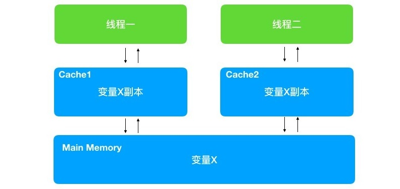

所有并发程序都需要保证线程的安全性，那么什么是线程的安全性呢？其实很难给出一个非常正式的定义。其实线程安全中的安全，是指程序的正确性。程序不但要在单线程的时候保证正确，在多线程并发的时候也要保证程序计算的正确性。

线程安全可以这样定义：**某个类，在多线程并发访问时，始终能够确保运行的正确性，那么这个类就是线程安全的**。

并发编程的三大特性，这是并发编程中所有问题的根源,只有深刻理解了这三大特性，才不会编写出漏洞百出的并发程序.

这三大特性:

- **原子性**: 所有操作要么全部成功，要么全部失败
- **可见性**: 一个线程对变量进行了修改，另外一个线程能够立刻读取到此变量的最新值
- **有序性**: 代码在执行阶段，并不一定和你的编写顺序一致

### 1.原子性

#### 1.1 什么是原子性

原子性也是事务的四大特性 ACID 之一,并且位居首位.那么到底什么是原子性呢？原子性的重点在原子上。其实所谓的**原子性就是不可分割性**。做为一个整体的N次操作不可分割，一荣俱荣，一损俱损。

#### 1.2 竞态条件

**竞态条件是指，在多线程的情况下，由于多个线程执行的时序不同，而出现不正确的结果**。

竞态条件并不一定会造成问题，当并发次数多时,就会出现问题.这是因为在多线程执行时，不同线程的不同步骤在特定时序执行才会出问题。而执行次数越多就越可能碰上导致出错的特定时序。

下面来看个单例的写法:

```java
public class Singleton {
    private static Singleton singleton = null;

    private Singleton() {
    }

    public static Singleton getInstance() {
        if(singleton==null){
            singleton = new Singleton();
        }
        return singleton;
    }
}
```

这段代码在非并发的情况下没有任何问题。但是在并发的情况下，因为竞态条件有可能引发错误。如果线程 A 在判断 singleton 为空并且创建 singleton 对象之前，线程B也开始执行这段代码，它同样会判断 singleton 为空去创建 singleton，这样本来的单例却变成了双例，和我们期望的正确结果不一致。

**总结**: **如果在需要保证原子性的一组操作中，有竞态条件产生，那么就会出现线程安全的问题。我们可以通过为原子操作加锁或者使用原子变量来解决**。原子变量在 `java.util.concurrent.atomic `包中，它提供了一系列的原子操作。

### 2.可见性

#### 2.1 什么是可见性

可见性指的是，某个线程对共享变量进行了修改，其它线程能够立刻看到修改后的最新值。变量被修改后在单线程中确实能看到,但并不保证别的线程会立刻看到. 原因就是编程领域经典的两大难题之一 --- 缓存一致性.

下面来看个例子:

```java
public class visibility {
    private static class ShowVisibility implements Runnable{
        public static Object o = new Object();
        private Boolean flag = false; 
        @Override
        public void run() {
            while (true) {
                if (flag) {
                    System.out.println(Thread.currentThread().getName()+":"+flag);
                }
            }
        }
    }

    public static void main(String[] args) throws InterruptedException {
        ShowVisibility showVisibility = new ShowVisibility();
        Thread blindThread = new Thread(showVisibility);
         blindThread.start();
        //给线程启动的时间
        Thread.sleep(500);
        //更新flag
        showVisibility.flag=true;
        System.out.println("flag is true, thread should print");
        Thread.sleep(1000);
        System.out.println("I have slept 1 seconds. I guess there was nothing printed ");
    }
}
```

ShowVisibility 实现 Runnable 接口，在 run 方法中判断成员变量 flag 值为 true 时进行打印。main 方法中通过 showVisibility 对象启动一个线程。主线程等待 0.5 秒后，改变 showVisibility 中 flag 的值为 true。按正常思路，此时 blindThread 应该开始打印。但是，实际情况并非如此。运行此程序，输出如下：

```java
flag is true, thread should print
I have slept 1 seconds. I guess there was nothing printed 
```

flag 改为 true 后，blindThread 没有任何打印。也就是说 blindThread 并没有观察到到 flag 的值变化。如果是单线程程序，做了一个变量的修改，那么程序是立即就能看到的。然而在多线程程序中并非如此。原因是 CPU 为提高计算的速度，使用了缓存。

#### 2.2 CPU缓存模型

根据摩尔定律,CPU 每18个月速度将会翻一番.CPU 的计算速度提升了，但是内存的访问速度却没有什么大幅度的提升。即CPU 计算的瓶颈出现在对内存的访问上。这样CPU利用缓存来提升计算速度.CPU更狠用了 L1、L2、L3，一共三级缓存。其中 L1 缓存根据用途不同，还分为 L1i 和 L1d 两种缓存。如下图：


CPU 会先从主存中复制数据到缓存，CPU 在计算的时候就可以从缓存读取数据了，在计算完成后再把数据从缓存更新回主存。这样在计算期间，就无须访问主存了，速度大大提升。加上缓存后，CPU 的数据访问如下：



这样就可以解释上文代码没有出现预期的结果了. blindThread 线程启动后，就进入 while 循环中，一直进行运算，运算时把 flag 从主存拿到了自己线程中的缓存，此后就会一直从缓存中读取 flag 的值。即便是main线程修改了 flag 的值。但是 blindThread 线程的缓存并未更新，所以取到的还一直是之前的值。导致 blindThread 线程一致也不会有输出。

#### 2.3 初识 volatile 关键字

解决可见性问题有两种方法,第一种就是解决一切并发问题的方法--同步.另一种就是使用 volatile 关键字.

上文的这行代码可在修饰共享变量前加上 volatile 关键字:

```java
private volatile Boolean flag = false; 
```

再次运行程序可以正常输出了.

**总结**: volatile 修饰的变量，在发生变化的时候，其它线程会立刻觉察到，然后从主存中取得更新后的值。volatile 除了简洁外，还有个好处就是它不会加锁，所以不会阻塞代码。即它能够以轻量级的方式实现同步.

### 3.有序性

#### 3.1 什么是指令重排序

说到有序性，我们一定会提到指令重排序。CPU 为了提高运行效率，可能会对编译后代码的指令做一些优化，这些优化不能保证 100% 符合你编写代码在正常编译后的顺序执行。但是一定能保证代码执行的结果和按照编写顺序执行的结果是一致的。

指令重排序的优化，仅仅对单线程程序确保安全。如果在并发的情况下，程序没能保证有序性，程序的执行结果往往会出乎我们的意料。另外注意，指令重排序，并不是代码重排序。我们的代码被编译后，一行代码可能会对应多条指令，所以指令重排序更为细粒度。

**指令重排对于提高CPU处理性能十分必要。虽然由此带来了乱序的问题，但是这点牺牲是值得的。**

指令重排一般分为以下三种：

- **编译器优化重排**

    编译器在**不改变单线程程序语义**的前提下，可以重新安排语句的执行顺序。

- **指令并行重排**

    现代处理器采用了指令级并行技术来将多条指令重叠执行。如果**不存在数据依赖性**(即后一个执行的语句无需依赖前面执行的语句的结果)，处理器可以改变语句对应的机器指令的执行顺序。

- **内存系统重排**

    由于处理器使用缓存和读写缓存冲区，这使得加载(load)和存储(store)操作看上去可能是在乱序执行，因为三级缓存的存在，导致内存与缓存的数据同步存在时间差。

**指令重排可以保证串行语义一致，但是没有义务保证多线程间的语义也一致**。所以在多线程下，指令重排序可能会导致一些问题。

#### 3.2 单例双重判断的有序性问题

下面是实现单例的双重判断写法:

```java
public class Singleton {
    private static Singleton instance; 
    private Singleton (){}
 
    public static Singleton getSingleton() {
        // 节省性能和时间,避免再次获取锁和进行判断
        if (instance == null) {                  
            synchronized (Singleton.class) {
                // 判断instance是否为空,避免多个线程排队获取锁后多次实例化
                if (instance == null) {       
                    instance = new Singleton();
                }
            }
        }
        return instance;
    }
}
```

在重排序上来看:  `instance = new Singleton ();` 这一行代码会被编译为三条指令，正常指令顺序如下：

- 为 instance 分配一块内存 A
- 在分配的内存 A 上初始化 instance 实例
- 把内存 A 的地址赋值给 instance 变量

而编译器优化后可能会变成：

- 为 instance 分配一块内存 A
- 把内存 A 的地址赋值给 instance 变量
- 在分配的内存 A 上初始化 instance 实例

可以看出在优化后第 2 和第 3 步调换了位置。调换后单线程运行是没有问题的。但是换做多线程，假如线程 A 正在初始化 instance，此时执行完第 2 步，正在执行第三步。而线程 B 执行到 if (instance == null) 的判断，那么线程 B 就会直接得到未初始化好的 instance，而此时线程 B 使用此 instance 显然是有问题的。

要解决该问题**只需要为 instance 声明时增加 volatile 关键字, volatile 修饰的变量是会保证读操作一定能读到写完的值**。

```java
private static volatile Singleton instance; 
```

**总结**: 有序性是在多线程的情况下，确保 CPU 不对我们需要保证顺序性的代码进行重排序的。我们可以通过 `sychronized` 或者` volatile` 来确保有序性。

### 4.Java内存模型简介

#### 4.1 运行时内存划分及堆内存不可见问题

Java内存模型即JMM(Java Memory Model),与 Java内存结构两者比较容易混淆. **Java内存结构**描述的是JVM对内存的逻辑划分,在学习垃圾回收和JVM优化时比较关心JVM内存结构.而 **JMM** 实际是一种规范,它描述了Java程序的运行行为,包括多线程操作对共享内存读取时,所能读取到的值应该遵守的规则.

先看一下**java运行时内存**的划分:


**对于每一个线程来说,栈都是私有的,而堆时共有的.即栈中的变量(局部变量,方法定义参数,异常处理器参数)不会在线程之间共享,也就不会有内存可见性的问题,也不受内存模型的影响.而堆中的变量是共享的,即共享变量.所以内存可见性是针对的共享变量.**

现代计算机为了高效，往往会在高速缓存区中缓存共享变量，因为cpu访问缓存区比访问内存要快得多。

> 线程之间的共享变量存在主内存中，每个线程都有一个私有的本地内存，存储了该线程以读、写共享变量的副本。本地内存是Java内存模型的一个抽象概念，并不真实存在。它涵盖了缓存、写缓冲区、寄存器等。

Java线程之间的通信由Java内存模型（简称JMM）控制，从抽象的角度来说，JMM定义了线程和主内存之间的抽象关系。JMM的抽象示意图如图所示：


从图中可以看出：

1. 所有的共享变量都存在主内存中。
2. 每个线程都保存了一份该线程使用到的共享变量的副本。
3. 如果线程A与线程B之间要通信的话，必须经历下面2个步骤：
    1. 线程A将本地内存A中更新过的共享变量刷新到主内存中去。
    2. 线程B到主内存中去读取线程A之前已经更新过的共享变量。

**所以，线程A无法直接访问线程B的工作内存，线程间通信必须经过主内存。**

注意，根据JMM的规定，**线程对共享变量的所有操作都必须在自己的本地内存中进行，不能直接从主内存中读取**。

那么怎么知道这个共享变量的被其他线程更新了呢？这就是JMM的功劳了，也是JMM存在的必要性之一。**JMM通过控制主内存与每个线程的本地内存之间的交互，来提供内存可见性保证**。

> Java中的volatile关键字可以保证多线程操作共享变量的可见性以及禁止指令重排序，synchronized关键字不仅保证可见性，同时也保证了原子性（互斥性）。在更底层，JMM通过内存屏障来实现内存的可见性以及禁止重排序。为了程序员的方便理解，提出了happens-before，它更加的简单易懂，从而避免了程序员为了理解内存可见性而去学习复杂的重排序规则以及这些规则的具体实现方法。

#### 4.2 JMM与java运行时内存区别和联系

JMM和Java运行时内存区域的划分，这两者既有差别又有联系：

- 区别

    两者是不同的概念层次。JMM是抽象的，他是用来描述一组规则，通过这个规则来控制各个变量的访问方式，围绕原子性、有序性、可见性等展开的。而Java运行时内存的划分是具体的，是JVM运行Java程序时，必要的内存划分。

- 联系

    都存在私有数据区域和共享数据区域。一般来说，JMM中的主内存属于共享数据区域，他是包含了堆和方法区；同样，JMM中的本地内存属于私有数据区域，包含了程序计数器、本地方法栈、虚拟机栈。

**实际上，他们表达的是同一种含义，这里不做区分**。

#### 4.3 happens-before

JMM提供了**happens-before规则**（JSR-133规范），满足了程序员的需求——**简单易懂，并且提供了足够强的内存可见性保证**。

JMM使用happens-before的概念来定制两个操作之间的执行顺序。这两个操作可以在一个线程以内，也可以是不同的线程之间。因此，JMM可以通过happens-before关系向程序员提供跨线程的内存可见性保证。

happens-before关系的定义如下：

1. 如果一个操作happens-before另一个操作，那么第一个操作的执行结果将对第二个操作可见，而且第一个操作的执行顺序排在第二个操作之前。
2. **两个操作之间存在happens-before关系，并不意味着Java平台的具体实现必须要按照happens-before关系指定的顺序来执行。如果重排序之后的执行结果，与按happens-before关系来执行的结果一致，那么JMM也允许这样的重排序**。

as-if-serial语义保证单线程内重排序后的执行结果和程序代码本身应有的结果是一致的，happens-before关系保证正确同步的多线程程序的执行结果不被重排序改变。

总之，**如果操作A happens-before操作B，那么操作A在内存上所做的操作对操作B都是可见的，不管它们在不在一个线程**。

`happens-before`并不是指操作A先于操作B发生，而是指**操作A的结果在任何情况下都可以被后面操作B所获取**。下面我们就来看一下Happens-before原则:

- 程序顺序规则。如果程序中A操作在B操作之前，那么线程中A操作将在B操作前执行。
- 上锁原则。不同线程对同一个锁的lock操作一定在unclock前。
- volatile变量原则。对于volatile变量的写操作会早于对其的读操作。
- 线程启动原则。A线程中调用threadB.start()方法，那么threadB.start()方法会早于B线程中中的任何动作执行。
- 传递规则。如果A早于B执行，B早于C执行，那么A一定早于C执行。
- 线程中断规则：线程interrupt()方法的一定早于检测到线程的中断信号。
- 线程终结规则：如果线程A终结了，并且导致另外一个线程B中的ThreadA.join()方法取得返回，那么线程A中所有的操作都早于线程B在ThreadA.join()之后的动作发生。
- 对象终结规则：一个对象初始化操作肯定先于它的finalize()方法。

### 5.死锁详解

所谓的死锁，其实就是因为某种原因，达不到解锁的条件，导致某线程对资源的占有无法释放，其他线程会一直等待其解锁，而被一直 block 住。

#### 5.1 死锁产出原因

1.交叉死锁:

**不同的线程分别占用对方需要的同步资源不放弃，都在等待对方放弃自己需要的同步资源，就形成了线程的死锁.** **出现死锁后，不会出现异常，不会出现提示，只是所有的线程都处于阻塞状态，无法继续. 使用同步时, 要避免出现死锁.**

2.内存不足

某系统内存 20M，两个线程正在分别执行任务，各自已经使用了 10M 内存。但是执行到一半时需要更大的内存，但是系统已经没有内存可供使用。那么两个线程都会等待对方执行完毕 时释放内存。这就造成了两个线程互相等待，从而形成死锁。

3.一问一答式的数据交换

所谓的一问一答式数据交换就是客户端发送请求，服务端返回响应。如果在交互过程中出现了数据的丢失，双方产生误解，以为对方没有收到消息，陷入等待之中。如果此时没有设置 timeout，就会造成互相的等待一直持续下去，从而形成死锁。

4.数据库锁

如果某个线程对数据库表或者行加锁，但是意外导致没能正确释放锁，而其他线程则会等待数据库锁的释放，从而陷入死锁。

5.文件锁

某个线程获取文件锁后开始执行。但是执行过程中意外退出，而没能释放锁。那么其他等待该文件锁的线程将会一直等待，直到系统释放文件句柄的资源。

6.死循环

假如某个线程，由于编码问题，在对资源加锁后，陷入死循环，导致一致无法释放锁。

**为什么会产生死锁呢?死锁的产生必须具备以下四个条件:**

- **互斥条件**: 该资源同时只由一个线程占用
- **请求并持有条件**: 一个线程已经持有了至少一个资源,又提出新的资源请求而被阻塞的同时并不释放自己已经获取的资源
- **不可剥夺条件**: 线程获取到的资源在自己使用完之前不能被其它线程抢占,只有自己使用完毕后才由自己释放该资源
- **环路等待条件**: 在发送死锁时,必然存在一个线程一资源的环形链.即若干进程之间形成一种头尾相接的循环等待资源关系

下面通过一个例子来说明线程死锁:

```java
public class DeadLock {
    private final String write_lock = new String();
    private final String read_lock = new String();

    public void read() {
        synchronized (read_lock) {
            System.out.println(Thread.currentThread().getName() + 
                               " got read lock and then i want to write");
            synchronized (write_lock) {
                System.out.println(Thread.currentThread().getName() + 
                                   " got read lock and write lock");
            }
        }
    }

    public void write() {
        synchronized (write_lock) {
            System.out.println(Thread.currentThread().getName() + 
                               " got write lock and then i want to read");
            synchronized (read_lock) {
                System.out.println(Thread.currentThread().getName() + 
                                   " got write lock and read lock");
            }
        }
    }

    public static void main(String[] args) {
        DeadLock deadLock = new DeadLock();
        new Thread(() -> {
            while (true) {
                deadLock.read();
            }
        },"read-first-thread").start();

        new Thread(() -> {
            while (true) {
                deadLock.write();
            }
        },"write-first-thread").start();
    }
}
```

输出结果:

```java
read-first-thread got read lock and then i want to write
read-first-thread got read lock and write lock
read-first-thread got read lock and then i want to write
write-first-thread got write lock and then i want to read
```

可以看到 write 线程启动前是正常的,启动后日志不再打印,停留在两个线程都在等待对方释放锁.

#### 5.2 如何避免线程死锁

要想避免死锁,只需要破环掉至少一个构造死锁的必要条件即可,目前只有请求并持有和环路等待条件是可以破环的.

- 请求并持有: 一次性申请所有的资源
- 环路等待: 使用资源申请的有序性原则来预防.按某一顺序申请资源,释放资源则反序释放

那么什么是资源申请的有序性呢?我们对上面线程 write 的代码进行如下修改:

```java
public void write() {
    synchronized (read_lock) {
        System.out.println(Thread.currentThread().getName() + 
                           " got write lock and then i want to read");
        synchronized (write_lock) {
            System.out.println(Thread.currentThread().getName() + 
                               " got write lock and read lock");
        }
    }
}
```

只需要将获取锁的顺序与 read 线程相同就可以了.

注: **线程死锁可以通过 java 的监控工具来查看。此类工具很多，例如 jstack、jconsole、jprofile 等**。


### 参考链接

- 书籍: <<Java并发编程之美>>
- [Java并发编程学习宝典（漫画版）](http://www.imooc.com/read/49#new_header)
- [深入浅出Java多线程](http://concurrent.redspider.group/)


