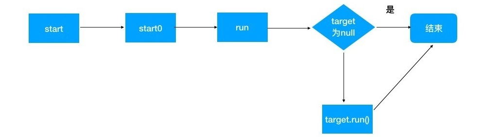

## 一.Java并发简介

### 1.多线程典型应用场景

**1.1 工作量太大，需要多人一块干，以缩短工期**

比如要完成书稿校对工作,每个人分一个章节,同时进行校对.

**1.2 实现分工**

比如每天中午都会去吃工作餐，饭馆的工作流程大同小异. 饭店会有这么几类员工，收银员、厨师、传菜员、清洁员。每个人各司其职，大家配合工作。每种角色的员工只关心自己的输入和输出。

- 每种角色对应一个环节，每个环节在执行上独立分开。
- 每个环节之间有了缓冲。订单的列表就是一个缓冲，调节两个环节速率的不匹配及不稳定。
- 每种角色只做自己的事情，省去了上下文切换的时间。
- 清洁员这个角色。他看到有人吃完饭离开就会去收拾桌子。
- 便于对原有流程进行改变。假如增加向客户推销关注店铺公众号，并注册会员的环节。

当主逻辑相当复杂,难维护和扩展时,我们的程序可以通过多线程 + 缓冲的方式，把不同步骤解耦，那么将大大提高效率。

比如 Kafka 的 producer 发送消息的机制就是如此，首先不同的发消息线程会往缓存中累积消息，此时消息没有被真正发送出去，只是累积在本地缓存中。Kafka 有专门负责网络 IO 的 sender 线程，当缓存满了，sender 线程被唤醒，它真正把消息发送出去，而此时新的消息还会被累积进来。

就像清洁员所做的工作，是不是很熟悉？没错，其实 JVM 中的 GC 线程就相当于清洁员。

**1.3 分头行动，最后汇合**

在微服务时代下,在一个业务接口中,可能会调用数个微服务接口获取数据.若没有采用多线程,那么每次请求时,主线程都会被阻塞.当采用多线程开发时,对获取其它微服务数据的几个请求可以同时发出,主线程阻塞射箭就只取决于几个请求中最长的那个,而不是所有请求阻塞之和.这样可以极大提高响应速度.

**1.4 排队的同时,不耽误做其它事情**

比如医院体检,可以先去B超排个号,然后再去做其它项目的检查,当听到叫号到你时,再去做B超.

这实质就是 java 多线程中的 Future 模式. 这种模式下，主线程不会因为一个耗时的业务操作而被阻塞住，主线程可以单起一个线程去处理耗时的操作，主线程逻辑继续执行，等用到另外线程返回的数据时，再通过 Futrue 对象获取。

### 2.java实现多线程的方式

在 java 中实现多线程有四种方式:

- 继承 Thread 类
- 实现 Runnable 接口
- 使用 FutureTask
- 使用 Executor 框架

其中 Thread 类和实现 Runnable 接口是最基本的方式,但都没有**返回值** . 而 FutureTask则解决了这个问题. Executor 是 JDK 提供的多线程框架,功能非常强大.

下面看个例子: 英语老师罚小明抄写 internationalization 单词100遍,在 java 中称 i18n.

#### 2.1 继承 Thread 实现独立线程

采用继承 thread 类，构造方法中调用 Thread 构造方法, 设置threadName, 重写 run 方法的方式.

```java
// 1、继承Thread类
public class Student extends Thread{
    private String name;
    private Punishment punishment;

    public Student(String name, Punishment punishment) {
        // 2、调用Thread构造方法，设置threadName
        super(name);
        this.name=name;
        this.punishment = punishment;
    }

    public void copyWord() {
        int count = 0;
        String threadName = Thread.currentThread().getName();

        while (true) {
                if (punishment.getLeftCopyCount() > 0) {
                    int leftCopyCount = punishment.getLeftCopyCount();
                    System.out.println(threadName+"线程-"+name + "抄写" + 
      punishment.getWordToCopy() + "。还要抄写" + --leftCopyCount + "次");
                    punishment.setLeftCopyCount(leftCopyCount);
                    count++;
                } else {
                    break;
                }
        }
        System.out.println(threadName+"线程-"+name + "一共抄写了" + count + "次！");
    }
    // 3、重写run方法，调用copyWord完成任务
    @Override
    public void run(){
        copyWord();
    }
}

/*
 * main方法进行test
 */
Punishment punishment = new Punishment(100,"internationalization");
Student student = new Student("小明",punishment);
// 线程对象调用start()方法
student.start();
```

start 方法是从 Thread 类继承而来，**调用后线程进入就绪状态，等待 CPU 的调用。而 start 方法最终会触发执行 run 方法**，在 run 方法中 copyWord 被执行。

#### 2.2 实现 Runnable 接口,启动单独线程

实现 Runnable 接口,由于是接口,不能在构造方法中设置线程名称了,也需要实现 run方法.通过 `Thread(Runnable target, String name)` 创建线程对象并设置当前线程的名称.然后调用start方法.

```java
public class Student implements Runnable{
    private String name;
    private Punishment punishment;

    public Student(String name, Punishment punishment) {
        this.name=name;
        this.punishment = punishment;
    }

    public void copyWord() {
        int count = 0;
        String threadName = Thread.currentThread().getName();

        while (true) {
                if (punishment.getLeftCopyCount() > 0) {
                    int leftCopyCount = punishment.getLeftCopyCount();
                    System.out.println(threadName+"线程-"+name + "抄写" + 
           punishment.getWordToCopy() + "。还要抄写" + --leftCopyCount + "次");
                    punishment.setLeftCopyCount(leftCopyCount);
                    count++;
                } else {
                    break;
                }
        }

        System.out.println(threadName+"线程-"+name + "一共抄写了" + count + "次！");
    }

    // 重写run方法，完成任务。
    @Override
    public void run(){
        copyWord();
    }
}

/*
 * main方法中进行test
 */
Punishment punishment = new Punishment(100,"internationalization");
// 通过Thread(Runnable target, String threadName)创建线程并设置线程名称
Thread xiaoming = new Thread(new Student("小明",punishment),"小明");
// 调用start方法,启动线程,进入就绪状态,等待CPU调用,执行run方法
xiaoming.start();
```

另外两种实现方式后文会接受...

### 3.多线程并发可能会遇到的问题

多线程并发时遇到的问题大多出现在 **共享资源的访问** 上,这也是线程安全问题的主要原因. 在多线程并发中只要 **对共享资源的操作** 都需要 **加锁**, 当对共享资源的操作结束后 就 **释放锁** ,这样来实现多线程的 **同步** (所谓的同步就是某一段流程同时只能有一个线程执行，其它线程需要等待).当加锁后,其它线程按照先来后到的顺序排队,那么就是 **公平锁** ,若是通过线程优先级或其它来争抢CPU资源,那么就是 **非公平锁** . 这种情况下,若一个线程永远无法抢到CPU资源,就叫做 **线程饿死** .

要想知道如何解线程安全问题，就要深刻理解问题产生的根本原因是什么。另外要**深刻理解解决问题的原理**，而不仅仅是记住解决方法。

## 二.Java中如何编写多线程

### 1.继承Thread与实现Runnable分析

#### 1.1 Thread与Runnable区别

继承Thread和实现Runnable接口看似好像是两种实现多线程的方式但其实**从根本上讲只有一种实现多线程的方式**.就是 **实例化Thread,并且提供其执行的run方法** .真正启动线程都是通过实例化Thread,调用其start方法.

**继承Thread类方式:**

```java
Student xiaoming = new Student("小明",punishment);
xiaoming.start();
```

Student继承了Thread类，启动时调用的start方法，其实还是他父类Thread的start方法。并最终触发执行Student重写的run方法。

**实现Runnable接口:**

```java
Thread xiaoming = new Thread(new Student("小明",punishment),"小明");
xiaoming.start();
```

Student实现Runnable接口，作为参数传递给Thread构造函数。接下来还是调用了Thread的start方法。最后则会触发传入的runnable实现的run方法。

相比较来所,第二种方式更好:

- Java语言只支持**单继承**,通过实现接口的方式,可以让实现类继承其他类
- 线程控制逻辑在Thread类中,业务运行逻辑在Runnable实现类中,**解耦**更为彻底
- 实现Runnable的**实例** 可以被**多个线程共享并执行**,而继承Thread类是做不到的

#### 1.2 start与run方法源代码分析

为什么不是Thread对象直接执行run方法呢,而是调用的start方法?为什么在调用start方法后会执行run方法呢? 接下来可以通过查看**Thread类中的start方法和run方法**的源码来解析.

Thread start方法源代码分析:

```java
	/**
     * Causes this thread to begin execution; the Java Virtual Machine
     * calls the <code>run</code> method of this thread.
     */
    public synchronized void start() {
		// 检查线程的状态,是否可以启动
        if (threadStatus != 0)
            throw new IllegalThreadStateException();
		// 把线程加入到线程group中
        group.add(this);

        boolean started = false;
        try {
            //调用了start0方法
            start0();
            started = true;
        } finally {
            try {
                if (!started) {
                    group.threadStartFailed(this);
                }
            } catch (Throwable ignore) {
                /* do nothing. If start0 threw a Throwable then
                  it will be passed up the call stack */
            }
        }
    }

	/**
	 * start0是一个native方法,也称为 JNI(java native interface)方法
	 * JNI 方法是java和其它语言交互的方式,同样也是java代码和虚拟机交互的方式
	 */
	private native void start0();
```

**可以看到start方法中最终调用的是start0方法,不是run方法.而start0方法是一个native方法,后面的执行会进入JVM中.再看start方法的注释就可得知JVM中的start0方法里的逻辑会调用run方法.**

Thread run方法源代码分析:

```java
/* Thread 也实现了 Runnable */
public class Thread implements Runnable {
    /* What will be run. */
    private Runnable target;
    
    // Runnable的实现对象通过构造函数传入Thread
    public Thread(Runnable target) {
        init(null, target, "Thread-" + nextThreadNum(), 0);
    }
    
    // init方法有多个重载方法,最终调用的是下面方法
    private void init(ThreadGroup g, Runnable target, String name,
                      long stackSize, AccessControlContext acc,
                      boolean inheritThreadLocals) {
        // ...
        // Thread的target被设置为你实现业务逻辑的Runnable实现
        this.target = target;
    }
    
    /*
     * 当传入非空的target时,则会执行target的run方法,即执行业务逻辑的方法
     * Thread 实现了 Runnable接口
     */
    @Override
    public void run() {
        if (target != null) {
            target.run();
        }
    }
}    
```

整体执行流程如下:



若是通过继承Thread,重写run方法的方式实现多线程,那么第三步执行的是重写的run方法.

Java中多线程的实现采用了**模板模式** (thread线程整体逻辑就是一个模板,把其中一个步骤剥离出来由其他类实现,这就是模板方法模式). Thread是模板对象,负者线程相关的逻辑,比如线程的创建,运行以及各种操作.而线程真正的业务逻辑则被剥离出来,交由Runnable的实现类去实现.线程操作和业务逻辑完全解耦.开发者只需关注业务逻辑实现.

### 2.线程的状态详解

Java 线程在运行的生命周期中的指定时刻只可能处于下面 6 种不同状态的其中一个状态,**Thread.State类**定义了线程的几种状态:

```java
public class Thread implements Runnable {

    public enum State {
          /**
         * 初始状态,线程被构建,但是还没有调用start()方法
         */
        NEW,

        /**
         * 运行状态,Java线程将操作系统中的就绪和运行两种状态笼统称作"运行中"
         * 就绪 -> 运行: Thread.start()方法后,将进入线程队列等待CPU时间片
         * 运行 -> 就绪: yield()方法
         */
        RUNNABLE,

        /**
         * 阻塞状态,表示线程阻塞于锁
         * 阻塞: 被人为挂起或执行输入输出操作时,让出CPU并临时终止自己的执行,进入阻塞状态
         * 等待进入synchronized方法,等待进入synchronized块
         * 获取到锁
         */
        BLOCKED,

        /**
         * 等待状态,表示线程进入等待状态,表示当前线程需要等待其它线程做出一些特点动作(通知或中断)
         * Object.wait(),Object.join(),LockSupport.park()
         * Object.notify(),Ojbect.notifyAll(),LockSupport.unpark(Thread)
         */
        WAITING,

        /**
         * 超时等待状态,该状态不同于 WAITING,它是可以在指定的时间自行返回
         * Thread.sleep(long),Object.wait(long),Thread.join(long),
         LockSupport.parkNanos(),LockSupport.parkUntil()
         * Object.notify(),Ojbect.notifyAll(),LockSupport.unpark(Thread)
         */
        TIMED_WAITING,

        /**
         * 终止状态,表示当前线程已经执行完毕(执行完run()方法)
         * 死亡: 线程完成全部工作或被提前强制性终止或出现异常导致结束
         */
        TERMINATED;
    }

}
```

在一个完整的生命周期中通常要经历一下五种状态:

- **新建**: 当一个Thread类或其子类的对象被声明并创建时
- **就绪**: start()方法后,将进入线程队列等待CPU时间片
- **运行**: 当就绪的线程被调度并获得CPU资源时,便进入运行状态
- **阻塞**: 被人为挂起或执行输入输出操作时,让出CPU并临时终止自己的执行,进入阻塞状态
- **死亡**: 线程完成全部工作或被提前强制性终止或出现异常导致结束

具体线程的状态转化可看上一篇文章: `并发总结 -- 线程的生命周期 -- 线程状态转换图` 部分内容.

### 3.Thread类的几个重要API

线程的状态变化很多时候是由于主动调用了某些方法,而这些方法大多是 Thread 类的API.下面是Thread类几个重要的API.

#### 3.1 等待线程执行终止的 join 方法

在项目实践中经常会遇到一个场景,**需要等待某件事完成后才能继续往下执行**,比如多个线程加载资源,需要等待多个线程全部加载完毕再汇总处理.Thread类中的 join 方法可以做这个事情.它能够显现**并行化处理**.比如主线程通过调用A线程的join方法,让主线程 block 住,知道A线程的工作全部完成,才能继续走下去.

```java
public class JoinClient {
    public static void main(String[] args) throws InterruptedException {
        Thread backendDev = createWorker("backed dev", "backend coding");
        Thread frontendDev = createWorker("frontend dev", "frontend coding");
        Thread tester = createWorker("tester", "testing");

        backendDev.start();
        frontendDev.start();
      
        backendDev.join();
        frontendDev.join();
      
        tester.start();
    }

    public static Thread createWorker(String role, String work) {
        return new Thread(() -> {
            System.out.println("I finished " + work + " as a " + role);
        });
    }
}
```

输出:

```java
I finished backend coding as a backed dev
I finished frontend coding as a frontend dev
I finished testing as a tester
```

在主线程里面启动了三个子线程,然后分别前两个调用了他们的join方法,那么主线程首先在调用`backendDev.join()`方法后被阻塞,等待backendDev执行完毕后返回.然后主线程调用`frontendDev.join()`方法再次被阻塞,等待frontendDev执行完毕后返回.最后执行`tester.start()`方法启动tester线程,等待获取CPU资源再执行.

#### 3.2 让线程睡眠的 sleep 方法

线程的 sleep 方法会使线程休眠指定的时间长度。休眠的意思是，当前逻辑执行到此不再继续执行，而是等待指定的时间。但在这段时间内，该线程持有的 monitor 锁并不会被放弃。可以认为线程只是工作到一半休息了一会，但它所占有的资源并不会交还。

sleep方法有两个重载,分别是:

```java
public static native void sleep(long millis) throws InterruptedException;
public static void sleep(long millis, int nanos) throws InterruptedException
```

两者的区别只是一个支持休眠时间到毫秒级，另外一个到纳秒级。但其实第二个并不能真的精确到纳秒级别，我们来看第二个重载方法代码：

```java
public static void sleep(long millis, int nanos)
throws InterruptedException {
    if (millis < 0) {
        throw new IllegalArgumentException("timeout value is negative");
    }
    if (nanos < 0 || nanos > 999999) {
        throw new IllegalArgumentException(
                            "nanosecond timeout value out of range");
    }
    if (nanos >= 500000 || (nanos != 0 && millis == 0)) {
        millis++;
    }
    sleep(millis);
}
```

可以清楚的看到，最终调用的还是第一个毫秒级别的 sleep 方法。而传入的纳秒会被四舍五入。如果大于 50 万，毫秒 ++，否则纳秒被省略。

#### 3.3 让出CPU执行权的 yield 方法

正常情况下当一个线程把分配给自己的时间片使用完后,线程调度器才会进行下一轮的线程调度,而当一个线程调用了Thread类的静态方法yield时,暗示线程调度器现在就可以进行下一轮的线程调度.

**当一个线程调用yield方法时,当前线程会让出CPU使用权,然后处于就绪状态,线程调度器会从线程就绪队列里面获取一个线程优先级最好的线程,当然也有可能会调度到刚刚让出CPU的那个线程来获取CPU执行权.**

一般很少使用这个方法,在调试或测试时这个方法或许可以帮助复现由于并发竞争条件导致的问题,其在设计并发控制时或许会有用途.下面是测试代码:

```java
public class YieldExampleClient {

    public static void main(String[] args) {
        Thread xiaoming = new Thread(() -> {
            for (int i = 0; i < 10; i++) {
                System.out.println("xiaoming--" + i);
                if (i == 2) {
                    Thread.yield();
                }
            }
        });

        Thread jianguo = new Thread(() -> {
            for (int i = 0; i < 10; i++) {
                System.out.println("jianguo--" + i);
            }
        });

        xiaoming.start();
        jianguo.start();
    }
}
```

输出结果:

```java
xiaoming--0
xiaoming--1
xiaoming--2
jianguo--0
jianguo--1
......
```

可以看出 xiaoming 先获得了 CPU 的使用权，不过在打印到 2 的时候调用了 yield 方法，提示可以让出 CPU 的使用权，jianguo获得了 CPU 的使用权.

#### 3.4 interrupt 相关方法

Java 中的线程中断是一种线程间的协作模式,通过设置线程的中断标志并不能直接终止线程的执行,而是被中断的线程根据中断状态自行处理.相关API方法如下:

- `void interrupt()` :中断线程,只是**设置中断标志为true并立即返回.线程并没有中断,会继续往下执行**.若线程A因为**调用了wait系列函数,join方法或sleep方法而被阻塞挂起**,这时若线程B调用线程A的interrupt方法,线程A会在**调用这些方法的地方抛出InterruptedException异常**而返回.即这个标识位只对可中断方法会产生作用.
- `boolean isInterrupted` :检查当前线程是否被中断,如果是返回true,否则返回false.不清除中断标志.
- `boolean interrupted` :检测当前线程是否被中断.**会清除中断标志**.而且获取的是**当前调用线程的中断标志**而不是调用interrupted方法的实例对象的中断标志.

看下相关源码:

```java
public boolean isInterrupted() {
    //传递false,说明不清除中断标志
    return isInterrupted(false);
}

public static boolean interrupted() {
    //传递true,清除中断标志,获取当前线程的中断状态
    return currentThread().isInterrupted(true);
}
```

下面通过一个例子来了解interrupted() 与 isInterrupted() 方法的不同之处.

```java
public static void main(String[] args) throws InterruptedException {
    Thread threadOne = new Thread(() -> {
        for(;;){}
    });
    // 启动线程
    threadOne.start();
    // 设置中断标志
    threadOne.interrupt();

    //获取中断标志
    System.out.println("isInterrupted:"+threadOne.isInterrupted()); // true
    //获取中断标志并重置
    System.out.println("isInterrupted:"+threadOne.interrupted());   // false
    System.out.println("isInterrupted:"+Thread.interrupted());      // false
    // 获取中断标志
    System.out.println("isInterrupted:"+threadOne.isInterrupted()); // true

    //由于是死循环,主线程一直被阻塞,无法向下执行
    threadOne.join();
    System.out.println("main thread is over");
}
```

在interrupted()方法内部是获取当前线程的中断状态,这里虽然调用了threadOne的interrupted()方法,但是获取的是主线程的中断标志.threadOne.interrupted() 和 Thread.interrupted()方法的作用是一样.都是获取当前线程的中断标志.

修改上面的例子:

```java
public static void main(String[] args) throws InterruptedException {
    Thread threadOne = new Thread(() -> {
        // 中断标志为true时会退出循环,并且清除中断标志,即退出循环后中断标志为false
        while (!Thread.currentThread().interrupted()) {}
        System.out.println("threadOne isInterrupted:"+
                           Thread.currentThread().isInterrupted());    // false
    });

    // 启动线程
    threadOne.start();
    // 设置中断标志
    threadOne.interrupt();

    // 等待threadOne执行完,此时主线程被阻塞
    threadOne.join();
    System.out.println("main thread is over");
}
```

从上面两个例子可看出`interrupted()`方法会清除中断标志,并且方法内部获取的是当前线程的中断标志.而`isInterrupted()`方法不会清除中断标志.

#### 3.5 currentThread 方法

currentThread是Thread的静态方法,用于获取当前线程的实例.

```java
Thread.currentThread();
```

得到实例后可以获取 Thread 的名称或获取线程ID.

```java
// 线程名
Thread.currentThread().getName();
// 线程ID
Thread.currentThread().getId();
```

#### 3.6 setPriority 方法

该方法用于设置线程的优先级.每个线程都有自己的优先级数值,当 CPU 资源紧张的时候，优先级高的线程获得 CPU 资源的概率会更大。请注意仅仅是概率会更大，并不意味着就一定能够先于优先级低的获取。

看下 setPriority 的源码:

```java
public final void setPriority(int newPriority) {
    ThreadGroup g;
    checkAccess();
    // Thread 有自己的最小和最大优先级数值，范围在 1-10。如果不在此范围内，则会报错
    if (newPriority > MAX_PRIORITY || newPriority < MIN_PRIORITY) {
        throw new IllegalArgumentException();
    }
    if((g = getThreadGroup()) != null) {
        // 如果设置的 priority 超过了线程所在组的 priority ，那么只能被设置为组的最高 priority 
        if (newPriority > g.getMaxPriority()) {
            newPriority = g.getMaxPriority();
        }
        // 调用 native 方法 setPriority0 进行设置
        setPriority0(priority = newPriority);
    }
}
```

### 4.线程的等待和通知

通知与等待系列函数都在 Object 中,即所有的 java 类都继承了这两个方法.原因是 java 中同步操作的需要.

原本处于 RUNNING 的线程,可以通过**调用 wait 方法**,进入 BLOCKING 状态.此线程会**放弃原来持有的锁**(只会释放当前共享对象的锁,当前线程持有的其它共享对象的监视器锁并不会被释放).而调用 notify 方法则会**任意唤醒 wait set 中的一个线程**,让其继续往下执行.

调用`wait()`方法时,该调用线程会被阻塞挂起,直到发生下列几件事情之一才返回:

- 其它线程调用了该对象的`notify()`或 `notifyAll()` 方法
- 其它线程调用了该线程的 `interrupt()` 方法,该线程抛出 `InterruptedException` 异常返回

注意: **调用这系列方法的线程没有事先获取该对象的监视器锁时,会抛出 IllegalMonitorStateException 异常.即这系列方法都必须要在同步方法或同步代码块中使用** .

一个线程如何才能获取一个对象的监视器锁呢?

- 执行 synchronized 同步代码块时,使用该对象作为参数  -- 同步代码块

    ```java
    synchronized(任何对象){...}
    ```

- 调用该对象的方法,并且该方法使用了 synchronized 修饰  -- 同步方法

    ```java
    synchronized void add(int a,int b){...}
    ```

**synchronized 关键字需要配合一个对象使用,这个对象可以是任何对象**,有时为了代码好懂一般会使用共享资源对象.**其实 synchronized 所使用的对象，只是用来记录等待同步操作的线程集合**。他相当于一位排队管理员，所有线程都要在此排队，并接受他的管理，他说谁能进就可以进。另外他**维护了一个 wait set，所有调用了 wait 方法的线程都保存于此。一旦有线程调用了同步对像的 notify 方法，那么 wait set 中的线程就会被 notify，继续执行自己的逻辑**。


一个线程调用共享对象的`notify()`方法后,会唤醒一个在在共享变量上调用 wait 系列方法后被挂起的线程.**具体唤醒哪个等待的线程是随机的**.此外,**被唤醒的线程不能马上从wait方法返回并继续执行,必须在获取了共享对象的监视器锁后才可以返回**,也就是唤醒它的线程释放了该共享对象的监视器锁后,被唤醒的线程也不一定会获取到共享对象的监视器锁.这是因为该线程还需要和其他线程一起竞争该锁,只有竞争到了该锁才可以继续执行.

`notifyAll()`方法则会唤醒所有在该共享变量上由于调用wait系列方法而被挂起的线程.注意: **只会唤醒调用这个方法前调用了 wait 系列函数而被放入共享变量等待集合里面的线程**.如果调用`notifyAll()`方法后一个线程调用了wait方法而被放入阻塞集合,则该线程是不会被唤醒的.

### 5.多线程协作-生产者与消费者实例

生产者 / 消费者是一种经典的设计模式，被广泛应用于软件领域。**生产者 / 消费者设计模式能够充分解藕，每一方只需要关注自己的职责。生产者专注生产，消费者专注消费。双方通过某种机制进行资源共享**。举个例子，就像男人负责赚钱养家，女人负责貌美如花。男人可以看作生产者，不停赚钱存入银行，而老婆负责花钱买生活用品等。银行账户就是共享金钱的机制。

需求分析:

1. 有两个角色，老师和学生。但每个角色可能有多个人。
2. 老师负责留抄写单词的作业，学生负责完成作业。一项作业是指抄写指定单词指定次数。
3. 每个学生领取一项作业，独立完成。
4. 当没有作业可领取的时候，学生等待。
5. 当有了新的作业可领取，学生被唤醒，继续领取作业。
6. 当作业数量达到上限的时候，老师停止布置作业。
7. 当作业小于上限的时候，老师被唤醒，继续布置作业。

这是一个典型的生产者 / 消费者的场景。老师负责生产作业，学生负责消化作业。当不满足某些条件的时候两种角色都可能休眠，而在特定条件下则会被唤醒。

Task 类代码:

```java
public class Task {
    private int leftCopyCount;
    private String wordToCopy;
	// 其余代码省略
}
```

Teacher 类代码:

```java
public class Teacher extends Thread {
    private String name;
    private List<String> punishWords = Arrays.asList("internationalization",
            "hedgehog", "penicillin", "oasis", "nirvana", "miserable");
    private LinkedList<Task> tasks;
    private int MAX = 10;

    public Teacher(String name, LinkedList<Task> tasks) {
        //调用Thread构造方法，设置threadName
        super(name);
        this.name = name;
        this.tasks = tasks;
    }

    public void arrangePunishment() throws InterruptedException {
        String threadName = Thread.currentThread().getName();

        while (true) {
            synchronized (tasks) {
                // 当任务数量未达 MAX 值时，teacher 会生成新的 task 加入任务列表
                if (tasks.size() < MAX) {
                    Task task = new Task(new Random().nextInt(3) + 1,
                            getPunishedWord());
                    tasks.addLast(task);
                    System.out.println(threadName + "留了作业，抄写" + task.getWordToCopy() +
                            " " + task.getLeftCopyCount() + "次");
                    // 并唤醒所有线程, 因为可能有学生线程因为无 task 可做已经 wait
                    tasks.notifyAll();
                } else {
                    // 当任务数量超出 MAX，当前老师线程则会进入 wait set
                    System.out.println(threadName+"开始等待");
                    tasks.wait();
                    System.out.println("teacher线程 " + threadName + "线程-" + name + "等待结束");
                }
            }
        }
    }

    //重写run方法，完成任务。
    @Override
    public void run() {
        try {
            arrangePunishment();
        } catch (InterruptedException e) {
            e.printStackTrace();
        }
    }

    private String getPunishedWord() {
        return punishWords.get(new Random().nextInt(punishWords.size()));
    }
}
```

Student 类代码:

```java
public class Student extends Thread {
    private String name;
    private LinkedList<Task> tasks;

    public Student(String name, LinkedList<Task> tasks) {
        //调用Thread构造方法，设置threadName
        super(name);
        this.name = name;
        this.tasks = tasks;
    }

    public void copyWord() throws InterruptedException {
        String threadName = Thread.currentThread().getName();

        while (true) {
            Task task = null;

            synchronized (tasks) {
                // 如果任务的数量大于 0，则会取出第一个任务，并从任务列表移除，同时会唤醒所有线程
                if (tasks.size() > 0) {
                    task = tasks.removeFirst();
                    sleep(100);
                    // notifyAll这是因为可能有 teacher 线程由于触及 MAX 值而进入了 wait set
                    tasks.notifyAll();
                } else {
                    // 当 task 数量为 0 时，学生线程则会进入等待，因为无 task 可做
                    System.out.println(threadName+"开始等待");
                    tasks.wait();
                    System.out.println("学生线程 "+threadName + "线程-" + name + "等待结束");
                }
            }

            if (task != null) {
                for (int i = 1; i <= task.getLeftCopyCount(); i++) {
                    System.out.println(threadName + "线程-" + name + "抄写" +
                            task.getWordToCopy() + "。已经抄写了" + i + "次");
                }
            }
        }
    }

    //重写run方法，完成任务。
    @Override
    public void run() {
        try {
            copyWord();
        } catch (InterruptedException e) {
            e.printStackTrace();
        }
    }
}
```

让线程 sleep 了 100 毫秒，这样是为了让 teacher 生产 task 的速度更快，以让 task 数量能够达到 MAX 值，触发 teacher 线程的 wait 操作。以便我们看到 wait 和 notifyAll 的效果。

以上程序代码逻辑，可参考下图理解：


客服端代码:

```java
public class WaitNotifyClient {
    public static void main(String[] args) {
        LinkedList<Task> tasks = new LinkedList<>();

        Student jack = new Student("Jack", tasks);
        jack.start();

        Student tom = new Student("Tom", tasks);
        tom.start();

        Teacher missZhang = new Teacher("MissZhang", tasks);
        missZhang.start();

        Teacher missWang = new Teacher("MissWang", tasks);
        missWang.start();
    }
}
```

**总结**: 学生和老师线程都会操作任务列表 tasks，所以对 tasks 的操作需要加上同步保护。任务达到 MAX 上限时，老师 wait，当任务数量为 0 时，学生休息。无论学生和老师，在执行完自己正常生产和消费逻辑后都会执行 notifyAll，确保如果有 wait 的线程，能被唤醒。

**采用生产者 / 消费者的多线程方式带来很多好处**:

- **分工**: 在真实世界里，每个人都像一个单独的线程，在并行工作
- **解耦**: 多线程之间不需要互相调用，并且不需要知道其他线程运行的情况。通过共享资源 tasks，让不同线程维系在一起工作
- **缓冲**: tasks 列表其实就是一个缓冲池，能够缓解生产和消费的速度不一致


## 参考链接

- 书籍: <<Java并发编程之美>>
- [Java并发编程学习宝典（漫画版）](http://www.imooc.com/read/49#new_header)
- [深入浅出Java多线程](http://concurrent.redspider.group/)