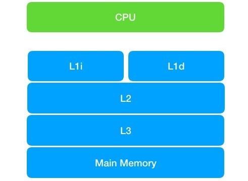

## 一.并发的问题和原因详解

所有并发程序都需要保证线程的安全性，那么什么是线程的安全性呢？其实很难给出一个非常正式的定义。其实线程安全中的安全，是指程序的正确性。程序不但要在单线程的时候保证正确，在多线程并发的时候也要保证程序计算的正确性。

线程安全可以这样定义：**某个类，在多线程并发访问时，始终能够确保运行的正确性，那么这个类就是线程安全的**。

并发编程的三大特性，这是并发编程中所有问题的根源,只有深刻理解了这三大特性，才不会编写出漏洞百出的并发程序.

这三大特性:

- **原子性**: 所有操作要么全部成功，要么全部失败
- **可见性**: 一个线程对变量进行了修改，另外一个线程能够立刻读取到此变量的最新值
- **有序性**: 代码在执行阶段，并不一定和你的编写顺序一致

### 1.原子性

#### 1.1 什么是原子性

原子性也是事务的四大特性 ACID 之一,并且位居首位.那么到底什么是原子性呢？原子性的重点在原子上。其实所谓的**原子性就是不可分割性**。做为一个整体的N次操作不可分割，一荣俱荣，一损俱损。

#### 1.2 竞态条件

**竞态条件是指，在多线程的情况下，由于多个线程执行的时序不同，而出现不正确的结果**。

竞态条件并不一定会造成问题，当并发次数多时,就会出现问题.这是因为在多线程执行时，不同线程的不同步骤在特定时序执行才会出问题。而执行次数越多就越可能碰上导致出错的特定时序。

下面来看个单例的写法:

```java
public class Singleton {
    private static Singleton singleton = null;

    private Singleton() {
    }

    public static Singleton getInstance() {
        if(singleton==null){
            singleton = new Singleton();
        }
        return singleton;
    }
}
```

这段代码在非并发的情况下没有任何问题。但是在并发的情况下，因为竞态条件有可能引发错误。如果线程 A 在判断 singleton 为空并且创建 singleton 对象之前，线程B也开始执行这段代码，它同样会判断 singleton 为空去创建 singleton，这样本来的单例却变成了双例，和我们期望的正确结果不一致。

**总结**: **如果在需要保证原子性的一组操作中，有竞态条件产生，那么就会出现线程安全的问题。我们可以通过为原子操作加锁或者使用原子变量来解决**。原子变量在 `java.util.concurrent.atomic `包中，它提供了一系列的原子操作。

### 2.可见性

#### 2.1 什么是可见性

可见性指的是，某个线程对共享变量进行了修改，其它线程能够立刻看到修改后的最新值。变量被修改后在单线程中确实能看到,但并不保证别的线程会立刻看到. 原因就是编程领域经典的两大难题之一 --- 缓存一致性.

下面来看个例子:

```java
public class visibility {
    private static class ShowVisibility implements Runnable{
        public static Object o = new Object();
        private Boolean flag = false; 
        @Override
        public void run() {
            while (true) {
                if (flag) {
                    System.out.println(Thread.currentThread().getName()+":"+flag);
                }
            }
        }
    }

    public static void main(String[] args) throws InterruptedException {
        ShowVisibility showVisibility = new ShowVisibility();
        Thread blindThread = new Thread(showVisibility);
         blindThread.start();
        //给线程启动的时间
        Thread.sleep(500);
        //更新flag
        showVisibility.flag=true;
        System.out.println("flag is true, thread should print");
        Thread.sleep(1000);
        System.out.println("I have slept 1 seconds. I guess there was nothing printed ");
    }
}
```

ShowVisibility 实现 Runnable 接口，在 run 方法中判断成员变量 flag 值为 true 时进行打印。main 方法中通过 showVisibility 对象启动一个线程。主线程等待 0.5 秒后，改变 showVisibility 中 flag 的值为 true。按正常思路，此时 blindThread 应该开始打印。但是，实际情况并非如此。运行此程序，输出如下：

```java
flag is true, thread should print
I have slept 1 seconds. I guess there was nothing printed 
```

flag 改为 true 后，blindThread 没有任何打印。也就是说 blindThread 并没有观察到到 flag 的值变化。如果是单线程程序，做了一个变量的修改，那么程序是立即就能看到的。然而在多线程程序中并非如此。原因是 CPU 为提高计算的速度，使用了缓存。

#### 2.2 CPU缓存模型

根据摩尔定律,CPU 每18个月速度将会翻一番.CPU 的计算速度提升了，但是内存的访问速度却没有什么大幅度的提升。即CPU 计算的瓶颈出现在对内存的访问上。这样CPU利用缓存来提升计算速度.CPU更狠用了 L1、L2、L3，一共三级缓存。其中 L1 缓存根据用途不同，还分为 L1i 和 L1d 两种缓存。如下图：



CPU 会先从主存中复制数据到缓存，CPU 在计算的时候就可以从缓存读取数据了，在计算完成后再把数据从缓存更新回主存。这样在计算期间，就无须访问主存了，速度大大提升。加上缓存后，CPU 的数据访问如下：


这样就可以解释上文代码没有出现预期的结果了. blindThread 线程启动后，就进入 while 循环中，一直进行运算，运算时把 flag 从主存拿到了自己线程中的缓存，此后就会一直从缓存中读取 flag 的值。即便是main线程修改了 flag 的值。但是 blindThread 线程的缓存并未更新，所以取到的还一直是之前的值。导致 blindThread 线程一致也不会有输出。

#### 2.3 初识 volatile 关键字

解决可见性问题有两种方法,第一种就是解决一切并发问题的方法--同步.另一种就是使用 volatile 关键字.

上文的这行代码可在修饰共享变量前加上 volatile 关键字:

```java
private volatile Boolean flag = false; 
```

再次运行程序可以正常输出了.

**总结**: volatile 修饰的变量，在发生变化的时候，其它线程会立刻觉察到，然后从主存中取得更新后的值。volatile 除了简洁外，还有个好处就是它不会加锁，所以不会阻塞代码。即它能够以轻量级的方式实现同步.

### 3.有序性

#### 3.1 什么是指令重排序

说到有序性，我们一定会提到指令重排序。CPU 为了提高运行效率，可能会对编译后代码的指令做一些优化，这些优化不能保证 100% 符合你编写代码在正常编译后的顺序执行。但是一定能保证代码执行的结果和按照编写顺序执行的结果是一致的。

指令重排序的优化，仅仅对单线程程序确保安全。如果在并发的情况下，程序没能保证有序性，程序的执行结果往往会出乎我们的意料。另外注意，指令重排序，并不是代码重排序。我们的代码被编译后，一行代码可能会对应多条指令，所以指令重排序更为细粒度。

**指令重排对于提高CPU处理性能十分必要。虽然由此带来了乱序的问题，但是这点牺牲是值得的。**

指令重排一般分为以下三种：

- **编译器优化重排**

    编译器在**不改变单线程程序语义**的前提下，可以重新安排语句的执行顺序。

- **指令并行重排**

    现代处理器采用了指令级并行技术来将多条指令重叠执行。如果**不存在数据依赖性**(即后一个执行的语句无需依赖前面执行的语句的结果)，处理器可以改变语句对应的机器指令的执行顺序。

- **内存系统重排**

    由于处理器使用缓存和读写缓存冲区，这使得加载(load)和存储(store)操作看上去可能是在乱序执行，因为三级缓存的存在，导致内存与缓存的数据同步存在时间差。

**指令重排可以保证串行语义一致，但是没有义务保证多线程间的语义也一致**。所以在多线程下，指令重排序可能会导致一些问题。

#### 3.2 单例双重判断的有序性问题

下面是实现单例的双重判断写法:

```java
public class Singleton {
    private static Singleton instance; 
    private Singleton (){}
 
    public static Singleton getSingleton() {
        // 节省性能和时间,避免再次获取锁和进行判断
        if (instance == null) {                  
            synchronized (Singleton.class) {
                // 判断instance是否为空,避免多个线程排队获取锁后多次实例化
                if (instance == null) {       
                    instance = new Singleton();
                }
            }
        }
        return instance;
    }
}
```

在重排序上来看:  `instance = new Singleton ();` 这一行代码会被编译为三条指令，正常指令顺序如下：

- 为 instance 分配一块内存 A
- 在分配的内存 A 上初始化 instance 实例
- 把内存 A 的地址赋值给 instance 变量

而编译器优化后可能会变成：

- 为 instance 分配一块内存 A
- 把内存 A 的地址赋值给 instance 变量
- 在分配的内存 A 上初始化 instance 实例

可以看出在优化后第 2 和第 3 步调换了位置。调换后单线程运行是没有问题的。但是换做多线程，假如线程 A 正在初始化 instance，此时执行完第 2 步，正在执行第三步。而线程 B 执行到 if (instance == null) 的判断，那么线程 B 就会直接得到未初始化好的 instance，而此时线程 B 使用此 instance 显然是有问题的。

要解决该问题**只需要为 instance 声明时增加 volatile 关键字, volatile 修饰的变量是会保证读操作一定能读到写完的值**。

```java
private static volatile Singleton instance; 
```

**总结**: 有序性是在多线程的情况下，确保 CPU 不对我们需要保证顺序性的代码进行重排序的。我们可以通过 `sychronized` 或者` volatile` 来确保有序性。

### 4.Java内存模型简介

#### 4.1 运行时内存划分及堆内存不可见问题

Java内存模型即JMM(Java Memory Model),与 Java内存结构两者比较容易混淆. **Java内存结构**描述的是JVM对内存的逻辑划分,在学习垃圾回收和JVM优化时比较关心JVM内存结构.而 **JMM** 实际是一种规范,它描述了Java程序的运行行为,包括多线程操作对共享内存读取时,所能读取到的值应该遵守的规则.

先看一下**java运行时内存**的划分:


**对于每一个线程来说,栈都是私有的,而堆时共有的.即栈中的变量(局部变量,方法定义参数,异常处理器参数)不会在线程之间共享,也就不会有内存可见性的问题,也不受内存模型的影响.而堆中的变量是共享的,即共享变量.所以内存可见性是针对的共享变量.**

现代计算机为了高效，往往会在高速缓存区中缓存共享变量，因为cpu访问缓存区比访问内存要快得多。

> 线程之间的共享变量存在主内存中，每个线程都有一个私有的本地内存，存储了该线程以读、写共享变量的副本。本地内存是Java内存模型的一个抽象概念，并不真实存在。它涵盖了缓存、写缓冲区、寄存器等。

Java线程之间的通信由Java内存模型（简称JMM）控制，从抽象的角度来说，JMM定义了线程和主内存之间的抽象关系。JMM的抽象示意图如图所示：


从图中可以看出：

1. 所有的共享变量都存在主内存中。
2. 每个线程都保存了一份该线程使用到的共享变量的副本。
3. 如果线程A与线程B之间要通信的话，必须经历下面2个步骤：
    1. 线程A将本地内存A中更新过的共享变量刷新到主内存中去。
    2. 线程B到主内存中去读取线程A之前已经更新过的共享变量。

**所以，线程A无法直接访问线程B的工作内存，线程间通信必须经过主内存。**

注意，根据JMM的规定，**线程对共享变量的所有操作都必须在自己的本地内存中进行，不能直接从主内存中读取**。

那么怎么知道这个共享变量的被其他线程更新了呢？这就是JMM的功劳了，也是JMM存在的必要性之一。**JMM通过控制主内存与每个线程的本地内存之间的交互，来提供内存可见性保证**。

> Java中的volatile关键字可以保证多线程操作共享变量的可见性以及禁止指令重排序，synchronized关键字不仅保证可见性，同时也保证了原子性（互斥性）。在更底层，JMM通过内存屏障来实现内存的可见性以及禁止重排序。为了程序员的方便理解，提出了happens-before，它更加的简单易懂，从而避免了程序员为了理解内存可见性而去学习复杂的重排序规则以及这些规则的具体实现方法。

#### 4.2 JMM与java运行时内存区别和联系

JMM和Java运行时内存区域的划分，这两者既有差别又有联系：

- 区别

    两者是不同的概念层次。JMM是抽象的，他是用来描述一组规则，通过这个规则来控制各个变量的访问方式，围绕原子性、有序性、可见性等展开的。而Java运行时内存的划分是具体的，是JVM运行Java程序时，必要的内存划分。

- 联系

    都存在私有数据区域和共享数据区域。一般来说，JMM中的主内存属于共享数据区域，他是包含了堆和方法区；同样，JMM中的本地内存属于私有数据区域，包含了程序计数器、本地方法栈、虚拟机栈。

**实际上，他们表达的是同一种含义，这里不做区分**。

#### 4.3 happens-before

JMM提供了**happens-before规则**（JSR-133规范），满足了程序员的需求——**简单易懂，并且提供了足够强的内存可见性保证**。

JMM使用happens-before的概念来定制两个操作之间的执行顺序。这两个操作可以在一个线程以内，也可以是不同的线程之间。因此，JMM可以通过happens-before关系向程序员提供跨线程的内存可见性保证。

happens-before关系的定义如下：

1. 如果一个操作happens-before另一个操作，那么第一个操作的执行结果将对第二个操作可见，而且第一个操作的执行顺序排在第二个操作之前。
2. **两个操作之间存在happens-before关系，并不意味着Java平台的具体实现必须要按照happens-before关系指定的顺序来执行。如果重排序之后的执行结果，与按happens-before关系来执行的结果一致，那么JMM也允许这样的重排序**。

as-if-serial语义保证单线程内重排序后的执行结果和程序代码本身应有的结果是一致的，happens-before关系保证正确同步的多线程程序的执行结果不被重排序改变。

总之，**如果操作A happens-before操作B，那么操作A在内存上所做的操作对操作B都是可见的，不管它们在不在一个线程**。

`happens-before`并不是指操作A先于操作B发生，而是指**操作A的结果在任何情况下都可以被后面操作B所获取**。下面我们就来看一下Happens-before原则:

- 程序顺序规则。如果程序中A操作在B操作之前，那么线程中A操作将在B操作前执行。
- 上锁原则。不同线程对同一个锁的lock操作一定在unclock前。
- volatile变量原则。对于volatile变量的写操作会早于对其的读操作。
- 线程启动原则。A线程中调用threadB.start()方法，那么threadB.start()方法会早于B线程中中的任何动作执行。
- 传递规则。如果A早于B执行，B早于C执行，那么A一定早于C执行。
- 线程中断规则：线程interrupt()方法的一定早于检测到线程的中断信号。
- 线程终结规则：如果线程A终结了，并且导致另外一个线程B中的ThreadA.join()方法取得返回，那么线程A中所有的操作都早于线程B在ThreadA.join()之后的动作发生。
- 对象终结规则：一个对象初始化操作肯定先于它的finalize()方法。

### 5.死锁详解

所谓的死锁，其实就是因为某种原因，达不到解锁的条件，导致某线程对资源的占有无法释放，其他线程会一直等待其解锁，而被一直 block 住。

#### 5.1 死锁产出原因

1.交叉死锁:

**不同的线程分别占用对方需要的同步资源不放弃，都在等待对方放弃自己需要的同步资源，就形成了线程的死锁.** **出现死锁后，不会出现异常，不会出现提示，只是所有的线程都处于阻塞状态，无法继续. 使用同步时, 要避免出现死锁.**

2.内存不足

某系统内存 20M，两个线程正在分别执行任务，各自已经使用了 10M 内存。但是执行到一半时需要更大的内存，但是系统已经没有内存可供使用。那么两个线程都会等待对方执行完毕 时释放内存。这就造成了两个线程互相等待，从而形成死锁。

3.一问一答式的数据交换

所谓的一问一答式数据交换就是客户端发送请求，服务端返回响应。如果在交互过程中出现了数据的丢失，双方产生误解，以为对方没有收到消息，陷入等待之中。如果此时没有设置 timeout，就会造成互相的等待一直持续下去，从而形成死锁。

4.数据库锁

如果某个线程对数据库表或者行加锁，但是意外导致没能正确释放锁，而其他线程则会等待数据库锁的释放，从而陷入死锁。

5.文件锁

某个线程获取文件锁后开始执行。但是执行过程中意外退出，而没能释放锁。那么其他等待该文件锁的线程将会一直等待，直到系统释放文件句柄的资源。

6.死循环

假如某个线程，由于编码问题，在对资源加锁后，陷入死循环，导致一致无法释放锁。

**为什么会产生死锁呢?死锁的产生必须具备以下四个条件:**

- **互斥条件**: 该资源同时只由一个线程占用
- **请求并持有条件**: 一个线程已经持有了至少一个资源,又提出新的资源请求而被阻塞的同时并不释放自己已经获取的资源
- **不可剥夺条件**: 线程获取到的资源在自己使用完之前不能被其它线程抢占,只有自己使用完毕后才由自己释放该资源
- **环路等待条件**: 在发送死锁时,必然存在一个线程一资源的环形链.即若干进程之间形成一种头尾相接的循环等待资源关系

下面通过一个例子来说明线程死锁:

```java
public class DeadLock {
    private final String write_lock = new String();
    private final String read_lock = new String();

    public void read() {
        synchronized (read_lock) {
            System.out.println(Thread.currentThread().getName() + 
                               " got read lock and then i want to write");
            synchronized (write_lock) {
                System.out.println(Thread.currentThread().getName() + 
                                   " got read lock and write lock");
            }
        }
    }

    public void write() {
        synchronized (write_lock) {
            System.out.println(Thread.currentThread().getName() + 
                               " got write lock and then i want to read");
            synchronized (read_lock) {
                System.out.println(Thread.currentThread().getName() + 
                                   " got write lock and read lock");
            }
        }
    }

    public static void main(String[] args) {
        DeadLock deadLock = new DeadLock();
        new Thread(() -> {
            while (true) {
                deadLock.read();
            }
        },"read-first-thread").start();

        new Thread(() -> {
            while (true) {
                deadLock.write();
            }
        },"write-first-thread").start();
    }
}
```

输出结果:

```java
read-first-thread got read lock and then i want to write
read-first-thread got read lock and write lock
read-first-thread got read lock and then i want to write
write-first-thread got write lock and then i want to read
```

可以看到 write 线程启动前是正常的,启动后日志不再打印,停留在两个线程都在等待对方释放锁.

#### 5.2 如何避免线程死锁

要想避免死锁,只需要破环掉至少一个构造死锁的必要条件即可,目前只有请求并持有和环路等待条件是可以破环的.

- 请求并持有: 一次性申请所有的资源
- 环路等待: 使用资源申请的有序性原则来预防.按某一顺序申请资源,释放资源则反序释放

那么什么是资源申请的有序性呢?我们对上面线程 write 的代码进行如下修改:

```java
public void write() {
    synchronized (read_lock) {
        System.out.println(Thread.currentThread().getName() + 
                           " got write lock and then i want to read");
        synchronized (write_lock) {
            System.out.println(Thread.currentThread().getName() + 
                               " got write lock and read lock");
        }
    }
}
```

只需要将获取锁的顺序与 read 线程相同就可以了.

注: **线程死锁可以通过 java 的监控工具来查看。此类工具很多，例如 jstack、jconsole、jprofile 等**。

## 二.如何解决并发问题

### 1.深入理解Atomic与CAS

#### 1.1 乐观锁和悲观锁

锁可以从不同的角度分类。其中，乐观锁和悲观锁是一种分类方式。这里的乐观和悲观指的是当前线程对是否有并发的判断。

**乐观锁** 

总是假设最好的情况,每次去拿数据的时候都认为别人不会修改,所有不会上锁,但是在更新的时候会去判断一下在此期间别人有没有更新这个数据,若有更新则什么都不操作,若无更新,则进行数据更新.乐观锁通常是使用一种称为CAS的技术来保证线程执行的安全性.在java中`java.util.concurrent.atomic`包下面的原子变量类就是使用乐观锁的一种实现方式CAS实现的.

由于没有锁操作的存在,因此不可能出现死锁的情况.即**乐观锁天生免疫死锁**.

**悲观锁**

总是假设最坏的情况,每次访问共享资源时会发生冲突,必须对每次数据操作加上锁,以保证临界区的程序同一时间只能有一个线程在执行.(**共享资源每次只给一个线程使用，其它线程阻塞，用完后再把资源转让给其它线程**),像传统的关系型数据库里面就用到了很多这种锁机制,比如行锁,表锁,读锁,写锁等都是在做操作之前先上锁.java中 `synchronized` 和 `ReentrantLock` 等独占锁就是悲观锁思想的实现.

乐观锁多用于**读多写少**的环境,避免频繁加锁影响性能;而悲观锁多用于**写多读少**的环境,避免频繁失败和重试影响性能.

乐观锁常见的两种实现方式: **版本号机制 或 CAS算法**实现.

**版本号机制**: 一般在数据表中加上一个数据版本号version字段,表示被修改的次数.当数据被修改时,version会加一.当线程A要更新数据值时,会先查询更新字段和version字段的值,提交更新时会在sql语句的where条件中判断version值是否等于刚查询到的值,若相等才更新,如不相等就说明要更新的字段已经被其它线程更改,就会一直循环上面逻辑,直到更新成功.

下面接下来再看看 CAS 算法.

#### 1.2 CAS的概念

CAS的全称是：比较并交换（Compare And Swap）。在CAS中，有这样三个值：

- V：要更新的变量(var)
- E：预期值(expected),本质上指定的是"旧值"
- N：新值(new)

具体过程: 先判断V是否等于E,若相等,将V的值设置为N;若不想打,说明V的值已经被其它线程更新了,则当前线程放弃更新,什么都不做.一般情况下是一个**自旋操作**，即**不断的重试**。

下面举个例子解释上面的过程:

如果有一个变量`i`原本等于6,被多个线程共享,现在线程A想把它设置为新的值8.首先CAS用`i`去和6比较,若相等,则没有被其它线程更新过,那么就将它设置为新的值8,此次CAS成功. 如不相等(比如现在i为3),那么CAS什么也不做,此次CAS失败,`i`的值仍然为3.

上面例子中, `i` 就是 V, 6就是E, 8就是N.

CAS是一种原子操作,它是一种系统原语,是一条CPU的原子指令,从CPU层面保证它的原子性.

**当多个线程同时使用CAS操作一个变量时，只有一个会胜出，并成功更新，其余均会失败，但失败的线程并不会被挂起，仅是被告知失败，并且允许再次尝试，当然也允许失败的线程放弃操作**。

#### 1.3 Atomic 源代码分析

Atomic 原子类都在Jdk下rt.jar里 `java.util.concurrent.atomic` ,如下图所示:


从上面JUC的原子包中可以明显看出原子类的分类:

- 原子更新基本类型
- 原子更新数组
- 原子更新引用
- 原子更新字段(属性)

下面看看 AtomicInteger 的源代码. 首先看看 AtomicInteger 中的3个重要成员变量:

```java
public class AtomicInteger extends Number implements java.io.Serializable {
    
	// setup to use Unsafe.compareAndSwapInt for updates
    // 更新操作时提供"比较并替换"的作用,Atomic中的原子操作都是借助unsafe对象实现的
    private static final Unsafe unsafe = Unsafe.getUnsafe();
    // AtomicInteger 包装的变量在内存中的地址
    private static final long valueOffset;

    static {
        try {
            /* public native long objectFieldOffset(Field var1);对象字段偏移量
             * unsafe对象获取了 AtomicInteger类中 value 字段的 offset 偏移量
             */
            valueOffset = unsafe.objectFieldOffset
                (AtomicInteger.class.getDeclaredField("value"));
        } catch (Exception ex) { throw new Error(ex); }
    }

    // AtomicInteger 包装的变量值，并且用 volatile 修饰，以确保变量的变化能被其它线程看到
    // 此 JVM 可以保证任何时刻任何线程总能拿到该变量的最新值
    private volatile int value;
    
    // Creates a new AtomicInteger with the given initial value
    public AtomicInteger(int initialValue) {
        value = initialValue;
    }
}    
```

`objectFieldOffset(Field var1)` 用于获取某个字段相对Java对象的“起始地址”的偏移量.

> 一个java对象可以看成是一段内存，各个字段都得按照一定的顺序放在这段内存里，同时考虑到对齐要求，可能这些字段不是连续放置的，用这个方法能准确地告诉你**某个字段相对于对象的起始内存地址的字节偏移量**，因为是相对偏移量，所以它其实跟某个具体对象又没什么太大关系，跟class的定义和虚拟机的内存模型的实现细节更相关。

通过上面的分析,可以对 AtomicInteger 有了下面的了解:

- AtomicInteger 对象包装了通过构造函数传入的一个 int 初始值
- AtomicInteger 拥有这个 int 变量的内存地址(相对于Java对象的“起始地址”的偏移量)
- AtomicInteger 拥有一个做原子性操作的 unsafe 对象

接下来以 AtomicInteger 类的 `getAndAdd(int delta)` 方法为例,看看 Java 是怎么实现原子操作的:

```java
// 获取当前的值，并加上预期的值
public final int getAndAdd(int delta) {
    return unsafe.getAndAddInt(this, valueOffset, delta);
}

// obj是AtomicInteger对象自己, valueOffset是value变量的内存地址, delta是要增加的值
public final int getAndAddInt(Object obj, long valueOffset, int delta) {
    int expect;
    // 利用循环，直到更新成功才跳出循环
    do {
        /* expect + delta表示需要更新的值
         * 如果compareAndSwapInt返回false，说明value值被其他线程更改了,那么就循环重试
         * 再次获取value最新值expect，然后再计算需要更新的值expect + delta, 直到更新成功
         */
        expect = this.getIntVolatile(obj, valueOffset);
    } while(!this.compareAndSwapInt(obj, valueOffset, expect, expect + delta));

    // 返回value变量原先值。并不是更改后的值
    return expect;
}

// compareAndSwapInt方法是一个本地方法,会由JVM执行
public final native boolean compareAndSwapInt(Object var1,long var2,int var4,int var5);

```

在上面的程序中,循环中通过 AtomicInteger 对象和 value 属性的 offset 取得当前的 value 值,在通过 `compareAndSwapInt()方法` (就是CAS)来把期望值和替换值做比较,如果一直false,这一直循环.知道比较替换成功.

compareAndSwapInt方法是一个本地方,native方法使用C语言编写.可以下载开源版本的 OpenJDK,在方法源代码最后调用了 `Atomic::cmpxchg(x,addr,e)`,这个方法在不同平台有不同的实现.代码思想:

- 判断当前系统是否为多核处理器；
- 执行 CPU 指令 cmpxchg，如果为多核则在 cmpxchg 加 lock 前缀.

可以看到最终 CPU 指令 cmpxchg 来实现比较交换,在执行期间,加了 lock 后,所使用的缓存会被锁定,其它处理器无法读写该指令要访问的内存区域,保证了比较替换的原子性.这个过程称为缓存锁定.

接下来看下 AtomicInteger 类的常用方法:

```java
public final int get() //获取当前的值
public final int getAndSet(int newValue)//获取当前的值，并设置新的值
public final int getAndIncrement()//获取当前的值，并自增
public final int getAndDecrement() //获取当前的值，并自减
public final int getAndAdd(int delta) //获取当前的值，并加上预期的值
boolean compareAndSet(int expect, int update) //如果输入的数值等于预期值，则以原子方式将该值设置为输入值（update）
public final void lazySet(int newValue)//最终设置为newValue,使用 lazySet 设置之后可能导致其他线程在之后的一小段时间内还是可以读到旧的值。
```

常用方法的使用:

```java
import java.util.concurrent.atomic.AtomicInteger;

public class AtomicIntegerTest {

    public static void main(String[] args) {
        // TODO Auto-generated method stub
        int temvalue = 0;
        AtomicInteger i = new AtomicInteger(0);
        temvalue = i.getAndSet(3);
        System.out.println("temvalue:" + temvalue + ";  i:" + i);//temvalue:0;  i:3
        temvalue = i.getAndIncrement();
        System.out.println("temvalue:" + temvalue + ";  i:" + i);//temvalue:3;  i:4
        temvalue = i.getAndAdd(5);
        System.out.println("temvalue:" + temvalue + ";  i:" + i);//temvalue:4;  i:9
    }

}
```

#### 1.4 CAS实现原子操作的三个问题

实质上也就是乐观锁的几个缺点.

##### 1.4.1 ABA问题

所谓ABA问题，就是一个值原来是A，变成了B，又变回了A。这个时候使用CAS是检查不出变化的，但实际上却被更新了两次。

ABA问题的解决思路是在变量前面追加上**版本号或者时间戳**。从JDK 1.5开始，JDK的atomic包里提供了一个类`AtomicStampedReference`类来解决ABA问题。这个类的`compareAndSet`方法的作用是首先检查当前引用是否等于预期引用，并且检查当前标志是否等于预期标志，如果二者都相等，才使用CAS设置为新的值和标志。

##### 1.4.2 循环时间长开销大

CAS多与自旋结合。如果自旋CAS长时间不成功，会占用大量的CPU资源。解决思路是**让JVM支持处理器提供的pause指令**。

pause指令能让自旋失败时cpu睡眠一小段时间再继续自旋，从而使得读操作的频率低很多,为解决内存顺序冲突而导致的CPU流水线重排的代价也会小很多。

##### 1.4.3 只能保证一个共享变量的原子操作

CAS 只对单个共享变量有效，当操作涉及跨多个共享变量时 CAS 无效。但是从 JDK 1.5开始，提供了`AtomicReference类`来保证引用对象之间的原子性，你可以把多个变量放在一个对象里来进行 CAS 操作.所以我们可以使用锁(锁内的临界区代码可以保证只有当前线程能操作)或者利用`AtomicReference类`把多个共享变量合并成一个共享变量来操作。

### 2.volatile详解

volatile 关键字用来解决可见性,有序性问题.

- 那么什么是可见性问题呢?**内存可见性指的是当一个线程修改了共享变量(存储在堆和方法区)时,其它线程可以立马读取到最新的值**.
- 那么有序性又是指什么呢?简而言之就是指令重排序,也就是**为了提高程序性能,对原有指令的执行顺序进行优化重新排序**.
- 那么怎么保证指令在多线程之间执行顺序不会中排序呢?**JMM提供了happens-before规则,只要遵循这个规则,JVM就能保证并发时指令的有序性**.

volatile可以用来修饰实例变量和类变量.volatile主要有以下两个功能:

- **变量的内存可见性**: 任何线程对其进行修改,其他线程立马就能读取到最新值
- **禁止volatile变量与普通变量重排序**

**第一个功能: 保证内存的可见性**

CPU为了提高速度,采用了缓存,造成了多个线程缓存不一致的问题.**MESI协议**是目前主流的缓存一致性协议,此协议会保证写操作发生时,线程独占该变量的缓存,CPU会通知其它线程对于该变量所在的缓存段失效.其它线程的读取操作需要等待写入操作完成,恢复到共享状态.

所谓**内存可见性**,指的是当一个线程对`volatile`修饰的变量进行**写操作**时，JMM会立即把该线程对应的本地内存中的共享变量的值刷新到主内存；当一个线程对`volatile`修饰的变量进行**读操作**时，JMM会把立即该线程对应的本地内存置为无效，从主内存中读取共享变量的值。

volatile修饰变量的赋值操作编译成指令后的代码最后使用了 **lock 关键字**: `lock addl $0x0,(%rsp) ` .lock的作用是在有效范围内锁住总线使得当前线程操作所在的处理器独占资源.由于总线锁定开销比较大,现在新的CPU不会锁住总线,而是**锁定变量所在的缓冲区域**.保证数据的可见性.

**第二个功能: 禁止重排序**

volatile的有序性是通过**内存屏障**实现的.所谓的**内存屏障就是在屏障前的所有指令可以重排序的，屏障之后的指令也可以重排序，但是重排序的时候不能越过内存屏障。也就是说内存屏障前的指令不会被重排序到内存屏障之后，反之亦然**。

具体什么是内存屏障呢?硬件层面，内存屏障分两种：**读屏障**（Load Barrier）和**写屏障**（Store Barrier）。内存屏障有两个作用：

1. 阻止屏障两侧的指令重排序；
2. 强制把写缓冲区/高速缓存中的脏数据等写回主内存，或者让CPU缓存中相应的数据失效。

编译器在生成字节码时，会在指令序列中插入内存屏障来禁止特定类型的处理器重排序。编译器选择了一个**比较保守的JMM内存屏障插入策略**:


- 在每个volatile**写**操作**前**插入一个StoreStore屏障: 在写操作之前保证第一个Store的写操作对其它处理器可见
- 在每个volatile**写**操作**后**插入一个StoreLoad屏障: 在读操作之前保证写操作对其它处理器可见
- 在每个volatile**读**操作**后**插入一个LoadLoad屏障: 在读操作之前保证第一个Load要读取的数据被读取完毕
- 在每个volatile**读**操作**后**再插入一个LoadStore屏障: 在写操作之前保证Load要读取的数据被读取完毕

**volatile的使用场景** 

从volatile的内存语义看,它能为我们提供如下特性:

- 确保实例变量和类变量的可见性；
- 确保 volatile 变量前后代码的重排序以 volatile 变量为界限

volatile的局限性:

- volatile 的可见性和有序性只能作用于**单一变量**,对单个volatile变量的读/写具有原子性;而锁能保证整个**临界区代码**的执行具有原子性
- volatile 不能作用于方法，只能修饰实例或者类变量。

一般使用 volatile 的场景是代码中通过**某个状态值 flag 做判断**，flag 可能被多个线程修改 或其他场景.

### 3.Synchronized使用

#### 1.Synchronized关键字

这里主要介绍一下 synchronized 关键字和几种锁的概念及原理. 具体基础使用和案例可查看上一篇文章: [并发知识点长篇总结-synchronized关键字](http://localhost:3000/#/docs/javaSenior/concurrence/thread?id=_1synchronized%e5%85%b3%e9%94%ae%e5%ad%97)

回顾一下synchronized的几种使用形式,使用 `synchronized` 关键字给一段代码或方法加锁,通常有以下三种形式: **修饰方法, 修饰静态方法, 修饰代码块**.

这里介绍一下临界区的概念:  **所谓“临界区”，指的是某一块代码区域，它同一时刻只能由一个线程执行**。如果`synchronized`关键字在**方法**上，那临界区就是**整个方法内部**。而如果是使用`synchronized`修饰**代码块**，那临界区就指的是**代码块内部的区域**。

```java
// 修饰方法,锁为: 当前实例
public synchronized void instanceLock() {
    // ...
}
// 与上面等效,锁为: 括号里的对象
public void blockLock() {
    synchronized (this) {
        // ...
    }
}

// 修饰静态方法，锁为: 当前Class对象
public static synchronized void classLock() {
    // ...
}
// 与上面等效，锁为: 括号里面的对象
public void blockLock() {
    synchronized (this.getClass()) {
        // ...
    }
}
```

构造方法是不能使用 synchronized 关键字修饰的。因为同步的构造方法是讲不通的，对于一个指定的对象，它只会有唯一的创建线程，所以不需要使用 synchroinzied 修饰。

`synchronized`的使用总结:

- 选用一个锁对象，可以是任意对象; **Java 多线程的锁都是基于对象的,每一个对象都可以作为锁**
- **锁对象锁的是同步代码块，并不是自己, 只是让它来维护秩序; 类锁其实也是对象锁, Class对象也是特殊的Java对象,即类锁也就是Class对象的锁**
- 不同类型的多个 Thread 如果有代码要同步执行，**锁对象要使用所有线程共同持有的同一个对象**
- **需要同步的代码放到花括号或方法体中**。同步的代码就是需要保证原子性、可见性、有序性中的任何一种或多种操作的代码

#### 2.对象的几种锁状态

Java6及其以后,一个对象有四种锁状态,他们从低到高依次是:

- 无锁状态: **没有对资源进行锁定，任何线程都可以尝试去修改它**
- 偏向锁状态: **在资源无竞争情况下消除了同步语句，连CAS操作都不做了，提高了程序的运行性能**
- 轻量级锁状态: **多个线程在不同时段获取同一把锁，即不存在锁竞争的情况，也就没有线程阻塞**
- 重量级锁状态: 后文会重点介绍

一个对象的锁信息都是存放在对象头中,若是非数组类型，则用2个字宽来存储对象头，如果是数组，则会用3个字宽来存储对象头。在32位处理器中，一个字宽是32位；在64位虚拟机中，一个字宽是64位。对象头的内容如下表：

| 长度     | 内容                   | 说明                         |
| -------- | ---------------------- | ---------------------------- |
| 32/64bit | Mark Word              | 存储对象的hashCode或锁信息等 |
| 32/64bit | Class Metadata Address | 存储到对象类型数据的指针     |
| 32/64bit | Array length           | 数组的长度（如果是数组）     |

再来看看Mark Word的格式：

| 锁状态   | 29 bit 或 61 bit             | 1 bit 是否是偏向锁？       | 2 bit 锁标志位 |
| -------- | ---------------------------- | -------------------------- | -------------- |
| 无锁     |                              | 0                          | 01             |
| 偏向锁   | 线程ID                       | 1                          | 01             |
| 轻量级锁 | 指向栈中锁记录的指针         | 此时这一位不用于标识偏向锁 | 00             |
| 重量级锁 | 指向互斥量（重量级锁）的指针 | 此时这一位不用于标识偏向锁 | 10             |
| GC标记   |                              | 此时这一位不用于标识偏向锁 | 11             |

可以看到，当对象状态为偏向锁时，`Mark Word`存储的是偏向的线程ID；当状态为轻量级锁时，`Mark Word`存储的是指向线程栈中`Lock Record`的指针；当状态为重量级锁时，`Mark Word`为指向堆中的monitor对象的指针。

这几种锁的升级流程: 每一个线程在准备获取共享资源时

1. 检查MarkWord里面是不是放的自己的ThreadId ,如果是，表示当前线程是处于 “偏向锁”
2. 如果MarkWord不是自己的ThreadId，锁升级，这时候，用CAS来执行切换，新的线程根据MarkWord里面现有的ThreadId，通知之前线程暂停，之前线程将Markword的内容置为空
3. 两个线程都把锁对象的HashCode复制到自己新建的用于存储锁的记录空间，接着开始通过CAS操作， 把锁对象的MarKword的内容修改为自己新建的记录空间的地址的方式竞争MarkWord
4. 第三步中成功执行CAS的获得资源，失败的则进入自旋
5. 自旋的线程在自旋过程中，成功获得资源(即之前获的资源的线程执行完成并释放了共享资源)，则整个状态依然处于 轻量级锁的状态，如果自旋失败
6. 进入重量级锁的状态，这个时候，自旋的线程进行阻塞，等待之前线程执行完成并唤醒自己

这几种锁的优缺点对比:

| 锁       | 优点                                                         | 缺点                                             | 适用场景                             |
| -------- | ------------------------------------------------------------ | ------------------------------------------------ | ------------------------------------ |
| 偏向锁   | 加锁和解锁不需要额外的消耗，和执行非同步方法比仅存在纳秒级的差距。 | 如果线程间存在锁竞争，会带来额外的锁撤销的消耗。 | 适用于只有一个线程访问同步块场景。   |
| 轻量级锁 | 竞争的线程不会阻塞，提高了程序的响应速度。                   | 如果始终得不到锁竞争的线程使用自旋会消耗CPU。    | 追求响应时间。同步块执行速度非常快。 |
| 重量级锁 | 线程竞争不使用自旋，不会消耗CPU。                            | 线程阻塞，响应时间缓慢。                         | 追求吞吐量。同步块执行速度较长。     |

偏向锁和轻量级锁的具体实现原理可查看: [深入浅出Java多线程](http://concurrent.redspider.group/article/02/9.html#922-%E5%81%8F%E5%90%91%E9%94%81)

下面主要来看看重量级锁.

#### 3.重量级锁

一个普通的java对象是如何来做同步这件事的呢？这是因为每个对象都关联了一个 monitor lock。

当一个线程获取了 monitor lock 后，其它线程如果运行到获取同一个 monitor 的时候就会被 block 住。当这个线程执行完同步代码，则会释放 monitor lock。在后一个线程获取锁后，happens-before 原则生效，前一个线程所做的任何修改都会被这个线程看到。

从底层原理来看, 每一个对象都可以当做一个锁，当多个线程同时请求某个对象锁时，对象锁会设置几种状态用来区分请求的线程：

- `Contention List`：所有请求锁的线程将被首先放置到该竞争队列
- `Entry List`：Contention List中那些有资格成为候选人的线程被移到Entry List
- `Wait Set`：那些调用wait方法被阻塞的线程被放置到Wait Set
- `OnDeck`：任何时刻最多只能有一个线程正在竞争锁，该线程称为OnDeck
- `Owner`：获得锁的线程称为Owner
- `!Owner`：释放锁的线程

每个java对象在JVM的对等对象头中保存锁状态,指向ObjectMonitor.`ObjectMonitor`保存了当前持有锁的线程引用,`EntryList` 中保存目前等待获取锁的线程,`WaitSet` 保存 wait 的线程.

此外还有一个计数器,每当线程获得monitor 锁,计数器就加一,当持有锁的线程释放了monitor 锁后,计数器减一,当计数器不为0时,其它尝试获取monitor锁的线程会被保存到EntryList中并被阻塞.

当计数器为0时,也就是线程释放锁时,会从Contention List或EntryList中挑选一个线程唤醒，被选中的线程叫做`Heir presumptive`即假定继承人，假定继承人被唤醒后会尝试先自旋获得锁，若自旋不成功再进入等待队列。这对那些已经在等待队列中的线程来说稍微显得不公平.

**synchronized使用注意**:

- synchronized 使用的是**非公平锁**，如果需要公平锁，可以使用 `ReentrantLock` 设置为公平锁
- **锁对象不能为 null**。如果锁对象为 null，何谈对象头以及保存与其关联的 monitor 锁呢
- **只把需要同步的代码放入 synchronized 代码块**
- **只有使用同一个对象作为锁对象才能同步**。注意是同一个对象，而不是同一个类

### 4.深入解析ThreadLocal

#### 1.ThreadLocal的简单使用及场景

前文介绍了线程同步的三种方式: **轻量级的Atomic, volatile 和重量级的 synchronized**. 其实都是采用了同步的方式解决了线程的安全问题. 而ThreadLocal解决线程安全问题的思路是**线程封闭**.

ThreadLocal 是 JDK包提供的,它提供了线程本地变量,若创建了一个ThreadLocal 变量,那么访问这个变量的每个线程都会有这个变量的一个本地副本.当多个线程操作这个变量时,实际操作的是自己本地内存里面的变量,因此避免了线程的安全问题.

ThreadLocal的使用场景: ThreadLocal中存储的变量是线程隔离的

- **存储需要在线程隔离的数据**: 如线程执行的上下文信息，每个线程是不同的，但是对于同一个线程来说会共享同一份数据; Spring MVC的 RequestContextHolder 的实现就是使用了ThreadLocal；
- **跨层传递参数**: 放入ThreadLocal跨层传递的变量一般也是具有上下文属性的。比如用户的信息等

一般来说，在实践中，我们会把ThreadLocal对象声名为static final，作为私有变量封装到自定义的类中。另外提供static的set和get方法: 

```java
public final class OperationInfoRecorder {

    private static final ThreadLocal<OperationInfoDTO> THREAD_LOCAL = new ThreadLocal<>();

    private OperationInfoRecorder() {
    }

    public static OperationInfoDTO get() {
        return THREAD_LOCAL.get();
    }

    public static void set(OperationInfoDTO operationInfoDTO) {
        THREAD_LOCAL.set(operationInfoDTO);
    }

    public static void remove() {
        THREAD_LOCAL.remove();
    }
}
```

用static和final修饰的目的是:

- **static 确保全局只有一个保存OperationInfoDTO对象的ThreadLocal实例**
- **final 确保ThreadLocal的实例不可更改**。防止被意外改变，导致放入的值和取出来的不一致。另外还能防止ThreadLocal的内存泄漏.

每个线程为同一个ThreadLocal对象set不同的值，但各个线程打印出来的依旧是自己保存进去的值，并没有被其它线程所覆盖。

#### 2.ThreadLocal源代码分析

首先看一下 ThreadLocal 相关类的类图结构:


Thread类中有两个变量,他们都是ThreadLocalMap类型的变量,而ThreadLocalMap是一个定制化的Hashmap.默认情况下,每个线程中的这两个变量都为null,只有当前线程第一次调用ThreadLocal的set或get方法时才会创建他们.其实每个线程的本地变量不是存放在ThreadLocal对象里而是存放在调用线程的threadLocals变量里面.

换句话说 ThreadLocal 类型的本地变量存放在具体的线程内存空间中. ThreadLocal就是一个工具壳. 

如果调用线程一直不终止,那么这个本地变量会一直存放在调用线程的threadLocals变量里,所以当不需要使用本地变量时可以调用remove方法删除该本地变量.

下面简单分析 `ThreadLocal` 的 set, get 及 remove 方法的源代码:

**set方法:** 会把当前threadLocal对象作为key，你想要保存的对象作为value，存入map

```java
public void set(T value) {
    // 获取当前线程
    Thread t = Thread.currentThread();
    // 将当前线程作为key,去查找对应的线程变量,找到则设置.这个map其实是和Thread绑定的
    ThreadLocalMap map = getMap(t);
    if (map != null)
        // 把value值设置到threadLocals中,即把当前变量值放入当前线程的内存变量threadLocals中
        map.set(this, value);
    else
        // 第一次调用创建当前线程对应的HashMap
        createMap(t, value);
}

// getMap的作用是获取线程自己的变量threadLocals,threadLocal变量被绑定到了线程的成员变量上
ThreadLocalMap getMap(Thread t) {
    return t.threadLocals;
}

//第一次调用创建当前线程的threadLocals变量
void createMap(Thread t, T firstValue) {
    t.threadLocals = new ThreadLocalMap(this, firstValue);
}
```

`Thread`类中:

```java
 /* ThreadLocal values pertaining to this thread. This map is maintained
  * by the ThreadLocal class. */
ThreadLocal.ThreadLocalMap threadLocals = null;
```

threadLocals这个属性由ThreadLocal来维护。threadLocals的访问控制决定在包外是无法直接访问的。所以我们在使用的时候只能通过ThreadLocal对象来访问。

**再来看get方法**: 

```java
public T get() {
    // 获取当前线程
    Thread t = Thread.currentThread();
    // 获取当前线程的threadLocals变量
    ThreadLocalMap map = getMap(t);
    // 如果threadLocals不为null,则返回对应本地变量的值
    if (map != null) {
        ThreadLocalMap.Entry e = map.getEntry(this);
        if (e != null) {
            @SuppressWarnings("unchecked")
            T result = (T)e.value;
            return result;
        }
    }
    // threadLocals为null则初始化当前线程的threadLocals成员变量
    return setInitialValue();
}

// 进行初始化
private T setInitialValue() {
    // 初始化为null
    T value = initialValue();
    Thread t = Thread.currentThread();
    ThreadLocalMap map = getMap(t);
    // 如果当前线程的threadLocals变量不为null,则设置当前线程的本地变量值为null
    if (map != null)
        map.set(this, value);
    else
        // 如果当前线程的threadLocals变量为null,创建当前线程的threadLocals变量
        createMap(t, value);
    return value;
}

// 初始化为null
protected T initialValue() {
    return null;
}
// 创建当前线程的threadLocals变量
void createMap(Thread t, T firstValue) {
    t.threadLocals = new ThreadLocalMap(this, firstValue);
}
```

**再来看下remove方法**:

```java
public void remove() {
    ThreadLocalMap m = getMap(Thread.currentThread());
    // 若当前线程的threadLocals变量不为null,则删除当前线程中指定ThreadLocal实例的本地变量
    if (m != null)
        m.remove(this);
}
```

总结: **在每个线程内部都有一个名为 threadLocals 的成员变量,该变量的类型为HashMap,其中key为我们定义的 ThreadLocal 变量的 this 引用, value则为我们使用set方法设置的值. 每个线程的本地变量存放在线程自己的内存变量 threadLocals 中,如果当前线程一直不消亡,那么这些本地变量会一直存在,所以可能会造成内存溢出,因此使用完毕后,会调用remove方法删除对应线程的 threadLocals 中的本地变量.**

#### 3.ThreadLocalMap分析

Thread对象中用来保存变量副本的ThreadLocalMap的定义就在ThreadLocal中。**ThreadLocalMap是ThreadLocal的静态内部类**, ThreadLocalMap的功能其实是和HashMap类似的. 

在ThreadLocalMap中使用WeakReference包装后的ThreadLocal对象作为key，也就是说这里对ThreadLocal对象为弱引用。当ThreadLocal对象在ThreadLocalMap引用之外，再无其他引用的时候能够被垃圾回收。

```java
static class ThreadLocalMap {

    static class Entry extends WeakReference<ThreadLocal<?>> {
        /** The value associated with this ThreadLocal. */
        Object value;

        Entry(ThreadLocal<?> k, Object v) {
            super(k);
            value = v;
        }
    }
    // ...
}    
```

如果ThreadLocal对象被回收，那么ThreadLocalMap中保存的key值就变成了null，而value会一直被Entry引用，而Entry又被threadLocalMap对象引用，threadLocalMap对象又被Thread对象所引用，那么当Thread一直不终结的话，value对象就会一直驻留在内存中，直至Thread被销毁后，才会被回收。这就是ThreadLocal引起内存泄漏问题。

可以通过以下两种方式来避免这个问题：

- **把ThreadLocal对象声明为static**，这样ThreadLocal成为了类变量，生命周期不是和对象绑定，而是和类绑定，延长了声明周期，避免了被回收
- 在使用完ThreadLocal变量后，**手动remove掉**，防止ThreadLocalMap中Entry一直保持对value的强引用。导致value不能被回收


## 参考链接

- 书籍: <<Java并发编程之美>>
- [Java并发编程学习宝典（漫画版）](http://www.imooc.com/read/49#new_header)
- [深入浅出Java多线程](http://concurrent.redspider.group/)


