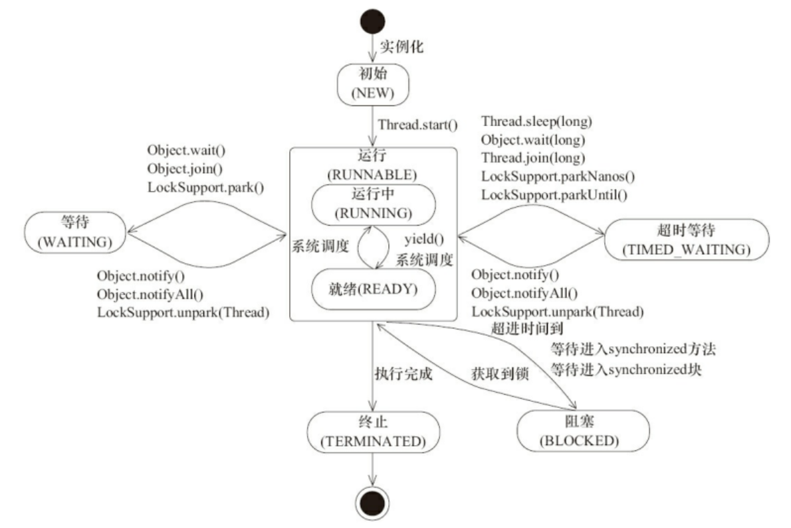

### 一:基本概念

#### 1.程序、进程、线程概念

**程序(program)**是为完成特定任务、用某种语言编写的一组指令的集合。即指一段静态的代码，静态对象。

**进程(process)**是代码在数据集合上的一次运行活动，是系统进行资源分配和调度的基本单位。系统运行一个程序即是一个进程从创建，运行到消亡的过程。

**线程(thread)**是进程的一个执行路径，一个进程中至少有一个线程，进程中的多个线程共享进程的堆和方法区资源，但每个线程都有自己的程序计数器、虚拟机栈和本地方法栈。线程是CPU分配的基本单位。

在windows中查看任务管理器的方式，可以看到window当前运行的进程(.exe文件的运行)：


小结：<div style="color:red;">

- 程序(program)是为完成指定任务,用某种语言编写的一组指令集合.指一段静态的代码
- 进程(process)是正在运行的一个程序.是一个动态的过程
- 线程(thread)是一个程序内部的一条执行路径

</div>

#### 2.线程与进程的关系与区别

一个进程中可以有多个线程，多个线程共享进程的**堆**和**方法区 (JDK1.8 之后的元空间)**资源，但是每个线程有自己的**程序计数器**、**虚拟机栈** 和 **本地方法栈**。

线程 是 进程 划分成的更小的运行单位。线程和进程最大的不同在于基本上各进程是独立的，而各线程则不一定，因为同一进程中的线程极有可能会相互影响。线程执行开销小，但不利于资源的管理和保护；而进程正相反


程序计数器:

-   字节码解释器通过改变程序计数器来依次读取指令，实现代码流程控制
-   多线程情况下，程序计数器用于记录当前线程执行的位置，知道线程切换回来运行到哪了
-   只有执行的是java代码时程序计数器记录的才是下一条指令地址. 若是native方法,记录的是undefined地址

程序计数器私有主要是为了**线程切换后能恢复到正确的执行位置**。

虚拟机栈与本地方法栈:

-   **虚拟机栈：** 每个 Java 方法在执行的同时会创建一个栈帧用于存储局部变量表、操作数栈、常量池引用等信息。从方法调用直至执行完成的过程，就对应着一个栈帧在 Java 虚拟机栈中入栈和出栈的过程。
-   **本地方法栈：** 和虚拟机栈所发挥的作用非常相似，区别是： **虚拟机栈为虚拟机执行 Java 方法 （也就是字节码）服务，而本地方法栈则为虚拟机使用到的 Native 方法服务。** 在 HotSpot 虚拟机中和 Java 虚拟机栈合二为一。

为了**保证线程中的局部变量不被别的线程访问到**，虚拟机栈和本地方法栈是线程私有的。

堆和方法区: 

-   堆和方法区是所有线程共享的资源，其中**堆**是进程中最大的一块内存，主要用于**存放新创建的对象** (所有对象都在这里分配内存)，**方法区**主要用于存放**已被加载的类信息、常量、静态变量、即时编译器编译后的代码**等数据。

#### 3.单核CPU,多核CPU的理解

1.  单核CPU,实质是一种假的多线程,在一个时间单元内,也只能执行一个线程的任务.
2.  多核CPU是多线程,每个核单独执行一个线程的任务.
3.  一个java应用程序java.exe,至少有三个线程:**main()主线程,gc()垃圾回收线程,异常处理线程.**

#### 4.并行与并发区别

1.  **并行:多个CPU同时执行多个任务.(多个人同时做不同的事)** ; 单位时间内，多个任务同时执行。
2.  **并发:一个CPU(采用时间片)同时执行多个任务.(多个人做同一件事)** ; 同一时间段，多个任务都在执行 (单位时间内不一定同时执行)

#### 5.使用多线程好处及可能带来的问题

从总体上来说：

-   **从计算机底层来说：** 线程可以比作是轻量级的进程，是程序执行的最小单位,线程间的切换和调度的成本远远小于进程。另外，多核 CPU 时代意味着多个线程可以同时运行，这减少了线程上下文切换的开销。
-   **从当代互联网发展趋势来说：** 现在的系统动不动就要求百万级甚至千万级的并发量，而多线程并发编程正是开发高并发系统的基础，利用好多线程机制可以大大提高系统整体的并发能力以及性能。

**提高应用程序的响应, 提高CPU的利用率, 改善程序结构**

并发编程的目的就是为了能提高程序的执行效率提高程序运行速度，但是并发编程并不总是能提高程序运行速度的，而且并发编程可能会遇到很多问题，比如：**内存泄漏、上下文切换、死锁还有受限于硬件和软件的资源闲置问题**。

#### 6.何时需要多线程

-   程序需要同时执行两个或多个任务.
-   程序需要实现一些需要等待的任务, 如用户输入、文件读写操作、网络操作、搜索等
-   需要一些后台运行的程序时.

### 二:线程的创建和使用

JVM允许程序运行多个线程,通过**java.lang.Thread**类体现.JDK1.5之前有两种方式创建线程: **继承Thread类 和 实现Runnable接口**. JDK5新增创建方式: **实现Callable接口 和 线程池**

#### 1.继承Thread类

##### 1.1 Thread类特性

-   **每个线程都是通过某个特定Thread对象的run()方法完成操作的**,常把run()方法的主体称为**线程体**.
-   **通过Thread对象的start()方法启动线程**,不是直接调用run()方法

##### 1.2 Thread类构造器

-   `Thread()` : **创建Thread对象**
-   `Thread(String threadname)` : 创建线程并指定线程实例名
-   `Thread(Runnable target)` : **创出线程的目标对象,它实现了Runnable接口的run()**
-   `Thread(Runnable target, String name)` : 创建新的Thread对象

##### 1.3 流程

-   **继承Thread**
-   **重写Thread中的run()**
-   **创建线程对象**
-   **调用对象的start(): 启动线程,调用run()**

##### 1.4 注意点

-   **对象调用run()方法,没有启动多线程模式**,
-   run()方法由JVM掉用,什么时候,执行过程都由CPU调度决定.
-   **启动多线程,必须调用start()方法**.
-   **一个线程对象不能重复调用start()方法,否则发生 "线程状态不符" 异常**

##### 1.5 示例

```java
//1. 创建一个继承于Thread类的子类
class MyThread extends Thread {
    public MyThread(){}
    public MyThread(String name){ super(name); }

    //2. 重写Thread类的run()
    @Override
    public void run() {
        for (int i = 0; i < 100; i++) {
            if (i % 2 == 0) {
                /*public Thread() {
                    init(null, null, "Thread-" + nextThreadNum(), 0);
                }*/
                System.out.println(Thread.currentThread().getName() + ":" + i);
            }
        }
    }
}

public class ThreadTest {
    public static void main(String[] args) {
        //3. 创建Thread类的子类的对象
//        MyThread t1 = new MyThread();
        MyThread t1 = new MyThread("分线程");
        //设置线程名称
//        t1.setName("线程一");

        //4.通过此对象调用start():①启动当前线程 ② 调用当前线程的run()
        t1.start();

        //问题一：我们不能通过直接调用run()的方式启动线程。
//        t1.run();
        //问题二：再启动一个线程，遍历100以内的偶数。不可以还让已经start()的线程去执行。
        /*if (threadStatus != 0)
            throw new IllegalThreadStateException();*/
//        t1.start();       // java.lang.IllegalThreadStateException

        //我们需要重新创建一个线程的对象
        MyThread t2 = new MyThread();
        t2.start();
        Thread.currentThread().setName("主线程");

        //如下操作仍然是在main线程中执行的。
        for (int i = 0; i < 100; i++) {
            if (i % 2 == 0) {
                System.out.println(Thread.currentThread().getName() + ":" + i);
            }
        }
    }
}
```
#### 2.实现Runnable接口

##### 2.1 流程

-   **实现Runnable接口.**
-   **重写Runnable接口中的run()方法.**
-   **通过Thread(Runnable target)构造器创建线程对象.**
-   **调用start()方法: 开启线程,调用Runnable子类接口的run()方法.**

##### 2.2 示例

```java
//1. 创建一个实现了Runnable接口的类
class MyThread2 implements Runnable{
    //2. 实现类去实现Runnable中的抽象方法：run()
    @Override
    public void run() {
        for (int i = 0; i <= 100 ; i++) {
            if (i % 2 == 0){
                System.out.println(Thread.currentThread().getName()+":"+i);
            }
        }
    }
}

public class ThreadTest2 {
    public static void main(String[] args) {
        //3. 创建实现类的对象
        MyThread2 r1 = new MyThread2();
        //4. 将此对象作为参数传递到Thread类的构造器中，创建Thread类的对象
        Thread t1 = new Thread(r1);
        t1.setName("线程1");
        //5. 通过Thread类的对象调用start():① 启动线程 ②调用当前线程的run()
        // -->调用了Runnable类型的target的run()
        t1.start();

        //再启动一个线程，遍历100以内的偶数
        Thread t2 = new Thread(r1);
        t2.setName("线程2");
        t2.start();
    }
}
```
#### 3.两种方式的联系与区别

`public class Thread extends Object implements Runnable{ ... }`

联系: **都需要重写run()方法,将线程要执行的逻辑都声明在run()中**

实现Runnable接口方式的好处
-   **避免了单继承的局限性**
-   **多个线程可以共享同一个接口实现类的对象,适合处理多个线程有共享数据的情况**

#### 4.实现Callable接口

##### 4.1 流程

-   **创建一个实现Callable接口的实现类**
-   **重写call方法**，将此线程需要执行的操作声明在call()中
-   **创建Callable接口实现类的对象**
-   将此Callable接口实现类的对象作为参数传递到FutureTask构造器中，**创建FutureTask的对象**
-   将FutureTask的对象作为参数传递到Thread类的构造器中，**创建Thread对象**
-   **调用start()** , 开启线程, 调用Callable实现类的call()方法

##### 4.2 Callable接口相对于Runnable接口的优势

-   call() 可以有**返回值**
-   call() 可以**抛出异常**,被外面操作捕获,获取异常信息
-   Callable **支持泛型**

##### 4.3 说明

```java
public class FutureTask<V> implements RunnableFuture<V>{ ... }

public interface RunnableFuture<V> extends Runnable, Future<V> {
    /**
     * Sets this Future to the result of its computation
     * unless it has been cancelled.
     */
    void run();
}
```

FutureTask是Future接口的唯一的实现类,**FutureTask 同时继承了Runnable, Future接口。它既可以作为**
**Runnable被线程执行，又可以作为Future得到Callable的返回值**.

##### 4.4 示例

```java
/**
 * 实现Callable接口
 *
 * @author zlg
 * @create 2019-11-16 15:21
 */
//1.创建一个实现Callable的实现类
class NumThread implements Callable<Integer>{

    //2.实现call方法，将此线程需要执行的操作声明在call()中
    @Override
    public Integer call() throws Exception {
        int sum = 0;
        for (int i = 1; i <= 100; i++) {
            if (i % 2 == 0){
                System.out.println(i);
                sum += i;
            }
        }
        return sum;
    }
}

public class ImplementTest2 {
    public static void main(String[] args) {
        //3.创建Callable接口实现类的对象
        NumThread numThread = new NumThread();
        //4.将此Callable接口实现类的对象作为传递到FutureTask构造器中，创建FutureTask的对象
        // public interface RunnableFuture<V> extends Runnable, Future<V>
        FutureTask<Integer> integerFutureTask = new FutureTask<>(numThread);
        //5.将FutureTask的对象作为参数传递到Thread类的构造器中，创建Thread对象，并调用start()
        Thread thread = new Thread(integerFutureTask);
        thread.start();
        try {
            //6.获取Callable中call方法的返回值
            //get()返回值即为FutureTask构造器参数Callable实现类重写的call()的返回值。
            Integer integer = integerFutureTask.get();
            System.out.println("输出为: " + integer);
        } catch (InterruptedException e) {
            e.printStackTrace();
        } catch (ExecutionException e) {
            e.printStackTrace();
        }
    }
}
```

#### 5.使用线程池

##### 5.1 概述

提前创建好多个线程，放入线程池中，使用时直接获取，使用完放回池中。可以避免频繁创建销毁、实现重复利用。**线程池**提供了一种限制和管理资源（包括执行一个任务）。 每个**线程池**还维护一些基本统计信息，例如已完成任务的数量。

使用线程池的好处:

-   **提高响应速度**（当任务到达时，任务可以不需要的等到线程创建就能立即执行）
-   **降低资源消耗**（通过重复利用已创建的线程降低线程创建和销毁造成的消耗）
-   **便于线程管理**（线程是稀缺资源，如果无限制的创建，不仅会消耗系统资源，还会降低系统的稳定性，使用线程池可以进行统一的分配，调优和监控）
    -   corePoolSize：核心池的大小
    -   maximumPoolSize：最大线程数
    -   keepAliveTime：线程没有任务时最多保持多长时间后会终止

##### 5.2 相关API

ExecutorService：真正的线程池接口。常见子类**ThreadPoolExecutor**

-   `void execute(Runnable command)`  ：执行任务/命令，没有返回值，一般用来执行Runnable对象
-   `<T> Future<T> submit(Callable<T> task)` ：执行任务，有返回值，一般又来执行Callable对象
-   `void shutdown()`  ：关闭连接池

Executors：工具类、线程池的工厂类，用于创建并返回不同类型的线程池

-   `Executors.newFixedThreadPool(n) ` ： 创建一个可重用固定线程数的线程池
-   `Executors.newSingleThreadExecutor()`  ：创建一个只有一个线程的线程池
-   `Executors.newCachedThreadPool()` ：创建一个可根据需要创建新线程的线程池
-   `Executors.newScheduledThreadPool(n)` ：创建一个线程池，它可安排在给定延迟后运行命令或者定期地执行。

##### 5.3 示例

```java
/**
 * 使用线程池
 *
 * @author zlg
 * @create 2019-12-06 20:45
 */
class NumThread2 implements Runnable {
    @Override
    public void run() {
        for (int i = 1; i <= 100; i++) {
            if (i % 2 != 0){
                System.out.println(i);
            }
        }
    }
}
class NumThread3 implements Callable<Integer>{
    @Override
    public Integer call() throws Exception {
        int sum = 0;
        for (int i = 1; i <= 100; i++) {
            if (i % 2 == 0){
                System.out.println(i);
                sum += i;
            }
        }
        return sum;
    }
}

public class ThreadPoolTest {
    public static void main(String[] args) throws ExecutionException, InterruptedException {
        //1. 提供指定线程数量的线程池
        ExecutorService executorService = Executors.newFixedThreadPool(16);
        ThreadPoolExecutor service = (ThreadPoolExecutor) executorService;
        //设置线程池的属性
//        System.out.println(executorService.getClass());
//        service.setCorePoolSize(15);
//        service.setKeepAliveTime();

        //2.执行指定的线程的操作。需要提供实现Runnable接口或Callable接口实现类的对象
        executorService.execute(new NumThread2());  //适合适用于Runnable
        Future<Integer> submit = executorService.submit(new NumThread3()); //适合使用于Callable
        System.out.println(submit.get());   // 2550

        //3.关闭连接池
        executorService.shutdown();
    }
}
```

### 三:Thread类的相关方法

| 方法                                    | 描述                                       |
| ------------------------------------- | ---------------------------------------- |
| **void start()**                      | 启动当前线程,并执行当前线程的run()方法                   |
| **run()**                             | 被CPU调度时执行的操作,将创建的线程要执行的操作声明在此方法中         |
| String getName()                      | 返回线程的名称                                  |
| void setName(String name)             | 设置线程的名称                                  |
| static Thread currentThread()         | 返回执行当前代码的线程. 在Thread子类中指this, 通常用于主线程和Runnable实现类 |
| **static void yield()**               | 释放当前cpu的执行权                              |
| **join()**                            | 在线程a中调用线程b的join(),此时线程a就进入阻塞状态，直到线程b完全执行完以后，线程a才结束阻塞状态 |
| **static void sleep(long millitime)** | 让当前线程“睡眠”指定的millitime毫秒。在指定的millitime毫秒时间内，当前线程是阻塞状态 |
| boolean isAlive()                     | 判断当前线程是否存活                               |
| stop()                                | 强制线程生命周期结束,不推荐使用                         |

应用:

```java
/**
 * 示例：创建两个分线程，其中一个线程遍历100以内的偶数，另一个线程遍历100以内的奇数
 *
 * @author zlg
 * @create 2019-10-25 1:56
 */
public class ThreadDemo {
    public static void main(String[] args) {
//        MyThread1 m1 = new MyThread1();
//        MyThread3 m2 = new MyThread3();
//        m1.start();
//        m3.start();

      	// 方式二:采用匿名内部类
        //创建Thread类的匿名子类的方式:遍历偶数
        new Thread(){
            @Override
            public void run() {
                for (int i = 0; i < 100; i++) {
                    if(i % 2 == 0){
                        System.out.println(Thread.currentThread().getName() + ":" + i);
                    }
                }
            }
        }.start();

		//创建Thread类的匿名子类的方式:遍历奇数
        new Thread(){
            @Override
            public void run() {
                for (int i = 0; i < 100; i++) {
                    if(i % 2 != 0){
                        System.out.println(Thread.currentThread().getName() + ":" + i);
                    }
                }
            }
        }.start();

    }
}

//方式一:采用两个类分别执行不同任务
// 遍历100以内偶数
class MyThread1 extends Thread{
    @Override
    public void run() {
        for (int i = 0; i < 100; i++) {
            if(i % 2 == 0){
                System.out.println(Thread.currentThread().getName() + ":" + i);
            }
        }
    }
}

// 遍历100以内奇数
class MyThread3 extends Thread{
    @Override
    public void run() {
        for (int i = 0; i < 100; i++) {
            if(i % 2 != 0){
                System.out.println(Thread.currentThread().getName() + ":" + i);
            }
        }
    }
}
```

### 四:线程的优先级及分类

调用策略: **时间片**(单元时间内做任务切换) 或 **抢占式**(高优先级的线程抢占CPU)

调度方法: **同优先级**线程组成先进先出队列(先到先服务),使用时间片策略; 对**高优先级**,使用抢占式策略

线程优先级:
-   **MAX_PRIORITY: 10;  MIN_PRIORITY: 1;  NORM_PRIORITY: 5;(默认优先级)**
-   **getPriority(): 返回线程等级值;  setPriority(int newPriority): 设置线程等级值**
-   **说明: 线程创建时继承父线程的优先级; 低优先级只是获得调度的概率低,并不一定在高优先级线程之后才被调用**

线程分类:
-   分为**守护线程 和 用户线程**.
-   守护线程是用来服务用户线程的,在**start()方法前调用thread.setDaemon(true)可以把一个用户线程变为一个守护线程.**
-   java垃圾回收就是一个守护线程.**若JVM中都是守护线程,当前JVM将退出**.

示例:

```java
class HelloThread extends Thread{
    @Override
    public void run() {
        for (int i = 0; i < 100; i++) {
            if(i % 2 == 0){

//                try {
//                    sleep(10);
//                } catch (InterruptedException e) {
//                    e.printStackTrace();
//                }

                System.out.println(Thread.currentThread().getName() + ":" + Thread.currentThread().getPriority() + ":" + i);
            }

//            if(i % 20 == 0){
//                yield();
//            }
        }
    }

    public HelloThread(String name){
        super(name);
    }
}


public class ThreadMethodTest {
    public static void main(String[] args) {
        HelloThread h1 = new HelloThread("Thread：1");

//        h1.setName("线程一");
        //设置分线程的优先级
        h1.setPriority(Thread.MAX_PRIORITY);
        h1.start();

        //给主线程命名
        Thread.currentThread().setName("主线程");
        Thread.currentThread().setPriority(Thread.MIN_PRIORITY);

        for (int i = 0; i < 100; i++) {
            if(i % 2 == 0){
                System.out.println(Thread.currentThread().getName() + ":" + Thread.currentThread().getPriority() + ":" + i);
            }

//            if(i == 20){
//                try {
//                    h1.join();
//                } catch (InterruptedException e) {
//                    e.printStackTrace();
//                }
//            }
        }

//        System.out.println(h1.isAlive());
    }
}
```

### 五:线程的生命周期

#### 1.Thread.State类及生命周期

Java 线程在运行的生命周期中的指定时刻只可能处于下面 6 种不同状态的其中一个状态,Thread.State类定义了线程的几种状态:

```java
public class Thread implements Runnable {
  
	public enum State {
      	/**
         * 初始状态,线程被构建,但是还没有调用start()方法
         */
        NEW,

        /**
         * 运行状态,Java线程将操作系统中的就绪和运行两种状态笼统称作"运行中"
         * 就绪 -> 运行: Thread.start()方法后,将进入线程队列等待CPU时间片
         * 运行 -> 就绪: yield()方法
         */
        RUNNABLE,

        /**
         * 阻塞状态,表示线程阻塞于锁
         * 阻塞: 被人为挂起或执行输入输出操作时,让出CPU并临时终止自己的执行,进入阻塞状态
         * 等待进入synchronized方法,等待进入synchronized块
         * 获取到锁
         */
        BLOCKED,

        /**
         * 等待状态,表示线程进入等待状态,表示当前线程需要等待其它线程做出一些特点动作(通知或中断)
         * Object.wait(),Object.join(),LockSupport.park()
         * Object.notify(),Ojbect.notifyAll(),LockSupport.unpark(Thread)
         */
        WAITING,

        /**
         * 超时等待状态,该状态不同于 WAITING,它是可以在指定的时间自行返回
         * Thread.sleep(long),Object.wait(long),Thread.join(long),LockSupport.parkNanos(),LockSupport.parkUntil()
         * Object.notify(),Ojbect.notifyAll(),LockSupport.unpark(Thread)
         */
        TIMED_WAITING,

        /**
         * 终止状态,表示当前线程已经执行完毕(执行完run()方法)
         * 死亡: 线程完成全部工作或被提前强制性终止或出现异常导致结束
         */
        TERMINATED;
    }
  
}
```

在一个完整的生命周期中通常要经历五种状态:

1.  **新建**: 当一个Thread类或其子类的对象被声明并创建时
2.  **就绪**: start()方法后,将进入线程队列等待CPU时间片
3.  **运行**: 当就绪的线程被调度并获得CPU资源时,便进入运行状态
4.  **阻塞**: 被人为挂起或执行输入输出操作时,让出CPU并临时终止自己的执行,进入阻塞状态
5.  **死亡**: 线程完成全部工作或被提前强制性终止或出现异常导致结束


图示中把等待(waiting),超时等待(timed_waiting)和阻塞(blocked)都放在了阻塞这一块,方便理解生命周期.

#### 2.线程状态转换图



-   NEW --> READY --> RUNNING:

    线程创建之后它将处于 **NEW（新建）** 状态，调用 `start()` 方法后开始运行，线程这时候处于 **READY（可运行）** 状态。可运行状态的线程获得了 CPU 时间片（timeslice）后就处于 **RUNNING（运行）** 状态。Java线程将操作系统中的就绪和运行两种状态笼统称作**RUNNABLE(运行中)** .

-   RUNNING --> READY:

    当线程调用 `yield()` 方法或失去CPU执行权后,会进入可运行状态.

-   RUNNING --> WAITING --> READY:

    当线程执行 `wait()`方法之后，线程进入 **WAITING（等待）** 状态。进入等待状态的线程需要依靠其他线程的**通知**才能够返回到运行状态.

-   RUNNING  --> TIME_WAITING --> READY:

    而 **TIME_WAITING(超时等待)** 状态相当于在等待状态的基础上增加了超时限制，比如通过 `sleep（long millis）`方法或 `wait（long millis）`方法可以将 Java 线程置于 TIMED_WAITING 状态。当超时**时间到达后** Java 线程将会返回到 RUNNABLE 状态。

-   RUNNING --> BLOCKED --> READY:

    当线程调用同步方法时，在**没有获取到锁**的情况下，线程将会进入到 **BLOCKED（阻塞）** 状态。

-   RUNNING --> TERMINATED:

    线程在执行 Runnable 的`run()`方法之后将会进入到 **TERMINATED（终止）** 状态。

#### 3.启动线程为什么不能直接调用run()方法

new 一个 Thread，线程进入了新建状态;调用 start() 方法，会启动一个线程并使线程进入了就绪状态，当分配到时间片后就可以开始运行了。 start() 会执行线程的相应准备工作，然后自动执行 run() 方法的内容，这是真正的多线程工作。 而直接执行 run() 方法，会把 run 方法当成一个 main 线程下的普通方法去执行，并不会在某个线程中执行它，所以这并不是多线程工作。

**总结：** <span style="color:red;">调用 start 方法方可启动线程并使线程进入就绪状态，而 run 方法只是 thread 的一个普通方法调用，还是在主线程里执行。</span>

#### 4.上下文切换

多线程编程中一般线程的个数都大于 CPU 核心的个数，而一个 CPU 核心在任意时刻只能被一个线程使用，为了让这些线程都能得到有效执行，CPU 采取的策略是**为每个线程分配时间片并轮转的形式。当一个线程的时间片用完的时候就会重新处于就绪状态让给其他线程使用，这个过程就属于一次上下文切换。**

概括来说就是：当前任务在执行完 CPU 时间片切换到另一个任务之前会先保存自己的状态，以便下次再切换回这个任务时，可以再加载这个任务的状态。**任务从保存到再加载的过程就是一次上下文切换**。

上下文切换通常是计算密集型的。也就是说，它需要相当可观的处理器时间，在每秒几十上百次的切换中，每次切换都需要纳秒量级的时间。所以，上下文切换对系统来说意味着消耗大量的 CPU 时间，事实上，可能是操作系统中时间消耗最大的操作。

Linux 相比与其他操作系统（包括其他类 Unix 系统）有很多的优点，其中有一项就是，其上下文切换和模式切换的时间消耗非常少。

### 六:线程的同步

多线程的安全问题

-   问题原有: 当多条语句在操作同一个线程共享数据时,一个线程对多条语句只执行了一部分,另一个线程就参与进来执行,导致共享数据的错误.
-   解决办法: 对多条操作共享数据的语句,只能让一个线程都执行完,在执行过程中,其他线程不可以参与执行.

#### 1.synchronized

##### 1.1 synchronized关键字概述

<span style="color:red;">synchronized关键字解决的是多个线程之间访问资源的同步性，synchronized关键字可以保证被它修饰的方法或者代码块在任意时刻只能有一个线程执行。</span>

synchronized关键字最主要的三种使用方式：

-   **修饰实例方法:** 作用于当前对象实例加锁，进入同步代码前要获得<span style="color:red;">当前对象</span>实例的锁
-   **修饰静态方法:** 也就是给当前类加锁，会作用于类的<span style="color:red;">所有对象</span>实例，因为静态成员不属于任何一个实例对象，是类成员（ static 表明这是该类的一个静态资源，不管new了多少个对象，只有一份）。所以如果一个线程A调用一个实例对象的非静态 synchronized 方法，而线程B需要调用这个实例对象所属类的静态 synchronized 方法，是允许的，不会发生互斥现象，**因为访问静态 synchronized 方法占用的锁是当前类的锁，而访问非静态 synchronized 方法占用的锁是当前实例对象锁**。
-   **修饰代码块:** 指定加锁对象，对<span style="color:red;">给定对象</span>加锁，进入同步代码库前要获得给定对象的锁。

**总结：** <span style="color:red;">synchronized 关键字加到 static 静态方法和 synchronized(class)代码块上都是是给 Class 类上锁。synchronized 关键字加到实例方法上是给对象实例上锁。尽量不要使用 synchronized(String a) 因为JVM中，字符串常量池具有缓存功能！</span>

##### 1.2 同步代码块

```java
synchronized(对象){
  // 需要被同步的代码;
}
```

说明：
-   操作共享数据的代码，即为需要被同步的代码。  -->不能包含代码多了，也不能包含代码少了。
-   共享数据：多个线程共同操作的变量。比如：ticket就是共享数据。
-   同步监视器，俗称：锁。任何一个类的对象，都可以充当锁。

要求：多个线程必须要共用同一把锁。

补充：

- 在继承Thread类创建多线程的方式中，慎用this充当同步监视器，考虑使用当前类充当同步监视器。
- 在实现Runnable接口创建多线程的方式中，我们可以考虑使用this充当同步监视器。


```java
/**
 * 应用:创建三个窗口卖票，总票数为100张
 * 1.问题：卖票过程中，出现了重票、错票 -->出现了线程的安全问题
 * 2.问题出现的原因：当某个线程操作车票的过程中，尚未操作完成时，其他线程参与进来，也操作车票。
 * 3.如何解决：当一个线程a在操作ticket的时候，其他线程不能参与进来。直到线程a操作完ticket时，其他
 *            线程才可以开始操作ticket。这种情况即使线程a出现了阻塞，也不能被改变。
 */

//方式一:采用继承类的方式
class Window1 extends Thread{
    // 共享资源需要加上static
    private static int ticket = 100;

    @Override
    public void run() {
        while (true){
            //同步方法
//            handleTicket();

            // 同步代码块
            // 不能使用this,this代表w1,w2,w3
            synchronized (Window1.class) {   //Class clazz = Window1.class,Window1.class只会加载一次
                if (ticket > 0){
                    try {
                        sleep(10);
                    } catch (InterruptedException e) {
                        e.printStackTrace();
                    }
                    System.out.println(getName()+":"+ticket);
                    ticket--;
                }else {
                    break;
                }
            }
        }
    }

    // 方式一
    /*private void handleTicket() {
        // 同步代码块
        synchronized (Window.class) {   //Class clazz = Window.class
            if (ticket > 0){
                System.out.println(getName()+":"+ticket);
                ticket--;
            }
        }
    }*/
    // 方式二
    // 同步方法: 需要加上static,保证是同一个对象锁
    // 方法不加static时,同步监视器：w1,w2,w3
    private static synchronized void handleTicket() {   // 同步监视器：Window.class
        if (ticket > 0){
            try {
                //sleep()方法属于静态方法,与对象无关
                sleep(10);
            } catch (InterruptedException e) {
                e.printStackTrace();
            }
            // static方法内容不能使用this,super关键字
            System.out.println(Thread.currentThread().getName()+":"+ticket);
            ticket--;
        }
    }
}

public class ExtendsTest {
    public static void main(String[] args) {
        Window1 w1 = new Window1();
        Window1 w2 = new Window1();
        Window1 w3 = new Window1();

        w1.setName("窗口一");
        w2.setName("窗口二");
        w3.setName("窗口三");

        w1.start();
        w2.start();
        w3.start();
    }
}
```


##### 1.3 同步方法

```java
public synchronized void add (String id){
  ......
}
```

如果操作共享数据的代码完整的声明在一个方法中，我们不妨将此方法声明同步的。
1. 同步方法仍然涉及到同步监视器，只是不需要我们显式的声明。
2. 非静态的同步方法，同步监视器是：this
         静态的同步方法，同步监视器是：当前类本身

同步的方式，解决了线程的安全问题。---好处
操作同步代码时，只能有一个线程参与，其他线程等待。相当于是一个单线程的过程，效率低。 ---局限性

应用:

```java
/**
 * 应用:创建三个窗口卖票，总票数为100张
 * 1.问题：卖票过程中，出现了重票、错票 -->出现了线程的安全问题
 * 2.问题出现的原因：当某个线程操作车票的过程中，尚未操作完成时，其他线程参与进来，也操作车票。
 * 3.如何解决：当一个线程a在操作ticket的时候，其他线程不能参与进来。直到线程a操作完ticket时，其他
 *            线程才可以开始操作ticket。这种情况即使线程a出现了阻塞，也不能被改变。
 */
 
//方式二:采用实现接口的方式
class Window2 implements Runnable{
    // 不需要加static
    private int ticket = 100;

    @Override
    public void run() {
        while (true){
            //同步方法
//            handleTicket();

            //同步代码块
            synchronized (this) {   //此时的this:唯一的Window2的对象
                if(ticket > 0){
                    try {
                        Thread.sleep(20);
                    } catch (InterruptedException e) {
                        e.printStackTrace();
                    }
                    // getName()属于Thread的方法
                    System.out.println(Thread.currentThread().getName()+":"+ticket);
                    ticket--;
                }else {
                    break;
                }
            }
        }
    }

    //方式一
    /*private void handleTicket() {
        // 同步代码块
        synchronized (this) {   //同步监视器：this
            if(ticket > 0){
                System.out.println(Thread.currentThread().getName()+":"+ticket);
                ticket--;
            }
        }
    }*/
    //方式二
    //同步方法: 不需要加static
    private synchronized void handleTicket() {  //同步监视器：this
        if(ticket > 0){
            System.out.println(Thread.currentThread().getName()+":"+ticket);
            ticket--;
        }
    }
}

public class ImplementTest {
    public static void main(String[] args) {
        Window2 w1 = new Window2();

        Thread t1 = new Thread(w1);
        Thread t2 = new Thread(w1);
        Thread t3 = new Thread(w1);

        t1.setName("窗口一");
        t2.setName("窗口二");
        t3.setName("窗口三");

        t1.start();
        t2.start();
        t3.start();
    }
}
```

#### 2.线程死锁

#### 3.lock

1.  synchronized 与 Lock的异同？

    相同：二者都可以解决线程安全问题
    不同：synchronized机制在执行完相应的同步代码以后，自动的释放同步监视器
    Lock需要手动的启动同步（lock()），同时结束同步也需要手动的实现（unlock()）

2.  优先使用顺序：

     Lock > 同步代码块（已经进入了方法体，分配了相应资源）> 同步方法（在方法体之外）

3.  代码:

```java
class Window implements Runnable{
    private int ticket = 100;
    //1.实例化ReentrantLock
    private ReentrantLock lock = new ReentrantLock();

    @Override
    public void run() {
        while(true){
            try{
                //2.调用锁定方法lock()
                lock.lock();

                if(ticket > 0){

                    try {
                        Thread.sleep(100);
                    } catch (InterruptedException e) {
                        e.printStackTrace();
                    }

                    System.out.println(Thread.currentThread().getName() + "：售票，票号为：" + ticket);
                    ticket--;
                }else{
                    break;
                }
            }finally {
                //3.调用解锁方法：unlock()
                lock.unlock();
            }
        }
    }
}

public class LockTest {
    public static void main(String[] args) {
        Window w = new Window();

        Thread t1 = new Thread(w);
        Thread t2 = new Thread(w);
        Thread t3 = new Thread(w);

        t1.setName("窗口1");
        t2.setName("窗口2");
        t3.setName("窗口3");

        t1.start();
        t2.start();
        t3.start();
    }
}
```

### 七:线程的通信

#### 1.涉及到的三个方法

1.  wait():一旦执行此方法，当前线程就进入阻塞状态，并释放同步监视器。
2.  notify():一旦执行此方法，就会唤醒被wait的一个线程。如果有多个线程被wait，就唤醒优先级高的那个。
3.  notifyAll():一旦执行此方法，就会唤醒所有被wait的线程。

#### 2.说明

1.  wait()，notify()，notifyAll()三个方法必须使用在同步代码块或同步方法中。
2.  wait()，notify()，notifyAll()三个方法的调用者必须是同步代码块或同步方法中的同步监视器。否则，会出现IllegalMonitorStateException异常.
3.  wait()，notify()，notifyAll()三个方法是定义在java.lang.Object类中。

#### 3.sleep() 和 wait()的异同？

相同点：一旦执行方法，都可以使得当前的线程进入阻塞状态。

不同点：
-   两个方法声明的位置不同：Thread类中声明sleep() , Object类中声明wait()
-   调用的要求不同：sleep()可以在任何需要的场景下调用。 wait()必须使用在同步代码块或同步方法中
-   关于是否释放同步监视器：如果两个方法都使用在同步代码块或同步方法中，**sleep()不会释放锁，wait()会释放锁**
-   Wait 通常被用于线程间交互/通信，sleep 通常被用于暂停执行
-   wait() 方法被调用后，线程不会自动苏醒，需要别的线程调用同一个对象上的 notify() 或者 notifyAll() 方法。sleep() 方法执行完成后，线程会自动苏醒。使用 wait(long timeout)超时后线程也会自动苏醒

#### 4.示例

```java
class Number implements Runnable{
    private int number = 1;
    private Object obj = new Object();
    @Override
    public void run() {
        while(true){

            synchronized (obj) {
                obj.notify();

                if(number <= 100){
                    try {
                        Thread.sleep(10);
                    } catch (InterruptedException e) {
                        e.printStackTrace();
                    }
                    System.out.println(Thread.currentThread().getName() + ":" + number);
                    number++;

                    try {
                        //使得调用如下wait()方法的线程进入阻塞状态
                        obj.wait();
                    } catch (InterruptedException e) {
                        e.printStackTrace();
                    }

                }else{
                    break;
                }
            }
        }
    }
}

public class CommunicationTest {
    public static void main(String[] args) {
        Number number = new Number();
        Thread t1 = new Thread(number);
        Thread t2 = new Thread(number);

        t1.setName("线程1");
        t2.setName("线程2");

        t1.start();
        t2.start();
    }
}
```


