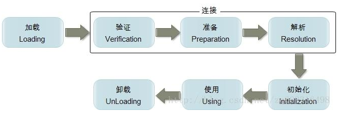
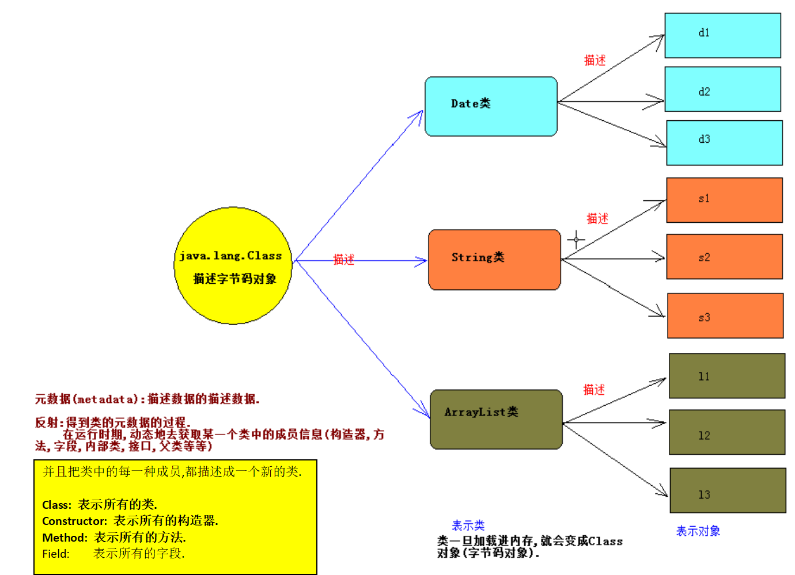

### 一.类加载机制与反射

#### 1.类加载机制

当调用java命令来运行某个java程序时，该命令将会启动一个JVM进程。同一个JVM中的所有线程，变量都处于同一个进程中，共享该JVM的内存区域。JVM进程一旦结束，该进程中内存中的数据将会丢失。

当出现以下情况，JVM会退出：

-   程序正常执行结束
-   使用System.exit(0)方法
-   出现异常时，没有捕获异常
-   平台强制结束JVM进程

当程序主动使用到某个类时,如果该类还未被加载进内存中,则系统会通过**加载,连接,初始化**三个步骤来对该类进行初始化操作.



1.  类的加载:

    **类加载时指将类的class文件(字节码文件)载入内存中,并为之创建一个java.lang.Class对象,我们称之为字节码对象.**

    类的加载过程由类加载器(ClassLoader)完成,类加载器通常有JVM提供,我们称之为系统类加载器,我们也可以继承ClassLoader类来提供自定义类加载器.

    不同的类加载器可以实现加载本地字节码文件,jar包中的字节码,通过网络加载字节码等.


2.  类的连接:

    当类被加载进内存之后,系统为之生产一个对应的Class对象,接着把类的二进制数据合并到JRE中.

    1.  验证:类是否有正确的内部结构.
    2.  准备:为类的static变量分配内存,并设置默认值.
    3.  解析:把类的二进制数据中的符号引用替换为直接引用(深入分析JVM).

3.  类的初始化:

    在此阶段,JVM负责对类进行初始化,主要就是对static变量进行初始化.类初始化一个类包含以下几个步骤:

    1.  如果该类还未被加载和连接,则程序先加载并连接该类.
    2.  如果该类的直接父类还未被初始化,则先初始化其父类.
    3.  系统依次执行初始化语句(静态代码块:为系统加载资源、初始化静态属性).

静态代码块用来初始化类（静态属性）:

```java
class Demo{
    static int age;
    static int num = 10;

    static{
           age = 0;
    }
}
```

#### 2.引出反射

对象有编译类型和运行类型:

-   `Object obj = new java.util.Date();`
-   编译类型: Object
-   运行类型: java.util.Date

需求: 通过obj对象,调用java.util.Date类中的toLocaleString方法. `obj.toLocaleString();`  此时编译报错. 编译时,会检查该编译类型中是否存在toLocaleString方法.如果存在,编译成功,否则编译失败.

解决方案: 因为obj的真实类型是java.util.Date类,所以可以把obj对象强制转换为java.util.Date类型.
`java.util.Date d = (java.util.Date)obj;` `d.toLocaleString();` 调用成功. 如果不知道obj的真实类型,就不能强转.

在面向对象中一切事物都可以看成是对象,那么问题来了,类这种事物是啥对象呢?又使用什么类来表示类这种对象呢?



### 二.Class类与Class实例

**Class类**: 用来描述类或者接口的类型,描述类的类. **Class类的实例**: 在JVM中的一份份字节码,Class实例表示在JVM中的类或者接口,枚举是一种特殊的类,注解是一种特殊的接口.

当程序第一次使用某一个java.util.Date类的时候,就会把该类的字节码对象加载进JVM,并创建出一个Class对象.
此时的Class对象就表示java.util.Date的字节码.

Class类可以表示N个类的字节码对象,问题,到底怎么区分Class类此时表示的那一个类的字节码呢?为了解决该问题,Class类的设计者提供了泛型.--->`Class<T>` .

-   java.lang.String类的字节码类型:  `Class<java.lang.String>` ;
-   java.util.Date类的字节码类型:  `Class<java.util.Date>` ;
-   java.util.ArrayList类的字节码类型:  `Class<java.util.ArrayList>` ;

一般创建对象都是new 一个对象, 当Class类中构造器 `private Class(){}` 私有了，Class类的对象是由JVM创建，不是我们创建. 同一个类在JVM中只存在一份字节码对象，即clz1 == clz2 == clz3,以后使用最多的是下列方式三创建.

**获取某类的字节码对象:**

```java
class ClassInstanceDemo{
	public static void main(String[] args) throws Exception{
		//需求：获取java.util.Date类的字节码对象
		//方式一：使用字节码对象的静态class属性		Class<T>:Class<Type>   Class<类型>
		Class<java.util.Date> clz1 = java.util.Date.class;
		//方式二：使用对象的getCalss()方法，getClass()是Object类中的方法，所有类都有getClass()方法；
		//getClass()表示获取当前类的真实类型(运行类型)
		Date date = new Date();
		Class<?> clz2 = date.getClass();
		//方式三：通过Class类中静态方法forName(String className)  --参数是类的全限定名称，并用双引号表示字符串
		Class<?> clz3 = Class.forName("java.util.Date");	//会声明异常，避免随意传入类的名称
		//class java.util.Date	一般是clz1.toStirng(); Class 中 toString()方法重写了
		System.out.println(clz1);	
		System.out.println(clz1==clz2);		//true
		System.out.println(clz1==clz3);		//true
		System.out.println(clz3==clz2);		//true
	}
}
```

在上述讲了三种获取Class对象的方式,基本数据类型不能表示为对象,也就不能使用getClass的方式,基本类型没有类名的概念,也不能使用Class.forName的方式,如何表示基本类型的字节码对象呢?

**所有的数据类型都有class属性. `Class clz = 数据类型.class;` Class表示基本数据类型的类型 ; 包装类表示基本数据类型的值.**

-   **九大内置Class实例**:  JVM中预先提供好的Class实例,分别:`byte,short,int,long,float,double,boolea,char,void` .表示:`byte.class,short.class,int.class,....void.class` . 
-   在**8大基本数据类型的包装类**中,都有一个常量:`TYPE` ,用于返回该包装类对应基本类的字节码对象. `System.out.println(Integer.TYPE == int.class); //true` . 注意:Integer和int是不同的数据类型. `System.out.println(Integer.class == int.class);//false` 
-   **数组的Class实例**: 数组是引用数据类型,数组其实是对象. 如何来表示数组的Class实例.方式一:`数组类型.class;` 方式二: `数组对象.getClass();` 注意:所有的具有相同的维数和相同元素类型的数组共享同一份字节码对象,和元素没有关系.

**Class**:  描述所有的类型,所以Class类中应该具有所有类型的相同的方法. **Object**: 描述所有的对象,所以在Object类中应该具有所有对象的共同的方法.

**获取基本数据类型和数组的字节码对象:**

```java
class DateTypeClassInstanceDemo{
	public static void main(String[] args){
		//八大基本数据类型Class实例
		Class intclass = int.class;
		Class booleanclass = boolean.class;
		
		//Integer.class 和 int.class相同吗？false，得出Integer和int是不同的数据类型
		System.out.println(Integer.class == int.class);
		System.out.println(intclass);	  //int
		System.out.println(Integer.class);		//class java.lang.Integer
   
		//Integer.TYPE 和 int.class相同
		System.out.println(Integer.TYPE == int.class);	//true
		System.out.println(Integer.TYPE);	//int
		//  -------------------------------------------------------------------------------
		int[] arr1 = {1,2,3,4,5};
		Class arr1class = arr1.getClass();
		Class arr2class = int[].class;
		System.out.println("arr1class:"+arr1class+"; arr2class:"+arr2class);
		//  所有的具有相同的维数和相同元素类型的数组共享同一份字节码对象,和元素没有关系
		int[][] arr2 = {};	//维数不同
		System.out.println(arr1class == int[][].class);		//false
		String[] arr3 = {};	//元素类型不同
		System.out.println(arr1class == arr3.getClass());	//false
		int[] arr4 = {6,7,8,9,0,1};
		System.out.println(arr1class == arr4.getClass());	//true
	}
}
```

### 三.获取类中的构造器及创建对象

#### 1.获取类中的构造器

通过反射来获取某一个类的构造器:

-   获取该类的字节码对象.
-   从该字节码对象中去找需要获取的构造器.

Class类获取构造器方法: **Constructor类表示类中构造器的类型,Constructor的实例就是某一个类中的某一个构造器**.

-   `public Constructor<?>[] getConstructors()` :该方法只能获取当前Class所表示类的public修饰的构造器
-   `public Constructor<?>[] getDeclaredConstructors()` :获取当前Class所表示类的所有的构造器,和访问权限无关
-   `public Constructor<T> getConstructor(Class<?>... parameterTypes)`  :获取当前Class所表示类中指定的一个public的构造器
-   `public Constructor<T> getDeclaredConstructor(Class<?>... parameterTypes)` :获取当前Class所表示类中指定的一个的构造
-   参数:parameterTypes表示构造器参数的Class类型. 如:`public User(String name){}; Constructor c =  clz.getConstructor(String.class);` 

示例:

```java
class User{
	public User(){
	}
	public User(String name){
	}
	private User(String name, int age){
	}
}
//获取构造器	方法签名 = 方法名 + 参数列表;
class GetConstructorDemo{
	public static void main(String[] args) throws Exception{
//		getAll();	//	获取多个构造器
		getOne();	//	获取某一个构造器
	}

	//	获取某一个构造器	--getConstructor();    getDeclaredConstructor();	方法结尾没有s
	public static void getOne() throws Exception{
		//1.获取构造器所在类的字节码对象
		Class<User> clz = User.class;
		//2.获取public User(){}
		Constructor cs = clz.getConstructor();
		System.out.println(cs);		//public User()
		//3.获取public User(String name)
		cs = clz.getConstructor(String.class);	//构造器参数的字节码类型
		System.out.println(cs);		//public User(java.lang.String)
		//4.获取private User(String name, int age){}
		cs = clz.getDeclaredConstructor(String.class,int.class);
		System.out.println(cs);		//private User(java.lang.String,int)
	}
	
	//	获取多个构造器	--getConstructors();    getDeclaredConstructors();	  方法结尾有s
	public static void getAll(){
		//1.获取构造器所在类的字节码对象
		Class<User> clz = User.class;
		//2.获取clz对象中的所有public构造器,用getConstructors()方法
		Constructor[] cs = clz.getConstructors();
		System.out.println(cs.length);
		for(int i=0; i<cs.length; i++){
			System.out.println(cs[i]);
		}
		System.out.println("-----------------------------------");
		//3.获取clz对象中的所有构造器，与访问权限无关，用getDeclaredConstructors()方法
		cs = clz.getDeclaredConstructors();
		System.out.println(cs.length);
		for(int i=0; i<cs.length; i++){
			System.out.println(cs[i]);
		}
	}
}
```

#### 2.使用反射创建对象

构造器最大的作用:创建对象. 为什么使用反射创建对象,为什么不直接来new呢? 在框架中,提供给我们的都是字符串.

使用反射创建对象:

- 找到构造器所在类的字节码对象.
- 获取构造器对象.
- 使用反射,创建对象

Constructor<T>类:表示类中构造器的类型,Constructor的实例就是某一个类中的某一个构造器.

常用方法: `public T newInstance(Object... initargs)` 如调用带参数的构造器,只能使用该方式. 参数:**initargs表示调用构造器的实际参数**. 返回:**返回创建的实例,T表示Class所表示类的类型.**

如果一个类中的构造器是外界可以直接访问,同时没有参数. 那么可以直接使用Class类中的newInstance方法创建对象. `public Object newInstance();`相当于new 类名();

调用私有的构造器必须**先设置可访问的对象**`setAccessible(true);` 

```java
class Person{
	public Person(){
		System.out.println("无参数构造器");
	}
	public Person(String name){
		System.out.println("构造器"+name);
	}
	private Person(String name, int age){
		System.out.println("构造器"+name+","+age);
	}
}

class CreateObjectDemo{
	public static void main(String[] args) throws Exception{
		//获取Person类中的字节码对象
		Class<Person> clz = Person.class; //必须给出泛型
		
		// 一个类中的构造器是外界可以直接访问,同时没有参数.
		// 那么可以直接使用Class类中的newInstance方法创建对象
		clz.newInstance();	//返回字节码对象所表示的类的新实例	
		
		//使用反射调用public Person()来创建对象
		Constructor<Person> cs = clz.getConstructor();
		System.out.println(cs);
		cs.newInstance();
		//使用反射掉用public Person(String name)来创建对象并传入实参
		cs = clz.getConstructor(String.class);
		System.out.println(cs);
		cs.newInstance("Jack");
		//使用反射调用private Person(String name, int age)来创建对象并传入实参
		cs = clz.getDeclaredConstructor(String.class, int.class);
		System.out.println(cs);
		cs.setAccessible(true);	// 设置当前构造器可以访问
		cs.newInstance("Tom",18);
	}
}
```

### 四.获取类中的方法及调用方法

#### 1.获取类中的方法

使用反射获取类中的方法:

-   获取方法所在类的字节码对象.
-   获取方法.

Class类中常用方法:

-   `public Method[] getMethods()` :获取包括自身和继承过来的所有的public方法
-   `public Method[] getDeclaredMethods()` :获取自身类中所有的方法(不包括继承的,和访问权限无关)
-   `public Method getMethod(String methodName,Class<?>... parameterTypes)` :表示调用指定的一个公共的方法(包括继承的)
-   `public Method getDeclaredMethod(String name,Class<?>... parameterTypes)` :表示调用指定的一个本类中的方法(不包括继承的)
-   参数: **methodName**: 表示被调用方法的名字. **parameterTypes**:表示被调用方法的参数的Class类型如String.class

示例:

```java
class User{
	public void doWork(){		
	}
	public static void doWork(String name){		
	}
	private String sayHello(String name, int age){
		return name+", "+age;
	}
}

class MethodDemo{
	public static void main(String[] args) throws Exception{
		//获取多个方法
//		getAll();
		//获取某一个方法
		getOne();
	}
	
	public static void getOne() throws Exception{
		Class<User> clz = User.class;
		//获取public void doWork()
		Method ms = clz.getMethod("doWork");
		System.out.println(ms);
		//获取public static void doWork(String name)
		ms = clz.getMethod("doWork", String.class);
		System.out.println(ms);
		//获取private String sayHello(String name, int age)
		ms = clz.getDeclaredMethod("sayHello",String.class,int.class);
		System.out.println(ms);
	}
	
	public static void getAll(){
		//获取方法所在类的字节码对象
		Class<User> clz = User.class;
		//获取所有public方法，包括父类
		Method[] ms = clz.getMethods();
		System.out.println(ms.length);
		for(Method m:ms){
			System.out.println(m);
		}
		System.out.println("-----------------------------------------------");
		//获取自身所有方法，与权限无关,不包括父类的
		ms = clz.getDeclaredMethods();
		System.out.println(ms.length);
		for(Method m:ms){
			System.out.println(m);
		}
	}
}
```

#### 2.使用反射调用方法

使用反射调用方法:

-   获取方法所在类的字节码对象.
-   获取方法对象.
-   使用反射调用方法.

如何使用反射调用一个方法? 在Method类中有方法:

`public Object invoke(Object obj, Object... args)` :表示调用当前Method所表示的方法

-   参数: **obj**表示被调用方法底层所属对象;  **args**表示调用方法是传递的实际参数
-   返回: 底层方法的返回结果

调用私有方法: 在调用私有方法之前应该设置该方法为可访问的. 又因为Method是AccessibleObject子类,所以Method中具有该方法. `sayGoodByeMethod.setAccessible(true);` 

示例:

```java
class Person{
	public void doWork(){
		System.out.println("Persn.doWork()");
	}
	public static void doWork(String name){
		System.out.println("Persn.doWork() "+name);
	}
	private String sayHello(String name, int age){
		System.out.println("Persn.sayHello() "+name+", "+age);
		return name+", "+age;
	}
}

class MethodInvokeDemo{
	public static void main(String[] args) throws Exception{
		Class<Person> clz = Person.class;
		//public void doWork()	公共无参无返回值方法
		Method ms = clz.getMethod("doWork");
		Object ret = ms.invoke(clz.newInstance());
		System.out.println(ret); //方法的返回值
		
		//public static void doWork(String name)	公共静态有参无返回值方法
		ms = clz.getMethod("doWork",String.class);
      	//static方法可以设置任何对象，因为与类名有关，与对象无关，一般设置null，不能省略
		ms.invoke(null,"Jack");		
		
		//private String sayHello(String name, int age)		私有有参有返回值方法
		ms = clz.getDeclaredMethod("sayHello",String.class,int.class);
		ms.setAccessible(true);
		ret = ms.invoke(clz.newInstance(),"Lucy",18);	//调用方法，并将返回值赋给ret
		System.out.println(ret);	//方法的返回值
		
		//父类引用指向子类对象，通过反射调用子类方法
		Object obj = new java.util.Date();
		ms = obj.getClass().getMethod("toLocaleString");
		ret = ms.invoke(obj);
		System.out.println(ret);
	}
}
```

#### 3.使用反射调用可变参数

使用反射调用静态方法:

-   静态方法不属于任何对象,静态方法属于类本身.
-   此时把invoke方法的第一个参数设置为null即可.

使用反射调用数组参数(可变参数):

-   调用方法的时候**把实际参数统统作为Object数组的元素**即可.
-   `Method对象.invoke(方法底层所属对象,new Object[]{ 所有实参 });` 

示例:

```java
class Employee{
	//方法参数是基本类型数组参数
	public static void doWork1(int...arr){
		System.out.println("doWork1被调用"+Arrays.toString(arr));
	}
	//方法参数是引用类型数组参数
	public static void doWork2(String...arr){
		System.out.println("doWork2被调用"+Arrays.toString(arr));
	}
	private String sayHello(String name, int age){
		System.out.println("Persn.sayHello() "+name+", "+age);
		return name+", "+age;
	}
}

class MethodInvokeDemo2{
	public static void main(String[] args) throws Exception{
		//获取方法所在类的字节码对象
		Class<Employee> clz = Employee.class;
		//数组元素的类型是基本类型
		Method ms = clz.getMethod("doWork1",int[].class);
		Object ret = ms.invoke(null, new int[]{1,2,3,4,5});
		System.out.println(ret);
		ret = ms.invoke(null, new Object[]{new int[]{1,2,3,4,5}});
		System.out.println(ret);
		
		//数组元素的类型是引用类型
		ms = clz.getMethod("doWork2",String[].class);
      	// ms.invoke(null, new String[]{"A","B","C","D","E"});	// ERROR
		ret = ms.invoke(null,new Object[]{new String[]{"A","B","C","D","E"}});
		System.out.println(ret);
		
		//私有有返回值的方法输入实参时也可以应  new Object[]{所有实参}
		ms = clz.getDeclaredMethod("sayHello",String.class,int.class);
		ms.setAccessible(true);
		ret = ms.invoke(clz.newInstance(),"Jack",18);
		System.out.println(ret);
		ret = ms.invoke(clz.newInstance(),new Object[]{"Jack",18});
		System.out.println(ret);
	}
}
```

### 五.获取泛型信息

获取到`java.lang.reflect.Method`对象，就有可能获取到某个方法的泛型返回信息。

#### 1.泛型方法返回类型

下面的类中定义了一个返回值中有泛型的方法：

```java
public class MyClass {

  protected List<String> stringList = ...;

  public List<String> getStringList(){
    return this.stringList;
  }
}
```

下面的代码使用反射检测`getStringList()`方法返回的是`List`而不是`List`:

```java
// 获取getStringList方法对象
Method method = MyClass.class.getMethod("getStringList", null);
// 获取返回值类型
Type returnType = method.getGenericReturnType();
// 判断返回值类型是否泛型化
if(returnType instanceof ParameterizedType){
    // 转化为泛型化
    ParameterizedType type = (ParameterizedType) returnType;
    // 获取泛型类型
    Type[] typeArguments = type.getActualTypeArguments();
    for(Type typeArgument : typeArguments){
        Class typeArgClass = (Class) typeArgument;
        System.out.println("typeArgClass = " + typeArgClass);
    }
}
```

上面这段代码会打印：`typeArgClass = java.lang.String`

#### 2.泛型方法参数类型

下面的类定义了一个有泛型参数的方法setStringList():

```java
public class MyClass {
  protected List<String> stringList = ...;

  public void setStringList(List<String> list){
    this.stringList = list;
  }
}
```

Method类提供了`getGenericParameterTypes()`方法获取方法的泛型参数:

```java
// 获取指定的方法
method = Myclass.class.getMethod("setStringList", List.class);
// 获取参数类型
Type[] genericParameterTypes = method.getGenericParameterTypes();
// 遍历
for(Type genericParameterType : genericParameterTypes){
    // 受否泛型化
    if(genericParameterType instanceof ParameterizedType){
        ParameterizedType aType = (ParameterizedType) genericParameterType;
        Type[] parameterArgTypes = aType.getActualTypeArguments();
        for(Type parameterArgType : parameterArgTypes){
            Class parameterArgClass = (Class) parameterArgType;
            System.out.println("parameterArgClass = " + parameterArgClass);
        }
    }
}
```

上面的代码会打印出`parameterArgType = java.lang.String`

#### 3.泛型变量类型

通过反射也可以获取到类的成员泛型变量信息——静态变量或实例变量。下面的类定义了一个泛型变量：

```java
public class MyClass {
  public List<String> stringList = ...;
}
```

通过反射的Filed对象获取到泛型变量的类型信息：

```java
// 获取stringList字段对象
Field field = MyClass.class.getField("stringList");
// 获取字段的类型
Type genericFieldType = field.getGenericType();
// 是否泛型化
if(genericFieldType instanceof ParameterizedType){
    ParameterizedType aType = (ParameterizedType) genericFieldType;
    Type[] fieldArgTypes = aType.getActualTypeArguments();
    for(Type fieldArgType : fieldArgTypes){
        Class fieldArgClass = (Class) fieldArgType;
        System.out.println("fieldArgClass = " + fieldArgClass);
    }
}
```

Field对象提供了`getGenericType()`方法获取到泛型变量。 上面的代码会打印出：`fieldArgClass = java.lang.String`.

### 六.反射相关API总结和应用场景

#### 1.Class对象常用API

```java
// 1.获取类名
String getName() // 返回类的全限定名
String getSimpleName() // 获得类的简单名字
// 2.获取类的修饰符
int getModifiers() // 获得修饰符
Modifier.isPublic(int modifiers) // 结合Modifier提供的方法确认修饰符的类型
// 3.获取包信息
Package getPackage() // 获得该类的包信息: package com.fishleap
// 4.获取父类的Class对象
Class getSuperclass() // 获得父类的Class对象
// 5.获取接口信息,只返回指定类实现的接口,不会返回父类实现的接口    
Class[] getInterfaces() // 获取接口的Class对象 
// 6.获取用public修饰的构造函数Constructor    
Constructor[] getConstructors() // 所有用public修饰的构造函数 
Constructor getConstructor(Class[] parameterTypes) // 获取指定的构造函数
// 7.获取类声明的成员Methods方法信息,不能获取到父类的方法
Method[] getMethods() // 获取所有的public修饰的方法
Method[] getDeclaredMethods() // 所有的成员方法,与修饰符无关
Method getMethod("eat", new Class[]{int.class}) // 提供 方法名,方法名的参数Class对象
Method getDeclaredMethod(String name, Class[] parameterTypes)
// 8.获取成员变量    
Field[] getFields() // 获取所有public修饰的成员变量
Field[] getDeclaredFields() // 获取所有修饰的成员变量
Field getFields("name") // 获取public成员变量name的对象
Field getDeclaredFields("name")  
   
boolean isArray() // 判断该Class实例是否是数组
boolean isEnum() // 判断该Class实例是否是枚举    
```

类修饰符有public、private等类型，getModifiers()可以获取一个类的修饰符，但是返回的结果是int，结合Modifier提供的方法，就可以确认修饰符的类型。

```java
Modifier.isAbstract(int modifiers)
Modifier.isFinal(int modifiers)
Modifier.isInterface(int modifiers)
Modifier.isNative(int modifiers)
Modifier.isPrivate(int modifiers)
Modifier.isProtected(int modifiers)
Modifier.isPublic(int modifiers)
Modifier.isStatic(int modifiers)
Modifier.isStrict(int modifiers)
Modifier.isSynchronized(int modifiers)
Modifier.isTransient(int modifiers)
Modifier.isVolatile(int modifiers)
```

#### 2.Constructor对象常用API

```java
// 1.获取构造函数的参数
Class[] getParameterTypes() // 获取构造函数的参数
// 2.初始化对象
Object newInstance([Object... params])
```

#### 3.Method对象常用API

```java
Class[] getParameterTypes() // 获取成员方法参数的Class对象
Class getReturnType() // 获取成员方法返回类型的Class对象
Type[] getGenericParameterTypes() // 获取成员方法参数的类型
Type getGenericReturnType() // 获取成员方法返回值类型
String getName() // 获取该方法的名称
// 第一个参数:调用方法的对象,第二个参数:调用方法要传入的值;若是static方法,第一个参数用null代替    
Object invoke(Ojbect obj, Object... args) // 调用指定对象的某个方法
```

使用反射可以在运行时检查和调用类声明的成员方法，可以用来检测某个类是否有getter和setter方法。getter和setter是java bean必须有的方法。 getter和setter方法有下面的一些规律： getter方法以get为前缀，无参，有返回值 setter方法以set为前缀，有一个参数，返回值可有可无， 下面的代码提供了检测一个类是否有getter和setter方法：

```java
public static void printGettersSetters(Class aClass){
  Method[] methods = aClass.getMethods();

  for(Method method : methods){
    if(isGetter(method)) System.out.println("getter: " + method);
    if(isSetter(method)) System.out.println("setter: " + method);
  }
}

public static boolean isGetter(Method method){
  if(!method.getName().startsWith("get"))      return false;
  if(method.getParameterTypes().length != 0)   return false;  
  if(void.class.equals(method.getReturnType()) return false;
  return true;
}

public static boolean isSetter(Method method){
  if(!method.getName().startsWith("set")) return false;
  if(method.getParameterTypes().length != 1) return false;
  return true;
}
```

#### 4.Field对象常用API

```java
Class getType() // 获取声明类型的Class对象
Type getGenericType() // 获取声明类型    
Object get(Object obj) // 获取指定对象上所表示的字段的值
void set(Object obj, Object value) // 将指定对象上Field表示的字段设置为指定的新值 
```

#### 5.反射的应用场景

例如模块化的开发，通过反射去调用对应的字节码；动态代理设计模式也采用了反射机制，还有我们日常使用的 Spring／Hibernate 等框架，也是利用CGLIB 反射机制才得以实现，下面就举例最常见的两个例子，来说明反射机制的强大之处：

##### JDBC的数据库连接

在JDBC 的操作中，如果要想进行数据库的连接，则必须按照以上的几步完成

1. 通过Class.forName()加载数据库的驱动程序 （通过反射加载，前提是引入相关了Jar包）
2. 通过 DriverManager 类进行数据库的连接，连接的时候要输入数据库的连接地址、用户名、密码
3. 通过Connection 接口接收连接

##### Spring框架的使用

反射机制是Java框架的基石. Spring 通过 XML 配置模式装载 Bean 的过程：

1. 将程序内所有 XML 或 Properties 配置文件加载入内存中
2. Java类里面解析xml或properties里面的内容，得到对应实体类的字节码字符串以及相关的属性信息
3. 使用反射机制，根据这个字符串获得某个类的Class实例
4. 动态配置实例的属性

Spring这样做的好处是：

- 不用每一次都要在代码里面去new或者做其他的事情
- 以后要改的话直接改配置文件，代码维护起来就很方便了
- 有时为了适应某些需求，Java类里面不一定能直接调用另外的方法，可以通过反射机制来实现

#### 6.自写System类中数组拷贝方法

System类中arraycopy方法：

```java
/*
src - 源数组。
srcPos - 源数组中的起始位置。
dest - 目标数组。
destPos - 目标数据中的起始位置。
length - 要复制的数组元素的数量。
*/
public static void arraycopy(Object src,int srcPos,
	Object dest,int destPos,int length)
```

可能抛出异常: 
```java
IndexOutOfBoundsException - 如果复制会导致对数组范围以外的数据的访问。 
ArrayStoreException - 如果因为类型不匹配而使得无法将 src 数组中的元素存储到 dest 数组中。 
NullPointerException - 如果 src 或 dest 为 null	
```
自写数组拷贝方法示例:

```java
import java.lang.reflect.Array;
import java.util.Arrays;

class ArrayCopyDemo{
	public static void main(String[] args){
		int[] src = new int[]{1,2,3,4,5,6,7,8,9,10};
		int[] dest = new int[10];
		System.out.println(Arrays.toString(dest));	// {0,0,0,0,0,0,0,0,0,0}
		arraycopy(src,3,dest,2,5);
      	//Arrays.toString(对象);	字符串表示数组的内容
		System.out.println(Arrays.toString(dest));	// {0,0,4,5,6,7,8,0,0,0}		
	}
	
	public static void arraycopy(Object src,int srcPos,Object dest,int destPos,int length){
		if(src == null || dest == null){	
			throw new NullPointerException("源数组和目标数组都不能为null");
		}
      	//判断是否是数组。字节码对象.isArray(); 
		if(!src.getClass().isArray() || !dest.getClass().isArray()){	
			throw new ArrayStoreException("源和目标都必须是数组");
		}
		if(srcPos<0 || destPos<0 || length<0 || srcPos+length>Array.getLength(src) ||
           destPos+length>Array.getLength(dest)){  //Array.getLength(对象)
			throw new IndexOutOfBoundsException("索引越界");
		}
      	//获取元素类型. 字节码对象.getComponentType()
		if(src.getClass().getComponentType() != dest.getClass().getComponentType()){	
			throw new ArrayStoreException("源和目标的元素类型必须相同");
		}
		
		for(int i=srcPos; i<srcPos+length; i++){
			//获取需要拷贝的元素
			Object val = Array.get(src,i);
			//给目标设置元素
			Array.set(dest,destPos,val);
			destPos++;
		}
	}
}
```

### 七.反射API使用总结

1.  **获取构造器或方法所在类的Class对象**  `Class<T> clz = 类名.class;` 或Object的`getClass();` 或`Class.forName(全限定类名);` **获取构造器或方法**都需要import java.lang.reflect.constructor/method、声明异常
2.  **获取构造器:**  `getConstructor(参数的Class类型); `多个`getConstructors(参数的Class类型);` **创建对象:** `newInstance(实参);` 当私有时，获取时要加Declared，调用时要`setAccessible(true);`
3.  **获取方法:**`getMethod(方法签名);`  多个`getMethods(方法签名);`  方法签名=方法名+参数的Class类型; **调用方法:** `invoke(创建对象,实参);` 当私有时，获取时加Declared，调用时要`setAccessible(true);`
4.  **获取静态方法:** `getMethod(方法签名)；`与普通方法获取一样; **调用方法:** `invoke(null,实参);` 创建对象可以是任意的，static方法只与类名有关，**一般设置null，不能省略**
5.  **获取数组参数方法:** `getMethod(方法名，数组类型.class)` ,基本与普通方法一样; **调用方法:** `Method对象.invoke(创建对象，new Object[]{所有参数});`
    -   Method对象.invoke(方法底层所属对象，new Object[]{new String[]{"Jack","TOm","Lucy"}});
    -   Method对象.invoke(对象，new int[]{1,2,3,4,5});
6.  反射其他相关API：
    -   类的修饰符：`Modifier.toString(字节码对象.getModifiers());` 
    -   类的全限定名称：`字节码对象.getName();` 
    -   类的简单名称: `字节码对象.getSimpleName();` 
    -   包名: `字节码对象.getPackage().getName();` 
    -   父类名称: `字节码对象.getSuperclass().getName();` 
    -   所有字段对象的集合: `字节码.getDeclaredFields();` 


### 参考链接

- [Java反射使用总结](https://zhuanlan.zhihu.com/p/80519709)
- [Reflection: Java反射机制的应用场景](https://segmentfault.com/a/1190000010162647)
- [Java基础之一反射(非常重要)](https://blog.csdn.net/sinat_38259539/article/details/71799078)
- [什么是反射机制?反射机制的应用场景有哪些?](https://snailclimb.gitee.io/javaguide/#/docs/java/basic/reflection)

