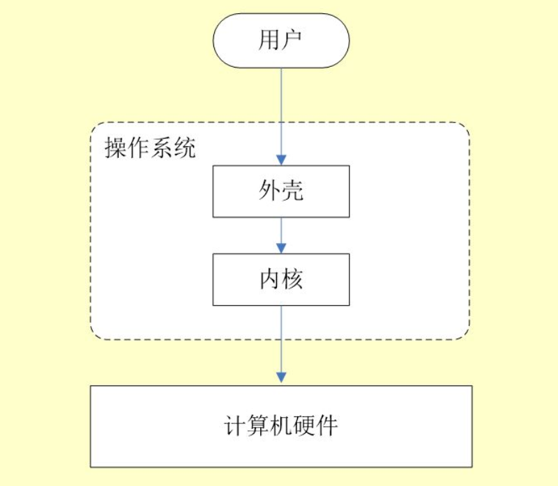
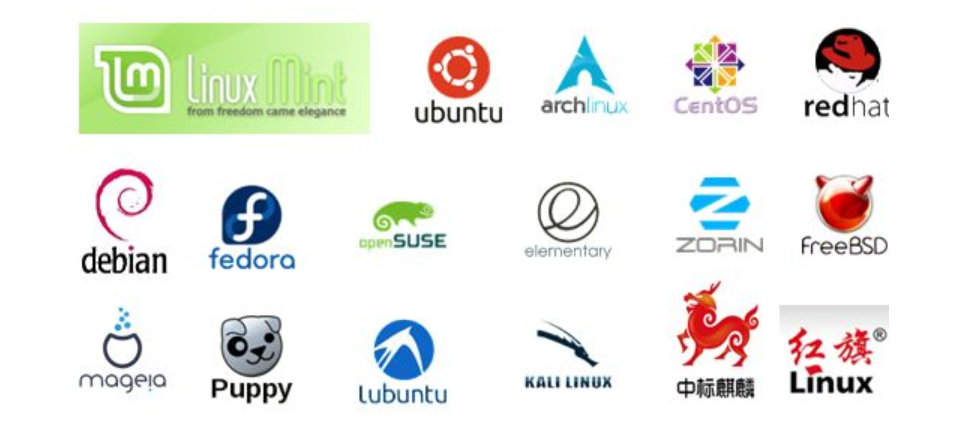
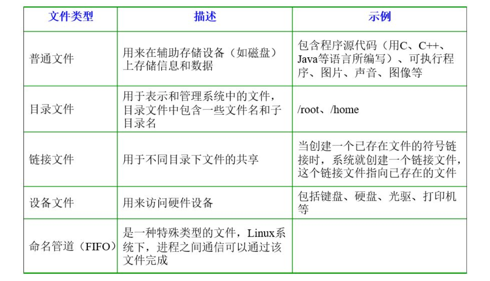
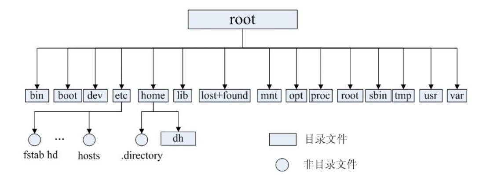
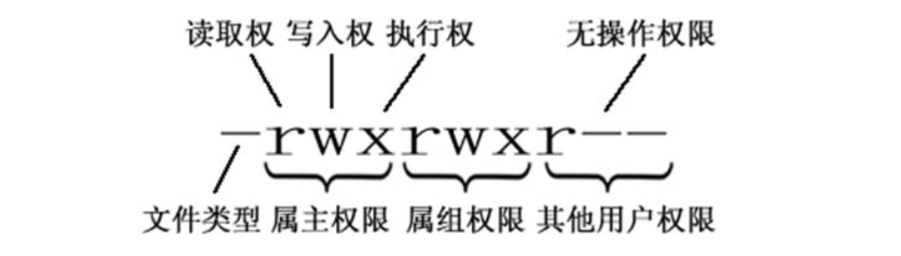

> 原文链接: [后端程序员必备的 Linux 基础知识](https://zhuanlan.zhihu.com/p/39157806)
>
> 推荐资源: 
>
> - [Linux命令大全](https://man.linuxde.net/)
> - [Linux Tools Quick Tutorial](https://linuxtools-rst.readthedocs.io/zh_CN/latest/base/index.html)
> - [Linux-Tutorial](https://github.com/judasn/Linux-Tutorial)
>
> 推荐博客:
>
> - [鸟哥的Linux私房菜](http://linux.vbird.org/)
> - [Vamei](https://www.cnblogs.com/vamei/tag/Linux/default.html?page=1)
> - [Linux大棚](http://roclinux.cn/)
> - [fudan_abc: linux开发者](https://blog.csdn.net/fudan_abc)

### 一.操作系统及linux概述

#### 1.操作系统简介

- 操作系统(OS)是管理计算机硬件与软件资源的程序，是计算机系统的内核与基石；
- 操作系统本质上是运行在计算机上的软件程序；
- 为用户提供一个与系统交互的操作界面；
- 操作系统分内核与外壳(可以把外壳理解围绕着内核的应用程序，而内核就是能操作硬件的程序)

#### 2.操作系统简单分类

- Windows：个人桌面操作系统。
- Unix：多用户、多任务操作系统。按照操作系统的分类，属于分时操作系统。
- Linux：类Unix操作系统。Linux存在着许多不同的Linux版本，但它们都使用了Linux内核。

#### 3.Linux简介

- **类Unix系统**：Linux是一种自由、开放源码的类似Unix的操作系统
- **Linux内核**：严格来说，Linux这个词本身只表示Linux内核
- **Linux之父**：担任Linux内核的首要架构师与项目协调者，是当今世界最著名的电脑程序员、黑客之一。发起了Git这个开源项目，并为主要开发者。

**Linux根据原生程度，分为两种：**

1.  **内核版本：** Linux不是一个操作系统，严格来讲，Linux只是一个操作系统中的内核。内核是什么？内核建立了计算机软件与硬件之间通讯的平台，内核提供系统服务，比如文件管理、虚拟内存、设备I/O等；
2.  **发行版本：** 一些组织或公司在内核版基础上进行二次开发而重新发行的版本。Linux发行版本有很多种（ubuntu和CentOS用的都很多，初学建议选择CentOS），如下图所示：

#### 4.Linux文件系统简介

**在Linux操作系统中，所有被操作系统管理的资源，例如网络接口卡、磁盘驱动器、打印机、输入输出设备、普通文件或是目录都被看作是一个文件。**

LINUX系统中有一个重要的概念：**一切都是文件**。

#### 5.文件类型与目录结构

**Linux支持5种文件类型** :

**Linux的目录结构** :

Linux文件系统的结构层次鲜明，就像一棵倒立的树，最顶层是其根目录：

**常见目录说明：**

- **/bin：** 存放二进制可执行文件(ls、cat、mkdir等)，常用命令一般都在这里；
- **/etc：** 存放**系统管理和配置文件**；
- **/home：** 存放**所有用户文件**的根目录，是用户主目录的基点，比如用户user的主目录就是/home/user，可以用~user表示；
- **/usr ：** **用于存放系统应用程序；**
- **/opt：** 额外安装的可选**应用程序包所放置的位置**。一般情况下，我们可以把tomcat等都安装到这里；
- **/proc：** 虚拟文件系统目录，是系统内存的映射。可直接访问这个目录来获取系统信息；
- **/root：** 超级用户（系统管理员）的主目录（特权阶级^o^）；
- **/sbin:** 存放二进制可执行文件，只有root才能访问。这里存放的是系统管理员使用的系统级别的管理命令和程序。如ifconfig等；
- **/dev：** 用于存放设备文件；
- **/mnt：** 系统管理员安装临时文件系统的安装点，系统提供这个目录是让用户临时挂载其他的文件系统；
- **/boot：** 存放用于系统引导时使用的各种文件；
- **/lib ：** 存放着和系统运行相关的库文件 ；
- **/tmp：** 用于存放**各种临时文件**，是公用的临时文件存储点；
- **/var：** 用于存放运行时需要改变数据的文件，也是某些大文件的溢出区，比方说各种服务的日志文件（系统启动日志等。）等；
- **/lost+found：** 这个目录平时是空的，系统非正常关机而留下“无家可归”的文件（windows下叫什么.chk）就在这里。

### 二.Linux基本命令

#### 1.目录切换命令

- `cd usr`：切换到usr目录下
- `cd ..`(或 cd ../)：切换到上一层目录
- `cd /`：切换到系统根目录
- `cd ~`：切换到用户主目录
- `cd -`：切换到上一个操作所在目录

#### 2.目录的操作命令(增删改查)

- `mkdir 目录名称`：增加目录
- `ls或者ll` (ll是ls -l的别名，ll命令可以看到该目录下的所有目录和文件的详细信息)：查看目录信息
- `find 目录 参数`：寻找目录(查), 示例：
  - 列出当前目录及子目录下所有文件和文件夹：`find .`
  - 在 /home 目录下查找以.txt结尾的文件名：`find /home -name "*.txt"`，忽略大小写：`find /home -iname "*.txt"`
  - 当前目录及子目录下查找所有以.txt和.pdf结尾的文件：`find . \( -name "*.txt" -o -name "*.pdf" \)` 或 `find . -name "*.txt" -o -name "*.pdf"`
- `mv 目录名称 新目录名称`：修改目录的名称
- `mv 目录名称 目录的新位置`：移动目录的位置(剪切)
- `cp -r 目录名称 目录拷贝的目标位置`：拷贝目录，-r代表递归拷贝，拷贝文件和压缩包不用写-r递归
- `rm [-rf] 目录`：删除目录/文件/压缩包

#### 3.文件的操作命令(增删改查)

- `touch 文件名称`：文件的创建
- `cat/more/less/tail 文件名称`：文件的查看
  - `cat`： 查看显示文件内容
  - `more`： 可以显示百分比，回车可以向下一行， 空格可以向下一页，q可以退出查看
  - `less`： 可以使用键盘上的PgUp和PgDn向上 和向下翻页，q结束查看
  - `tail-10`：查看文件的后10行，Ctrl+C结束.  注意：命令 tail -f 文件 可以对某个文件进行动态监控，例如tomcat的日志文件， 会随着程序的运行，日志会变化，可以使用`tail -f catalina-2016-11-11.log`  监控文件的变化
- `vim 文件`：修改文件的内容. **在实际开发中，使用vim编辑器主要作用就是修改配置文件，下面是一般步骤：**
  vim 文件------>进入文件----->命令模式------>按i进入编辑模式----->编辑文件 ------->按Esc进入底行模式----->输入：wq/q! （输入wq代表写入内容并退出，即保存；输入q!代表强制退出不保存。）
- `rm -rf 文件`：删除文件

#### 4.压缩文件的操作命令

##### 4.1打包并压缩文件

Linux中的打包文件一般是以.tar结尾的，压缩的命令一般是以.gz结尾的。

而一般情况下打包和压缩是一起进行的，打包并压缩后的文件的后缀名一般.tar.gz。 命令：**tar -zcvf 打包压缩后的文件名 要打包压缩的文件** 其中：

- z：调用gzip压缩命令进行压缩
- c：打包文件
- v：显示运行过程
- f：指定文件名

比如：假如test目录下有三个文件分别是：aaa.txt bbb.txt ccc.txt，如果我们要打包test目录并指定压缩后的压缩包名称为test.tar.gz可以使用命令：`tar -zcvf test.tar.gz aaa.txt bbb.txt ccc.txt`  或  `tar -zcvf test.tar.gz /test/`

##### 4.2解压压缩包

命令：`tar [-xvf] 解压缩文件`

其中： x：代表解压

示例：

- 将/test 下的 test.tar.gz 解压到当前目录下可以使用命令：`tar -xvf test.tar.gz`
- 将/test下的 test.tar.gz 解压到根目录/usr下 : `tar -xvf test.tar.gz -C /usr`（- C代表指定解压的位置）

#### 5.Linux的权限命令

在Linux中权限一般分为读(readable)，写(writable)和执行(excutable)，分为三组。分别对应文件的属主(owner)，属组(group)和其他用户(other)。通过 `ls -l` 命令我们可以 查看某个目录下的文件或目录的权限。

` - rwx rwx r--` ：第一列内容信息解释如下

文件的类型、Linux中权限以及文件有所有者、所在组、其它组具体:

**文件的类型：**

- d： 代表目录
- -： 代表文件
- l： 代表软链接（可以认为是window中的快捷方式）

**Linux中权限分为以下几种：**

- r：代表权限是可读，r也可以用数字4表示
- w：代表权限是可写，w也可以用数字2表示
- x：代表权限是可执行，x也可以用数字1表示

修改文件/目录的权限命令：chmod

`chmod u=rwx,g=rw,o=r aaa.txt`	修改aaa.txt的权限为属主有全部权限，所在组有读写权限，其他用户只有读的权限。可以使用数字表示：`chmod 761 aaa.txt`

#### 6.Linux用户管理

**Linux用户管理相关命令:**

- `useradd 选项 用户名`:添加用户账号
- `userdel 选项 用户名`:删除用户帐号
- `usermod 选项 用户名`:修改帐号
- `passwd 用户名`:更改或创建用户的密码
- `passwd -S 用户名` :显示用户账号密码信息
- `passwd -d 用户名`: 清除用户密码

useradd命令用于Linux中创建的新的系统用户。useradd可用来建立用户帐号。帐号建好之后，再用passwd设定帐号的密码．而可用userdel删除帐号。使用useradd指令所建立的帐号，实际上是保存在/etc/passwd文本文件中。

passwd命令用于设置用户的认证信息，包括用户密码、密码过期时间等。系统管理者则能用它管理系统用户的密码。只有管理者可以指定用户名称，一般用户只能变更自己的密码。

#### 7.Linux系统用户组的管理

每个用户都有一个用户组，系统可以对一个用户组中的所有用户进行集中管理。不同Linux 系统对用户组的规定有所不同，如Linux下的用户属于与它同名的用户组，这个用户组在创建用户时同时创建。

用户组的管理涉及用户组的添加、删除和修改。组的增加、删除和修改实际上就是对/etc/group文件的更新。

**Linux系统用户组的管理相关命令:**

- `groupadd 选项 用户组` :增加一个新的用户组
- `groupdel 用户组`:要删除一个已有的用户组
- `groupmod 选项 用户组` : 修改用户组的属性

#### 8.其他常用命令

- `pwd`：显示当前所在位置
- `sudo+其他命令`：经由 sudo 所执行的指令就好像是 root 亲自执行
- `grep 要搜索的字符串 要搜索的文件 --color`：搜索命令，--color代表高亮显示
- `ps -ef / ps -aux`：查看当前系统正在运行进程. 注意：如果直接用ps（（Process Status））命令，会显示所有进程的状态，通常结合grep命令查看某进程的状态。如：`ps aux|grep redis` 
- kill -9 进程的pid：杀死进程(-9 表示强制终止).  先用ps查找进程，然后用kill杀掉
- **网络通信命令：**
  - 查看当前系统的网卡信息：ifconfig
  - 查看与某台机器的连接情况：ping
  - 查看当前系统的端口使用：netstat -an
  - 查看当前匹配端口的使用情况：netstat -nlp|grep :80
- shutdown：`shutdown -h now`：立即关机；`shutdown +5 "System will shutdown after 5 minutes"` ：指定5分钟后关机，同时送出警告信息给登入用户。
- reboot：重开机。`reboot -w`：做个重开机的模拟(只有记录并不会真的重开机)。

