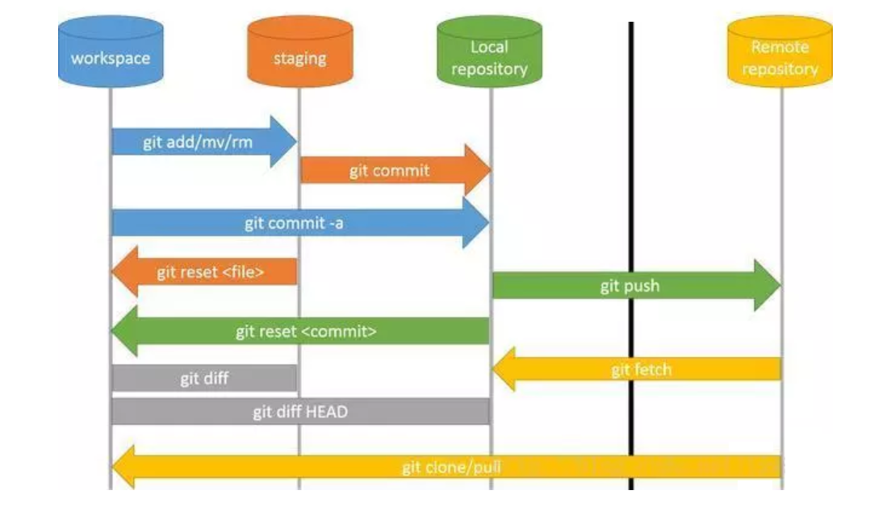
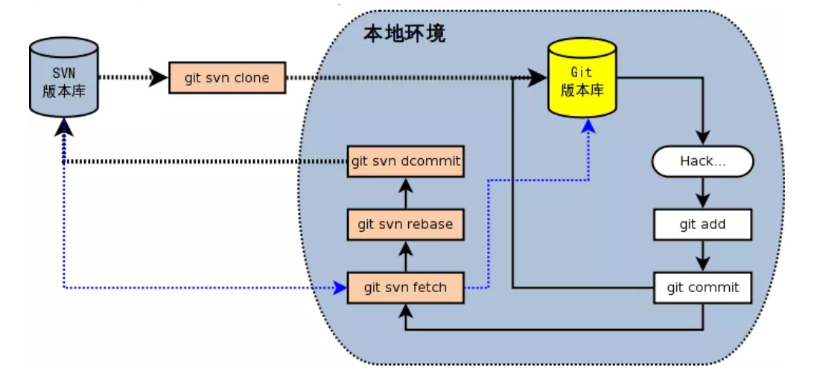

> 链接: [通俗易懂｜用好Git 和 SVN ,轻松驾驭版本管理](https://mp.weixin.qq.com/s?__biz=MzU3NTgyODQ1Nw==&mid=2247488064&idx=1&sn=dbeb33915371b36fab38641fa15cb3cf&chksm=fd1c6ac6ca6be3d0229101a04e07a18af619f303354670d0a55e98bae94423e1de62528306b1&mpshare=1&scene=24&srcid=0115LbSbh63utLmXEWVAHMkY&sharer_sharetime=1579084180189&sharer_shareid=97882d908ba6498447727c27e86f5d0e&key=b1b0a4eeed0bd1e1cbf1cfe97995efc137eabe897d071213498c4d613996a32745d9457d27af2a9f3dd4a6366d973c7827e74dd40d69c0cc1426034dda235e0584d1dfcbd9f6f6a7d2226318861a6d13&ascene=14&uin=MTU0ODQ4ODg4MQ%3D%3D&devicetype=Windows+10&version=62080079&lang=zh_CN&exportkey=AQlP1cPmPewmoGPtmu5bpcA%3D&pass_ticket=lNQIKpOrHbUrIl4dAPX5VvLUI%2BF8xEVFtV4CKL1gLpiadqSq6r97ArXzpryNl%2F%2Bk)

本文从 Git 与 SVN 的对比入手，介绍如何通过 Git-SVN 开始使用 Git，并总结平时工作高频率使用到的 Git 常用命令。

### 一.Git vs SVN

**Git是分布式的，SVN是集中式的**

Git 和 SVN 孰优孰好，每个人有不同的体验。

这是 Git 和 SVN 最大的区别。若能掌握这个概念，两者区别基本搞懂大半。因为 Git 是分布式的，所以 Git 支持离线工作，在本地可以进行很多操作，包括接下来将要重磅推出的分支功能。而 SVN 必须联网才能正常工作。

**Git复杂概念多，SVN简单易上手**

所有同时掌握 Git 和 SVN 的开发者都必须承认，Git 的命令实在太多了，日常工作需要掌握`add,commit,status, fetch,push,rebase`等，若要熟练掌握，还必须掌握rebase和merge的区别，fetch和pull的区别等，除此之外，还有cherry-pick，submodule，stash等功能，仅是这些名词听着都很绕。

在易用性这方面，SVN对于新手来说会更有好一些。但是从另外一方面看，Git 命令多意味着功能多，若我们能掌握大部分 Git 的功能，体会到其中的奥妙，会发现再也回不去 SVN 的时代了。

**Git分支廉价，SVN分支昂贵**

在版本管理里，分支是很常使用的功能。在发布版本前，需要发布分支，进行大需求开发，需要 feature 分支，大团队还会有开发分支，稳定分支等。在大团队开发过程中，常常存在创建分支，切换分支的需求。

**Git 分支是指针指向某次提交，而 SVN 分支是拷贝的目录**。这个特性使 Git 的分支切换非常迅速，并且创建成本非常低。而且 **Git 有本地分支，SVN 无本地分支**。在实际开发过程中，经常会遇到有些代码没写完，但是需紧急处理其他问题，若我们使用 Git，便可以创建本地分支存储没写完的代码，待问题处理完后，再回到本地分支继续完成代码。

### 二.Git 核心概念



-- 图片来源于网络

Git 最核心的一个概念就是**工作流**。

- **工作区**(Workspace)是电脑中实际的目录。
- **暂存区**(staging)类似于缓存区域，临时保存你的改动。
- **仓库区**(Repository)，分为本地仓库和远程仓库。

从 SVN 切换到 Git，最难理解并且最不能理解的是**暂存区和本地仓库**。熟练使用 Git 后，会发现这简直是神设计，由于这两者的存在，使许多工作变得易管理。

通常提交代码分为几步：

1. `git add`从工作区提交到暂存区
2. `git commit`从暂存区提交到本地仓库
3. `git push`或`git svn dcommit`从本地仓库提交到远程仓库

### 三.Git-SVN常用命令

若服务器使用的 SVN，但是本地想要体验 Git 的本地分支，离线操作等功能，可以使用 Git-SVN功能。

常用操作如下（图片来源于网络）：



**[ Git-SVN ]**

```shell
# 下载一个 SVN 项目和它的整个代码历史，并初始化为 Git 代码库
$ git svn clone -s [repository]
# 查看当前版本库情况
$ git svn info
# 取回远程仓库所有分支的变化
$ git svn fetch
# 取回远程仓库当前分支的变化，并与本地分支变基合并
$ git svn rebase
# 上传当前分支的本地仓库到远程仓库
$ git svn dcommit
# 拉取新分支，并提交到远程仓库
$ svn copy [remote_branch] [new_remote_branch] -m [message]
# 创建远程分支对应的本地分支
$ git checkout -b [local_branch] [remote_branch]
```

### 四.常用命令

从本节开始，除特殊说明，以下命令均适用于 Git 与 Git-SVN。

#### 1.初始化

```shell
# 在当前目录新建一个Git代码库
$ git init
# 下载一个项目和它的整个代码历史 [Git only]
$ git clone [url]
```

#### 2.配置

- Git 用户的配置文件位于 `~/.gitconfig`
- Git 单个仓库的配置文件位于 `~/$PROJECT_PATH/.git/config`

```shell
# 列举所有配置
$ git config -l		#英文字母l
# 为命令配置别名
$ git config --global alias.co checkout
$ git config --global alias.ci commit
$ git config --global alias.st status
$ git config --global alias.br branch
# 设置提交代码时的用户信息
$ git config [--global] user.name "[name]"
$ git config [--global] user.email "[email address]"
```

#### 3.查询

```shell
# 查看工作区文件修改状态
$ git status 
# 查看工作区文件修改具体内容 
$ git diff [file]
# 查看暂存区文件修改内容
$ git diff --cached [file] 
# 查看版本库修改记录
$ git log 
# 查看某人提交记录
$ git log --author=someone 
# 查看某个文件的历史具体修改内容
$ git log -p [file] 
# 查看某次提交具体修改内容
$ git show [commit]
```

#### 4.增删文件

把文件名 file1 添加到 `.gitignore` 文件里，Git 会停止跟踪 file1 的状态。

```shell
# 添加当前目录的所有文件到暂存区
$ git add .
# 添加指定文件到暂存区
$ git add <file1> <file2> ...
# 添加指定目录到暂存区，包括其子目录
$ git add <dir>
# 删除工作区文件，并且将这次删除放入暂存区
$ git rm [file1] [file2] ...
# 停止追踪指定文件，但该文件会保留在工作区
$ git rm --cached [file]
# 改名文件，并且将这个改名放入暂存区
$ git mv [file-original] [file-renamed]
```

#### 5.提交

```shell
# 提交暂存区到仓库区
$ git commit -m [message]
# 提交工作区与暂存区的变化直接到仓库区
$ git commit -a
# 提交时显示所有 diff 信息
$ git commit -v
# 提交暂存区修改到仓库区，合并到上次修改，并修改上次的提交信息
$ git commit --amend -m [message]
# 上传本地指定分支到远程仓库
$ git push [remote] [remote-branch]
```

#### 6.拉取

```shell
# 下载远程仓库的所有变动 (Git only)
$ git fetch [remote]
# 显示所有远程仓库 (Git only)
$ git remote -v
# 显示某个远程仓库的信息 (Git only)
$ git remote show [remote]
# 增加一个新的远程仓库，并命名 (Git only)
$ git remote add [remote-name] [url]
# 取回远程仓库的变化，并与本地分支合并，(Git only), 若使用 Git-SVN，请查看第三节
$ git pull [remote] [branch]
# 取回远程仓库的变化，并与本地分支变基合并，(Git only), 若使用 Git-SVN，请查看第三节
$ git pull --rebase [remote] [branch]
```

#### 7.撤销

```shell
# 恢复暂存区的指定文件到工作区
$ git checkout [file]
# 恢复暂存区当前目录的所有文件到工作区
$ git checkout .
# 恢复工作区到指定 commit
$ git checkout [commit]
# 重置暂存区的指定文件，与上一次 commit 保持一致，但工作区不变
$ git reset [file]
# 重置暂存区与工作区，与上一次 commit 保持一致
$ git reset --hard
# 重置当前分支的指针为指定 commit，同时重置暂存区，但工作区不变
$ git reset [commit]
# 重置当前分支的HEAD为指定 commit，同时重置暂存区和工作区，与指定 commit 一致
$ git reset --hard [commit]
# 新建一个 commit，用于撤销指定 commit
$ git revert [commit]
# 将未提交的变化放在储藏区
$ git stash
# 将储藏区的内容恢复到当前工作区
$ git stash pop
```

#### 8.分支

```shell
# 列出所有本地分支
$ git branch
# 列出所有本地分支和远程分支
$ git branch -a
# 新建一个分支，但依然停留在当前分支
$ git branch [branch-name]
# 新建一个分支，并切换到该分支
$ git checkout -b [new_branch] [remote-branch]
# 切换到指定分支，并更新工作区
$ git checkout [branch-name]
# 合并指定分支到当前分支
$ git merge [branch]
# 选择一个 commit，合并进当前分支
$ git cherry-pick [commit]
# 删除本地分支，-D 参数强制删除分支
$ git branch -d [branch-name]
# 删除远程分支
$ git push [remote]:[remote-branch]
```

实际环境，Git的使用的确比SVN要多一点，毕竟功能要强大一些。


