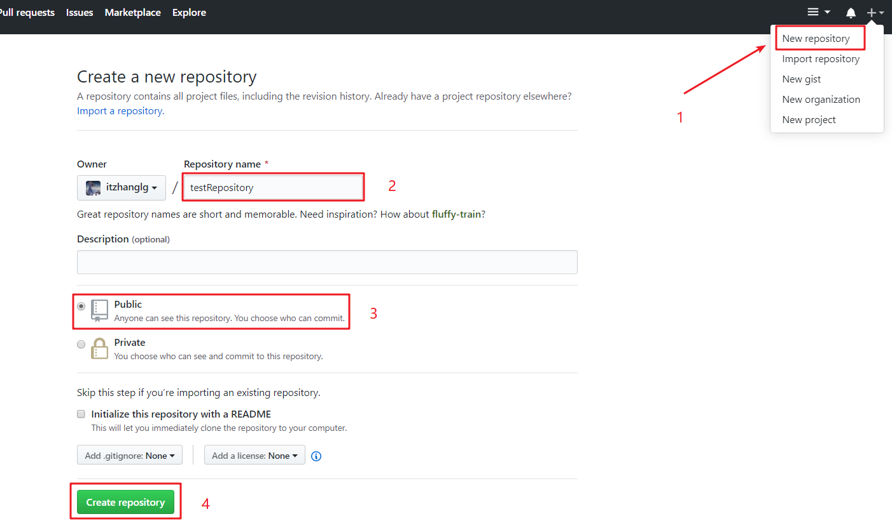
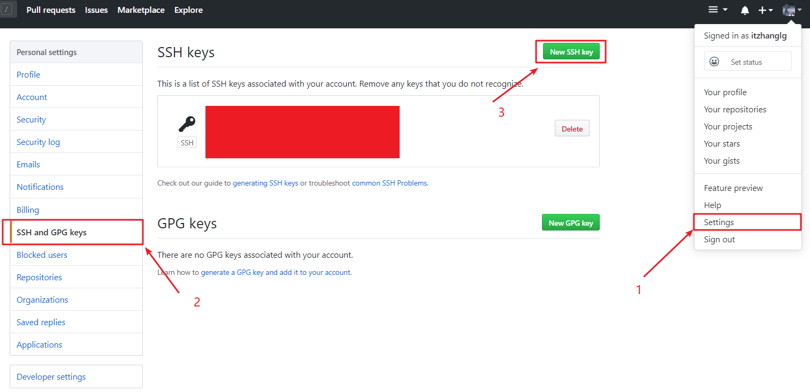
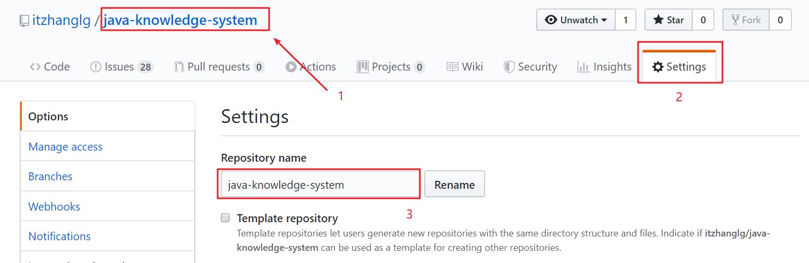
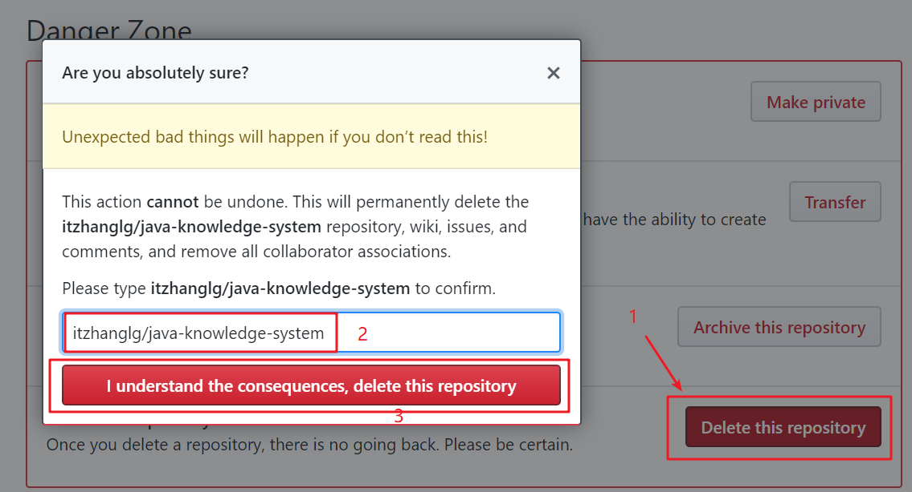

### Github简单使用

官网网址: [https://github.com](https://github.com) ,gitHub 是一个面向开源及私有软件项目的托管平台，因为只支持 git 作为唯一的版本库格式进行托管，故名 gitHub。在 GitHub，用户可以十分轻易地找到海量的开源代码。

Git 是一个开源的分布式版本控制系统，可以有效、高速的处理从很小到非常大的项目版本管理。Git 是 Linus Torvalds 为了帮助管理 Linux 内核开发而开发的一个开放源码的版本控制软件。

#### 1.注册账号

在 [Github](https://github.com) 网站中注册, 在部分企业中，开发人员是否拥有 Github 帐户，在 Github 中是否有个人的代码和资料
发布、发布数量等，成为了开发人员实力的一种评价标准。

#### 2.创建版本仓库

这里创建的是公开版本仓库，私有版本仓库不完全开放，大部分功能需要付费购买。

#### 3.提供SSH2密钥

创建本地密钥: 打开Git Bash, 创建本地ssh:

-   输入`ssh-keygen -t rsa -C "username@example.com"` (github注册的邮箱)，接下来enter键即可（也可以输入密码）
-   生成的文件保存在`C:\Users\admin\.ssh` ，文件名：id_rsa(私钥)，id_rsa.pub(公钥)

github添加密钥:

进入github密钥管理界面:

在 title 中输入密匙名称（自定义），在 key 文本域中输入 `id_rsa.pub`  文件中的内容。并确认新增密匙(新增密匙过程可能需要确认用户密码). 

#### 4.删除版本仓库

选择要删除的版本仓库，进入对应仓库的 Settings 管理界面:

在管理界面的最末端，点击 Delete this repository 按钮, 对话框中输入`用户名/仓库名称` ,点击确认即可删除：

